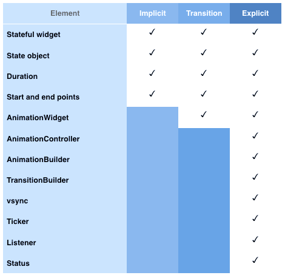

* TOC Placeholder
{:toc}

__________________________________  

Well-designed animations makes a UI more intuitive, contributes to the sophisticated look and feel of a polished app, and improves the user experience. Flutter’s animation framework makes it easy to implement basic and advanced animation types—so whether you are new to animations or an animation wizard, Flutter provides the platform to bring your creative vision to life.

Using the built-in Flutter animation widgets means you don’t have to write sophisticated drawing code. Flutter animation widgets include definitions for standard motion effects such *fade out* or *slide transition* so most of the code required to draw each animation frame is already written for you. And Flutter includes a built-in graphics rendering and animation infrastructure for both iOS and Android so you build one animation for both platforms.

## Flutter animation widgets
The level of customization depends on what type of animation widget you include in your app.  
Flutter animations widgets are *implicit*, *transition*, or *explicit* animations. Implicit and transition animations have most of the animation code already included so the level of customization is moderate. If you’re starting out in animations, or you want to quickly add an animation to your app, try out the implicit or transition animation widgets.

For highly customizable animations, Flutter provides explicit animation widgets. You can build your own explicit animations using the `AnimatedBuilder` or `TransitionBuilder` widgets.


<br>


### Implicit animation widgets

 *Implicit animations* are animations that are already programmed or styled within pre-existing constraints—all you need to do is add the animated object, and set some basic parameters such as the duration. You don’t need to write the animation code to add listeners or tickers for example, and you don't need to tell the app when to start—the animation simply changes from the old to the new value.  
 <br>
 For more information including a list of implicit widgets, see [Implicit animations](/animations/implicit_widgets).


### Transition animation widgets

*Transition animations* implement the abstract class `AnimatedWidget`. Using the `AnimatedWidget` class allows you to separate the widget code from the animation code in the `setState()` call and it doesn’t need to maintain a `State` object to hold the animation.  Transition animations are similar to implicit animations because many of the animation elements are predefined for you.  
<br>
For more information including a list of transition widgets, [Transition animations](/animations/transition_widgets).  


### Explicit animation widgets

 *Explicit animations* involve building complex animations using the `AnimationBuilder` widget which requires you to customize many of the animation elements that are pre-defined in the implicit and transition animation widgets. When you build explicit animations, you manually add listeners, tickers, and other elements for customization.  
 <br>
 For more information, see [Explicit animations](/animations/explicit_widgets).  

## Choosing an animation widget
Choosing an animation widget depends on the customization that you need for your animation and whether there is an existing widget available for reuse. The table below shows the customizable elements in each animation type.


<br>

All Flutter animations include these basic properties:
1. Animations must be associated with an object to animate. You add the object.
2. Animations must define what type of animation will be performed. For implicit and transition animation, you add the animation widget from the Flutter library. For explicit animations, you build the animation using `AnimationController`.
3. Animations must define how long the animation will last. You specify the duration and the start and end points.


## Flutter packages
The Flutter SDK includes several libraries that contain pre-defined animation widgets. To access the Flutter animation widgets, determine which library contains the widget that you want to use and then add the appropriate import statement to the `main.dart` file.

```Dart
import 'package:flutter/animation.dart';
import 'package:flutter/material.dart';
```
For information on the SDK libraries and available widgets in each library, see the following resources.

* [Flutter SDK libraries](https://docs.flutter.io/index.html)  
* [Animation and Motion Widgets](/widgets/animation/)  
* [Flutter Widget Index](/widgets/widgetindex/)  
* [Widget Catalog](/widgets/)

## Flutter animation resources  
To learn about Flutter animations, check out the following resources.

### Concepts  
[Flutter Animation Concepts](/animations/concepts) includes information about how Flutter animation works and definitions of the main animation concepts. You'll also find information on the main animation widgets such as the `AnimationController` or `AnimationBuilder`, and information about tweens, curves, tickers, and more.  


### Animation and Motion widgets  
For a list of Flutter animation widgets, see the following:
* [Implicit animation widgets](/animations/implicit_widgets)  
* [Transition animation widgets](/animations/transition_widgets)  
* [Explicit animation widgets](/animations/explicit_widgets)  
* [Animation and Motion Widgets Catalog](/widgets/animation/)  

### Codelabs  
Codelabs are a great way to learn how to use Flutter and how to add Flutter animation widgets to your app. Check out [Building Beautiful UIs with Flutter](/codelabs/). This Codelab demonstrates how to build a simple chat app. And Step 7 (Animate your app) shows how to animate the new message—sliding it from the input area up to the message list. For more information, see [Codelabs](/codelabs/).  
If you're new to Flutter, check out the [Write your first app, part 1](https://codelabs.developers.google.com/codelabs/first-flutter-app-pt1/#0) and [Write your first app, part 2](https://codelabs.developers.google.com/codelabs/first-flutter-app-pt2/#0) codelabs. They walk you through the basics of using Flutter to quickly create an iOS and Android app.  

### Flutter animation demos and examples  
Flutter animation demos and examples provide code samples of some of the common and most popular animation widgets.  
* [AnimatedList](/catalog/samples/animated-list/)—This example demonstrates how to display a list of cards which stay in sync using the  ListModel widget. When an item is added or removed from the model, the corresponding card animates in or out of view.
* [Hero Animations](/animations/hero-animations/)—This demo shows how to build standard hero animations, and hero animations that transform the image from a circular shape to a square shape during flight. The [Shrine Demo](https://github.com/flutter/flutter/blob/master/examples/flutter_gallery/lib/demo/shrine_demo.dart) shows another example showing hero animations.
* [Flutter Gallery](https://github.com/flutter/flutter/tree/master/examples/flutter_gallery)—The Flutter Gallery app includes Material Design widgets and Flutter animation features.  
* [Staggered Animations Demo](https://flutter.io/animations/staggered-animations/)—This demo shows how to build a staggered animation using Flutter.

### Flutter animation YouTube videos  
Another great way to learn about Flutter animations is to check out the [Flutter animations on YouTube](https://www.youtube.com/results?search_query=Flutter+animations). For example, the [The Basics of Animation with Dart's Flutter Framework](https://www.youtube.com/watch?v=5urRyqOwTuo) tutorial describes the basics of tween-based animations in Flutter.

### Articles  
Check out [Medium.com](medium.com) for articles about developing apps using Flutter including [Zero to One with Flutter](https://medium.com/flutter-io/zero-to-one-with-flutter-43b13fd7b354) which describes: *Discovering the strength of Flutter’s widget and tween concepts by writing chart animations in Dart for an Android/iOS app*. And [Zero to One with Flutter, Part Two](https://medium.com/flutter-io/zero-to-one-with-flutter-part-two-5aa2f06655cb) which describes: *Discovering how to animate composite graphical objects in the context of a cross-platform mobile app*.
