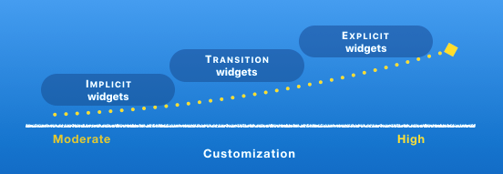

* TOC Placeholder
{:toc}

__________________________________  

Well-designed animations makes a UI more intuitive, contributes to the sophisticated look and feel of a polished app, and improves the user experience. Flutter’s animation framework makes it easy to implement basic and advanced animation types—so whether you are new to animations or an animation wizard, Flutter provides the platform to bring your creative vision to life.

## Flutter animation widgets
Using the built-in Flutter animation widgets means you don’t have to write sophisticated drawing code. Flutter animation widgets include definitions for standard motion effects such as *fade out* or *slide transition* so most of the code required to draw each animation frame is already written for you.  

Flutter animations widgets are *implicit*, *transition*, or *explicit* animations. Implicit and transition animations have most of the animation code already included so the level of customization is moderate. If you’re starting out in animations, or you want to quickly add an animation to your app, try out the implicit or transition animation widgets.

For highly customizable animations, Flutter provides explicit animation widgets. You can build your own explicit animations using the `AnimatedBuilder` or `TransitionBuilder` widgets.


<br>


### Implicit animation widgets

 *Implicit animations* are animations that are already programmed or styled within pre-existing constraints—all you need to do is add the animated object, and set some basic parameters such as the duration. You don’t need to write the animation code to add listeners or tickers for example, and you don't need to tell the app when to start—the animation begins automatically when a property value changes. The `AnimatedOpacity` and `AnimatedIcon` widgets are two examples of implicit animations.
 <br>
 For more information including a list of implicit widgets, see [Implicit animations](/animations/implicit_widgets).


### Transition animation widgets

*Transition animations*   NEED - description of transition widgets - why would you use transition instead of implicit

<br>
For more information including a list of transition widgets, [Transition animations](/animations/transition_widgets).  


### Explicit animation widgets

 *Explicit animations* involve building customized animations using the `AnimationBuilder` widget that allows you to customize many of the animation elements that are pre-defined in the implicit and transition animation widgets. When you build explicit animations, you manually add listeners, tickers, and other elements for customization.  
 <br>
 For more information, see [Explicit animations](/animations/explicit_widgets).  

## Choosing an animation widget
Choosing an animation widget depends on the customization that you need for your animation and whether there is an existing widget available for reuse. The table below shows the customizable elements in each animation type.


<br>


## Flutter packages
The Flutter SDK includes several libraries that contain pre-defined animation widgets. To access the Flutter animation widgets, determine which library contains the widget that you want to use and then add the appropriate import statement to the `main.dart` file.

```Dart
import 'package:flutter/animation.dart';
import 'package:flutter/material.dart';
```
For information on the SDK libraries and available widgets in each library, see the following resources.

* [Flutter SDK libraries](https://docs.flutter.io/index.html)  
* [Animation and Motion Widgets](/widgets/animation/)  
* [Flutter Widget Index](/widgets/widgetindex/)  
* [Widget Catalog](/widgets/)

## Flutter animation resources  
To learn about Flutter animations, check out the following resources.

### Concepts  
[Flutter Animation Concepts](/animations/concepts) includes information about how Flutter animation works and definitions of the main animation concepts. You'll find information on the main animation widgets such as the `AnimationController` or `AnimationBuilder`, and information about tweens, curves, tickers, and more.  


### Animation and Motion widgets  
For a list of Flutter animation widgets, see the following:
* [Implicit animation widgets](/animations/implicit_widgets)  
* [Transition animation widgets](/animations/transition_widgets)  
* [Explicit animation widgets](/animations/explicit_widgets)  
* [Animation and Motion Widgets Catalog](/widgets/animation/)  


### Common animation patterns  
The following list provides links to "How-to" information for some of the common and most popular animation widgets.  
* [AnimatedList](/catalog/samples/animated-list/)—How to display a list of cards that stay in sync using the  ListModel widget. When an item is added or removed from the model, the corresponding card animates in or out of view.
* [Shared element animations](/animations/hero-animations/)—How to build shared element animations. In Flutter, the [Hero animations widget](https://docs.flutter.io/flutter/widgets/Hero-class.html) is an example of a shared element animation. The guide shows two examples: a standard hero animation and one that transforms the image from a circular shape to a square shape during flight.  The [Shrine Demo](https://github.com/flutter/flutter/blob/master/examples/flutter_gallery/lib/demo/shrine_demo.dart) shows another example showing hero animations.
* [Staggered Animations Demo](/animations/staggered-animations/)—How to build a staggered animation where animations start at different points on a timeline.  
* [Flutter Gallery](https://github.com/flutter/flutter/tree/master/examples/flutter_gallery)—How to build the Flutter Gallery app and install it onto your device. The Flutter Gallery is a one-stop demo app that shows off many of the Material Design widgets and many types of animations.  

### Flutter animation YouTube videos  
Another great way to learn about Flutter animations is to check out [Flutter animations on YouTube](https://www.youtube.com/results?search_query=Flutter+animations). For example, the [The Basics of Animation with Dart's Flutter Framework](https://www.youtube.com/watch?v=5urRyqOwTuo) tutorial describes the basics of tween-based animations in Flutter.

### Articles  
Check out the [Flutter Publication on Medium](https://medium.com/google-developer-experts/introducing-the-flutterdoc-publication-3becc900b611.com) for articles about developing apps using Flutter. Many third parties have published on Medium including the following articles:  
* [Zero to One with Flutter](https://medium.com/flutter-io/zero-to-one-with-flutter-43b13fd7b354) — *Discovering the strength of Flutter’s widget and tween concepts by writing chart animations in Dart for an Android/iOS app*.  
* [Zero to One with Flutter, Part Two](https://medium.com/flutter-io/zero-to-one-with-flutter-part-two-5aa2f06655cb) — *Discovering how to animate composite graphical objects in the context of a cross-platform mobile app*.
