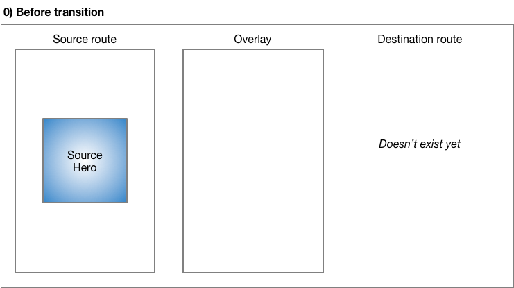
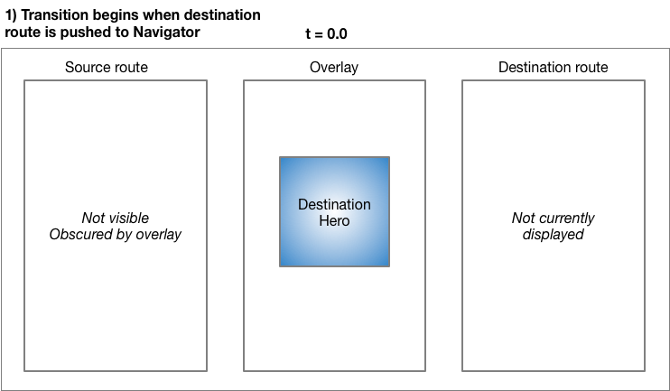
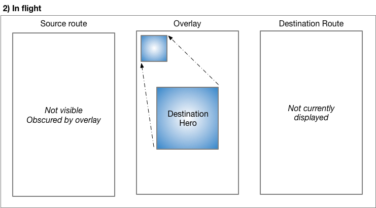
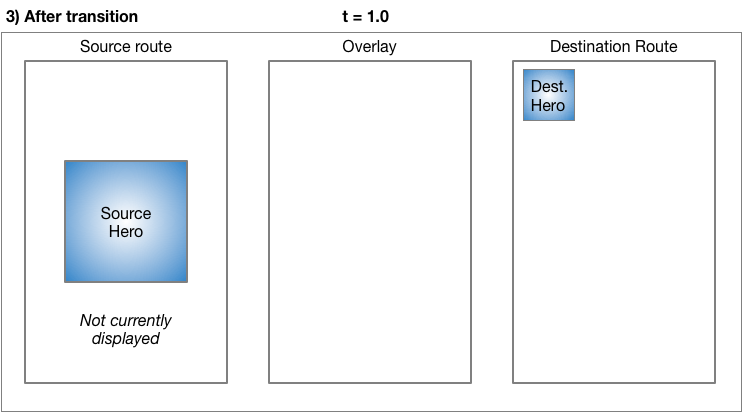

<b> <a id="whats-the-point" class="anchor" href="#whats-the-point" aria-hidden="true"></a>What you'll learn:</b>

* Create a shared element transition using Flutter's Hero widget.
* Fly the Hero's child from one page to another.
* Animate the transformation of a Hero's shape from circular to
  rectangular, while flying it from one page to another.

This guide demonstrates how to build shared element transitions
in Flutter, also called shared element _animations_. Flutter
calls these _Hero animations_ because they are implemented
with Hero widgets.

* TOC Placeholder
{:toc}

<aside class="alert alert-info" markdown="1">
**New to Flutter?**
You should first understand how to create a layout using Flutter’s
widgets.  For more information, see [Building Layouts in
Flutter](/tutorials/layout/).
</aside>

<aside class="alert alert-info" markdown="1">
**Terminology:**
A _Route_ describes a page or screen in a Flutter app. These terms
are sometimes used interchangeably.
</aside>

A shared element transition animates a Hero's child
(typically an image) from one route to another.
This guide focuses on two types of Hero animations:

<ul>
<li markdown="1">Flying transitions 
A _flying transition_ animates the Hero
from one route to a new route, usually landing at a different
location and with a different size.

The following video (recorded at slow speed) shows a typical example.
Tapping the flippers in the center of the screen flies them to the
upper left corner of a new, blue screen, at a smaller size.
Tapping the flippers in the blue screen
(or using the device's back-to-previous-screen gesture)
flies the flippers back to the original screen.

<iframe width="560" height="315" src="https://www.youtube.com/embed/uF7_JfhBsww" frameborder="0" allowfullscreen></iframe>

</li>&nbsp;

<li markdown="1">Radial transformations 
A _radial transformation_ animates the Hero from
a circular shape to a rectangular shape, as it flies the image
from one route to another.

The following video (recorded at slow speed),
shows an example of a radial transformation. At the start,
a row of three images appears at the bottom of the route.
Tapping any of the circles flies the image to a new route that displays
it as a larger square shape. Tapping the image in the square
returns to the original screen.

<iframe width="560" height="315" src="https://www.youtube.com/embed/V735TEHW5UI" frameborder="0" allowfullscreen></iframe>

</li>
</ul>

Before moving to the sections specific to the
[flying](#flying-transitions)
or [radial](#radial-transformations) transitions,
read the [basic structure of a Hero animation](#basic-structure)
to learn how to structure your app for either transition type,
and [behind the scenes](#behind-the-scenes) to understand
how Flutter performs a Hero animation.

## Basic structure of a Hero animation

<b> <a id="whats-the-point" class="anchor" href="#whats-the-point" aria-hidden="true"></a>What's the point?</b>

* Use two Hero widgets to implement a shared element transition.
* The Navigator manages a stack containing the app’s routes (pages).
* Pushing a route on or popping a route from the Navigator’s stack
  triggers the transition.
* To make a Hero respond to a tap, wrap it in an Inkwell widget.
* The Flutter framework calculates the tweens for you, and performs the
  flight animation in an overlay.

In Flutter, shared element transitions are implemented using
[Hero](https://docs.flutter.io/flutter/widgets/Hero-class.html) widgets.
While the term "shared element transition" is widely used by motion
designers and programmers who write animation code, Flutter implements
this type of transition using two Hero widgets: one describing the
widget in the source route, and another describing the widget in
the destination route.  From the user’s point of view,
the Hero appears to be shared, and only the programmer needs to
understand this implementation detail.

The actual transition occurs in an overlay that appears over
the current route, obscuring it during flight.

<aside class="alert alert-info" markdown="1">
**Note about dialogs:**
Heroes fly from one PageRoute to another. Dialogs
(displayed with `showDialog()`, for example), use PopupRoutes,
which are not PageRoutes.  At least for now,
you can't animate a Hero to a Dialog.
For further developments (and a possible workaround), [watch this
issue.](https://github.com/flutter/flutter/issues/10667)
</aside>

Hero animation code has the following structure:

1. Define a starting Hero object, referred to as the _source
   Hero_. The Hero specifies its location,
   size, graphical representation (typically an image), and an
   identifying tag.
1. Define an ending Hero object, referred to as the _destination Hero_.
   This Hero also specifies its location, size, graphical
   representation, and the same tag as the source Hero.
   It's <strong>essential that both Hero objects are created with
   the same tag</strong>, typically an object that represents the
   underlying data. For best results, the Heroes should have
   virtually identical widget trees.
1. (Optional) Place any Hero object that responds to user input,
   such as a tap, in an Inkwell.
1. Specify a route that contains the destination Hero.
   The destination route defines its widget tree at the end
   of the transition.
1. Trigger the animation by pushing the route on the Navigator's stack.
   Popping a route from the Navigator’s stack triggers a return
   transition.

Flutter calculates the tweens required to transition the
starting Hero to the ending Hero (interpolating size and
position changes), and performs the animation in an overlay.

The next section describes Flutter's process in greater detail.

## Behind the scenes

The source route contains the Hero inside an Inkwell.
What happens when the InkWell receives a tap gesture?
The following describes how Flutter performs the transition.

Before transition, the source Hero waits in the source route's widget
tree. The destination route does not yet exist, and the overlay
is blank and disabled.

---

Tapping the Hero's InkWell triggers the animation, and the
following occurs:

* Offscreen, Flutter calculates the transition (including
  position and size changes) from beginning to end,
  moving the Hero along a curved path as described in the
  Material motion spec. Flutter saves the size and location
  of the Hero at the beginning and end of the transition.

* Flutter places the destination Hero in the overlay, at the
  same location and size as the _source_ Hero.

* Flutter enables the overlay, obscuring the current route.

* Flutter creates the destination route, placing it at the
  top of the Navigator's stack (above the source route),
  but it's obscured by the overlay.

* The destination route won't contain the destination Hero
  until the transition is complete.

---

While the Hero is in-flight:

* The same Animation object drives both
  the route transition and the Hero animation.

* As the Hero flies, its rectangular bounds are animated using
  [Tween&lt;Rect&gt;,](https://docs.flutter.io/flutter/animation/Tween-class.html)
  accessible via the Hero's `createRectTween` property.
  By default, Flutter uses an instance of
  [MaterialRectArcTween,](https://docs.flutter.io/flutter/material/MaterialRectArcTween-class.html)
  which animates the rectangle's opposing corners along a curved path.
  (See the [radial transformations](#radial-transformations) section
  for an example that uses a different Tween animation.)

---

When the flight completes:

* Flutter moves the Hero widget from the overlay to the
  destination route.

* Flutter disables the (now blank) overlay.

* The destination Hero appears in its final position in
  the destination route.

---

Popping the route performs the same process, animating the
Hero back to its size and location in the source route.

### Essential classes

The examples in this guide use the following classes to
implement shared element transitions:

[Hero](https://docs.flutter.io/flutter/widgets/Hero-class.html)
: The "shared element" that flies from the source to the destination
  route. The Hero itself doesn't fly, it's actually the image that
  represents the Hero, a child of the Hero.
  Also, the Hero isn’t actually shared in the implementation.
  Define one Hero for the start of the transition and another for
  the end, and assign each the same tag. Flutter animates pairs of
  Heroes with matching tags.

[Inkwell](https://docs.flutter.io/flutter/material/InkWell-class.html)
: (Optional) Specifies what happens when tapping the Hero.
  The InkWell's `onTap()` method builds the new route and pushes it
  to the Navigator's stack.

[Navigator](https://docs.flutter.io/flutter/widgets/Navigator-class.html)
: The Navigator manages a stack of routes. Pushing a route on or
  popping a route from the Navigator's stack triggers the animation.

[Route](https://docs.flutter.io/flutter/widgets/Route-class.html)
: Specifies a screen or page. Most apps, beyond the most basic,
  have multiple routes. To specify a route, use
  [MaterialPageRoute,](https://docs.flutter.io/flutter/material/MaterialPageRoute-class.html)
  [CupertinoPageRoute,](https://docs.flutter.io/flutter/cupertino/CupertinoPageRoute-class.html)
  or build a custom route using
  [PageRouteBuilder.](https://docs.flutter.io/flutter/widgets/PageRouteBuilder-class.html)

## Flying transitions

<b> <a id="whats-the-point" class="anchor" href="#whats-the-point" aria-hidden="true"></a>What's the point?</b>

* Specify a route using MaterialPageRoute, CupertinoPageRoute,
  or PageRouteBuilder. The flying examples shown here use
  MaterialPageRoute.
* Change the size of the image at the end of the transition by
  wrapping the destination's image in a SizedBox.
* Change the location of the image by placing the destination's
  image in a layout widget. These examples use Container.

<aside class="alert alert-info" markdown="1">
**Show me the code!**

Each of the following examples demonstrate flying an element from one
route to another. This guide describes the first example.  

[flying_transition](https://github.com/flutter/website/tree/master/_includes/code/animation/flying_transition)
: Movement along a curved path, as described in the Material motion
  spec. Encapsulates the Hero code in a custom PhotoHero widget.

[basic_flying_transition](https://github.com/flutter/website/tree/master/_includes/code/animation/basic_flying_transition)
: Uses the Hero object directly.
  This more basic example, provided for your reference, isn't
  described in this guide.

</aside>

Flying an element from one route to another, one of the most
common types of shared element transitions, is easy to implement
using Flutter's Hero widget. When using MaterialPageRoute
to specify the new route, the element flies along a curved path,
as described by the [Material Design motion
spec.](https://material.io/guidelines/motion/movement.html)
The widget tree for the destination route is created in the `builder`
property.

[Create a new Flutter example](/getting-started/) and
update it using the files from the
[GitHub directory.](https://github.com/flutter/website/tree/master/_includes/code/animation/flying_transition)

To run the example:

* Tap on the home route’s photo to fly the image to a new route
  showing the same photo at a different location and scale.
* Return to the previous route by tapping the image, or by using the
  device’s back-to-the-previous-screen gesture.
* You can slow the transition further using the `timeDilation`
  property.

### PhotoHero class

The custom PhotoHero class maintains the Hero, and its size, image,
and behavior when tapped. The PhotoHero builds the following
widget tree:

Here's the code:

<!-- skip -->

class PhotoHero extends StatelessWidget {
  const PhotoHero({ Key key, this.photo, this.onTap, this.width }) : super(key: key);

  final String photo;
  final VoidCallback onTap;
  final double width;

  Widget build(BuildContext context) {
    return new SizedBox(
      width: width,
      child: new Hero(
        tag: photo,
        child: new Material(
          color: Colors.transparent,
          child: new InkWell(
            onTap: onTap,
            child: new Image.asset(
              photo,
              fit: BoxFit.contain,
            ),
          ),
        ),
      ),
    );
  }
}


Key information:

* An InkWell wraps the Hero, making it trivial to add a tap
  gesture to the both the source and destination Heroes.
* Defining the Material widget with a transparent color
  enables the image to "pop out" of the background as it
  flies to its destination.
* Placing everything in a SizedBox and setting it's width
  to the passed-in value, determines the size
  of the image at the end of the animation.
* Setting the Image's `fit` property to `BoxFit.contain`,
  ensures that the image is as large as possible during the
  transition while fitting into the target box.

### SharedElementTransition class

The SharedElementTransition class creates the source and destination
PhotoHeroes, and sets up the transition.

Here's the code:

<!-- skip -->

class SharedElementTransition extends StatelessWidget {
  Widget build(BuildContext context) {
    [[highlight]]timeDilation = 5.0; // 1.0 means normal animation speed.[[/highlight]]

    return new Scaffold(
      appBar: new AppBar(
        title: const Text('Shared Element Transition'),
      ),
      body: new Center(
        [[highlight]]child: new PhotoHero([[/highlight]]
          photo: 'images/flippers-alpha.png',
          width: 300.0,
          [[highlight]]onTap: ()[[/highlight]] {
            [[highlight]]Navigator.of(context).push(new MaterialPageRoute<Null>([[/highlight]]
              [[highlight]]builder: (BuildContext context)[[/highlight]] {
                return new Scaffold(
                  appBar: new AppBar(
                    title: const Text('Flippers Page'),
                  ),
                  body: new Container(
                    // The blue background emphasizes that it's a new route.
                    color: Colors.lightBlueAccent,
                    padding: const EdgeInsets.all(16.0),
                    alignment: Alignment.topLeft,
                    [[highlight]]child: new PhotoHero([[/highlight]]
                      photo: 'images/flippers-alpha.png',
                      width: 100.0,
                      [[highlight]]onTap: ()[[/highlight]] {
                        [[highlight]]Navigator.of(context).pop();[[/highlight]]
                      },
                    ),
                  ),
                );
              }
            ));
          },
        ),
      ),
    );
  }
}


Key information:

* When the user taps the InkWell containing the source Hero,
  the code creates a new MaterialPageRoute (in `onTap()`) and pushes
  it to the Navigator’s stack, triggering the animation.
* The anonymous builder for the new route creates a Container with the
  destination PhotoHero. The Container's alignment determines where
  the destination Hero lands.
* The `onTap()` method for the destination PhotoHero pops the
  Navigator’s stack, triggering the animation that flies
  the Hero back to the original route.
* Use the `timeDilation` property to slow the transition
  while debugging.

---

## Radial transformations

<b> <a id="whats-the-point" class="anchor" href="#whats-the-point" aria-hidden="true"></a>What's the point?</b>

* A radial transformation_ animates a circular element into a square
  element.
* Because this is a Hero animation, the Hero transforms while
  flying in an overlay from the source route to the destination route.
* MaterialRectCenterArcTween defines the tween animation.
* Build the destination route using PageRouteBuilder.

Animating an element as it transforms from a circular shape to a
rectanglar shape is a slick effect that you can implement using Hero
widgets. To accomplish this, the code animates the intersection of
two clip shapes: a circle and a square.
Throughout the animation, the circle clip (and the image) scales from
`minRadius` to `maxRadius`, while the square clip maintains a constant
size. At the same time, the image flies
from its position in the source route to its position in the
destination route. For visual examples of this transition, see
<a href="https://material.io/guidelines/motion/transforming-material.html#transforming-material-radial-transformation">Radial
transformation</a> in the Material motion spec.

This animation might seem complex (and it is), but you can
**customize the provided example to your needs.**
The heavy lifting is done for you.

<aside class="alert alert-info" markdown="1">
**Show me the code!**

Each of the following examples demonstrates a radial transformation.
This guide describes the first example.  

[radial_transition](https://github.com/flutter/website/tree/master/_includes/code/animation/radial_transition)
: A radial transformation as described in the Material motion spec.

[basic_radial_transition](https://github.com/flutter/website/tree/master/_includes/code/animation/basic_radial_transition)
: A radial transformation with a simple destination route&mdash;it has
  no Scaffold, Card, Column, or Text.
  This basic example, provided for your reference, isn't
  described in this guide.

[radial_transition_animate_rectclip](https://github.com/flutter/website/tree/master/_includes/code/animation/basic_radial_transition_animate_rectclip)
: Extends radial_transition by also animating the size of the
  rectangular clip.
  This more advanced example, provided for your reference, isn't
  described in this guide.

</aside>

<aside class="alert alert-info" markdown="1">
**Pro tip:**
The radial animation involves intersecting a round shape with
a square shape. This can be hard to see, even when slowing
the animation with `timeDilation`, so you might consider enabling
Flutter's [visual debugging mode](/debugging/#visual-debugging)
during development.
</aside>

### What's going on?

The following diagram shows the clipped image at the beginning
(`t = 0.0`), and the end (`t = 1.0`) of the animation.

The blue gradient (representing the image), indicates where these
shapes intersect. At the beginning of the transition,
the result of the intersection is a circular clip
([ClipOval](https://docs.flutter.io/flutter/widgets/ClipOval-class.html)).
During the transformation,
the ClipOval scales from `minRadius` to `maxRadius` while the
[ClipRect](https://docs.flutter.io/flutter/widgets/ClipRect-class.html)
maintains a constant size.
At the end of the transition the intersection of the circular and
rectangular clips yield a rectangle that's the same size as the Hero
widget. In other words, at the end of the transition the image is no
longer clipped.

[Create a new Flutter example](/getting-started/) and
update it using the files from the
[GitHub directory.](https://github.com/flutter/website/tree/master/_includes/code/animation/radial_transition)

To run the example:

* Tap on one of the three circular thumbnails to animate the image
  to a larger square positioned in the middle of a new route that
  obscures the original route.
* Return to the previous route by tapping the image, or by using the
  device’s back-to-the-previous-screen gesture.
* You can slow the transition further using the `timeDilation`
  property.

### Photo class

The Photo class builds the widget tree that holds the image:

<!-- skip -->

class Photo extends StatelessWidget {
  Photo({ Key key, this.photo, this.color, this.onTap }) : super(key: key);

  final String photo;
  final Color color;
  final VoidCallback onTap;

  Widget build(BuildContext context) {
    return [[highlight]]new Material([[/highlight]]
      // Slightly opaque color appears where the image has transparency.
      [[highlight]]color: Theme.of(context).primaryColor.withOpacity(0.25),[[/highlight]]
      child: [[highlight]]new InkWell([[/highlight]]
        onTap: [[highlight]]onTap,[[/highlight]]
        child: [[highlight]]new Image.asset([[/highlight]]
            photo,
            fit: BoxFit.contain,
          )
      ),
    );
  }
}


Key information:

* The Inkwell captures the tap gesture.
  The calling function passes the `onTap()` function to the
  Photo's constructor.

* During flight, the InkWell draws its splash on its first Material
  ancestor.

* The Material widget has a slightly opaque color, so the
  transparent portions of the image are rendered with color.
  This ensures that the circle-to-square transition is easy to see,
  even for images with transparency.

* The Photo class does not include the Hero in its widget tree.
  For the animation to work, the Hero
  wraps the RadialExpansion widget, which wraps the Hero.

### RadialExpansion class

The RadialExpansion widget, the core of the demo, builds the
widget tree that clips the image during the transition.
The clipped shape results from the intersection of a circular clip
(that grows during flight),
with a rectangular clip (that remains a constant size throughout).

To do this, it builds the following widget tree:

Here's the code:

<!-- skip -->

class RadialExpansion extends StatelessWidget {
  RadialExpansion({
    Key key,
    this.maxRadius,
    this.child,
  }) : [[highlight]]clipRectSize = 2.0 * (maxRadius / math.SQRT2),[[/highlight]]
       super(key: key);

  final double maxRadius;
  final clipRectSize;
  final Widget child;

  @override
  Widget build(BuildContext context) {[[/highlight]]
    return [[highlight]]new ClipOval([[/highlight]]
      child: [[highlight]]new Center([[/highlight]]
        child: [[highlight]]new SizedBox([[/highlight]]
          width: clipRectSize,
          height: clipRectSize,
          child: [[highlight]]new ClipRect([[/highlight]]
            child: [[highlight]]child,[[/highlight]]  // Photo
          ),
        ),
      ),
    );
  }
}


Key information:

<ul markdown="1">
<li markdown="1">The Hero wraps the RadialExpansion widget.
</li>
<li markdown="1">As the Hero flies, the RadialExpansion widget's
size changes, and the Photo rebuilds.
</li>
<li markdown="1">The RadialExpansion animation is created by two
overlapping clips.
</li>
<li markdown="1">The example defines the tweening interpolation using
[MaterialRectCenterArcTween:](https://docs.flutter.io/flutter/material/MaterialRectCenterArcTween-class.html)
The default flight path for a Hero animation interpolates the tweens
using the corners of the Heroes. That approach can affect the
Hero's aspect ratio during the radial transformation,
so the example defines a new flight path in
`_createRectTween()`.
The new path is calculated using MaterialRectCenterArcTween,
which interpolates the tweens using
the center point of both Heroes.

Here's the code:

<!-- skip -->

static RectTween _createRectTween(Rect begin, Rect end) {
  return new MaterialRectCenterArcTween(begin: begin, end: end);
}


This changes the default flight path for the Hero, from one where
its aspect ratio might change during flight,
to one where the aspect ratio remains constant.
The Heroes' flight path still follows an arc,
but now s the center of the Hero that follows the arc,
not a pair of opposing corners.
</li>
</ul>

---

## Resources

The following resources may help when writing animations:

[Animations landing page](/animations/)
: Lists the available documentation for Flutter animations.
  If tweens are new to you, check out the
  [Animations tutorial](/tutorials/animation/).

[Flutter API documentation](https://docs.flutter.io/)
: Reference documentation for all of the Flutter libraries.
  In particular, see the [animation
  library](https://docs.flutter.io/flutter/animation/animation-library.html)
  documentation.

[Flutter Gallery](https://github.com/flutter/flutter/tree/master/examples/flutter_gallery)
: Demo app showcasing many Material Design widgets and other Flutter
  features.  The [Shrine
  demo](https://github.com/flutter/flutter/tree/master/examples/flutter_gallery/lib/demo/shrine)
  implements a Hero animation.

[Material motion spec](https://material.io/guidelines/motion/)
: Describes motion for Material design apps.
