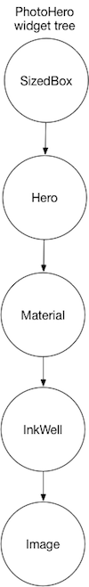
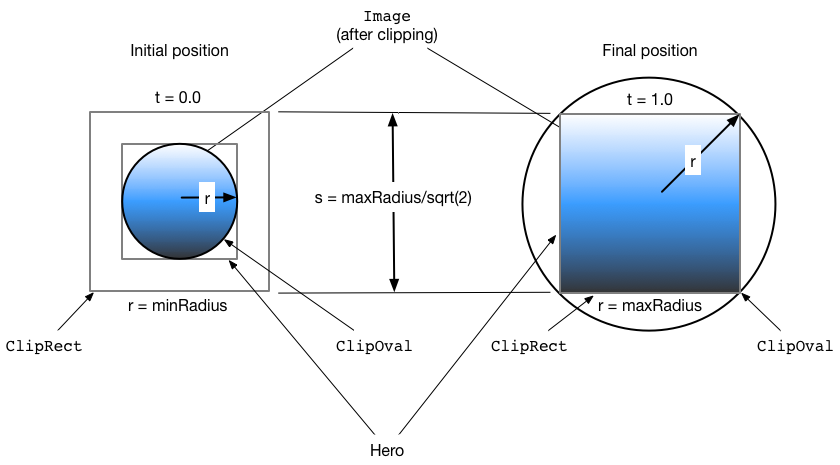
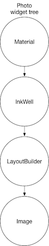
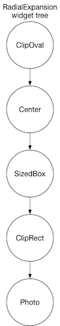


XXX - TODO

* My tweaked copy of basic_radial_transition doesn't look right.
  It takes on an oval shape as it flies.
* Currently the adb command isn't working. I IM'd on Hackers
  and received the following from Amir Hardon:
  "Hi Shams (: a shot in the dark for the adb
  error - I think I had similar issues when the command line adb
  is from a different Android sdk than the one used by Android
  studio (I think Android studio keep trying to restart adb when
  you kill it), you can easily check by closing Android studio,
  killing the adb server and then trying again
  (while studio is closed)"
  "If that's the issue a better fix would be to make sure the
  SDK you use from the command line is the same one intellij is
  using."
  Solution: Hans made the videos for me.
* Eventually publish these under GoogleDevelopers on Youtube but,
  in the meantime, publish them on my Youtube account.


<b> <a id="whats-the-point" class="anchor" href="#whats-the-point" aria-hidden="true"></a>What you'll learn:</b>

* Create a shared element transition using Flutter's Hero widget.
* Fly an element from one page to another.
* Animate morphing a circular shape to a rectangular shape.

This guide demonstrates how to build shared element transitions
in Flutter, also called shared element _animations_.
There are several types of shared element transitions, and this
guide covers two of them.

* TOC Placeholder
{:toc}

<aside class="alert alert-info" markdown="1">
**New to Flutter?**
You should first understand how to create a layout using Flutter’s
widgets.  For more information, see [Building Layouts in
Flutter](/tutorials/layout/).
</aside>

A shared element transition animates an element (typically an image)
from one page to another. This guide focuses on:

<ul>
<li markdown="1">Flying transitions 
A _flying transition_ animates the element
from one page to a new page, usually landing at a different
location and with a different size.

The following video (recorded at slow speed) shows a typical example.
Clicking the flippers in the center of the screen flies them to the
upper left corner of a new, blue screen, at a smaller size.
Clicking the flippers in the blue screen
(or using the device's back-to-previous-screen gesture)
returns the user to the original screen.

<iframe width="560" height="315" src="https://www.youtube.com/embed/uF7_JfhBsww" frameborder="0" allowfullscreen></iframe>

[PENDING/XXX: This video is in my personal Youtube
account.  When we all sign off, I'll upload it to the
<a href="https://www.youtube.com/user/GoogleDevelopers">Google
Developer Youtube account</a>.

</li>&nbsp;

<li markdown="1">Radial transitions 
A _radial transition_ morphs the element from
a circular shape to a rectangular shape, as it flies the image
from one page to another.

The following video (recorded at slow speed),
shows an example of a radial transition.
At the start, you see a row of three images displayed at the bottom
of the page.
Clicking any of the circles animates it to a new page that displays
the image as a larger square shape. Clicking the image in the square
returns the user to the original screen.

<iframe width="560" height="315" src="https://www.youtube.com/embed/V735TEHW5UI" frameborder="0" allowfullscreen></iframe>

[PENDING/XXX: Ditto.]

</li>
</ul>

Before moving to the sections specific to the
[flying](#flying-transitions)
or [radial](#radial-transitions) transitions,
read the [next section](#basic-structure) to learn how
to structure your app for either transition type.

## Basic structure of a shared element transition

<b> <a id="whats-the-point" class="anchor" href="#whats-the-point" aria-hidden="true"></a>What's the point?</b>

* Use two Hero widgets to implement a shared element transition.
* Routes describe a page or a scene in a Flutter app.
* The Navigator manages an app’s routes in its stack.
* Pushing a route to, or popping a route from, the Navigator’s stack
  triggers the transition.
* To make a Hero respond to a user’s tap, wrap it in an Inkwell widget.
* The Flutter framework calculates the tweens for you, and performs the
  animation in an overlay.

In Flutter, shared element transitions are implemented using
[Hero](https://docs.flutter.io/flutter/widgets/Hero-class.html) widgets.
While the term "shared element transition" is widely used by motion
designers and programmers who write animation code, Flutter implements
this type of transition using two Hero widgets: one describing the
element in the source page, and another describing the element in
the destination page.  From the user’s point of view,
the element appears to be shared, and only the programmer needs to
understand this implementation detail.

<aside class="alert alert-info" markdown="1">
**Note about dialogs:**
Heroes fly from one PageRoute to another. Dialogs
(as in `showDialog()`), use PopupRoutes, which are not PageRoutes.
At least for now, you can't animate a Hero to a Dialog.
For further developments, [watch this
issue.](https://github.com/flutter/flutter/issues/10667)
</aside>

Hero transition code has the following structure:

1. Define a starting Hero element. The Hero specifies its location,
   size, a graphical representation (typically an image), and a tag
   object that identifies the element.
1. Define an ending Hero element. This element also specifies a
   location, size a graphical representation and the same tag object
   as the starting Hero. It's <strong>essential that both Hero objects
   are created with the same tag</strong>, typically an object that
   represents the underlying data. To make the animations look good,
   it's critical that the widget tree
   for the Hero in both locations be essentially identical.
1. (Optional) Place any Hero elements that respond to user input,
   such as a tap, in an Inkwell.
1. Specify a route (also called a page or a screen) that contains the
   destination element. When creating the route, define the widget tree
   for the new page when the transition completes. The route class used
   depends on the type of transition.
1. Trigger the animation by pushing the route to the Navigator,
   the stack that manages the routes. Popping a route from the
   Navigator’s stack triggers a return transition.

Triggering the transition causes the framework to calculate the tweens
required to transition the starting element to the ending element,
interpolating size and position changes, as required. When the
transition begins, the framework transitions the element (in an overlay)
to the destination.

<aside class="alert alert-info" markdown="1">
**Behind the scenes:** Pushing the route causes the following behavior:

1. Flutter checks to see if the source and destination routes have Heros
   with matching tags.
1. If they do, Flutter creates the destination route “offstage” (where
   you can’t see it) and determines where each Hero ends up when the
   transition completes.
1. The transition begins and each destination Hero starts exactly
   where the source Hero was, but in the Navigator’s overlay.
1. During the transition, the destination Hero remains in the overlay
   and animates to its final size and position.
1. When the transition completes, the framework removes the
   transitional Hero from the overlay,
   and the destination page rebuilds normally.
</aside>

### Essential classes

The examples in this guide use the following classes to
implement shared element transitions:

[Hero](https://docs.flutter.io/flutter/widgets/Hero-class.html)
: The "shared element" that flies from the source to the destination.
  The Hero isn’t actually shared in the implementation. Define one Hero
  for the start of the transition and another for the end, and assign
  each the same tag. Flutter animates pairs of Heros with matching tags.

[Inkwell](https://docs.flutter.io/flutter/material/InkWell-class.html)
: (Optional) Specifies what happens when tapping the element.
  For the examples in this guide, the `onTap()` method creates the new
  route and pushes it to the Navigator, triggering the transition.

[Navigator](https://docs.flutter.io/flutter/widgets/Navigator-class.html)
: The stack that manages an app’s routes. Pushing a route to, or popping
  a route from the Navigator triggers the animation.

[Route](https://docs.flutter.io/flutter/widgets/Route-class.html)
: Specifies a screen or page. Most apps, beyond the most basic,
  have multiple routes. To specify a route, use
  [MaterialPageRoute,](https://docs.flutter.io/flutter/material/MaterialPageRoute-class.html)
  [CupertinoPageRoute,](https://docs.flutter.io/flutter/cupertino/CupertinoPageRoute-class.html)
  or build a custom route using
  [PageRouteBuilder.](https://docs.flutter.io/flutter/widgets/PageRouteBuilder-class.html)

## Flying transitions

<b> <a id="whats-the-point" class="anchor" href="#whats-the-point" aria-hidden="true"></a>What's the point?</b>

* Specify a route using MaterialPageRoute, CupertinoPageRoute,
  or PageRouteBuilder. The flying examples shown here use
  MaterialPageRoute.
* Change the size of the image at the end of the transition by
  wrapping the destination's image in a SizedBox.
* Change the location of the image by placing the destination's
  image in a layout widget. These examples use Container.

<aside class="alert alert-info" markdown="1">
**Show me the code!**

Each of the following examples demonstrate flying an element from one
route to another. This guide describes the first example.  

[flying_transition](https://github.com/flutter/website/tree/master/_includes/code/animation/flying_transition)
: A movement transition as described in the Material motion spec.
  Encapsulates the Hero code in a custom PhotoHero widget.

[basic_flying_transition](https://github.com/flutter/website/tree/master/_includes/code/animation/basic_flying_transition)
: Uses the Hero object directly.
  This more basic example, provided for your reference, isn't
  described in this guide.

</aside>

Flying an element from one route to another, one of the most
common types of shared element transitions, is easy to implement
using Flutter's Hero widget. When using MaterialPageRoute
to specify the new route, the element flies along a curved path,
as described by the [Material Design motion
spec.](https://material.io/guidelines/motion/movement.html)
The widget tree for the destination route is created in the `builder`
property.

[Create a new Flutter example](/getting-started/) and
update it using the files from the
[GitHub directory.](https://github.com/flutter/website/tree/master/_includes/code/animation/flying_transition)

To run the example:

* Tap on the home route’s photo to fly the image to a new route
  showing the same photo at a different location and scale.
* Return to the previous route by clicking the image, or by using the
  device’s back-to-the-previous-screen gesture.
* You can slow the transition further using the `timeDilation`
  property.

### PhotoHero class

The custom PhotoHero class maintains the Hero, and its size, image,
and behavior when tapped. The PhotoHero builds the following
widget tree:

Here's the code:

<!-- skip -->

class PhotoHero extends StatelessWidget {
  const PhotoHero({ Key key, this.photo, this.onTap, this.width }) : super(key: key);

  final String photo;
  final VoidCallback onTap;
  final double width;

  Widget build(BuildContext context) {
    [[highlight]]return new SizedBox([[/highlight]]
      width: width,
      child: new Hero(
        tag: photo,
        child: new Material(
          [[highlight]]color: Colors.transparent,[[/highlight]]
          child: [[highlight]]new InkWell([[/highlight]]
            [[highlight]]onTap: onTap,[[/highlight]]
            child: new Image.asset(
              photo,
              [[highlight]]fit: BoxFit.contain,[[/highlight]]
            ),
          ),
        ),
      ),
    );
  }
}


Key information:

* An InkWell wraps the Hero, making it trivial to add a tap
  gesture to the both the source and destination Heros.
* Defining the Material widget with a transparent color
  enables the image to "pop out" of the background as it
  flies to its destination.
* Placing everything in a SizedBox and setting it's width
  to the passed-in value, determines the size
  of the image at the end of the animation.
* Setting the Image's `fit` property to `BoxFit.contain`,
  ensures that the image is as large as possible during the
  transition while fitting into the target box.

### SharedElementTransition class

The SharedElementTransition class creates the source and destination
PhotoHeros, and sets up the transition.

Here's the code:

<!-- skip -->

class SharedElementTransition extends StatelessWidget {
  Widget build(BuildContext context) {
    [[highlight]]timeDilation = 5.0; // 1.0 means normal animation speed.[[/highlight]]

    return new Scaffold(
      appBar: new AppBar(
        title: const Text('Shared Element Transition'),
      ),
      body: new Center(
        [[highlight]]child: new PhotoHero([[/highlight]]
          photo: 'images/flippers-alpha.png',
          width: 300.0,
          [[highlight]]onTap: ()[[/highlight]] {
            [[highlight]]Navigator.of(context).push(new MaterialPageRoute<Null>([[/highlight]]
              [[highlight]]builder: (BuildContext context)[[/highlight]] {
                return new Scaffold(
                  appBar: new AppBar(
                    title: const Text('Flippers Page'),
                  ),
                  body: new Container(
                    // Set background to blue to emphasize that it's a new page.
                    color: Colors.lightBlueAccent,
                    padding: const EdgeInsets.all(16.0),
                    alignment: Alignment.topLeft,
                    [[highlight]]child: new PhotoHero([[/highlight]]
                      photo: 'images/flippers-alpha.png',
                      width: 100.0,
                      [[highlight]]onTap: ()[[/highlight]] {
                        [[highlight]]Navigator.of(context).pop();[[/highlight]]
                      },
                    ),
                  ),
                );
              }
            ));
          },
        ),
      ),
    );
  }
}


Key information:

* When the user taps the InkWell that contains the source Hero,
  the code creates a new MaterialPageRoute (in `onTap()`) and pushes
  it to the Navigator’s stack, triggering the animation.
* The anonymous builder for the new route creates a Container with the
  destination PhotoHero. The Container determines where the destination
  Hero lands.
* The `onTap()` method for the destination PhotoHero pops the
  Navigator’s stack, triggering the animation that flies
  the Hero back to the original route.

---

## Radial transitions

<b> <a id="whats-the-point" class="anchor" href="#whats-the-point" aria-hidden="true"></a>What's the point?</b>

* A radial transition morphs a circular element into a square element.
* Because this is a Hero transition, the Hero morphs while
  flying in an overlay from the source route to the destination route.
* MaterialRectCenterArcTween defines the tween animation.
* Build the destination route using PageRouteBuilder.

 (rather than MaterialPageRoute), to use its animation property
  fade the second route in and out.
* Only the ClipOval changes size&mdash;from minSize to maxSize.
* The ClipRect has constant size throughout the animation.


Animating an element as it morphs from a circular shape to a rectanglar
shape is a slick effect that you can implement using Hero animation.
To accomplish this, the code animates the intersection of two clip
shapes: a circle and a square.
Throughout the animation, the circle clip (and the image) scales from
`minRadius` to `maxRadius`, while the square clip maintains a constant
size. At the same time, the image flies
from its position in the source route to its position in the
destination route. For visual examples of this transition, see
<a href="https://material.io/guidelines/motion/transforming-material.html#transforming-material-radial-transformation">Radial
transformation</a> in the Material motion spec.

This animation might seem complex (and it is), but you can
**customize the provided example to your needs.**
The heavy lifting is done for you.

<aside class="alert alert-info" markdown="1">
**Show me the code!**

Each of the following examples demonstrates a radial transition.
This guide describes the first example.  

[radial_transition](https://github.com/flutter/website/tree/master/_includes/code/animation/radial_transition)
: A radial transition as described in the Material motion spec.

[basic_radial_transition](https://github.com/flutter/website/tree/master/_includes/code/animation/basic_radial_transition)
: A radial transition with a simple destination route&mdash;it has
  no Scaffold, Card, Column, or Text.
  This basic example, provided for your reference, isn't
  described in this guide.

[radial_transition_animate_rectclip](https://github.com/flutter/website/tree/master/_includes/code/animation/basic_radial_transition_animate_rectclip)
: Extends radial_transition by also animating the size of the
  rectangular clip.
  This more advanced example, provided for your reference, isn't
  described in this guide.

</aside>

<aside class="alert alert-info" markdown="1">
**Pro tip:**
The radial animation involves intersecting a round shape with
a square shape. This can be hard to see, even when slowing
the animation with `timeDilation`, so you might consider enabling
Flutter's [visual debugging mode](/debugging/#visual-debugging)
during development.
</aside>

### What's going on?

The following diagram shows the clipped image at the beginning
(`t = 0.0`), and the end (`t = 1.0`) of the animation.

The blue gradient (representing the image), indicates where these
shapes intersect. At the beginning of the transition,
the shapes intersect as a circle
([ClipOval](https://docs.flutter.io/flutter/widgets/ClipOval-class.html)).
At the end, the image and circle clip have scaled up, and the
shapes intersect as a square
([ClipRect](https://docs.flutter.io/flutter/widgets/ClipRect-class.html)).
The ClipOval scales from `minRadius` to `maxRadius` while the
ClipRect maintains a constant size.

[Create a new Flutter example](/getting-started/) and
update it using the files from the
[GitHub directory.](https://github.com/flutter/website/tree/master/_includes/code/animation/radial_transition)

To run the example:

* Tap on one of the three circular thumbnails to animate the image
  to a larger square positioned in the middle of a new route that
  obscures the original route.
* Return to the previous route by clicking the image, or by using the
  device’s back-to-the-previous-screen gesture.
* You can slow the transition further using the `timeDilation`
  property.

### Photo class

The Photo class builds the widget tree that holds the image:

Here's the code:

<!-- skip -->

class Photo extends StatelessWidget {
  Photo({ Key key, this.photo, this.color, this.onTap }) : super(key: key);

  final String photo;
  final Color color;
  final VoidCallback onTap;

  Widget build(BuildContext context) {
    return [[highlight]]new Material([[/highlight]]
      // Slightly opaque color appears where the image has transparency.
      [[highlight]]color: Theme.of(context).primaryColor.withOpacity(0.25),[[/highlight]]
      child: [[highlight]]new InkWell([[/highlight]]
        onTap: [[highlight]]onTap,[[/highlight]]
        child: [[highlight]]new LayoutBuilder([[/highlight]]
          builder: (BuildContext context, BoxConstraints size) {
            return [[highlight]]new Image.asset([[/highlight]]
              photo,
              fit: BoxFit.contain,
            );
          },
        ),
      ),
    );
  }
}


Key information:

* A
[LayoutBuilder](https://docs.flutter.io/flutter/widgets/LayoutBuilder-class.html)
  wraps the image, allowing the parent to constrain the image's
  size as it animates.

* The Inkwell captures the user's tap gesture.
  The calling function passes the `onTap()` function to the
  Photo's constructor.

* The Material widget has a slightly opaque color, so the
  transparent portions of the image are rendered with color.
  This ensures that the circle-to-square transition is easy to see,
  even for images with transparency.

* The Photo class does not include the Hero in its widget tree.
  For the animation to work, the Hero
  wraps the RadialExpansion widget, which wraps the Hero.

### RadialExpansion class

The RadialExpansion widget, the core of the demo, expands and
clips the circle that holds the image. To do this, it builds
the following widget tree:

Here's the code:

<!-- skip -->

class RadialExpansion extends StatelessWidget {
  RadialExpansion({
    Key key,
    this.maxRadius,
    this.child,
  }) : [[highlight]]clipRectSize = 2.0 * (maxRadius / math.SQRT2),[[/highlight]]
       super(key: key);

  final double maxRadius;
  final clipRectSize;
  final Widget child;

  @override
  Widget build(BuildContext context) {[[/highlight]]
    return [[highlight]]new ClipOval([[/highlight]]
      child: [[highlight]]new Center([[/highlight]]
        child: [[highlight]]new SizedBox([[/highlight]]
          width: clipRectSize,
          height: clipRectSize,
          child: [[highlight]]new ClipRect([[/highlight]]
            child: [[highlight]]child,[[/highlight]]  // Photo
          ),
        ),
      ),
    );
  }
}


Key information:

<ul markdown="1">
<li markdown="1">The Hero wraps the RadialExpansion widget.
</li>
<li markdown="1">As the hero flies, the RadialExpansion widget's
size changes, and the Photo rebuilds because it's wrapped in a
LayoutBuilder.
</li>
<li markdown="1">The RadialExpansion animation is created by two
overlapping clips.
</li>
<li markdown="1">The example defines the tweening interpolation
using
[MaterialRectCenterArcTween:](https://github.com/flutter/flutter/blob/master/packages/flutter/lib/src/material/arc.dart#L331)
[FIX LINK/XXX: Once the class is rolled into alpha and the docs
are updated]
The default flight path for a Hero animation interpolates the tweens
using the corners of the Heroes. That approach can affect the
Hero's aspect ratio during the radial transition,
so the example defines a new flight path in
`_createRectTween()`.
The new path is calculated using MaterialRectCenterArcTween,
which interpolates the tweens using
the center point of both Heroes.

Here's the code:

<!-- skip -->

static RectTween _createRectTween(Rect begin, Rect end) {
  return new MaterialRectCenterArcTween(begin: begin, end: end);
}


This changes the default flight path for the Hero, from one where
its aspect ratio might change during flight,
to one where the aspect ratio remains constant.
The Heroes' flight path still follows an arc,
but now s the center of the Hero that follows the arc,
not a pair of opposing corners.
</li>
</ul>

---

## Resources

The following resources may help when writing animations:

[Animations landing page](/animations/)
: Lists the available documentation for Flutter animations.
  If tweens are new to you, check out the
  [Animations tutorial](/tutorials/animation/).

[Flutter API documentation](https://docs.flutter.io/)
: Reference documentation for all of the Flutter libraries.
  In particular, see the [animation
  library](https://docs.flutter.io/flutter/animation/animation-library.html)
  documentation.

[Flutter Gallery](https://github.com/flutter/flutter/tree/master/examples/flutter_gallery)
: Demo app showcasing many Material Design widgets and other Flutter
  features.  The [Shrine
  demo](https://github.com/flutter/flutter/tree/master/examples/flutter_gallery/lib/demo/shrine)
  implements a Hero transition.

[Material motion spec](https://material.io/guidelines/motion/)
: Describes motion for Material design apps.
