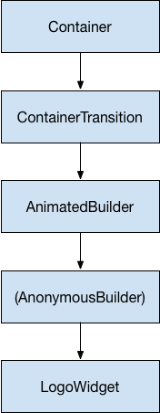

* TOC Placeholder
{:toc}

The animation system in Flutter is based on typed
[`Animation`](https://docs.flutter.io/flutter/animation/Animation-class.html)
objects. Widgets can either incorporate these animations in their build
functions directly by reading their current value and listening to their
state changes or they can use the animations as the basis of more elaborate
animations that they pass along to other widgets.

## Animation&lt;double&gt;

In Flutter, an Animation object knows nothing about what is onscreen.
An Animation is an abstract class that understands its current value
and its state (completed or dismissed). One of the more commonly used
animation types is Animation&lt;double&gt;.

A few facts about Flutter animations:

* An Animation object in Flutter is a class that sequentially generates
  interpolated numbers between two values over a certain duration.
  The output of an Animation object may be linear, a curve, a step function,
  or any other mapping you can devise. Depending on how the Animation object
  is controlled, it could run in reverse, or even switch directions in the
  middle.

* Animations can also interpolate types other than double, such as
  Animation&lt;Color&gt; or Animation&lt;Size&gt;.
  You'll learn about other types later in this page.

* An `Animation` object has state. Its current value is always available
  in the `.value` member.

* An Animation object knows nothing about rendering or `build()` functions.
  You'll see later how to make the connection.

## AnimationController

AnimationController is a special Animation object that generates a new
value whenever the hardware is ready for a new frame. By default,
an AnimationController linearly produces the numbers from 0.0 to 1.0
during a given duration. For example, this code creates an Animation object,
but does not start it running:

<!-- skip -->

final AnimationController controller = new AnimationController(
    duration: const Duration(milliseconds: 2000), vsync: this);


AnimationController derives from Animation&lt;double&gt;, so it can be used
wherever an Animation object is needed. However, the AnimationController
has additional methods to control the animation. For example, you start
an animation with the `.forward()` method. The generation of numbers is
tied to the screen refresh, so typically 60 numbers are generated per
second. After each number is generated, each Animation object calls the
attached Listener objects.

When creating an AnimationController, you pass it a `vsync` argument.
This option keeps the current widget tree in display memory until
Flutter's rendering engine completes its refresh cycle. To use your
custom State object as the `vsync`, include the `TickerProviderStateMixin`
when defining the custom State class.

## CurvedAnimation

A CurvedAnimation modifies an Animation object's output to make the
progression be a non-linear curve:

<!-- skip -->

final CurvedAnimation curve =
    new CurvedAnimation(parent: controller, curve: Curves.easeIn);


CurvedAnimation and AnimationController are both of type
Animation&lt;double&gt;, so you can pass them interchangeably.
Note that the CurvedAnimation wraps the object it’s modifying.
You don’t subclass AnimationController to implement a curve.

<aside class="alert alert-success" markdown="1">
By default, AnimationController can go from 0.0 to 1.0.
There is also a `fling()` function that allows you to provide velocity,
force, and position (via the Force object).
The position can be anything and so can be outside of the 0.0 to 1.0 range.

The CurvedAnimation can exceed its 0.0 to 1.0 range,
even if the AnimationController doesn't. Depending on the curve selected,
the output of the CurvedAnimation can have a wider range than the input.
For example, elastic curves such as Curves.elasticIn will significantly
overshoot or undershoot the default range.
</aside>

## Tween

By default, the AnimationController object ranges from 0.0 to 1.0.
If you need a different range or a different data type,
you can use a Tween to configure an animation to interpolate to a
different range or data type. For example, the following Tween
goes from -200.0 to 0.0:

<!-- skip -->

final Tween doubleTween = new Tween<double>(begin: -200.0, end: 0.0);


A Tween is a stateless object that takes only `begin` and `end`.
The sole job of a Tween is to define a mapping from an input range
to an output range. The input range is commonly 0.0 to 1.0,
but that’s not a requirement.

A Tween inherits from Animatable&lt;T&gt;, not from Animation&ltT&gt;.
An Animatable does not have to output double.
For example, ColorTween specifies a progression between two colors.

<!--- skip -->

final Tween colorTween =
    new ColorTween(begin: Colors.transparent, end: Colors.black54);


A Tween object does not store any state. Instead, it exposes two methods
`evaluate(Animation<double> animation)`, which applies the mapping function
to the current value of the animation. The current value of the `Animation`
object can be found in the `.value` method. The evaluate function also
performs some housekeeping, such as ensuring that begin and end are
returned when the animation values are 0.0 and 1.0, respectively.

## Tween.animate

To use a Tween object, you configure an Animation to use the Tween
(Animatable) with the `animate()` function on the Animatable object.
For example, the following code generates the integer values from
0 to 255 over the course of 500 ms.

<!-- skip -->

final AnimationController controller = new AnimationController(
    duration: const Duration(milliseconds: 500), vsync: this);
Animation<int> alpha = new IntTween(begin: 0, end: 255).animate(animation);


Notice that `animate()` returns an Animation, not an Animatable.

The following example shows a controller, a curve, and a Tween:

<!-- skip -->

final AnimationController controller = new AnimationController(
    duration: const Duration(milliseconds: 500), vsync: this);
final Animation curve =
    new CurvedAnimation(parent: animation, curve: Curves.easeOut);
Animation<int> alpha = new IntTween(begin: 0, end: 255).animate(curve);


You can chain Tweens together using the `.chain()` method,
in which case a single Animation object will be configured by multiple
Tween objects called in succession. This is different than calling
`.animate()` twice, in which case you have two Animate objects,
each configured with a single Tween.

## Animation notifications

An Animation object can have Listeners and StatusListeners,
defined with `addListener()` and `addStatusListener()`.
A Listener is called whenever the value of the animation changes.
The most common behavior of a Listener is to call `setState()`
to cause a rebuild. A StatusListener is called when an animation begins,
ends, moves forward, or moves reverse, as defined by AnimationStatus.
The next section has an example of the `addListener()` method,
and [Monitoring the progress of the animation](#monitoring) shows an
example of `addStatusListener()`.

## Rendering animations

The examples so far show how to generate a sequence of numbers over time.
Nothing has been rendered to the screen.
To render with an Animation&lt;&gt; object, store the Animation object as a
member of your Widget, then use its value to decide how to draw.

Consider the following application that draws the Flutter logo without
animation:

<!-- skip -->

import 'package:flutter/material.dart';

class LogoApp extends StatefulWidget {
  LogoAppState createState() => new LogoAppState();
}

class LogoAppState extends State<LogoApp> {
  @override
  Widget build(BuildContext context) {
    return new Center(
      child: new Container(
        margin: new EdgeInsets.symmetric(vertical: 10.0),
        height: 300.0,
        width: 300.0,
        child: new FlutterLogo(),
      ),
    );
  }
}

void main() {
  runApp(new LogoApp());
}


The following shows the same code modified to animate the
logo to grow from nothing to full size. The changes are highlighted:

<!-- skip -->

[[highlight]]import 'package:flutter/animation.dart';[[/highlight]]
import 'package:flutter/material.dart';

class LogoApp extends StatefulWidget {
  LogoAppState createState() => new LogoAppState();
}

class LogoAppState extends State<LogoApp> with SingleTickerProviderStateMixin {
  [[highlight]]Animation<double> animation;[[/highlight]]

  [[highlight]]initState() {[[/highlight]]
    [[highlight]]super.initState();[[/highlight]]
    [[highlight]]AnimationController controller = new AnimationController([[/highlight]]
        [[highlight]]duration: const Duration(milliseconds: 2000), vsync: this);[[/highlight]]
    [[highlight]]animation = new Tween(begin: 0.0, end: 300.0).animate(controller)[[/highlight]]
      [[highlight]]..addListener(() {[[/highlight]]
        [[highlight]]setState(() {[[/highlight]]
          [[highlight]]// the state that has changed here is the animation object’s value[[/highlight]]
        [[highlight]]});[[/highlight]]
      [[highlight]]});[[/highlight]]
    [[highlight]]controller.forward();[[/highlight]]
  [[highlight]]}[[/highlight]]

  @override
  Widget build(BuildContext context) {
    return new Center(
      child: new Container(
        margin: new EdgeInsets.symmetric(vertical: 10.0),
        height: [[highlight]]animation.value,[[/highlight]]
        width: [[highlight]]animation.value,[[/highlight]]
        child: new FlutterLogo,
      ),
    );
  }
}

void main() {
  runApp(new LogoApp());
}


The `addListener()` function calls `setState()`, so every time the
Animation generates a new number, the current frame is marked dirty,
which forces `build()` to be called again.
In `build()`, the container changes size because its height and width
now use `animation.value` instead of a hardcoded value.

With these few changes, you’ve created your first animation in Flutter!
You can find the source for this example,
[animate1,](https://raw.githubusercontent.com/InMatrix/animation_tutorial/master/lib/animate1.dart)
on GitHub.

<aside class="alert alert-success" markdown="1">
**Dart language tricks**
You may not be familiar with Dart's cascade notation&mdash;the two
dots in `..addListener()`. This syntax means that the `addListener()`
method is called with the return value from `animate()`.
Consider the following example:

<!-- skip -->

[[highlight]]animation = tween.animate(controller)[[/highlight]]
          [[highlight]]..addListener(()[[/highlight]] {
            setState(() {
              // the animation object’s value is the changed state
            });
          });


This code is equivalent to:

<!-- skip -->

[[highlight]]animation = tween.animate(controller);[[/highlight]]
[[highlight]]animation.addListener(()[[/highlight]] {
            setState(() {
              // the animation object’s value is the changed state
            });
          });


The difference is that, in the first case,
the animation variable hasn't been set when the closure is created.
Therefore, if you need to use `animation.value` in `setState()`,
you must use the second form.

You can learn more about cascade notation in the
[Dart Language Tour.](https://www.dartlang.org/guides/language/language-tour)
</aside>

##  Simplifying with AnimatedWidget

The call to `setState()` is an obvious candidate for refactoring,
which you’ll find in a helper class named AnimatedWidget.
The simplified code is shown below. LogoApp now derives from
AnimatedWidget instead of from StatefulWidget, and your
AnimatedWidget does not need to maintain a State object to
hold the animation.

You can use the AnimatedWidget helper class to separate the widget
code from the animation code in the previous example. In the refactored
example below, LogoApp now derives from AnimatedWidget instead of
StatefulWidget, and the AnimatedWidget doesn't need to maintain a State
object to hold the animation. For example:

<!-- skip -->

import 'package:flutter/animation.dart';
import 'package:flutter/material.dart';

class AnimatedLogo extends AnimatedWidget {
  AnimatedLogo({Key key, Animation<double> animation})
      : super(key: key, listenable: animation);

  @override
  Widget build(BuildContext context) {
    final Animation<double> animation = listenable;
    return new Center(
      child: new Container(
        margin: new EdgeInsets.symmetric(vertical: 10.0),
        height: animation.value,
        width: animation.value,
        child: new FlutterLogo(),
      ),
    );
  }
}

class LogoApp extends StatefulWidget {
  @override
  _LogoAppState createState() => new _LogoAppState();
}

class _LogoAppState extends State<LogoApp> with TickerProviderStateMixin {
  AnimationController controller;
  Animation<double> animation;

  initState() {
    super.initState();
    controller = new AnimationController(
        duration: const Duration(milliseconds: 2000), vsync: this);
    animation = new Tween(begin: 0.0, end: 300.0).animate(controller);
    controller.forward();
  }

  @override
  Widget build(BuildContext context) {
    return new AnimatedLogo(animation: animation);
  }

  @override
  dispose() {
    super.dispose();
    controller.dispose();
  }
}

void main() {
  runApp(new LogoApp());
}


LogoApp passes the Animation object to the base class and uses
`animation.value` to set the height and width of the container, so
it works exactly the same as before.

You can find the source for this example,
[animate2,](https://raw.githubusercontent.com/InMatrix/animation_tutorial/master/lib/animate2.dart)
on GitHub.

## Monitoring the progress of the animation

It’s often helpful to know when an animation changes state,
such as finishing, moving forward, or reversing.
You can get notifications for this with `addStatusListener()`.
The following code modifies the previous example so that
it listens for a state change and prints an update.
The highlighted line shows the change:

<!-- skip -->

class _LogoAppState extends State<LogoApp> with SingleTickerProviderStateMixin {
  AnimationController controller;
  Animation<double> animation;

  initState() {
    super.initState();
    controller = new AnimationController(
        duration: const Duration(milliseconds: 2000), vsync: this);
    animation = new Tween(begin: 0.0, end: 300.0).animate(controller)
      [[highlight]]..addStatusListener((state) => print("$state"));[[/highlight]]
    controller.forward();
  }
  //...
}


Running this code produces lines like the following:

<!-- skip -->

AnimationStatus.forward
AnimationStatus.completed


Next, use `addStatusListener()` to reverse the animation at the
beginning or the end. This creates a "breathing" effect:

<!-- skip -->

class _LogoAppState extends State<LogoApp> with SingleTickerProviderStateMixin {
  AnimationController controller;
  Animation<double> animation;

  initState() {
    super.initState();
    controller = new AnimationController(
        duration: const Duration(milliseconds: 2000), vsync: this);
    animation = new Tween(begin: 0.0, end: 300.0).animate(controller);

    animation.addStatusListener((status) {
      if (status == AnimationStatus.completed) {
        controller.reverse();
      } else if (status == AnimationStatus.dismissed) {
        controller.forward();
      }
    });
    controller.forward();
  }
  //...
}


You can find the source for this example,
[animate3,](https://raw.githubusercontent.com/InMatrix/animation_tutorial/master/lib/animate3.dart)
on GitHub.

## Refactoring with AnimatedBuilder

One problem with the code in the previous example, is that changing
the animation required changing the widget that renders the logo.
A better solution is to separate responsibilities into different
classes:

* Render the logo
* Define the Animation object
* Render the transition

You can accomplish this separation with the help of the
AnimatedBuilder class. An AnimatedBuilder is a separate class in the
render tree. Like AnimatedWidget, AnimatedBuilder automatically
listens to notifications from the Animation object, and marks
the widget tree dirty as necessary, so you don't need to call
`addListener()`.

The widget tree for this example looks like this:

Starting from the bottom of the widget tree, the code for rendering
the logo is straightforward:

<!-- skip -->

class LogoWidget extends StatelessWidget {
  // Leave out the height and width so it fills the animating parent
  build(BuildContext context) {
    return new Container(
      margin: new EdgeInsets.symmetric(vertical: 10.0),
      child: new FlutterLogo(),
    );
  }
}


The middle three blocks in the diagram are all created in the
`build()` method in GrowTransition. The GrowTransition widget itself
is stateless and holds the set of final variables necessary to
define the transition animation. The build() function creates and
returns the AnimatedBuilder, which takes the (Anonymous builder)
method and the LogoWidget object as parameters. The work of
rendering the transition actually happens in the (Anonymous builder)
method, which creates a Container of the appropriate size to force
the LogoWidget to shrink to fit.

One tricky point in the code below is that the child looks like it's
specified twice. What's happening is that the outer reference of
child is passed to AnimatedBuilder, which passes it to the anonymous
closure, which then uses that object as its child. The net result is
that the AnimatedBuilder is inserted in between the two widgets in
the render tree.

<!-- skip -->

class GrowTransition extends StatelessWidget {
  GrowTransition({this.child, this.animation});

  final Widget child;
  final Animation<double> animation;

  @override
  Widget build(BuildContext context) {
    return new AnimatedBuilder(animation: animation,
        builder: (BuildContext context, Widget child) {
          return new Center(
              child: new Container(
                  height: animation.value,
                  width: animation.value,
                  child: child));
        }, child: child);
  }
}


Finally, the code to initialize the animation looks very similar to
our first example. The `initState()` method creates an AnimationController
and a Tween, then binds them with `animate()`. The magic happens in the
`build()` methods, which returns a GrowTransition object with a
LogoWidget as a child, and an animation object to drive the transition.
These are the three elements listed in the bullet points above.

<!-- skip -->

class LogoApp extends StatefulWidget {
  LogoAppState createState() => new LogoAppState();
}

class LogoAppState extends State<LogoApp> with TickerProviderStateMixin {
  Animation animation;
  AnimationController controller;

  initState() {
    super.initState();
    controller =
    new AnimationController(
        duration: const Duration(milliseconds: 2000),
        vsync: this,
    );
    final curve = new CurvedAnimation(
        parent: controller,
        curve: Curves.easeIn
    );
    animation = new Tween(begin: 0.0, end: 300.0).animate(curve);
    controller.forward();
  }

  Widget build(BuildContext context) {
    return new GrowTransition(
        child: new LogoWidget(),
        animation: animation
    );
  }

  @override
  dispose() {
    super.dispose();
    controller.dispose();
  }
}

void main() {
  runApp(new LogoApp());
}


You can find the source for this example,
[animate4,](https://raw.githubusercontent.com/InMatrix/animation_tutorial/master/lib/animate4.dart)
on GitHub.

## Simultaneous animations

In this section, you'll build on the example from [monitoring
the progress of the animation,](#monitoring) which used
AnimatedWidget to animate in and out continuously. Consider the case
where we want to go in and out AND the opacity to fade out and in.

<aside class="alert alert-success" markdown="1">
**Note:**
This example shows how to chain tweens together to manage multiple
effects in an animation. It is for illustrative purposes only.
If you were tweening opacity and size in production code,
you would probably use
[FadeTransition](https://docs.flutter.io/flutter/widgets/FadeTransition-class.html) and
[SizeTransition](https://docs.flutter.io/flutter/widgets/SizeTransition-class.html)
to accomplish this task.
</aside>

Managing multiple animation effects is typically handled by adding Tween
objects to the animation chain. Each tween manages an aspect of the
animation. For example:

<!-- skip -->

final AnimationController controller =
    new AnimationController(duration: const Duration(milliseconds: 2000), vsync: this,);
final Animation<double> sizeAnimation =
    new Tween(begin: 0.0, end: 300.0).animate(controller);
final Animation<double> opacityAnimation =
    new Tween(begin: 1.0, end: 0.3).animate(controller);


You can get the size with `sizeAnimation.value` and the opacity
with `opacityAnimation.value`. But the constructor for AnimatedWidget
only takes a single Animation object. To solve this problem,
we’ll create our own Tween objects and explicitly calculate the
values we need. Here’s the code:  (changes noted with highlights)

<!-- skip -->

import 'package:flutter/animation.dart';
import 'package:flutter/material.dart';

class AnimatedLogo extends AnimatedWidget {
  // We can make the Tweens static because we don't change them.
  [[highlight]]static final _opacityTween = new Tween<double>(begin: 1.0, end: 0.1);[[/highlight]]
  [[highlight]]static final _sizeTween = new Tween<double>(begin: 0.0, end: 300.0);[[/highlight]]

  AnimatedLogo({Key key, Animation<double> animation})
      : super(key: key, listenable: animation);

  @override
  Widget build(BuildContext context) {
    final Animation<double> animation = listenable;
    return new Center(
      child: new Opacity([[/highlight]]
        opacity: _opacityTween.evaluate(animation),[[/highlight]]
        child: new Container(
          margin: new EdgeInsets.symmetric(vertical: 10.0),
          height: [[highlight]]_sizeTween.evaluate(animation)[[/highlight]],
          width: [[highlight]]_sizeTween.evaluate(animation)[[/highlight]],
          child: new FlutterLogo(),
        ),
      ),
    );
  }
}

class LogoApp extends StatefulWidget {
  @override
  _LogoAppState createState() => new _LogoAppState();
}

class _LogoAppState extends State<LogoApp> with TickerProviderStateMixin {
  AnimationController controller;
  Animation<double> animation;

  initState() {
    super.initState();
    controller = new AnimationController(
        duration: const Duration(milliseconds: 2000), vsync: this);
    animation = [[highlight]]new CurvedAnimation(parent: controller, curve: Curves.easeIn);[[/highlight]]

    animation.addStatusListener((status) {
      if (status == AnimationStatus.completed) {
        controller.reverse();
      } else if (status == AnimationStatus.dismissed) {
        controller.forward();
      }
    });

    controller.forward();
  }

  @override
  Widget build(BuildContext context) {
    return new AnimatedLogo(animation: animation);
  }

  @override
  dispose() {
    super.dispose();
    controller.dispose();
  }
}

void main() {
  runApp(new LogoApp());
}


You can see that the GrowTransition class was changed to encapsulate
its own Tween objects, whose `.evaluate()` functions were called with
the parent’s animation object to calculate the required size and
opacity values.

You can find the source for this example,
[animate5,](https://raw.githubusercontent.com/InMatrix/animation_tutorial/master/lib/animate5.dart)
on GitHub.

## Next steps

There are many more classes to explore, including specialized Tween
classes, animations specific to Material Design, ReverseAnimation,
physics simulations and `fling()` methods. This doc should have
given you the foundation to understand these other parts of Flutter
animation.


The Flutter team is looking for use cases for more complex animations,
such as cascading events that delay the start of Animation B until three
seconds after Animation A starts. Please contact abarth@ if you have
use cases.


