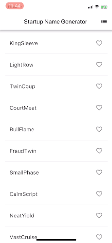
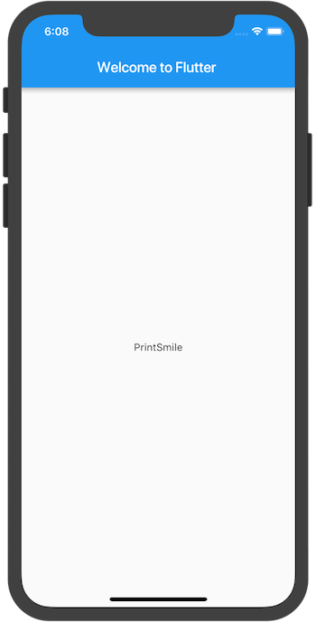
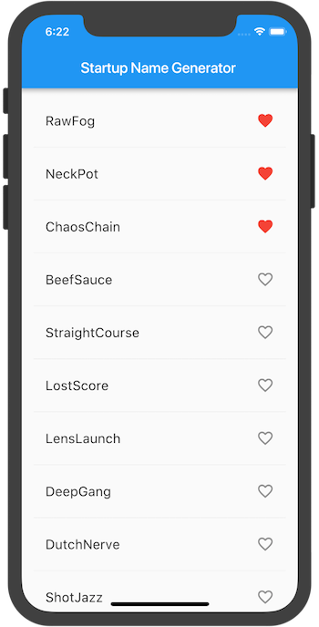
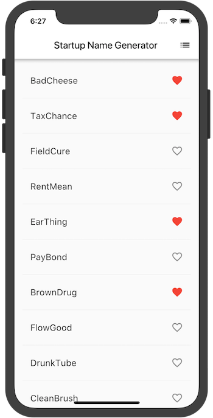

<figure class="right-figure" style="max-width: 250px">
    
    <figcaption>This is the app you will be building.</figcaption>
</figure>

This is a guide to creating your first Flutter app. If you
are familiar with object-oriented code and basic programming
concepts such as variables, loops, and conditionals,
you can complete this tutorial. You don’t need
previous experience with Dart or mobile programming.


TODO: (later)
- Break down the logic further where it calculates divided cells.
  (Search for xxx)
- Retake screenshots on the Android emulator?
- Somehow cross links from code to text so people can restart
  and fine their place more easily? (Tao)
- Second route should be named "Saved Suggestions" - name
  should be consistent: screenshot, code, markdown content.


* TOC
{:toc}

## What are Flutter and Dart?

_Flutter_ is Google's mobile UI framework for crafting high-quality
native interfaces on iOS and Android in record time. Flutter works with
existing code, is used by organizations around the world, and is free
and open source.

_Dart_ is an application programming language from Google that's
easy to learn, easy to use, and deployable everywhere.
Flutter apps are written in Dart.

## What you'll build

You’ll implement a simple mobile app that generates proposed names for a
startup company. The user can select and unselect proposed names,
saving the best ones. The code generates ten names at a time.
As the user scrolls, new batches of names are generated.

The animated GIF above shows how the finished app works.

<b> <a id="whats-the-point" class="anchor" href="#whats-the-point" aria-hidden="true"></a>What you'll learn:</b>

* Basic structure of a Flutter app.
* Finding and using packages to extend functionality.
* Using hot reload for a quicker development cycle.
* How to implement a stateful widget.
* How to create an infinite, lazily loaded list.
* How to create and navigate to a second screen.

<b> <a id="whats-the-point" class="anchor" href="#whats-the-point" aria-hidden="true"></a>What you'll use:</b>

You'll need to install the following:

<ul markdown="1">
<li markdown="1"> Flutter SDK 
    The Flutter SDK includes Flutter's engine, framework, widgets, tools,
    and a Dart SDK. This codelab requires v0.1.4 or later.
</li>
<li markdown="1"> Android Studio IDE 
    This codelab features the Android Studio IDE, but you can use
    another IDE, or work from the command line.
</li>
<li markdown="1"> Plugin for your IDE 
    The Flutter and Dart plugins must be installed separately for your
    IDE. Besides Android Studio, Flutter and Dart plugins are also available
    for the [VS Code](https://code.visualstudio.com/download) and
    [IntelliJ](https://www.jetbrains.com/idea/download/#section=mac) IDEs.
</li>
</ul>

See [Flutter Installation and Setup](/setup/) for information on how to set up
your environment.

# Step 1: Create the starting Flutter app

Create a simple, templated Flutter app, using the instructions in
[Getting Started with your first Flutter app.](/getting-started/)
Name the project **startup_namer** (instead of _myapp_).
You’ll be modifying this starter app to create the finished app.

## Replace lib/main.dart

In this codelab, you'll mostly be editing **lib/main.dart**,
where the Dart code lives.

<aside class="alert alert-success" markdown="1">
<i class="fa fa-lightbulb-o"> </i> **Tip:**
When pasting code into your app, indentation can
become skewed. You can fix this automatically with the Flutter tools:

* Android Studio / IntelliJ IDEA: Right-click the dart code and
  select **Reformat Code with dartfmt**.
* VS Code: Right-click the code and select **Reformat Code with dartfmt**.
* Terminal: Run `flutter format <filename>`.
</aside>

<ol markdown="1">

<li markdown="1"> Delete all of the code from **lib/main.dart**.
    Replace with the following code, which displays "Hello World" in the center
    of the screen.

<!-- skip -->

import 'package:flutter/material.dart';

void main() => runApp(new MyApp());

class MyApp extends StatelessWidget {
  @override
  Widget build(BuildContext context) {
    return new MaterialApp(
      title: 'Welcome to Flutter',
      home: new Scaffold(
        appBar: new AppBar(
          title: new Text('Welcome to Flutter'),
        ),
        body: new Center(
          child: new Text('Hello World'),
        ),
      ),
    );
  }
}


</li>

<li markdown="1"> Run the app. You should see the following screen.

</li>

</ol>

## Observations

<ul markdown="1">
<li markdown="1"> This example creates a Material app.
    [Material](https://material.io/guidelines/) is a visual design language
    that is standard on Android and the web. Flutter offers a rich set
    of Material widgets.
</li>
<li markdown="1"> The main method specifies fat arrow (`=>`) notation,
     which is short hand used for one-line functions or methods.
</li>
<li markdown="1"> The app extends StatelessWidget which makes the app itself a
     widget. In Flutter, most everything is a widget, including
     alignment, padding, and layout.
</li>
<li markdown="1"> The Scaffold widget, from the Material library,
     provides a default app bar, title, and a body property that
     holds the widget tree for the home screen. The widget subtree
     can be quite complex.
</li>
<li markdown="1"> A widget’s main job is to provide a `build()` method
    that describes how to display the widget in terms of other,
    lower level widgets.
</li>
<li markdown="1"> The widget tree for this example consists of a Center widget
     containing a Text child widget. The Center widget aligns its
     widget subtree to the center of the screen.
</li>

Removing this for now. A) It might be confusing and B) the code as shown here is wrong.
<li markdown="1"> Moving the “hello world” text into a separate widget,
    HelloWorld, results in an identical widget tree as the code above.
    (This code is informational only. You are starting with the Hello
    World code above.)

<!-- skip -->

import 'package: flutter/material.dart';

class MyApp extends StatelessWidget {
 @override
 Widget build(BuildContext context) {
   return new MaterialApp(
     title: 'Welcome to Flutter',
     home: new Scaffold(
       appBar: new AppBar(
         title: new Text('Welcome to Flutter'),
       ),
       body: new Center(
         child: new Text('Hello World')
       ),
     ),
   );
 }
}


Update with this code:

class HelloWorld extends StatelessWidget {
 @override
 Widget build(BuildContext context) {
   return new Center(
     child: new Text('Hello World'),
   );
 }
}
</li>

</ul>

---

# Step 2: Use an external package

In this step, you’ll start using an open-source package named
**english_words**, which contains a few thousand of the most used
English words plus some utility functions.

You can find the
[english_words](https://pub.dartlang.org/packages/english_words)
package, as well as many other open source packages, on
[pub.dartlang.org](https://pub.dartlang.org/flutter/).

<ol markdown="1">

<li markdown="1"> The pubspec file manages the assets for a Flutter app.
    In **pubspec.yaml**, add **english_words** (3.1.0 or higher)
    to the dependencies list.
    The new line is highlighted below:

<!-- skip -->

dependencies:
  flutter:
    sdk: flutter

  cupertino_icons: ^0.1.0
  [[highlight]]english_words: ^3.1.0[[/highlight]]

</li>

<li markdown="1"> While viewing the pubspec in Android Studio's editor view,
    click **Packages get** upper right. This pulls the package into
    your project. You should see the following in the console:

<!-- skip -->

flutter packages get
Running "flutter packages get" in startup_namer...
Process finished with exit code 0

</li>

<li markdown="1"> In **lib/main.dart**, add the import for `english_words`,
    as shown in the highlighted line:

<!-- skip -->

import 'package:flutter/material.dart';
[[highlight]]import 'package:english_words/english_words.dart';[[/highlight]]


As you type, Android Studio gives you suggestions for libraries to
import. It then renders the import string in gray, letting you
know that the imported library is unused (so far).
</li>

<li markdown="1"> Use the English words package to generate the text instead of
    using the string "Hello World". Make the following changes,
    as highlighted below:

<!-- skip -->

import 'package:flutter/material.dart';
import 'package:english_words/english_words.dart';

void main() => runApp(new MyApp());

class MyApp extends StatelessWidget {
  @override
  Widget build(BuildContext context) {
    [[highlight]]final wordPair = new WordPair.random();[[/highlight]]
    return new MaterialApp(
      title: 'Welcome to Flutter',
      home: new Scaffold(
        appBar: new AppBar(
          title: new Text('Welcome to Flutter'),
        ),
        body: new Center(
          //child: new Text([[highlight]]'Hello World'[[/highlight]]), // Replace the highlighted text...
          child: new Text([[highlight]]wordPair.asPascalCase[[/highlight]]),  // With this highlighted text.
        ),
      ),
    );
  }
}

</li>

<li markdown="1"> If the app is running, use the hot reload button
    ()
    to update the running app. Each time you click hot reload,
    or save the project, you should see a different word pair,
    chosen at random, in the running app.
    This is because the word pairing is generated inside the build
    method, which is run each time the app is hot loaded or saved.

</li>

</ol>

## Problems?

If your app isn't running correctly, look for typos. If needed,
use the code at the following links to get back on track.

* [**pubspec.yaml**](https://gist.githubusercontent.com/Sfshaza/bb51e3b7df4ebbf3dfd02a4a38db2655/raw/57c25b976ec34d56591cb898a3df0b320e903b99/pubspec.yaml)
(The **pubspec.yaml** file won't change again.)
* [**lib/main.dart**](https://gist.githubusercontent.com/Sfshaza/bb51e3b7df4ebbf3dfd02a4a38db2655/raw/57c25b976ec34d56591cb898a3df0b320e903b99/main.dart)

---

# Step 3: Add a Stateful widget

State<em>less</em> widgets are immutable, meaning that their
properties can’t change&mdash;all values are final.

State<em>ful</em> widgets maintain state that might change
during the lifetime of the widget. Implementing a stateful
widget requires at least two classes: 1) a StatefulWidget class
that creates an instance of 2) a State class. The StatefulWidget
class is, itself, immutable, but the State class persists over the
lifetime of the widget.

In this step, you’ll add a stateful widget, RandomWords, which creates
its State class, RandomWordsState. The State class will eventually
maintain the proposed and favorite word pairs for the widget.

<ol markdown="1">
<li markdown="1"> Add the stateful RandomWords widget to main.dart.
    It can go anywhere in the file, outside of MyApp, but the solution
    places it at the bottom of the file. The RandomWords widget does little
    else besides creating its State class:

<!-- skip -->

class RandomWords extends StatefulWidget {
  @override
  createState() => new RandomWordsState();
}

</li>

<li markdown="1"> Add the RandomWordsState class. Most of the
    app’s code resides in this class, which maintains the state for the
    RandomWords widget. This class will save the generated word pairs,
    which grow infinitely as the user scrolls, and also favorite
    word pairs, as the user adds or removes them from the list by
    toggling the heart icon.

You’ll build this class bit by bit. To begin, create a minimal
class by adding the highlighted text:

<!-- skip -->

class RandomWordsState extends State<RandomWords> {
}

</li>

<li markdown="1"> After adding the state class, the IDE complains that
    the class is missing a build method. Next, you'll add a basic
    build method that generates the word pairs by moving the
    word generation code from MyApp to RandomWordsState.

Add the build method to RandomWordState, as shown
by the highlighted text:

<!-- skip -->

class RandomWordsState extends State<RandomWords> {
  [[highlight]]@override[[/highlight]]
  [[highlight]]Widget build(BuildContext context) {[[/highlight]]
    [[highlight]]final wordPair = new WordPair.random();[[/highlight]]
    [[highlight]]return(new Text(wordPair.asPascalCase));[[/highlight]]
  [[highlight]]}[[/highlight]]
}

</li>

<li markdown="1"> Remove the word generation code from MyApp by making
    the highlighted changes below:

<!-- skip -->

class MyApp extends StatelessWidget {
  @override
  Widget build(BuildContext context) {
    [[strike]]final wordPair = new WordPair.random();[[/strike]]  // Delete this line

    return new MaterialApp(
      title: 'Welcome to Flutter',
      home: new Scaffold(
        appBar: new AppBar(
          title: new Text('Welcome to Flutter'),
       ),
        body: new Center(
          //child: new [[highlight]]Text(wordPair.asPascalCase),[[/highlight]] // Change the highlighted text to...
          child: new [[highlight]]RandomWords(),[[/highlight]] // ... this highlighted text
        ),
      ),
    );
  }
}

</li>

</ol>

Restart the app. If you try to hot reload, you might see an error:


Reloading...
Not all changed program elements ran during view reassembly; consider
restarting.


It may be a false positive, but consider restarting in order to make sure
that your changes are reflected in the app's UI.

The app should behave as before, displaying a word
pairing each time you hot reload or save the app.

## Problems?

If your app isn't running correctly, you can use the code
at the following links to get back on track.

xxx
* [**pubspec.yaml**]()
* [**lib/main.dart**]()

---

# Step 4: Create an infinite scrolling ListView

In this step, you'll expand RandomWordsState to generate
and display a list of word pairings. As the user scrolls, the list
displayed in a ListView widget, grows infinitely. ListView's
`builder` factory constructor allows you to build a list view
lazily, on demand.

<ol markdown="1">

<li markdown="1"> Add a `_suggestions` list to the RandomWordsState
class for saving suggested word pairings. Note that the variable begins
with an underscore (`_`).  Prefixing an identifier with an underscore enforces
privacy in the Dart language.

Also, add a `biggerFont` variable for making the font size larger.

<!-- skip -->

class RandomWordsState extends State<RandomWords> {
  [[highlight]]final _suggestions = <WordPair>[];[[/highlight]]

  [[highlight]]final _biggerFont = const TextStyle(fontSize: 18.0);[[/highlight]]
  ...
}

</li>

<li markdown="1"> Add a `_buildSuggestions()` method to the RandomWordsState
class. This method grabs word pairings in batches of 10 and
displays them in the ListView.

The ListView class provides a builder property, `itemBuilder`, where the rows
are built inside an anonymous function. Two parameters are passed to
the function&mdash;the BuildContext, and the row iterator, `i`.


xxx: Todo: Explain this by breaking it down further.

<!-- skip -->

class RandomWordsState extends State<RandomWords> {
  ...
  [[highlight]]Widget _buildSuggestions() {[[/highlight]]
    [[highlight]]return new ListView.builder([[/highlight]]
      [[highlight]]padding: const EdgeInsets.all(16.0),[[/highlight]]
      [[highlight]]itemBuilder: (context, i) {[[/highlight]]
        [[highlight]]if (i.isOdd) return new Divider();[[/highlight]]

        [[highlight]]final index = i ~/ 2;[[/highlight]]
        [[highlight]]if (index >= _suggestions.length) {[[/highlight]]
          [[highlight]]_suggestions.addAll(generateWordPairs().take(10));[[/highlight]]
        [[highlight]]}[[/highlight]]
        [[highlight]]return _buildRow(_suggestions[index]);[[/highlight]]
      [[highlight]]}[[/highlight]]
    [[highlight]]);[[/highlight]]
  [[highlight]]}[[/highlight]]
}

</li>

<li markdown="1"> The `_buildSuggestions` method calls `_buildRow` once per
word pair. This method displays each new pair in a ListTile,
which allows you to make the rows more attractive in the next step.

Add a `_buildRow` method to RandomWordsState:

<!-- skip -->

class RandomWordsState extends State<RandomWords> {
  ...

  [[highlight]]Widget _buildRow(WordPair pair) {[[/highlight]]
    [[highlight]]return new ListTile([[/highlight]]
      [[highlight]]title: new Text([[/highlight]]
        [[highlight]]pair.asPascalCase,[[/highlight]]
        [[highlight]]style: _biggerFont,[[/highlight]]
      [[highlight]])[[/highlight]]
    [[highlight]]);[[/highlight]]
  [[highlight]]}[[/highlight]]
}

</li>

<li markdown="1"> Update the build method for RandomWordsState to use
`_buildSuggestions()`, rather than directly calling the word
generation library. Make the highlighted changes:

<!-- skip -->

class RandomWordsState extends State<RandomWords> {
  ...
  @override
  Widget build(BuildContext context) {
    [[strike]]final wordPair = new WordPair.random();[[/strike]] // Delete these two lines.
    [[strike]]Return(new Text(wordPair.asPascalCase));[[/strike]]
    [[highlight]]return new Scaffold ([[/highlight]]
      [[highlight]]appBar: new AppBar([[/highlight]]
        [[highlight]]title: new Text('Startup Name Generator'),[[/highlight]]
      [[highlight]]),[[/highlight]]
    [[highlight]]body: _buildSuggestions(),[[/highlight]]
    [[highlight]]);[[/highlight]]
  }
  ...
}

</li>

<li markdown="1"> Update the build method for MyApp. Replace the
    contents of the original method with the following highlighted code.
    This removes the Scaffold and AppBar instances from MyApp.
    These are now managed by RandomWordsState and make it possible to
    navigate from one screen to another in the next step.

Replace the original method with the highlighted build method below:

<!-- skip -->

class MyApp extends StatelessWidget {
  @override
  [[highlight]]Widget build(BuildContext context) {[[/highlight]]
    [[highlight]]return new MaterialApp([[/highlight]]
      [[highlight]]title: 'Startup Name Generator',[[/highlight]]
      [[highlight]]home: new RandomWords(),[[/highlight]]
    [[highlight]]);[[/highlight]]
  [[highlight]]}[[/highlight]]
}

</li>

</ol>

Restart the app. You should see a list of word pairings. Scroll down
as far as you want and you will continue to see new word pairings.

## Problems?

If you've gotten off track, you can use the following
**lib/main.dart** code to get back on track.


import 'package:flutter/material.dart';
import 'package:english_words/english_words.dart';

void main() => runApp(new MyApp());

class MyApp extends StatelessWidget {
  @override
  Widget build(BuildContext context) {
    return new MaterialApp(
      title: 'Startup Name Generator',
      home: new RandomWords(),
    );
  }
}

class RandomWords extends StatefulWidget {
  @override
  createState() => new RandomWordsState();
}

class RandomWordsState extends State<RandomWords> {
  final _suggestions = <WordPair>[];

  final _biggerFont = const TextStyle(fontSize: 18.0);

  @override
  Widget build(BuildContext context) {
    return new Scaffold(
      appBar: new AppBar(
        title: new Text('Startup Name Generator'),
      ),
      body: _buildSuggestions(),
    );
  }

  Widget _buildSuggestions() {
    return new ListView.builder(
      padding: const EdgeInsets.all(16.0),
      itemBuilder: (context, i) {
        if (i.isOdd) return new Divider();

        final index = i ~/ 2;
        if (index >= _suggestions.length) {
          _suggestions.addAll(generateWordPairs().take(10));
        }
        return _buildRow(_suggestions[index]);
      },
    );
  }

  Widget _buildRow(WordPair pair) {
    return new ListTile(
      title: new Text(
        pair.asPascalCase,
        style: _biggerFont,
      ),
    );
  }
}


---

# Step 5: Add interactivity

In this step, you'll add tappable heart icons to each row.
When the user taps an entry in the list, toggling its
"favorited" state, that word pairing is added or removed from a
set of saved favorites.

<ol markdown="1">
<li markdown="1"> Add a `_saved` Set to RandomWordsState. This Set stores
    the word pairings that the user favorited. A Set is used instead of a List
    because a Set doesn't allow duplicates, if it's implemented not to
    do so.

<!-- skip -->

class RandomWordsState extends State<RandomWords> {
  final _suggestions = <WordPair>[];

  [[highlight]]final _saved = new Set<WordPair>();[[/highlight]]

  final _biggerFont = const TextStyle(fontSize: 18.0);
  ...
}

</li>

<li markdown="1"> In the `_buildRow` method, add `alreadySaved`,
    a check to ensure that a word pairing hasn't already been added to
    favorites.

<!-- skip -->

  Widget _buildRow(WordPair pair) {
    [[highlight]]final alreadySaved = _saved.contains(pair);[[/highlight]]
    ...
  }

</li>

<li markdown="1"> Also in `_buildRow()`, add heart-shaped icons to the
    ListTiles to enable favoriting. Later, you'll add the ability to
    interact with the heart icons.

Add the highlighted lines below:

<!-- skip -->

  Widget _buildRow(WordPair pair) {
    final alreadySaved = _saved.contains(pair);
    return new ListTile(
      title: new Text(
        pair.asPascalCase,
        style: _biggerFont,
      ),
      [[highlight]]trailing: new Icon([[/highlight]]
        [[highlight]]alreadySaved ? Icons.favorite : Icons.favorite_border,[[/highlight]]
        [[highlight]]color: alreadySaved ? Colors.red : null,[[/highlight]]
      [[highlight]]),[[/highlight]]
    );
  }

</li>

<li markdown="1"> Restart the app. You should now see open hearts on each row,
    but they aren't yet interactive.
</li>

<li markdown="1"> Make the hearts tappable in the `_buildRow` method.
    If a word entry has already been added to favorites, tapping it again
    removes it from favorites. When the heart has been tapped, the method
    calls `setState()` to notify the framework that state has changed.

<aside class="alert alert-success" markdown="1">
<i class="fa fa-lightbulb-o"> </i> **Tip:**
In Flutter's react style framework, calling `setState()` triggers
a call to the `build()` method of the State object, resulting in
an update to the UI.
</aside>

Add the highlighted lines:

<!-- skip -->

  Widget _buildRow(WordPair pair) {
    final alreadySaved = _saved.contains(pair);
    return new ListTile(
      title: new Text(
        pair.asPascalCase,
        style: _biggerFont,
      ),
      trailing: new Icon(
        alreadySaved ? Icons.favorite : Icons.favorite_border,
        color: alreadySaved ? Colors.red : null,
      ),
      [[highlight]]onTap: () {[[/highlight]]
        [[highlight]]setState([[/highlight]]
              [[highlight]]() {[[/highlight]]
            [[highlight]]if (alreadySaved) {[[/highlight]]
              [[highlight]]_saved.remove(pair);[[/highlight]]
            [[highlight]]} else {[[/highlight]]
              [[highlight]]_saved.add(pair);[[/highlight]]
            [[highlight]]}[[/highlight]]
          [[highlight]]},[[/highlight]]
        [[highlight]]);[[/highlight]]
      [[highlight]]},[[/highlight]]
    );
  }

</li>
</ol>

Hot reload the app. You should be able to tap any row to favorite, or unfavorite,
the entries. Note that toggling a heart's state generates an implicit ink
splash animation.

## Problems?

If you've gotten off track, you can use the following
**lib/main.dart** code to get back on track.


import 'package:flutter/material.dart';
import 'package:english_words/english_words.dart';

void main() => runApp(new MyApp());

class MyApp extends StatelessWidget {
  @override
  Widget build(BuildContext context) {
    return new MaterialApp(
      title: 'Startup Name Generator',
      home: new RandomWords(),
    );
  }
}

class RandomWords extends StatefulWidget {
  @override
  createState() => new RandomWordsState();
}

class RandomWordsState extends State<RandomWords> {
  final _suggestions = <WordPair>[];

  final _saved = new Set<WordPair>();

  final _biggerFont = const TextStyle(fontSize: 18.0);

  @override
  Widget build(BuildContext context) {
    return new Scaffold(
      appBar: new AppBar(
        title: new Text('Startup Name Generator'),
      ),
      body: _buildSuggestions(),
    );
  }

  Widget _buildSuggestions() {
    return new ListView.builder(
      padding: const EdgeInsets.all(16.0),
      itemBuilder: (context, i) {
        if (i.isOdd) return new Divider();

        final index = i ~/ 2;
        if (index >= _suggestions.length) {
          _suggestions.addAll(generateWordPairs().take(10));
        }
        return _buildRow(_suggestions[index]);
      },
    );
  }

  Widget _buildRow(WordPair pair) {
    final alreadySaved = _saved.contains(pair);
    return new ListTile(
      title: new Text(
        pair.asPascalCase,
        style: _biggerFont,
      ),
      trailing: new Icon(
        alreadySaved ? Icons.favorite : Icons.favorite_border,
        color: alreadySaved ? Colors.red : null,
      ),
      onTap: () {
        setState(
              () {
            if (alreadySaved) {
              _saved.remove(pair);
            } else {
              _saved.add(pair);
            }
          },
        );
      },
    );
  }
}


---

# Step 6: Navigate to a new screen

In this step, you'll add a new screen (called a _route_ in Flutter) that
displays the favorites. You'll learn how to navigate between the home route
and the new route.

In Flutter, the Navigator manages a stack containing the app's routes.
Pushing a route onto the Navigator's stack, updates the display to that route.
Popping a route from the Navigator's stack, returns the display to the previous
route.

<ol markdown="1">
<li markdown="1"> Add a list icon to the AppBar in the build method
    for RandomWordsState.  When the user clicks the list icon, a new
    route that contains the favorites items is pushed to the Navigator,
    displaying the icon.

Note that the `actions` property takes an array of widgets. Some properties
take a single widget (`child`), and other properties take multiple widgets
(`children`), as indicated by the square brackets (`[]`).

Add the icon and its acton to the build method:

<!-- skip -->

class RandomWordsState extends State<RandomWords> {
  ...
  @override
  Widget build(BuildContext context) {
    return new Scaffold(
      appBar: new AppBar(
        title: new Text('Startup Name Generator'),
        [[highlight]]actions: <Widget>[[[/highlight]]
          [[highlight]]new IconButton(icon: new Icon(Icons.list), onPressed: _pushSaved),[[/highlight]]
        [[highlight]]],[[/highlight]]
      ),
      body: _buildSuggestions(),
    );
  }
  ...
}

</li>

<li markdown="1"> Add a `_pushSaved()` method to the RandomWordsState class.

<!-- skip -->

class RandomWordsState extends State<RandomWords> {
  ...
  void _pushSaved() {
  }
}


Hot reload the app. The list icon appears in the app bar.
Tapping it does nothing yet, because the `_pushSaved` method is empty.
</li>

<li markdown="1"> When the user taps the list icon in the app bar,
    build a route and push it to the Navigator's stack.
    This action changes the screen to display the new route.

The content for the new page is built in MaterialPageRoute's `builder`
property, in an anonymous function.

Add the call to Navigator.push, as shown by the highlighted code,
which pushes the route to the Navigator's stack.

<!-- skip -->

  void _pushSaved() {
    [[highlight]]Navigator.of(context).push([[/highlight]]
      [[highlight]]);[[/highlight]]
  }

</li>

<li markdown="1"> Add the MaterialPageRoute and its builder. For now,
    add the code that generates the ListTile rows. The `divideTiles()`
    method of ListTile adds horizontal spacing between each ListTile.
    The `divided` variable holds the final rows, converted to a list
    by the convienice function, `toList()`.

<!-- skip -->

  void _pushSaved() {
    Navigator.of(context).push(
      [[highlight]]new MaterialPageRoute([[/highlight]]
        [[highlight]]builder: (context) {[[/highlight]]
          [[highlight]]final tiles = _saved.map([[/highlight]]
                [[highlight]](pair) {[[/highlight]]
              [[highlight]]return new ListTile([[/highlight]]
                [[highlight]]title: new Text([[/highlight]]
                  [[highlight]]pair.asPascalCase,[[/highlight]]
                  [[highlight]]style: _biggerFont,[[/highlight]]
                [[highlight]]),[[/highlight]]
              [[highlight]]);[[/highlight]]
            [[highlight]]},[[/highlight]]
          [[highlight]]);[[/highlight]]
          [[highlight]]final divided = ListTile[[/highlight]]
              [[highlight]].divideTiles([[/highlight]]
            [[highlight]]context: context,[[/highlight]]
            [[highlight]]tiles: tiles,[[/highlight]]
          [[highlight]])[[/highlight]]
              [[highlight]].toList();[[/highlight]]
        [[highlight]]},[[/highlight]]
      [[highlight]]),[[/highlight]]
    );
  }

</li>

<li markdown="1"> The builder property returns a Scaffold.
    From the Material library, this widget provides an app bar for the
    new route with the name, "Saved Suggestions". The body consists of a
    ListView with the ListTiles.

Add the highlisted code below:

<!-- skip -->

  void _pushSaved() {
    Navigator.of(context).push(
      new MaterialPageRoute(
        builder: (context) {
          final tiles = _saved.map(
                (pair) {
              return new ListTile(
                title: new Text(
                  pair.asPascalCase,
                  style: _biggerFont,
                ),
              );
            },
          );
          final divided = ListTile
              .divideTiles(
            context: context,
            tiles: tiles,
          )
              .toList();

          [[highlight]]return new Scaffold([[/highlight]]
            [[highlight]]appBar: new AppBar([[/highlight]]
              [[highlight]]title: new Text('Saved Suggestions'),[[/highlight]]
            [[highlight]]),[[/highlight]]
            [[highlight]]body: new ListView(children: divided),[[/highlight]]
          [[highlight]]);[[/highlight]]
        },
      ),
    );
  }


</li>

<li markdown="1"> Hot reload the app. Favorite some of the selections and
    tap the list icon in the app bar. The new route appears containing
    the favorites. Note that the Navigator adds a "Back" button to the
    app bar. You didn't have to explicitly implement Navigator.pop.
    Tap the back button to return to the home route.
</li>
</ol>

xxx: replace images

## Problems?

If you've gotten off track, use the following code for
**lib/main.dart** to get back on track.


import 'package:flutter/material.dart';
import 'package:english_words/english_words.dart';

void main() => runApp(new MyApp());

class MyApp extends StatelessWidget {
  @override
  Widget build(BuildContext context) {
    return new MaterialApp(
      title: 'Startup Name Generator',
      home: new RandomWords(),
    );
  }
}

class RandomWords extends StatefulWidget {
  @override
  createState() => new RandomWordsState();
}

class RandomWordsState extends State<RandomWords> {
  final _suggestions = <WordPair>[];

  final _saved = new Set<WordPair>();

  final _biggerFont = const TextStyle(fontSize: 18.0);

  @override
  Widget build(BuildContext context) { return new Scaffold(
      appBar: new AppBar(
        title: new Text('Startup Name Generator'),
        actions: <Widget>[
          new IconButton(icon: new Icon(Icons.list), onPressed: _pushSaved),
        ],
      ),
      body: _buildSuggestions(),
    );
  }

  Widget _buildSuggestions() {
    return new ListView.builder(
      padding: const EdgeInsets.all(16.0),
      itemBuilder: (context, i) {
        if (i.isOdd) return new Divider();

        final index = i ~/ 2;
        if (index >= _suggestions.length) {
          _suggestions.addAll(generateWordPairs().take(10));
        }
        return _buildRow(_suggestions[index]);
      },
    );
  }

  Widget _buildRow(WordPair pair) {
    final alreadySaved = _saved.contains(pair);
    return new ListTile(
      title: new Text(
        pair.asPascalCase,
        style: _biggerFont,
      ),
      trailing: new Icon(
        alreadySaved ? Icons.favorite : Icons.favorite_border,
        color: alreadySaved ? Colors.red : null,
      ),
      onTap: () {
        setState(
          () {
            if (alreadySaved) {
              _saved.remove(pair);
            } else {
              _saved.add(pair);
            }
          },
        );
      },
    );
  }

  void _pushSaved() {
    Navigator.of(context).push(
      new MaterialPageRoute(
        builder: (context) {
          final tiles = _saved.map(
                (pair) {
              return new ListTile(
                title: new Text(
                  pair.asPascalCase,
                  style: _biggerFont,
                ),
              );
            },
          );
          final divided = ListTile
              .divideTiles(
            context: context,
            tiles: tiles,
          )
              .toList();

          return new Scaffold(
            appBar: new AppBar(
              title: new Text('Saved Suggestions'),
            ),
            body: new ListView(children: divided),
          );
        },
      ),
    );
  }
}


---
# Step 7: Using Themes

In this final step, you'll play with the app's theme. The
_theme_ controls the look and feel of your app. You can use
the default theme, which is dependent on the physical device
or emulator, or you can customize the theme to reflect your branding.

<ol markdown="1">
<li markdown="1"> You can easily change an app's theme by configuring
    the ThemeData class.  Our app uses the default Theme, but you can use
    themes to make the app reflect your branding.

Change the app's theme to white by adding the highlighted code to MyApp:

<!-- skip -->

class MyApp extends StatelessWidget {
  @override
  Widget build(BuildContext context) {
    return new MaterialApp(
      title: 'Startup Name Generator',
      [[highlight]]theme: new ThemeData([[/highlight]]
        [[highlight]]primaryColor: Colors.white,[[/highlight]]
      [[highlight]]),[[/highlight]]
      home: new RandomWords(),
    );
  }
}

</li>

<li markdown="1">
Hot reload the app. Notice that the entire background is white,
even the app bar.
</li>
</ol>

## Problems?

If you've gotten off track, use the code from the following link
to get back on track.

* [**lib/main.dart**]()

---

# Well done!

You've written an interactive Flutter app that runs on both iOS and Android.
In this codelab, you've:

* Created a Flutter app from the ground up.
* Written Dart code.
* Leveraged an external, third party library.
* Used hot reload for a faster development cycle.
* Implemented a stateful widget, adding interactivity to your app.
* Created a lazily loaded, infinite scrolling list displayed with a
  ListView and ListTiles.
* Created a route and added logic for moving between the home route
  and the new route.
* Learned about changing the look of your app's UI using Themes.

Here are some resources you might find useful:


Once the "Flutter for React" doc (etc) are done, add here.


* [Flutter API docs](https://docs.flutter.io/)
* [Building Layouts in Flutter](/tutorials/layout/) tutorial
* [Add Interactivity](/tutorials/interactive/) tutorial
* [Flutter Cookbook](/cookbook/)
* [From Java to Dart](https://codelabs.developers.google.com/codelabs/from-java-to-dart/#0) codelab

You can learn more about Flutter at [flutter.io,](https://flutter.io/)
and Dart at [www.dartlang.org.](https://www.dartlang.org/)

