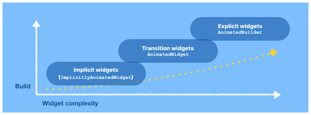

* TOC Placeholder
{:toc}


This section describes the basic concepts behind the Flutter animation architecture.

If you use Flutter's built-in implicit and transition widgets, you may not need to interact with all of the Flutter core animation concepts directly because most of the work required to code the animation is already done. But for more complex explicit animations, it's important to understand the animation concepts used to fine-tune and control your animations.

## How it works
Animation is the movement of an object or a change over time—like a fade in or out, or a bounce. An animation represents a value of a specific type that can change over time—specifically over the lifetime of the animation. Most animation widgets receive an `Animation` object as a parameter, from which the animation widget reads the current value of the animation and listens for changes to that value. It listens for "state" changes.

Whenever the animation’s object value changes, the animation object notifies all the listeners (that were added with `addListener`). Typically, a `State` object that listens to an animation will call `setState` in its listener callback to notify the widget system that it needs to rebuild with the new value of the animation.

> insert image/representation of Animation>listerners>state>build>implicit/transition/explicit

There are three Flutter SDK widgets that help animation widgets rebuild when a state change occurs.


* `ImplicitlyAnimatedWidget` is an abstract widget used to build implicit widgets that gradually change their values over a period of time. This widget is already included in Flutter SDK implicit animations so you don't need to add it to your animation unless you are building a reusable implicit animation widget.
* `AnimatedWidget` is a widget that rebuilds when the given `Listenable` changes value. This widget is already in Flutter SDK transition animations. You'll need to add it to your animation if you are building a reusabe transition animation widget.
* `AnimatedBuilder` is used in Flutter explicit animations that include an animation as part of a larger build function. If you are building an explicit animation,  you need to use `AnimatedBuilder` to build your animation.

Animations also provide an `AnimationStatus` enum which indicates animation status. Whenever the animation’s status changes, the animation notifies all the listeners that were added with `addStatusListener`. Typically, animations start out in the dismissed status, which means they’re at the beginning of their range. For example, animations that progress from the 0.0 to 1.0 value range are dismissed when their value returns to 0.0. When the animation reaches the end of its range, the animation reaches the completed status.

The animation system in Flutter is based on typed Animation objects. Widgets can either incorporate these animations in their build functions directly by reading their current value and listening to their state changes or they can use the animations as the basis of more elaborate animations that they pass along to other widgets.

To summarize how it works:
* Animations are objects with a time dependent value.  
* The value is updated each time Flutter generates a frame.  
* Animations are Listenables: they notify listeners when their value changes.  
* A `StatefulWidget` listens to an animation and responds to notifications by calling `setState()`.  
* Flutter animations are stateful widgets whose build method depends on one or more animation values.  
* The `Animation<T>` class is an abstract class.  


## Essential background concepts  
Flutter animation is built upon basic Flutter and Dart concepts such as the `StatefulWidget` and the `StatelessWidget` and working with the `main.dart` and `pubspec.yaml` files. Be sure to review the information in [A Tour of the Flutter Widget Framework](https://flutter.io/widgets-intro/) for important basic information you'll need to build your app. And if you haven't already followed the introductory codelabs, you might want to start with [Write Your First Flutter App, part 1](https://codelabs.developers.google.com/codelabs/first-flutter-app-pt1/#0) and [Write Your First flutter App, part 2](https://codelabs.developers.google.com/codelabs/first-flutter-app-pt2/#0).

The [Material Design](https://material.io/design/motion/understanding-motion.html) motion concepts provide professional guidance to help with your animation designs so that when you add animation, it makes the UI expressive and easy to use. It's important to make sure that your animation is informative, focused, and expressive so that it doesn't interfere or detract from the function of your app.  When you're planning your animation, check out the Material Design principals of motion. You can also find helpful information about using  [Material](/widgets/material/) components on the Flutter website.   

## Animation<T\> class
The primary building block of Flutter animation is the `Animation<T>` class. The Animation object is a core class in Flutter’s animation library that interpolates the values used to guide an animation.  The `Animation<T>` abstract class provides a value of a given type, a concept of the animation direction, the animation status, and a listener interface to register callbacks that are invoked when the value or status changes.


### Animation objects  
The animation system in Flutter is based on typed Animation objects. Widgets can either incorporate these animations in their build functions directly by reading their current value and listening to their state changes or they can use the animations as the basis of more elaborate animations that they pass along to other widgets.

An Animation object in Flutter is a class that sequentially generates interpolated numbers between two values over a certain duration. The output of an Animation object may be linear, a curve, a step function, or any other mapping you define. Depending on how the Animation object is controlled, it could run in reverse, or even switch directions in the middle of the animation.

The Animation object knows the current state of an animation, for example, whether it’s started, stopped, or moving forward or in reverse, but doesn’t know what appears onscreen.


#### Animation<double\>
One of the more commonly used animation types is `Animation<double>` which is used to represent a double value in the range of 0.0-1.0. This is the input expected by the `Curve` and `Tween` classes, as well as other `Animation` subclasses. The Animation object has state and its current value is always available in the `.value` member.

Animations can also interpolate types other than double, such as `Animation<Color>` or `Animation<Size>`.

#### Animation subclasses
Some `Animation` subclasses are stateless (they forward listeners to their parents) and some `Animation` subclasses are stateful. Examples of `Animation` subclasses that have values that never change are `kAlwaysCompleteAnimation`, `kAlwaysDismissedAnimation`, or  `AlwaysStoppedAnimation`; so registering callbacks on these subclasses have no effect as the callbacks are never called.


##### Composable animations  
Most `Animation` subclasses take an explicit “parent” `Animation<double>` and they are driven by that parent.

* The `CurvedAnimation` subclass takes an `Animation<double>` class (the parent) and a couple of Curve classes (the forward and reverse curves) as input. This subclass uses the value of the parent as input to the curves to determine its output. `CurvedAnimation` is immutable and stateless.

* The `ReverseAnimation` subclass takes an `Animation<double>` class as its parent and reverses all the values of the animation. It assumes the parent is using a value nominally in the range 0.0-1.0 and returns a value in the range 1.0-0.0. The status and direction of the parent animation are also reversed. ReverseAnimation is immutable and stateless.

* The `ProxyAnimation` subclass takes an `Animation<double>` class as its parent and forwards the current state of that parent. The parent is mutable.  

* The `TrainHoppingAnimation` subclass takes two parents, and switches between them when their values cross.

## AnimationController
Description  

The `AnimationController` manages the animation and it’s the main child class of the `Animation<T>` class.  The `AnimationController` class lets you perform tasks such as the following:
* Play an animation forward or in reverse.
* Stop an animation.
* Set the animation to a specific value.
* Define the upperBound and lowerBound values of an animation.
* Create a fling animation effect using a physics simulation.

For explicit animations, you build an `AnimationController`. For implicit and transition animations, the `AnimationController` is already defined and provided for you in the Flutter SDK widgets so you only need to provide a few parameters such as duration and curve.

`AnimationController` is an `Animation` object that can be used wherever an `Animation` object is needed. It is derived from `Animation<double>`, and by default, it linearly produces values that range from 0.0 to 1.0 during a specified duration. A new value is produced whenever the hardware is ready for a new frame. The value generation is tied to the screen refresh, so typically 60 numbers are generated per second. After each value is generated, each Animation object calls the attached `Listener` objects.

The `AnimationController` has methods that are used to control the animation. For example, an animation can start with the `.forward()` method.

The `AnimationController`  constructor includes the following arguments. The  `TickerProvider` and `vsync` are required and can't be null.

```Dart
AnimationController({
  double value,
  Duration duration,
  String debugLabel,
  double lowerBound: 0.0,
  double upperBound: 1.0,
  @required TickerProvider vsync
})
```

* The `value` is the initial value of the animation. If defaults to the lower bound.  
* The `duration` is the length of the animation.
* The `debugLabel` is a string used to identify the animation during debugging (used by toString).
* The `lowerBound` parameter is the smallest value this animation can obtain and the value at which this animation is deemed to be dismissed. It can't be null.
* The `upperBound` parameter is the largest value this animation can obtain and the value at which this animation is deemed to be completed. It can't be null.
* The `vsync` parameter is the `TickerProvider` for the current context. It is required and can't be null. See [TickerProvider](https://docs.flutter.io/flutter/scheduler/TickerProvider-class.html) for information on obtaining a ticker provider.


```Dart
final AnimationController controller = new AnimationController(
    duration: const Duration(milliseconds: 2000), vsync: this);
```

An `AnimationController` needs a `TickerProvider` to send the signal to mark the frames of the animation from beginning to end. The `TickerProvider` is configured using the `vsync` argument on the constructor. If you are creating an `AnimationController` from a State, then you can use the `TickerProviderStateMixin` and `SingleTickerProviderStateMixin` classes.


The `AnimationController` is a stateful `Animation<double>` that uses a Ticker to mark the animation frame changes. For each tick, the controller takes the time elapsed since the animation started and passes it to a `Simulation` to obtain a value. The value is used to report the animation status. When the `Simulation` reports a value indicating the end of the animation, then the controller stops the animation.  

The `AnimationController` can be given a lower and upper bound (for example, 0.0-1.0) to animate between, and a duration (for example, milliseconds: 2000).
In a simple case using forward(), reverse() , play() , or resume(), the `AnimationController` does a linear interpolation from the lower bound to the upper bound (or vice versa, for the reverse direction) over the specified duration.  
* When using `repeat()`, the `AnimationController` uses a linear interpolation between the given bounds over the given duration, but does not stop.  
* When using `animateTo()`, the `AnimationController` does a linear interpolation over the given duration from the current value to the given target. If no duration is given to the method, the default duration of the controller and the range described by the controller’s lower bound and upper bound is used to determine the velocity of the animation.  
* When using `fling()`, a `Force` object is used to create a specific simulation which is then used to drive the controller.  
* When using `animateWith()`, the given simulation is used to drive the controller.

These methods all return the future that the Ticker provides and which will resolve when the controller next stops or changes simulation.

#### Customized values

In some cases, a position might exceed the 0.0-1.0 value range of the `AnimationController`. For example, the `fling()` function allows you to provide velocity, force, and position using the `Force` object. The position can be anything and so it can be outside of the 0.0-1.0 value range.
For example, a `CurvedAnimation` can also exceed the 0.0-1.0 range even if the value range of the `AnimationController` doesn't go out of the default range. Depending on the curve selected, the output of the `CurvedAnimation` can have a wider range than the input. Elastic curves such as `Curves.elasticIn` will significantly overshoot or undershoot the default range.


## AnimatedWidget
The `AnimatedWidget` class allows you to separate the widget code from the animation code in the `setState()` call. `AnimatedWidget` doesn’t need to maintain a State object to hold the animation.

Use `AnimatedWidget` when you want to create or reuse a transition animation such as `FadeTransition` or `SizeTransition`.

For more information, see [Flutter transition animations](/new-animations/transitions_widgets.html)

## AnimatedBuilder

`AnimatedBuilder` is used for complex, explicit widgets where an animation is included in a larger build function. Use `AnimatedBuilder` widget to describe an animation as part of a build method for another widget.

## AnimatedContainer
The `AnimatedContainer` is a container that gradually changes its values over a period of time. The `AnimatedContainer` automatically animates between the old and new values of properties when they change using the specified `curve` and `duration`. Properties that are null are not animated.

The `AnimatedContainer` widget is an example of a simple implicit animation between different parameters. It has an internal `AnimationController` that has already been defined and provided for you in the Flutter SDK.  

## Tweens

Tweening or inbetweening, is the process of generating intermediate frames between two images, called key frames, to give the appearance that the first image transforms smoothly from one key frame to the next key frame. Inbetweens are the drawings which create the illusion of motion. The sequence of frames is called a tween For example, a tween might define an interpolation from red to blue, or from 0 to 255.

In a tween animation, the begin and end points are defined, as well as a timeline (duration), and a curve that defines the timing and speed of the transition. The Flutter SDK framework calculates how to transition from the beginning point to the end point.  Flutter’s animation widgets enables you to specify objects in an image and define how they should move and change during the tweening process. While some widgets can be used to manually render or customize frames (explicit animations), the Flutter SDK also includes widgets that you can use to automatically render the tweens (implicit and transition widgets).

A `Tween` is a stateless and immutable object that takes a begin value and an end value of an output type `<T>` and a way to interpolate (leap) between the begin and end values. `Tween` classes are stateless and immutable. The sole job of a `Tween` is to define a mapping from an input range to an output range. The input range is commonly 0.0 to 1.0, but that’s not a requirement. A Tween inherits from `Animatable<T>`, not from `Animation<T>`. An Animatable, like Animation, isn't required to output a double. For example, `ColorTween` specifies a progression between two colors and a `CurveTween` transforms the value of the given animation by a given curve.


By itself, a tween defines how to interpolate between two values. To get a concrete value for the current frame of an animation, you also need an animation to determine the current state. There are two ways to combine a tween with an animation to get a concrete value:  
1. You can evaluate the tween at the current value of an animation. This approach is useful for widgets that are already listening to the animation and rebuilding whenever the animation changes value.
2. You can animate the tween based on the animation. Rather than returning a single value, the animate function returns a new `Animation` that incorporates the tween. This approach is useful when you want to give the newly created animation to another widget, which can then read the current value that incorporates the tween as well as listen for changes to the value.

A Tween object does not store any state. Instead, it provides the evaluate (`Animation<double> animation`) method that applies the mapping function to the current value of the animation. The current value of the `Animation` object can be found in the `.value` method. The evaluate function also ensures that the begin and end values are returned when the animation values are 0.0 and 1.0, respectively.

### Customizing the interpolation
By default, the `AnimationController` object ranges from 0.0 to 1.0. If you need a different range or a different data type, you can use a `Tween` to configure an animation to interpolate to a different range or data type.
```Dart
final Tween doubleTween = new Tween<double>(begin: -200.0, end: 0.0);
```

Many types have specific `Tween` subclasses that provide type-specific interpolation. For example, `ColorTween` interpolates between colors and `RectTween` interpolates between rectangles.
```Dart
final Tween colorTween =
    new ColorTween(begin: Colors.transparent, end: Colors.black54);
```

You can define your own interpolations by creating your own subclass of `Tween` and overriding its linear interpolation (lerp) function.


### Tween examples
To use a Tween object, call `animate()` on the `Tween` (`Tween.animate`), passing in the controller object. For example, the following code generates the integer values from 0 to 255 over the course of 500 ms. Notice that `animate()` returns an `Animation`, not an `Animatable`.  
```Dart
final AnimationController controller = new AnimationController(
    duration: const Duration(milliseconds: 500), vsync: this);
Animation<int> alpha = new IntTween(begin: 0, end: 255).animate(controller);
```


The following example shows a controller, a curve, and a Tween:
```Dart
final AnimationController controller = new AnimationController(
    duration: const Duration(milliseconds: 500), vsync: this);
final Animation curve =
    new CurvedAnimation(parent: controller, curve: Curves.easeOut);
Animation<int> alpha = new IntTween(begin: 0, end: 255).animate(curve);
```

## Scheduler

(NEED better description of the scheduler)  
The `SchedulerBinding` is a singleton class that exposes the Flutter scheduling primitives.
For this discussion, the key primitive is the frame callbacks. Each time a frame needs to be shown on the screen, Flutter’s engine triggers a “begin frame” callback which the scheduler multiplexes to all the listeners registered using `scheduleFrameCallback()`. These callbacks are given the official time stamp of the frame, in the form of a `Duration` from some arbitrary epoch. Since all the callbacks have the same time, any animations triggered from these callbacks will appear to be exactly synchronized even if they take a few milliseconds to be executed.

## vsync

The `vsync` parameter prevents offscreen animations from consuming unnecessary resources.  You can use your stateful object as the `vsync` by adding `SingleTickerProviderStateMixin` to the class definition or, if you have multiple `AnimationController` objects, you can use the `TickerProviderStateMixin`.

An `AnimationController` requires a `TickerProvider` which is configured using the `vsync` argument on the constructor.

The `vsync` parameter can be changed by calling `resync`.


## Tickers

The `Ticker` class hooks into the scheduler’s `scheduleFrameCallback()` mechanism to invoke a callback for every tick.
A `Ticker` can be started and stopped. When started, it returns a `Future` that resolves when it is stopped. For each tick, the `Ticker` provides the callback with the duration since the first tick after it was started. Because tickers always give their elapsed time relative to the first tick after they were started, tickers are all synchronized. If you start three ticks at different times between two frames, they will all be synchronized with the same starting time, and will subsequently tick in lockstep.

`SingleTickerProviderStateMixin`–Provides a single `Ticker` that is configured to only tick while the current tree is enabled, as defined by `TickerMode`. To create the `AnimationController` in a `State` that only uses a single `AnimationController`, mix in this class, then pass `vsync: this` to the animation controller constructor. This mixin only supports vending a single ticker.  

`TickerProviderStateMixin`—Provides `Ticker` objects that are configured to only tick while the current tree is enabled, as defined by `TickerMode`. Use this class if you might have multiple `AnimationController` objects over the lifetime of the `State`. To create an `AnimationController` in a class that uses this mixin, pass `vsync: this` to the animation controller constructor whenever you create a new animation controller.


The widget test framework `WidgetTester` object can be used as a ticker provider for testing purposes. In other contexts, you will need to either pass a `TickerProvider` from a higher level for example, indirectly from a `State` that mixes in `TickerProviderStateMixin`, or create a custom `TickerProvider` subclass.


## Curves
The `Curves` class defines an array of commonly used curves that you can use with a `CurvedAnimation`. The `Curve` abstract class maps doubles in the range 0.0-1.0 to doubles in the range 0.0-1.0.
Curve classes are stateless and immutable.


A `CurvedAnimation` defines the animation progress as a non-linear curve.
```Dart
final CurvedAnimation curve =
    new CurvedAnimation(parent: controller, curve: Curves.easeIn);
```

The Curves class defines many commonly used curves, or you can create your own.
For example:
```Dart
class ShakeCurve extends Curve {
  @override
  double transform(double t) {
    return math.sin(t * math.PI * 2);
  }
}
```

`CurvedAnimation` and the `AnimationController` are both of type `Animation<double>`, so you can pass them interchangeably. The `CurvedAnimation` wraps the object it’s modifying—you don’t subclass `AnimationController` to implement a curve.


## Listeners and notifications  
`Listeners` and `StatusListeners` are used to monitor animation state changes.

An `Animation` object can have `Listeners` and `StatusListeners` defined with `addListener()` and `addStatusListener()`. A `Listener` is called whenever the value of the animation changes. The most common behavior of a `Listener` is to call `setState()` to cause a rebuild. A `StatusListener` is called when an animation begins, ends, moves forward, or moves reverse, as defined by `AnimationStatus`.

See the [Rendering animation](https://flutter.io/tutorials/animation/#rendering-animations) tutorial for an example showing how to use the `addListener()` method.

See [Monitoring the progress of the animation](https://flutter.io/tutorials/animation/#monitoring) tutorial for an example showing how to use `addStatusListener()` method.

When the animation’s value changes and the animation notifies all the listeners added with `addListener`. Typically, a `State` object that listens to an animation will call `setState` on itself in its listener callback to notify the widget system that it needs to rebuild with the new value of the animation.


## AnimationStatus

The status is defined by an enum with four states:

* dismissed: The animation stopped and the current frame is the first frame.

* forward: The animation plays from the starting value to the ending value.

* reverse: The reverse of the forward animation.

* completed: The animation stops at the last frame.


## Simulations

The `Simulation` abstract class maps a relative time value (an elapsed time) to a double value, and has a notion of completion.
In principle, simulations are stateless but in practice, some simulations (for example, `BouncingScrollSimulation` and `ClampingScrollSimulation`) change state irreversibly when queried.
There are various concrete implementations of the `Simulation` class for different effects.


## Animatables
The `Animatable` abstract class maps a double to a value of a particular type.

The `Tween` abstract class maps a double value nominally in the range 0.0-1.0 to a typed value (for example, a `Color`, or another double). It is an Animatable .

Passing an `Animatable<double>` (the parent) to an `Animatable` `chain()` method creates a new `Animatable` subclass that applies the parent’s mapping and then the child’s mapping.

Passing an `Animation<double>` (the new parent) to an `Animatable` `animate()` method creates a new `Animation` subclass that acts like the `Animatable` but is driven from the given parent.

## Physics-based animation  
In physics-based animation, motion is modeled to resemble real-world behavior. When you toss a ball, for example, where and when it lands depends on how fast it was tossed, how heavy it is, and how far off the ground. Similarly, dropping a ball attached to a spring falls and bounces differently than dropping a ball attached to a string. The Flutter gallery provides a demo app for Material design widgets that includes and example. Under Material Components, the [Grid](https://github.com/flutter/flutter/blob/master/examples/flutter_gallery/lib/demo/material/grid_list_demo.dart) example demonstrates a fling animation. Select one of the images from the grid and zoom in. You can pan the image with flinging or dragging gestures.
For more information, see the API documentation for [AnimationController.animateWith](https://docs.flutter.io/flutter/animation/AnimationController/animateWith.html) and [SpringSimulation](https://docs.flutter.io/flutter/physics/SpringSimulation-class.html).
