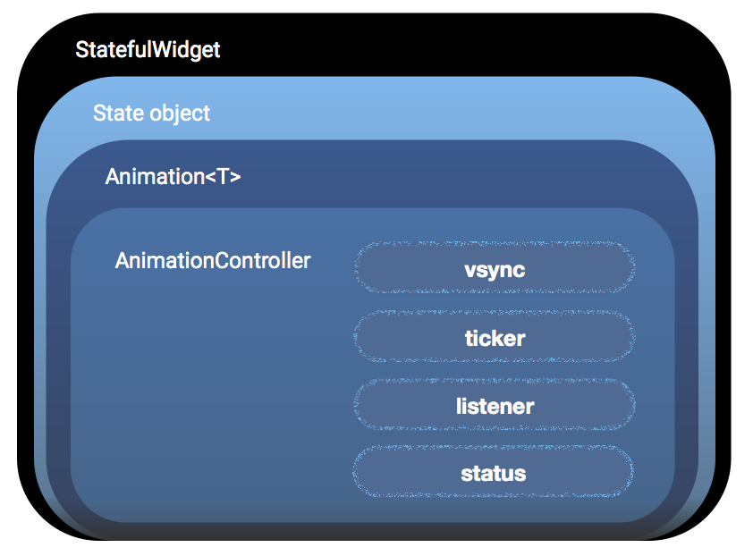

* TOC Placeholder
{:toc}


Explicit animations allow you to specify precise custom animations. They're a bit more complicated than implicit and transition animations since they require you to build the animation objects, set their properties, and then apply those to the object that you want to animate.

## Creating an explicit animation

To create an explicit animation, you need to create an `AnimationController` to control the animation. Once you’ve created a controller, you can use it to build other animations. For example, you can create a ForwardAnimation then modify some of the parameters to create a ReverseAnimation that mirrors the original animation but runs in reverse. Similarly, you can create a CurvedAnimation whose value is adjusted by a curve and then reverse it. The steps below describe the basic tasks used to create an explicit animation:

<!-- 1. Declare your `StatefulWidget` class.
2. Declare the `State` class with the appropriate ticker (`SingleTickerProviderStateMixin` or `TickerProviderStateMixin`).
3. Declare an instance of `Animation<T>` and `AnimationController`.
4. Define optional and required parameters such as `vsync` and `duration`.
5. Specify the animation such as `CurvedAnimation`
6. Add the appropriate action in the `listener` callback such as `setState`.
7. Start the animation.
8. Define the `BuildContext` to return the animation.
9. Dispose and stop the animation. -->

<div>
<table class="table" width="100%">
  <col width="35%">
  <col width="65%">
	<tbody>
    <tr>
      <td></td>
      <td>  
      1. Declare your <code>StatefulWidget</code> class.  
      2. Declare the <code>State</code> class with the appropriate ticker (<code>SingleTickerProviderStateMixin</code> or <code>TickerProviderStateMixin</code>).  
      3. Declare an instance of <code>Animation<T\></code> and <code>AnimationController</code>.  
      4. Define optional and required parameters such as <code>vsync</code> and <code>duration</code>.  
      5. Specify the animation such as <code>CurvedAnimation</code>  
      6. Add the appropriate action in the <code>listener</code> callback such as <code>setState</code>.  
      7. Start the animation.  
      8. Define the <code>BuildContext</code> to return the animation.  
      9. Dispose and stop the animation.  
       </td>
    </tr>
   </tbody>
  </table>
</div>

To reuse existing Flutter SDK implicit and transition widgets, see [Implicit animations](/new-animations/implicit_widgets.html) and [Transition animations](/new-animations/transition_widgets.html).

## Explicit animation examples

[Tutorial: Animations in Flutter](/tutorials/animation/)— < use the tutorial and transfer it to the example
This example shows you how to build an explicit animation using Flutter concepts, classes, and methods—and it walks you through 5 animation examples that build on each other to make a complex animation. The example also shows how to use the `AnimationWidget` and the `AnimatedBuilder`.
> This tutorial needs to be revised to remove the concept descriptions that are described on the Concepts web page to keep definitions together—so that information isn't repeated or contradicted on multiple web pages. For example, the AnimationController and Tween are defined on three separate web pages.
> The objective of the tutorial s/b revised to state: 1. How to use Flutter animation classes to add an explicit animation to a widget 2. When to use the `AnimatedWidget` and when to use the `AnimatedBuilder`. (perhaps make the second part a separate tutorial?)


The code for the `animationexample` example is shown below. The `animationexample` widget extends the `AnimatedWidget` class and already includes the listeners, tickers, and other elements that define the animation.  
<!-- skip -->

```Dart
import 'package:flutter/material.dart';

add the code for the explicit widget

```



## Explicit animations widgets

The Flutter SDK includes the following explicit animation widgets.

<div>
<table class="table" width="100%">
  <col width="25%">
  <col width="70%">
	<thead>
		<tr>
			<th>Implicit widget</th>
			<th>Description</th>
		</tr>
	</thead>
	<tbody>
    <tr>
			<td><a href="url">explicitanimation</a> </td>
			<td>This widget < description > <br>
			Flutter SDK libary: <a href="https://docs.flutter.io/flutter/widgets/widgets-library.html">widgets</a>
      </td>
		</tr>
    <tr>
			<td><a href="url">explicitanimation</a> </td>
			<td>This widget < description > <br>
			Flutter SDK libary: <a href="https://docs.flutter.io/flutter/widgets/widgets-library.html">widgets</a>
      </td>
		</tr>
	</tbody>
</table>
