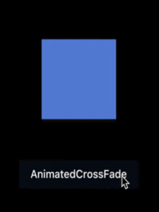

* TOC Placeholder
{:toc}


If you’re new to Flutter or new to animation, consider starting with the built-in Flutter implicit widgets. Implicit animations are useful when you want to quickly add an animation without having to write a lot of animation code because the Flutter SDK implicit widgets already include the `AnimationController`, the ticker provider, the listener, and other animations elements.

Implicit animations are distinct from explicit animations which involve building the animation action using `AnimationController`. And implicit animations are different from transition widgets since you don't need to create an animation widget using `AnimatedWidget`, you simply use an existing implicit animation widget such as `AnimatedOpacity` or `AnimatedIcon`.


## Using an implicit animation widget

<div>
<table class="table" width="100%">
  <col width="35%">
  <col width="65%">
	<tbody>
    <tr>
      <td></td>
      <td>
      1. Create your <code>StatefulWidget</code>.<br>
      2. Create the <code>State</code> class to hold the animation object and the implicit animation widget.<br>
      3. Specify the <code>BuildContext</code> to return the implicit animation widget, such as <code>AnimatedOpacity</code>.<br>
      4. Add the animation object, the duration of the animation, and any parameters relating to the implicit animation. For example, you would set the opacity level for an implicit <code>AnimatedOpacity</code> widget.
      </td>
    </tr>
   </tbody>
  </table>
</div>

To create your own reusable implicit animations, create a widget that extends `ImplicitlyAnimatedWidget`.

For more complex or customized animations, you can use a subclass of `AnimatedWidget` such as the `DecoratedBoxTransition` or you can build your own `AnimationController`.  

## Implicit animation examples  
The `AnimatedOpacity` and `AnimatedCrossFade` are two implicit widgets included in the Flutter SDK.  

### AnimatedOpacity example
<!-- The `AnimatedOpacity` implicit widget automatically transitions a child's opacity over a given duration whenever the specified opacity changes. -->
<table cellpadding="10">
  <tr>
    <td style="width:20%">
    <a href="" onMouseOver="document.MyImage1.src='images/AnimatedOpacity_blue.gif';" onMouseOut="document.MyImage1.src='images/AnimatedOpacity_blue.png';">
    
    </a></td>
    <td>
    The <code>AnimatedOpacity</code> implicit widget automatically transitions a child's opacity over a given duration whenever the specified opacity changes.<br>Mouseover the image to view the animation.
    </td>
  </tr>
</table>

<!-- <a href="" onMouseOver="document.MyImage1.src='images/AnimatedOpacity_blue.gif';" onMouseOut="document.MyImage1.src='images/AnimatedOpacity_blue.png';">

</a>
Mouseover the image to view the animation using the <code>AnimatedOpacity</code> implicit widget. -->

<!-- <div>


 <script>
 imgOn2 = new Image;
 imgOff2 = new Image;
 imgOn2.src = "images/AnimatedOpacity_blue.gif";
 imgOff2.src = "images/AnimatedOpacity_blue.png";
 </script>

 <a href="#C4" onClick="document.img.src=imgOn2.src;">▶︎</a>
 <a href="#C4" onClick="document.img.src=imgOff2.src;">◼︎</a>

 This example shows an animation using the <code>AnimatedOpacity</code> implicit widget.
</div> -->

 <!-- <br>
 The `AnimatedOpacity` implicit widget automatically transitions a child's opacity over a given duration whenever the given opacity changes. Notice that the listeners, tickers, and other animation elements are *implied* so you don't need to add them. The `AnimatedOpacity` class extends `ImplicitlyAnimatedWidget` and those elements are already included in the `ImplicitlyAnimatedWidget` class. -->

The code for the `AnimatedOpacity` example is shown below. The `AnimatedOpacity` widget extends the `ImplicitlyAnimatedWidget` class and already includes the listeners, tickers, and other elements that define the animation.  
<!-- skip -->

```Dart
import 'package:flutter/material.dart';

class LogoFade extends [[highlight]]StatefulWidget[[/highlight]] {
  @override
  createState() => new LogoFadeState();
}

class LogoFadeState extends [[highlight]]State<LogoFade>[[/highlight]] {
  double opacityLevel = 1.0;

  _changeOpacity() {
    setState(() => opacityLevel = opacityLevel == 0 ? 1.0 : 0.0);
  }

  @override
  Widget [[highlight]]build(BuildContext context)[[/highlight]] {
    return new Column(
      mainAxisAlignment: MainAxisAlignment.center,
      children: [
        new [[highlight]]AnimatedOpacity[[/highlight]](
          opacity: opacityLevel,
          duration: new Duration(seconds: 3),
          child: new Container (
            width: 100.0,
            height: 100.0,
            color: Colors.blueAccent
          ),
        ),
        new SizedBox(height: 48.0),
        new RaisedButton(
          child: new Text('AnimatedOpacity'),
          textColor: Colors.white,
          color: Colors.black,
          splashColor: Colors.blueAccent,
          onPressed: _changeOpacity,
        ),
      ],
    );
  }
}

void main() {
  runApp(new MaterialApp(home: new LogoFade()));
}

```


### AnimatedCrossFade example

<!-- The `AnimatedCrossFade` implicit widget automatically cross-fades between two children and animates itself between their sizes. -->
<table cellpadding="10">
  <tr>
    <td style="width:20%">
    <a href="" onMouseOver="document.MyImage.src='images/AnimatedCrossFade_blue.gif';" onMouseOut="document.MyImage.src='images/AnimatedCrossFade_blue.png';">
    
    </a></td>
    <td>The <code>AnimatedCrossFade</code> implicit widget automatically cross-fades between two children and animates itself between their sizes.<br>
    Mouseover the image to view the animation.
  </td>
  </tr>
</table>


<!-- <a href="" onMouseOver="document.MyImage.src='images/AnimatedCrossFade_blue.gif';" onMouseOut="document.MyImage.src='images/AnimatedCrossFade_blue.png';">

</a>
Mouse over the image to view the animation using the <code>AnimatedCrossFade</code> implicit widget. -->

<!-- onMouseOut="document.MyImage.src='images/AnimatedCrossFade_orig.png';">
 -->

<!-- 
 <script>
 img2On = new Image;
 img2Off = new Image;
 img2On.src = "images/AnimatedCrossFade_blue.gif";
 img2Off.src = "images/AnimatedCrossFade_orig.png";
 </script>

 <a href="#" onmouseover="document.img2.src=img2On.src;"></a>
 <!-- <a href="#" onmouseout="document.img2.src=img2Off.src;">◼︎</a> -->


 The code for the `AnimatedCrossFade` example is shown below. The `AnimatedCrossFade` class extends `ImplicitlyAnimatedWidget` which already includes the listeners, tickers, and other elements that define the animation. The listeners, tickers, and other animation elements are *implied* so you don't need to add them.  


```Dart
import 'package:flutter/material.dart';

class ImageCrossFade extends [[highlight]]StatefulWidget[[/highlight]] {
  @override
  createState() => new _ImageCrossFadeState();
}

class _ImageCrossFadeState extends [[highlight]]State<ImageCrossFade>[[/highlight]] {
  CrossFadeState _crossFadeState = CrossFadeState.showFirst;

  _changeImage() {
    setState(() {
      if (_crossFadeState == CrossFadeState.showFirst)
        _crossFadeState = CrossFadeState.showSecond;
      else
        _crossFadeState = CrossFadeState.showFirst;
    });
  }

  @override
  Widget [[highlight]]build(BuildContext context)[[/highlight]] {
    return new Column(
      mainAxisAlignment: MainAxisAlignment.center,
      children: [
        new [[highlight]]AnimatedCrossFade[[/highlight]](
          duration: const Duration(seconds: 3),
          firstChild: new SizedBox(
            child: new Container (
                width: 150.0,
                height: 150.0,
                color: Colors.amberAccent
            ),
          ),
          secondChild: new SizedBox(
            height: 100.0,
            child: new Container (
                width: 100.0,
                height: 100.0,
                color: Colors.blueAccent
            ),
          ),
          crossFadeState: _crossFadeState,
        ),
        new SizedBox(height: 48.0),
        new RaisedButton(
          child: new Text('AnimatedCrossFade'),
          textColor: Colors.white,
          color: Colors.black,
          splashColor: Colors.blueAccent,

          onPressed: _changeImage,
        ),
      ],
    );
  }
}

void main() {
  runApp(new MaterialApp(home: new ImageCrossFade()));
}
```


## Implicit animations widgets


The Flutter SDK includes the following implicit animation widgets.

<div>
<table class="table" width="100%">
  <col width="25%">
  <col width="70%">
	<thead>
		<tr>
			<th>Implicit widget</th>
			<th>Description</th>
		</tr>
	</thead>
	<tbody>
		<tr>
			<td><a href="https://docs.flutter.io/flutter/widgets/AnimatedAlign-class.html">AnimatedAlign</a> </td>
			<td>This widget is the animated version of <a href="https://docs.flutter.io/flutter/widgets/Align-class.html">Align</a> which automatically transitions the child's position over a given duration whenever the alignment changes.<br>
			Flutter SDK libary: <a href="https://docs.flutter.io/flutter/widgets/widgets-library.html">widgets</a>
      </td>
		</tr>
		<tr>
			<td><a href="https://docs.flutter.io/flutter/widgets/AnimatedContainer-class.html">AnimatedContainer</a> </td>
			<td>This widget automatically animates between the old and new values of properties, such as a background color, when they change using the provided curve and duration. Properties that are null are not animated.

 <br>
			Flutter SDK libary: <a href="https://docs.flutter.io/flutter/widgets/widgets-library.html">widgets</a> </td>
		</tr>
		<tr>
			<td><a href="https://docs.flutter.io/flutter/widgets/AnimatedCrossFade-class.html">AnimatedCrossFade</a> </td>
			<td>This widget automatically cross-fades between two children.<br>
			Flutter SDK libary: <a href="https://docs.flutter.io/flutter/widgets/widgets-library.html">widgets</a> </td>
		</tr>
		<tr>
			<td><a href="https://docs.flutter.io/flutter/widgets/AnimatedDefaultTextStyle-class.html">AnimatedDefaultTextStyle</a> </td>
			<td>This widget is the animated version of <a href="https://docs.flutter.io/flutter/widgets/DefaultTextStyle-class.html">DefaultTextStyle</a> which automatically transitions the default text style (the text style to apply to descendant <a href="https://docs.flutter.io/flutter/widgets/Text-class.html">Text</a> widgets without explicit style) over a given duration whenever the given style changes.

</td>
		</tr>
		<tr>
			<td><a href="https://docs.flutter.io/flutter/material/AnimatedIcon-class.html">AnimatedIcon</a></td>
			<td>This widget shows an animated icon at a given animation <a href="https://docs.flutter.io/flutter/material/AnimatedIcon/progress.html">progress</a>. The available icons are specified in <a href="https://docs.flutter.io/flutter/material/AnimatedIcons-class.html" >AnimatedIcons</a>.</td>
		</tr>
		<tr>
			<td><a href="https://docs.flutter.io/flutter/widgets/AnimatedList-class.html">AnimatedList</a> </td>
			<td>This widget provides a scrolling container that animates items when they are inserted or removed. The <a href="https://docs.flutter.io/flutter/widgets/AnimatedListState-class.html">AnimatedListState</a> class can be used to dynamically insert or remove items. </td>
		</tr>
		<tr>
			<td><a href="https://docs.flutter.io/flutter/widgets/AnimatedListState-class.html">AnimatedListState</a> </td>
			<td>This widget is the scrolling container that animates items when they are inserted or removed.  </td>
		</tr>
		<tr>
			<td><a href="https://docs.flutter.io/flutter/widgets/AnimatedModalBarrier-class.html">AnimatedModalBarrier</a> </td>
			<td>This widget prevents a user from interacting with widgets behind itself, and can be configured with an animated color value. This widget is similar to <a href="https://docs.flutter.io/flutter/widgets/ModalBarrier-class.html">ModalBarrier</a> except that it takes an animated color instead of a single color.</td>
		</tr>
		<tr>
			<td><a href="https://docs.flutter.io/flutter/widgets/AnimatedOpacity-class.html">AnimatedOpacity</a> </td>
			<td>This widget automatically transitions the child's opacity over a specified duration.</td>
		</tr>
		<tr>
			<td><a href="https://docs.flutter.io/flutter/widgets/AnimatedPadding-class.html">AnimatedPadding</a> </td>
			<td>This widget automatically transitions the indentation over a given duration whenever the given inset changes. This widget is the animated version of <a href="https://docs.flutter.io/flutter/widgets/Padding-class.html">Padding</a>.</td>
		</tr>
		<tr>
			<td><a href="https://docs.flutter.io/flutter/widgets/AnimatedPhysicalModel-class.html">AnimatedPhysicalModel</a> </td>
			<td>This widget is the animated version of <a href="https://docs.flutter.io/flutter/widgets/PhysicalModel-class.html">PhysicalModel</a> which represents a physical layer that clips its children to a shape.

</td>
		</tr>
		<tr>
			<td><a href="https://docs.flutter.io/flutter/widgets/AnimatedPositioned-class.html">AnimatedPositioned</a> </td>
			<td>This widget is the animated version of <a href="https://docs.flutter.io/flutter/widgets/Positioned-class.html">Positioned</a> which automatically transitions the child's position over a given duration. This requires that the child is part of a <a href="https://docs.flutter.io/flutter/widgets/Stack-class.html">Stack</a>.

</td>
		</tr>
		<tr>
			<td><a href="https://docs.flutter.io/flutter/widgets/AnimatedPositionedDirectional-class.html">AnimatedPositionedDirectional</a> </td>
			<td>This widget is the animated version of <a href="https://docs.flutter.io/flutter/widgets/PositionedDirectional-class.html">PositionedDirectional</a> which automatically transitions the child's position over a given duration. The ambient <a href="https://docs.flutter.io/flutter/widgets/Directionality-class.html">Directionality</a> is used to determine whether the start is to the left or to the right. This requires that the child is part of a <a href="https://docs.flutter.io/flutter/widgets/Stack-class.html">Stack</a>.

</td>
		</tr>
		<tr>
			<td><a href="https://docs.flutter.io/flutter/widgets/AnimatedSize-class.html">AnimatedSize</a> </td>
			<td>This widget automatically transitions the child's size over a given duration.

</td>
		</tr>
		<tr>
			<td><a href="https://docs.flutter.io/flutter/widgets/AnimatedSwitcher-class.html">AnimatedSwitcher</a> </td>
			<td>This widget does a <a href="https://docs.flutter.io/flutter/widgets/FadeTransition-class.html">FadeTransition</a> between a new child and the child previously set on the AnimatedSwitcher. If the children are swapped fast enough (before duration elapses), more than one previous child can exist; one will transition out while the newest transitions in.</td>
		</tr>
		<tr>
			<td><a href="https://docs.flutter.io/flutter/material/AnimatedTheme-class.html">AnimatedTheme</a> </td>
			<td>This widget is the animated version of <a href="https://docs.flutter.io/flutter/material/Theme-class.html">Theme</a> which automatically transitions the colors and typographic choices of an application over a given duration.</td>
		</tr>
	</tbody>
</table>
