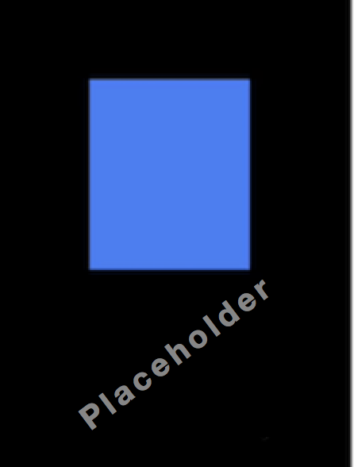

* TOC Placeholder
{:toc}

Transition animations implement the abstract class `AnimatedWidget`. The `AnimatedWidget` class allows you to separate the widget code from the animation code in the `setState()` call. The `AnimatedWidget` class doesn’t need to maintain a `State` object to hold the animation. Use the  `AnimatedWidget` helper class (instead of `addListener()` and `setState()`) to create a reusable transition animation widget.

< additional info on transition widgets >


## Using a transition animation widget

<div>
<table class="table" width="100%">
  <col width="35%">
  <col width="65%">
	<tbody>
    <tr>
      <td></td>
      <td> < Revise for a transition widget example >   
      1. Create your <code>StatefulWidget</code>.<br>
      2. Create the <code>State</code> class to hold the animation object and the _transition_  animation widget.<br>
      3. Specify the <code>BuildContext</code> to return the _transition_ animation widget, such as <code>animationexample</code>.<br>
      4. Add the animation object, the duration of the animation, and any parameters relating to the _transition_ animation. For example, you would set the < example > for a <code>animationexample</code> widget.
      </td>
    </tr>
   </tbody>
  </table>
</div>

To create your own reusable transition animations, create a widget that extends `AnimatedWidget`.

For more complex or customized animations, you can build your own using the  `AnimationController` class.  

## Transition animation examples  
The `animationexample` and `animationexample` are two transition widgets included in the Flutter SDK.  

### < Transition animation > example 1
<!-- The `AnimatedOpacity` implicit widget automatically transitions a child's opacity over a given duration whenever the specified opacity changes. -->
<table cellpadding="10">
  <tr>
    <td style="width:20%">
    <a href="" onMouseOver="document.MyImage1.src='images/AnimatedOpacity_blue.gif';" onMouseOut="document.MyImage1.src='images/placeholder_image.png';">
    
    </a></td>
    <td>
    The <code>animationexample</code> transition widget automatically < description > .<br>Mouseover the image to view the animation.
    </td>
  </tr>
</table>

<!-- <a href="" onMouseOver="document.MyImage1.src='images/AnimatedOpacity_blue.gif';" onMouseOut="document.MyImage1.src='images/AnimatedOpacity_blue.png';">

</a>
Mouseover the image to view the animation using the <code>AnimatedOpacity</code> implicit widget. -->

<!-- <div>


 <script>
 imgOn2 = new Image;
 imgOff2 = new Image;
 imgOn2.src = "images/AnimatedOpacity_blue.gif";
 imgOff2.src = "images/AnimatedOpacity_blue.png";
 </script>

 <a href="#C4" onClick="document.img.src=imgOn2.src;">▶︎</a>
 <a href="#C4" onClick="document.img.src=imgOff2.src;">◼︎</a>

 This example shows an animation using the <code>AnimatedOpacity</code> implicit widget.
</div> -->

 <!-- <br>
 The `AnimatedOpacity` implicit widget automatically transitions a child's opacity over a given duration whenever the given opacity changes. Notice that the listeners, tickers, and other animation elements are *implied* so you don't need to add them. The `AnimatedOpacity` class extends `ImplicitlyAnimatedWidget` and those elements are already included in the `ImplicitlyAnimatedWidget` class. -->

The code for the `animationexample` example is shown below. The `animationexample` widget extends the `AnimatedWidget` class and already includes the listeners, tickers, and other elements that define the animation.  
<!-- skip -->

```Dart
import 'package:flutter/material.dart';

add the code for the transition widget

```


### < Transition animation > example 2
<!-- The `AnimatedOpacity` implicit widget automatically transitions a child's opacity over a given duration whenever the specified opacity changes. -->
<table cellpadding="10">
  <tr>
    <td style="width:20%">
    <a href="" onMouseOver="document.MyImage1.src='images/AnimatedOpacity_blue.gif';" onMouseOut="document.MyImage1.src='images/placeholder_image.png';">
    
    </a></td>
    <td>
    The <code>animationexample</code> transition widget automatically < description > .<br>Mouseover the image to view the animation.
    </td>
  </tr>
</table>

<!-- <a href="" onMouseOver="document.MyImage1.src='images/AnimatedOpacity_blue.gif';" onMouseOut="document.MyImage1.src='images/AnimatedOpacity_blue.png';">

</a>
Mouseover the image to view the animation using the <code>AnimatedOpacity</code> implicit widget. -->

<!-- <div>


 <script>
 imgOn2 = new Image;
 imgOff2 = new Image;
 imgOn2.src = "images/AnimatedOpacity_blue.gif";
 imgOff2.src = "images/AnimatedOpacity_blue.png";
 </script>

 <a href="#C4" onClick="document.img.src=imgOn2.src;">▶︎</a>
 <a href="#C4" onClick="document.img.src=imgOff2.src;">◼︎</a>

 This example shows an animation using the <code>AnimatedOpacity</code> implicit widget.
</div> -->

 <!-- <br>
 The `AnimatedOpacity` implicit widget automatically transitions a child's opacity over a given duration whenever the given opacity changes. Notice that the listeners, tickers, and other animation elements are *implied* so you don't need to add them. The `AnimatedOpacity` class extends `ImplicitlyAnimatedWidget` and those elements are already included in the `ImplicitlyAnimatedWidget` class. -->

The code for the `animationexample` example is shown below. The `animationexample` widget extends the `AnimatedWidget` class and already includes the listeners, tickers, and other elements that define the animation.  
<!-- skip -->

```Dart
import 'package:flutter/material.dart';

add the code for the transition widget

```



## Transition animations widgets


The Flutter SDK includes the following transition animation widgets. These are included in the <a href="https://docs.flutter.io/flutter/widgets/widgets-library.html">widgets</a> Flutter SDK libary.

<div>
<table class="table" width="100%">
  <col width="25%">
  <col width="70%">
	<thead>
		<tr>
			<th>Implicit widget</th>
			<th>Description</th>
		</tr>
	</thead>
	<tbody>
    <tr>
			<td><a href="https://docs.flutter.io/flutter/widgets/DecoratedBoxTransition-class.html">DecoratedBoxTransition</a> </td>
			<td>This widget is the animated version of a <a href="https://docs.flutter.io/flutter/widgets/DecoratedBox-class.html">DecoratedBox</a> that animates the different properties of its <a href="https://docs.flutter.io/flutter/painting/Decoration-class.html">Decoration</a>.<br>

      </td>
		</tr>
    <tr>
			<td><a href="https://docs.flutter.io/flutter/widgets/FadeTransition-class.html">FadeTransition</a> </td>
			<td>This widget animates the opacity of a widget.
      </td>
		</tr>
    <tr>
			<td><a href="https://docs.flutter.io/flutter/widgets/PositionedTransition-class.html">PositionedTransition</a> </td>
			<td>This widget is the animated version of <a href="https://docs.flutter.io/flutter/widgets/Positioned-class.html">Positioned</a> which takes a specific <a href="url">Animation</a> to transition the child's position from a start position to and end position over the lifetime of the animation. This requires that the child is part of a <a href="https://docs.flutter.io/flutter/widgets/Stack-class.html">Stack</a>.
      </td>
		</tr>
    <tr>
			<td><a href="https://docs.flutter.io/flutter/widgets/RelativePositionedTransition-class.html">RelativePositionedTransition</a> </td>
			<td>This widget is the animated version of <a href="https://docs.flutter.io/flutter/widgets/Positioned-class.html">Positioned</a> which transitions the child's position based on the value of the <a href="url">rect</a> property relative to a bounding box with the specified size. This requires that the child is part of a <a href="https://docs.flutter.io/flutter/widgets/Stack-class.html">Stack</a>.
      </td>
		</tr>
    <tr>
			<td><a href="https://docs.flutter.io/flutter/widgets/RotationTransition-class.html">RotationTransition</a> </td>
			<td>This widget animates the rotation of a widget.
      </td>
		</tr>
    <tr>
			<td><a href="https://docs.flutter.io/flutter/widgets/ScaleTransition-class.html">ScaleTransition</a> </td>
			<td>This widget animates the scale of a widget.
      </td>
		</tr>
    <tr>
			<td><a href="https://docs.flutter.io/flutter/widgets/SizeTransition-class.html">SizeTransition</a> </td>
			<td>This widget animates its own size and clips and aligns the child.
      </td>
		</tr>
    <tr>
			<td><a href="https://docs.flutter.io/flutter/widgets/SlideTransition-class.html">SlideTransition</a> </td>
			<td>This widget animates the position of a widget relative to its normal position.
      </td>
		</tr>

	</tbody>
</table>
