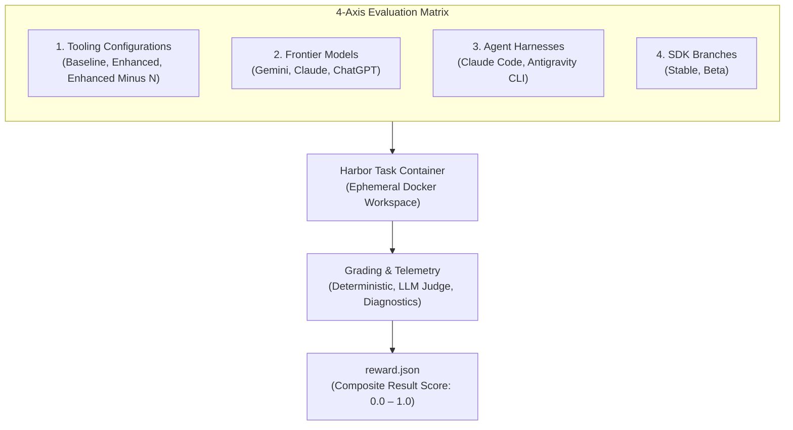

<!-- TODO: Put more interesting content here -->

  

    verified
    Primary Metric Architecture
  

  <h3 class="hero-title">The Result Score</h3>
  

    Each task run produces a composite <code>reward.json</code> score on a
    <strong>0.0 to 1.0 scale</strong>, synthesizing deterministic code
    correctness, maintainability, and developer experience.
  

## Methodology overview

FlutterBench is made up of four key components:

| Component | Description |
|:---|:---|
| **Dataset** | Real-world development tasks derived from canonical critical user journeys. |
| **Test matrix** | Multidimensional testing framework across models, agents, tooling configurations, and SDK branches. |
| **Scoring system** | Comprehensive grading approach evaluating both functional outcomes and developer experience. |
| **Harness** | Containerized automation infrastructure that executes evaluations at scale. |

## Dataset & tasks

### Task derivation

Evaluation tasks derive directly from Flutter's canonical
[**Critical User Journeys (CUJs)**][], which are the core workflows that
developers perform regularly. This approach ensures evaluations reflect
real-world developer needs.

Each CUJ represents a combination of a persona, a high-level goal, and 
a list of tasks required to achieve that goal. For example:

<CujDiagram />

:::note
We can't open-source the full evaluation tasks without contaminating the
benchmark dataset, but we publish our [canonical list of CUJs][]. With
this list, along with the example task below, you can understand our
evaluation philosophy for FlutterBench.
:::

These CUJs are converted into [Harbor](https://harborframework.com/)
tasks. Harbor is the framework used to run containerized evaluation tasks.

CUJs and Harbor tasks don't map cleanly one-to-one. Instead, the CUJ list
serves as a guide to verify that core developer workflows are evaluated.
In some cases, several CUJs combine into a single task, and vice-versa.
Our most ambitious evaluations combine multiple Harbor tasks, and thus
cover many CUJs.

### Task categories

Tasks are categorized by the type of agent capability they test. A task
can belong to multiple categories, particularly hill-climbing tasks:

| Category | Description |
|:---|:---|
| **Greenfield generation** | Creating new features or applications from scratch. |
| **Hill climbing** | Iterative debugging and problem-solving across multiple turns. |
| **Refactoring** | Restructuring existing code while maintaining functionality. |
| **Migration** | Upgrading deprecated APIs or moving between architectural patterns. |
| **Integration** | Adding platform-specific features or third-party packages. |

### Task prioritization

Tasks are prioritized based on user impact and frequency:

| Priority | Description                                                         |
|:---------|:--------------------------------------------------------------------|
| **P0**   | Critical production workflows and high-frequency productivity tasks |
| **P1**   | Core functionality and API consistency verification                 |
| **P2**   | Standard features and application maturity tasks                    |
| **P3**   | Edge cases and cosmetic polish                                      |

### Quality assurance

Before a task graduates into the core benchmark suite, it undergoes an
engineering audit. Human reviewers inspect initial trial runs and label
results as:

| Audit label | Definition |
|:---|:---|
| **True positive** | Agent correctly passed the task. |
| **True negative** | Agent correctly failed the task. |
| **False positive** | Agent passed incorrectly due to overly lenient checks. |
| **False negative** | Agent failed incorrectly due to brittle or flaky tests. |

This process ensures that the dataset produces reliable, actionable signals
rather than noise.

### Interactive task anatomy

Each task contains an instruction, a target codebase and environment,
verification criteria, and metadata. Using the CUJ example above,
a corresponding Harbor task looks like this:



## Evaluation test matrix

### Matrix overview

To draw statistically sound conclusions, FlutterBench evaluates tasks
across a 4-axis matrix:

### Tooling configurations

FlutterBench tests three configurations to measure the impact of Dart and
Flutter AI tools:

| Configuration        | Description                                                                             |
|:---------------------|:----------------------------------------------------------------------------------------|
| **Baseline**         | No specialized Dart/Flutter tools—tests raw model capability.                           |
| **Enhanced**         | Full suite of Dart/Flutter skills and MCP server tools.                                 |
| **Enhanced Minus N** | Full suite except for one specific tool or group—used to measure individual tool impact.|

This A/B testing approach helps answer questions such as:
"Does adding the Flutter widget tree skill improve success rates? By how
much? Does the improvement vary by model?"

### Frontier models

Testing covers major frontier models based on developer usage data:

* **Gemini**
* **Claude**
* **ChatGPT**

Additional providers are added based on community feedback and usage.

### Agent harnesses

Different agents use different system prompts and tool-loading strategies.
Evaluations run against the agents Flutter developers use most:

* **Claude Code**
* **Antigravity CLI**

This measures how the same model performs across different agent
environments.

### SDK release channels

Evaluations run against both channels:

| Channel | Evaluation focus |
|:---|:---|
| **Stable** | The current production SDK; measures developer-ready reliability. |
| **Beta** | Monthly beta releases; catches regressions before reaching stable. |

## Scoring architecture

### Scoring philosophy

Because the Flutter team focuses on building the tooling, documentation,
and SDKs that agents consume rather than the models or agents themselves,
scoring reflects this focus:

* **Primary focus**: The quality of the final code artifact.
* **Secondary signals**: Developer experience and resource efficiency.

If an agent produces idiomatic Flutter code that passes all tests, the
evaluation passes—even if it took an unconventional path. However, the
system tracks process and efficiency metrics as diagnostic signals to
improve tooling.

### Three core evaluation dimensions

Each evaluation produces three independent dimensions that compute the
composite result score:

<ThreeDimensionsCards />

### Grader matrix

FlutterBench deploys a mix of deterministic, LLM-as-a-judge, and
heuristic graders across all three dimensions:

<GraderMatrix />

### Grader implementation tiers

Evaluations use three types of graders:

| Tier | Grader type | Evaluation role |
|:---|:---|:---|
| **Code-based** | Compilers, test runners, linters, and formatters | Deterministic, unambiguous source of truth for syntax and correctness. |
| **LLM judge** | Model-assisted rubric evaluation | Evaluates qualitative patterns, style, and trajectory using **BINEVAL** rubrics. |
| **Human audit** | Flutter engineer manual review | Ground truth calibration, failure root-cause analysis, and conflict resolution. |

## Reliability & triage

### Multi-run reliability metrics

Single-run trials only sample luck. True agent trust requires measuring
multi-trial stability across repeated runs:

<ReliabilityCards />

### Diagnostic telemetry

In addition to the primary result score, FlutterBench captures diagnostic
telemetry:

#### Process score

This score tracks agent behavior to identify tooling improvement
opportunities:

* Tool usage patterns and discoverability.
* Reasoning trace quality and plan adherence.
* Error recovery strategies.
* Accurate reporting (whether the agent's summary matches reality).

Process scores help triage failures to determine whether an agent failed
because tool definitions are unclear, documentation is missing, or the
model fundamentally misunderstood the task.

#### Efficiency score

This score measures resource consumption:

| Metric | Measurement target |
|:---|:---|
| **Token usage** | Compares actual token consumption against task-specific baselines. |
| **Step efficiency** | Detects redundant steps, unnecessary tool calls, or execution loops. |

Efficiency data helps developers make informed trade-offs. An agent using
2× the tokens but producing correct code on the first try can be preferable
to one using half the tokens but requiring manual intervention.

### Score triage matrix

Click a score tier to view its grading criteria and actionable engineering
triage steps:

<ScoreTriage />

### Multidimensional triage heuristics

Isolating the result score from process and efficiency scores allows for
systematic triage of issues:

| Metric pattern | Diagnosis | Recommended action |
|:---|:---|:---|
| **High result + low process** | Unconventional success | Inspect trajectory for unexpected shortcuts or optimize tool guidance. |
| **Low result + high process** | Tooling or documentation breakdown | Refine API docs, tool definitions, or diagnostic compiler errors. |
| **Low result + low process** | Model disorientation | Improve prompt engineering, frontmatter instructions, and context cues. |
| **High result + low efficiency** | Excessive resource consumption | Introduce specialized skills or fast-path shortcut tools. |
| **Low result + high efficiency** | Rapid failure | Strengthen bounding constraints, schema validation, and early exit rules. |

## Transparency & dataset integrity

To prevent model training contamination, raw datasets and reference
solutions cannot be opensourced. However, the Flutter team maintains transparency
by:

* Publishing the comprehensive evaluation methodology on this page.
* Sharing task prompts and [CUJ][] lists.
* Publishing regular blog posts with analysis and insights.
* Open-sourcing verification tooling that does not risk dataset compromise.

This methodology will evolve as more data is gathered and analyzed. Expect
updates and refinements in future blog posts and documentation.

[**Critical User Journeys (CUJs)**]: /ai/flutter-bench/cujs
[CUJ]: /ai/flutter-bench/cujs

[canonical list of CUJs]: /ai/flutter-bench/cujs
