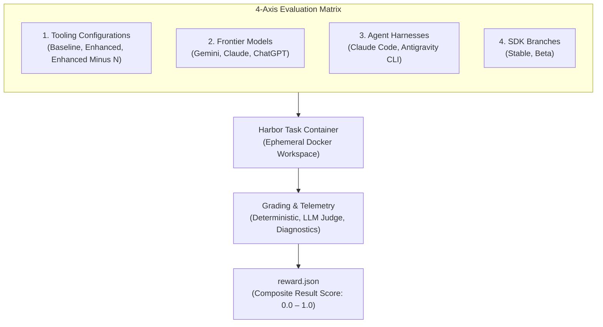

  

    verified
    Primary Metric Architecture
  

  <h3 class="hero-title">The Result Score</h3>
  

    Each task run produces a composite <code>reward.json</code> score on a
    <strong>0.0 to 1.0 scale</strong>, synthesizing deterministic code
    correctness, maintainability, and developer experience.
  

## Methodology

FlutterBench is made up of four key components:

1. **Dataset**: A collection of real-world development tasks derived from
   canonical critical user journeys.
2. **Test matrix**: A multidimensional testing framework across models,
   agents, tooling configurations, and SDK branches.
3. **Scoring system**: A comprehensive grading approach that evaluates both
   functional outcomes and developer experience.
4. **Harness**: The containerized automation infrastructure that executes
   evaluations at scale.

## Dataset

Evaluation tasks derive directly from Flutter's canonical
[**Critical User Journeys (CUJs)**][], which are the core workflows that
developers perform regularly. This approach ensures evaluations reflect
real-world developer needs.

Each CUJ represents a combination of a persona, a high-level goal, and 
a list of tasks required to achieve that goal. For example:

{:width="60%" .diagram-wrap}

:::note
We can't open-source the full evaluation tasks without contaminating the
benchmark dataset, but we publish our [canonical list of CUJs][]. With
this list, along with the example task below, you can understand our
evaluation philosophy for FlutterBench.
:::

### Task structure

These CUJs are converted into [Harbor](https://harborframework.com/)
tasks. Harbor is the framework used to run containerized evaluation tasks.

CUJs and Harbor tasks don't map cleanly one-to-one. Instead, the CUJ list
serves as a guide to verify that core developer workflows are evaluated.
In some cases, several CUJs combine into a single task, and vice-versa.
Our most ambitious evaluations combine multiple Harbor tasks, and thus
cover many CUJs.

### Task categories

Tasks are categorized by the type of agent capability they test. A task
can belong to multiple categories, particularly hill-climbing tasks.

* **Greenfield generation**: Creating new features or applications from
  scratch.
* **Hill climbing**: Iterative debugging and problem-solving across
  multiple turns.
* **Refactoring**: Restructuring existing code while maintaining
  functionality.
* **Migration**: Upgrading deprecated APIs or moving between architectural
  patterns.
* **Integration**: Adding platform-specific features or third-party
  packages.

### Task prioritization

Tasks are prioritized based on user impact and frequency:

| Priority | Description                                                         |
|:---------|:--------------------------------------------------------------------|
| **P0**   | Critical production workflows and high-frequency productivity tasks |
| **P1**   | Core functionality and API consistency verification                 |
| **P2**   | Standard features and application maturity tasks                    |
| **P3**   | Edge cases and cosmetic polish                                      |

### Quality assurance

Before a task graduates into the core benchmark suite, it undergoes an
engineering audit. Human reviewers inspect initial trial runs and label
results as:

* **True positive**: Agent correctly passed the task.
* **True negative**: Agent correctly failed the task.
* **False positive**: Agent passed incorrectly due to lenient checks.
* **False negative**: Agent failed incorrectly due to brittle tests.

This process ensures that the dataset produces reliable, actionable signals
rather than noise.

## Task example

Each task contains an instruction, a target codebase and environment,
verification criteria, and metadata. Using the CUJ example above,
a corresponding Harbor task looks like this:



## Test matrix

To draw statistically sound conclusions, FlutterBench evaluates tasks
across a 4-axis matrix:

### 1. Tooling configuration

FlutterBench tests three configurations to measure the impact of Dart and
Flutter AI tools:

| Configuration        | Description                                                                             |
|:---------------------|:----------------------------------------------------------------------------------------|
| **Baseline**         | No specialized Dart/Flutter tools—tests raw model capability.                           |
| **Enhanced**         | Full suite of Dart/Flutter skills and MCP server tools.                                 |
| **Enhanced Minus N** | Full suite except for one specific tool or group—used to measure individual tool impact.|

This A/B testing approach helps answer questions such as:
"Does adding the Flutter widget tree skill improve success rates? By how
much? Does the improvement vary by model?"

### 2. Model selection

Testing covers major frontier models based on developer usage data:

* **Gemini**
* **Claude**
* **ChatGPT**

Additional providers are added based on community feedback and usage.

### 3. Agent harnesses

Different agents use different system prompts and tool-loading strategies.
Evaluations run against the agents Flutter developers use most:

* **Claude Code**
* **Antigravity CLI**

This measures how the same model performs across different agent
environments.

### 4. SDK branch

Evaluations run against both channels:

* **Stable**: The current production SDK.
* **Beta**: Monthly beta releases, which helps catch regressions before
  they reach the stable channel.

## Scoring system

The scoring methodology balances functional capability with process and
efficiency telemetry.

### Design philosophy

Because the Flutter team focuses on building the tooling, documentation,
and SDKs that agents consume rather than the models or agents themselves,
scoring reflects this focus:

* **Primary focus**: The quality of the final code artifact.
* **Secondary signals**: Developer experience and resource efficiency.

If an agent produces idiomatic Flutter code that passes all tests, the
evaluation passes—even if it took an unconventional path. However, the
system tracks process and efficiency metrics as diagnostic signals to
improve tooling.

### Three core dimensions

Each evaluation produces three independent dimensions that compute the
composite result score:

<ThreeDimensionsCards />

### Grader matrix

FlutterBench deploys a mix of deterministic, LLM-as-a-judge, and
heuristic graders across all three dimensions:

<GraderMatrix />

### Grader implementation

Evaluations use three types of graders:

* **Code-based graders** provide deterministic, objective verification:
  * Compilers, test runners, linters, and formatters.
  * Fast and unambiguous source of truth.
* **LLM-as-a-judge graders** handle qualitative evaluation:
  * Idiomatic style review, plan adherence, and trajectory analysis.
  * Follow strict rubrics using a **BINEVAL** approach (decomposing criteria
    into binary yes/no questions).
  * Nondeterministic but calibrated for nuanced assessment.
* **Human graders** serve as the ultimate authority:
  * Calibrate automated graders on initial runs.
  * Perform root-cause analysis on failures.
  * Resolve disagreements between automated graders.

### Multi-run reliability

Single-run trials only sample luck. True agent trust requires measuring
multi-trial stability across repeated runs:

<ReliabilityCards />

* **Capability ($pass@k$)**: The probability that an agent succeeds at least
  once across $k$ attempts. This indicates what a model can achieve under
  ideal conditions.
* **Consistency ($pass^k$)**: The probability that an agent succeeds every
  single time across all $k$ attempts. This represents our north star
  metric, measuring whether developers can reliably depend on the agent in
  production workflows.

### Diagnostic scores

In addition to the primary result score, FlutterBench captures diagnostic
telemetry:

#### Process score (diagnostic)

This score tracks agent behavior to identify tooling improvement
opportunities:

* Tool usage patterns and discoverability.
* Reasoning trace quality and plan adherence.
* Error recovery strategies.
* Accurate reporting (whether the agent's summary matches reality).

Process scores help triage failures to determine whether an agent failed
because tool definitions are unclear, documentation is missing, or the
model fundamentally misunderstood the task.

#### Efficiency score (diagnostic)

This score measures resource consumption:

* **Token usage**: Compares actual token consumption against task-specific
  baselines.
* **Step efficiency**: Detects redundant steps, unnecessary tool calls, or
  loops.

Efficiency data helps developers make informed trade-offs. An agent using
2× the tokens but producing correct code on the first try can be preferable
to one using half the tokens but requiring manual intervention.

### Score triage and action matrix

Click a score tier to view its grading criteria and actionable engineering
triage steps:

<ScoreTriage />

| Result score  | Classification              | Criteria                                                                                                                                       |
|:--------------|:----------------------------|:-----------------------------------------------------------------------------------------------------------------------------------------------|
| **1.00**      | Perfect success             | Code compiles, runs, and passes all tests. Clean static analysis. Highly idiomatic. Perfect developer experience.                              |
| **0.75–0.99** | Functional with minor flaws | Code works and tests pass. Minor lint warnings or slightly unidiomatic patterns. Minor developer experience friction.                          |
| **0.50–0.74** | Partial success             | Core features work, but some tests fail or minor compilation issues exist. Or working code with significant lints or low developer experience. |
| **0.25–0.49** | Poor implementation         | Significant errors. Fails to compile, ignores constraints, or catastrophic developer experience friction.                                      |
| **0.00**      | Total failure               | No working code or agent stuck in an infinite loop.                                                                                            |

### Combining scores for analysis

Isolating the result score from process and efficiency scores allows for
systematic triage of issues:

* **High result + low process**: The agent succeeded through an unexpected
  path, highlighting an optimization opportunity.
* **Low result + high process**: The agent used tools correctly but failed,
  signaling tooling or documentation issues.
* **Low result + low process**: Model disorientation, which indicates a
  need for improved prompt engineering.
* **High result + low efficiency**: The agent solved the problem but
  consumed excessive resources; consider specialized skills.
* **Low result + high efficiency**: The agent failed quickly, which
  suggests a need for better constraints or tool schemas.

## Data analysis

Evaluation results are analyzed across all four matrix dimensions to answer
specific questions:

* Does adding a new Flutter skill improve result scores across multiple
  models?
* Do improvements hold steady when testing with different agents?
* Are there SDK changes in beta that break agent workflows before reaching
  stable?
* Which tasks have consistently low scores, indicating knowledge gaps?

This multidimensional analysis drives decisions about where to invest in
tooling, documentation, and SDK improvements.

## Transparency and iteration

To prevent model training contamination, raw datasets and reference
solutions remain private. However, the Flutter team maintains transparency
by:

* Publishing the comprehensive evaluation methodology on this page.
* Sharing task prompts and CUJ lists.
* Publishing regular blog posts with analysis and insights.
* Open-sourcing verification tooling that does not risk dataset compromise.

This methodology will evolve as more data is gathered and analyzed. Expect
updates and refinements in future blog posts and documentation.

[**Critical User Journeys (CUJs)**]: /ai/flutter-bench/cujs

[canonical list of CUJs]: /ai/flutter-bench/cujs
