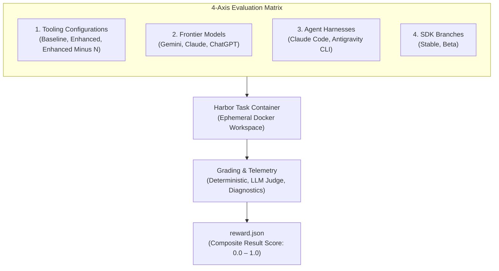

<!-- TODO: Put more interesting content here -->

  

    verified
    Primary Metric Architecture
  

  <h3 class="hero-title">The Result Score</h3>
  

    Each task run produces a composite <code>reward.json</code> score on a
    <strong>0.0 to 1.0 scale</strong>, synthesizing deterministic code
    correctness, maintainability, and developer experience.
  

## Methodology overview

FlutterBench is our evaluation framework designed to measure how AI coding
agents perform within the Dart and Flutter ecosystem.

The evaluation system consists of four core components:

| Component | Description |
|:---|:---|
| **Dataset** | Real-world development tasks derived from critical user journeys (CUJs). |
| **Test matrix** | Multidimensional testing framework across models, agents, tooling configurations, and SDK versions. |
| **Scoring system** | Unified grading approach evaluating functional outcomes, code quality, and developer experience, paired with diagnostic telemetry. |
| **Harness** | Containerized automation infrastructure that executes evaluations at scale. |

## Dataset & tasks

### Task derivation

Evaluation tasks derive directly from Flutter's canonical
[**Critical User Journeys (CUJs)**][], which are the core workflows that
developers perform regularly. This approach ensures evaluations reflect
real-world developer needs rather than synthetic puzzles.

Each CUJ represents a combination of:
* A Flutter developer persona (e.g., app developer, plugin developer,
  full-stack developer)
* A high-level goal
* The specific sequential steps required to achieve that goal

For example:

<CujDiagram />

:::note
We can't open-source the full evaluation tasks without contaminating the
benchmark dataset, but we publish our [canonical list of CUJs][]. With
this list, along with the example task below, you can understand our
evaluation philosophy for FlutterBench.
:::

These CUJs are converted into [Harbor](https://harborframework.com/)
tasks. Harbor is the framework used to run containerized evaluation tasks.

CUJs and Harbor tasks don't map cleanly one-to-one. Instead, the CUJ list
serves as a guide to verify that core developer workflows are evaluated.
In some cases, several CUJs combine into a single task, and vice-versa.
Our most ambitious evaluations combine multiple Harbor tasks, and thus
cover many CUJs.

### Task structure

Each task lives in its own directory and contains four elements:

| Element | Description |
|:---|:---|
| **Instruction** | A realistic prompt written the way developers talk to agents (typically 1–2 sentences, behavior-focused rather than prescriptive). |
| **Target codebase & environment** | A containerized Docker environment preseeded with a Dart or Flutter codebase, testing greenfield generation or existing codebases with bugs or debt. |
| **Verification criteria** | Verification scripts (`tests/graders.dart` and `test.sh`) executing `package:eval_scoring`. |
| **Configuration & metadata** | The `task.toml` configuration defining associated CUJs, priority tiers, expected skills, and MCP tools. |

### Task categories

Tasks are categorized by the primary agent capability being evaluated:

| Category | Description |
|:---|:---|
| **Greenfield generation** | Creating new features or applications from scratch. |
| **Hill climbing** | Iterative debugging, test repair, and multi-turn problem-solving. |
| **Refactoring** | Restructuring existing code while maintaining functionality. |
| **Migration** | Upgrading deprecated APIs or transitioning between architectural patterns. |
| **Integration** | Adding platform-specific features, native plugins, or third-party packages. |

### Task tiers & prioritization

To balance comprehensive coverage with evaluation speed, tasks are organized
into execution tiers and priorities:

#### Execution tiers

| Tier | Description |
|:---|:---|
| **Tier 1** | Core benchmark tasks executed monthly across the complete evaluation matrix. |
| **Tier 2** | Maturing tasks slated to graduate into Tier 1 once calibrated. |
| **Tier 3** | Experimental tasks used for ad-hoc investigations and targeted questions. |

#### Task priority

| Priority | Description |
|:---|:---|
| **P0** | Critical production workflows and high-frequency productivity tasks |
| **P1** | Core functionality and API consistency verification |
| **P2** | Standard features and application maturity tasks |
| **P3** | Edge cases and cosmetic polish |

### Quality assurance

Before a task graduates into the core benchmark suite, it undergoes an
engineering audit. Human reviewers inspect initial trial runs and label
results as:

| Audit label | Definition |
|:---|:---|
| **True positive** | Agent correctly passed the task. |
| **True negative** | Agent correctly failed the task. |
| **False positive** | Agent passed incorrectly due to overly lenient checks. |
| **False negative** | Agent failed incorrectly due to brittle or flaky tests. |

This process ensures that the dataset produces reliable, actionable signals
rather than noise.

### Interactive task anatomy

Each task contains an instruction, a target codebase and environment,
verification criteria, and metadata. Using the CUJ example above,
a corresponding Harbor task looks like this:



## Evaluation test matrix

### Matrix overview

To draw statistically sound conclusions, FlutterBench evaluates tasks
across a 4-axis matrix:

### Tooling configurations

FlutterBench tests three configurations to measure the impact of Dart and
Flutter AI tools:

| Configuration | Description |
|:---|:---|
| **Baseline** | No specialized Dart/Flutter tools—tests raw model capability. |
| **Enhanced** | Full suite of Dart/Flutter skills and MCP server tools loaded. |
| **Enhanced Minus N** | Full suite with a specific tool or skill group ablated to measure its isolated delta. |

This A/B testing approach helps answer questions such as:
"Does adding the Flutter widget tree skill improve success rates? By how
much? Does the improvement vary by model?"

### Frontier models

Testing covers major frontier model families across high-capability and
low-latency tiers:

* **Gemini** (Pro and Flash)
* **Claude** (Opus and Sonnet)
* **ChatGPT** (GPT-4o series)

Additional providers are added based on community feedback and usage data.

### Agent harnesses

Different agents use different system prompts, context management techniques,
and tool-loading strategies. Evaluations run against the CLI agents Flutter
developers use most:

* **Antigravity CLI**
* **Claude Code**

This measures how the same model performs across different agent runtime
environments.

### SDK release channels

Evaluations run against both channels:

| Channel | Evaluation focus |
|:---|:---|
| **Stable** | The current production SDK release; measures developer-ready reliability. |
| **Beta** | Monthly beta releases; catches regressions before reaching stable. |

## Scoring architecture

### Scoring philosophy

When evaluating AI coding agents, execution friction—such as tool failures,
endless retries, and hallucinations—is often attributed entirely to model
capability. However, AI coding systems follow a core equation:

$$\text{Agent} = \text{Model} + \text{Harness}$$

While the Dart and Flutter teams do not train the underlying LLMs, we build
and maintain the **Dart and Flutter AI Harness** (skills, MCP tools,
compiler diagnostics, and sandboxes).

Therefore, **Developer Experience (DX)** is directly within our engineering
control and belongs in our primary benchmark score alongside functional
outcomes and code quality:

* **Primary focus**: The quality and correctness of the final code artifact.
* **First-class signal**: Developer experience friction, tool accuracy, and
  recovery efficiency.

### Three core evaluation dimensions

Each evaluation produces three independent dimensions that compute the
composite Result Score in Harbor's `reward.json`:

<ThreeDimensionsCards />

### Grader matrix

FlutterBench deploys a mix of deterministic, LLM-as-a-judge, and
heuristic graders across all three dimensions:

<GraderMatrix />

### Grader implementation tiers

Evaluations use three types of graders:

| Tier | Grader type | Evaluation role |
|:---|:---|:---|
| **Code-based** | Compilers, test runners, `dart analyze`, DCM, and structural checkers | Deterministic, unambiguous source of truth for syntax and correctness. |
| **LLM judge (BINEVAL)** | Frontier model rubric evaluation | Evaluates qualitative dimensions (visual UI, idiomatic review, trajectory, recovery) using binary yes/no questions. |
| **Human audit** | Flutter engineer manual review | Ground truth calibration, failure root-cause analysis, and conflict resolution. |

### Diagnostic telemetry (excluded from Result Score)

To avoid penalizing capability scores on complex tasks that require more
reasoning steps or tokens, FlutterBench tracks diagnostic telemetry separately
from the Result Score:

| Metric | Measurement target |
|:---|:---|
| **Token usage** | Tracks total input and output tokens consumed to measure efficiency deltas and verify token reductions from skill optimizations. |
| **Expected tool calls** | Compares actual tool invocations against expected tools. If an agent succeeds without using an expected tool, it is not penalized; this telemetry helps evaluate whether the tool is necessary for that user journey. |

## Reliability & triage

### Multi-run reliability metrics

Single-run trials only sample luck. True agent trust requires measuring
multi-trial stability across repeated runs:

<ReliabilityCards />

### Score triage matrix

Click a score tier to view its grading criteria and actionable engineering
triage steps:

<ScoreTriage />

### How scores drive engineering decisions

By combining the Result Score with diagnostic telemetry and human audits,
we systematically triage issues:

| Result score range | Classification | Engineering diagnosis & action |
|:---|:---|:---|
| **1.00** | Perfect Success | Code is correct, idiomatic, and clean with flawless DX. • **Expected tools check**: If called, tool design is validated. If skipped, evaluate if the tool is necessary for this CUJ. • **Token efficiency**: If token burn was high, streamline prompt context or add shortcut tools. |
| **0.50–0.99** | Medium Result | Functional success achieved, but with minor flaws (lints, unidiomatic patterns) or moderate DX friction. • **Action**: Tune skill prompts, refine tool parameter schemas and validation logic (MCP/CLI errors), or collaborate with model teams on code polish. |
| **< 0.50** | Low Result | Code failed (compile errors, broken logic) or suffered severe DX breakdown. • **If expected tools ignored**: Tool discoverability issue or ambiguous prompt $\rightarrow$ refine descriptions, frontmatter, and guidelines. • **If expected tools used but failed**: Output was insufficient $\rightarrow$ build stronger helper tools or refine APIs. • **If token burn was high**: Agent caught in repetitive debugging loops $\rightarrow$ improve compiler diagnostic messages for single-step self-healing. • **If token burn was low**: Agent surrendered prematurely $\rightarrow$ refine prompt constraints and system instructions. |

#### Human root-cause audits

When an evaluation task receives a low Result Score, human expert reviewers
inspect the diagnostic process data:

* **Reasoning trace review**: Inspect the agent's internal thoughts to identify
  where misunderstandings of Dart/Flutter APIs occurred.
* **Plan adherence audit**: Check whether the agent derailed due to ambiguous
  task prompts or missing context.
* **Harness diagnostics**: Audit error messages returned to the agent during
  failed compile/test steps to see why recovery failed.

## Transparency & dataset integrity

To prevent model training contamination, raw datasets and reference
solutions cannot be open-sourced. However, the Flutter team maintains
transparency by:

* Publishing the comprehensive evaluation methodology on this page.
* Sharing task prompts and [CUJ][] lists.
* Publishing regular blog posts with analysis and insights.
* Open-sourcing verification tooling that does not risk dataset compromise.

This methodology will evolve as more data is gathered and analyzed. Expect
updates and refinements in future blog posts and documentation.

[**Critical User Journeys (CUJs)**]: /ai/flutter-bench/cujs
[CUJ]: /ai/flutter-bench/cujs

[canonical list of CUJs]: /ai/flutter-bench/cujs
