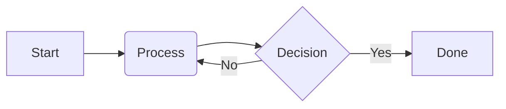
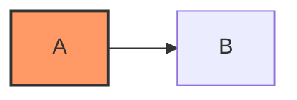

:::warning
This document is a work in progress.
:::

Our sites support writing content in [Markdown][],
with some additions from [GitHub Flavored Markdown][]
as well as other custom syntaxes.

This page outlines the Markdown syntax we support
as well as our style guidelines for authoring Markdown.

[Markdown]: https://commonmark.org/
[GitHub Flavored Markdown]: https://github.github.com/gfm/

## General guidelines

Prefer using Markdown syntax over custom HTML and components.
Raw Markdown is easier to maintain, easier for tools to understand,
and easier to migrate in the future if necessary.

## Code blocks

Don't use Markdown's indented code blocks,
only use fenced code blocks using backticks
and always specify a language. For example:

````markdown
```dart
void main() {
  print('Hello world!');
}
```
````

To learn more about customizing code blocks,
check out the dedicated documentation on [Code blocks][].

[Code blocks]: /contribute/docs/code-blocks


## Mermaid diagrams

To render flowcharts, sequence diagrams, and other charts within a Markdown file,
use a fenced code block with the `mermaid` language identifier:

````markdown

````

### Style Mermaid diagrams

Mermaid diagrams automatically adapt to the site's light and dark themes
and inherit the default `Google Sans Flex` typography.

#### In-diagram styling (Recommended)

When you need custom colors for specific nodes,
define them directly in the diagram using Mermaid's built-in
[`classDef` and `:::styleName` syntax][]:



#### SCSS styling

To adjust the global diagram layout, border, or background across the site,
edit [`_mermaid.scss`][]:

```scss
.mermaid-container {
  // Container styling (padding, margins, background, border)

  // Fallback while loading or during SSR
  pre.mermaid {
    // Pre-loading styles
  }

  svg {
    // Custom SVG element overrides (requires !important)
    .highlightNode rect {
      fill: var(--site-primary-color) !important;
    }
  }
}
```

[`classDef` and `:::styleName` syntax]: https://mermaid.js.org/syntax/flowchart.html#styling-and-classes
[`_mermaid.scss`]: https://github.com/flutter/website/blob/main/packages/site_shared/lib/_sass/components/_mermaid.scss
