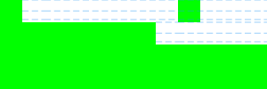

## Changes

This section lists the notable non-API breaking changes.

### (Only Affects Tests) `FlutterTest` is now the default test font

The `FlutterTest` font replaced `Ahem` as the default font in tests: when
`fontFamily` isn't specified, or the font families specified are not registered,
tests use the `FlutterTest` font to render text. The `Ahem` font is still
available in tests if specified as the `fontFamily` to use.

The `FlutterTest` font produces more precise font and glyph metrics than `Ahem`,
and the metrics are generally font-engine agnostic.
Check out the [Flutter Test Fonts][]
wiki page for more details about the test font.

**Differences**

The `FlutterTest` font looks almost identical to the old default `Ahem`: the
glyph for most characters is a box that fills the em square. The notable
differences between the `FlutterTest` font and `Ahem` font are:

**1. Different baseline location**

The `FlutterTest` font's ascent and descent are 0.75 em and 0.25 em, while
`Ahem`'s are 0.8 em and 0.2 em, respectively.

In the example golden image change below, the white blocks are text rendered
using `Ahem` and `FlutterTest`. The second character is taller in the new font
since it has a larger descent.

| Before (`Ahem`) | After | Animated Diff |
| :---: | :---: | :---: |
|  |  |  |

**2. Different decoration position**

The underline location is slightly higher in `FlutterTest` than `Ahem`.

In the example golden image change below, the 3 lines of white blocks are text
rendered using `Ahem` and `FlutterTest`. The blue dashed lines indicate the
[TextDecoration.overline]/[TextDecoration.lineThrough]/[TextDecoration.underline]
positions for each line.

| Before (`Ahem`) | After | Animated Diff |
| :---: | :---: | :---: |
|  |  |   |

**3. The glyph used for unmapped characters are slightly different**

Unmapped characters are rendered as hollow boxes in both fonts, with
a slight difference:

| Before (`Ahem`) | After | Diff |
| :---: | :---: | :---: |
|  |  |  |

## References

Relevant PRs:

* The `FlutterTest` font was added in: [Add new test font]({{site.repo.engine}}/pull/39809)
* The `FlutterTest` font was made the default in: [Make FlutterTest the default test font]({{site.repo.engine}}/pull/40188)

Wiki page:

* [Flutter Test Fonts][]

[Flutter Test Fonts]: {{site.repo.flutter}}/blob/master/docs/contributing/testing/Flutter-Test-Fonts.md
[TextDecoration.underline]: {{site.api}}/flutter/dart-ui/TextDecoration/underline-constant.html
[TextDecoration.overline]: {{site.api}}/flutter/dart-ui/TextDecoration/overline-constant.html
[TextDecoration.lineThrough]: {{site.api}}/flutter/dart-ui/TextDecoration/lineThrough-constant.html
