## Adaptation philosophy

There are generally 2 cases of platform adaptiveness:

1. Things that are behaviors of the OS environment (such as text editing and
   scrolling) and that would be 'wrong' if a different behavior took place.
2. Things that are conventionally implemented in apps using the OEM's SDKs
   (such as using parallel tabs on iOS or showing an
   [android.app.AlertDialog](https://developer.android.com/reference/android/app/AlertDialog.html)
   on Android).

This article mainly covers the automatic adaptations provided by Flutter
in case 1 on Android and iOS.

For case 2, Flutter bundles the means to produce the appropriate effects of
the platform conventions but does not adapt automatically when app design
choices are needed. For a discussion, see [#8410](https://github.com/flutter/flutter/issues/8410#issuecomment-468034023)
and [http://bit.ly/flutter-adaptive-widget-problem](http://bit.ly/flutter-adaptive-widget-problem).

For an example of an app using different information architecture structures on
Android and iOS but sharing the same content code, see [https://github.com/flutter/samples/tree/master/platform_design](https://github.com/flutter/samples/tree/master/platform_design).

## Page navigation

Flutter provides the navigation patterns seen on Android and iOS and also
automatically adapts the navigation animation to the current platform.

### Navigation transitions

On **Android**, the default
[Navigator.push]({{site.api}}/flutter/widgets/Navigator/push.html)
transition is modeled after
[startActivity()](https://developer.android.com/reference/android/app/Activity.html#startActivity(android.content.Intent)),
which generally has one bottom-up animation variant.

On **iOS**:

* The default
  [Navigator.push]({{site.api}}/flutter/widgets/Navigator/push.html)
  API produces an iOS Show/Push style transition which animates from
  end-to-start depending on the locale's RTL setting. The page behind the new
  route also parallax-slides in the same direction as in iOS.
* A separate bottom-up transition style exists when pushing a page route where
 [PageRoute.fullscreenDialog]({{site.api}}/flutter/widgets/PageRoute-class.html)
  is true. This represents iOS's Present/Modal style transition and is
  typically used on fullscreen modal pages.

  

    

      <figure class="figure">
        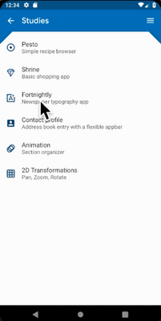
        <figcaption class="figure-caption">
          Android page transition
        </figcaption>
      </figure>
    

    

      <figure class="figure">
        
        <figcaption class="figure-caption">
          iOS push transition
        </figcaption>
      </figure>
    

    

      <figure class="figure">
        
        <figcaption class="figure-caption">
          iOS present transition
        </figcaption>
      </figure>
    

  

### Platform-specific transition details

On **Android**, 2 page transition animation styles exist depending on your OS
version:

* Pre API 28 uses a bottom-up animation that [slides up and fades
  in]({{site.api}}/flutter/material/FadeUpwardsPageTransitionsBuilder-class.html).
* On API 28 and later, the bottom-up animation [slides and clip-reveals
  up]({{site.api}}/flutter/material/OpenUpwardsPageTransitionsBuilder-class.html).

On **iOS** when the push style transition is used, Flutter's bundled
[CupertinoNavigationBar]({{site.api}}/flutter/cupertino/CupertinoNavigationBar-class.html)
and [CupertinoSliverNavigationBar]({{site.api}}/flutter/cupertino/CupertinoSliverNavigationBar-class.html)
nav bars automatically animate each subcomponent to its corresponding
subcomponent on the next or previous page's CupertinoNavigationBar or
CupertinoSliverNavigationBar.

  

    

      <figure class="figure">
        
        <figcaption class="figure-caption">
          Android Pre-P
        </figcaption>
      </figure>
    

    

      <figure class="figure text-center">
        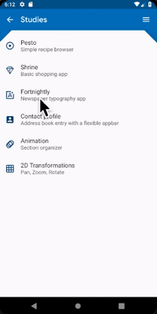
        <figcaption class="figure-caption">
          Android Post-P
        </figcaption>
      </figure>
    

    

      <figure class="figure text-center">
        
        <figcaption class="figure-caption">
          iOS Nav Bar
        </figcaption>
      </figure>
    

  

### Back navigation

On **Android**, the OS back button, by default, is sent to Flutter and pops the
top route of the
[WidgetsApp]({{site.api}}/flutter/widgets/WidgetsApp-class.html)'s
Navigator.

On **iOS**, an edge swipe gesture can be used to pop the top route.

  

    

      <figure class="figure">
        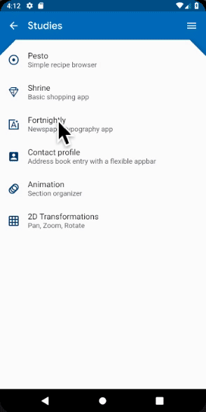
        <figcaption class="figure-caption">
          Android back button
        </figcaption>
      </figure>
    

    

      <figure class="figure text-center">
        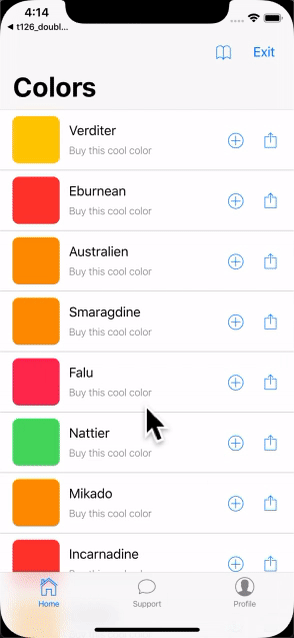
        <figcaption class="figure-caption">
          iOS back swipe gesture
        </figcaption>
      </figure>
    

  

## Scrolling

Scrolling is an important part of the platform's look and feel, and Flutter
automatically adjusts the scrolling behavior to match the current platform.

### Physics simulation

Android and iOS both have complex scrolling physics simulations that are
difficult to describe verbally. Generally, iOS's scrollable has more weight and
dynamic friction but Android has more static friction. Therefore iOS gains high
speed more gradually but stops less abruptly and is more slippery at
slow speeds.

  

    

      <figure class="figure">
        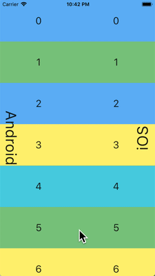
        <figcaption class="figure-caption">
          Soft fling comparison
        </figcaption>
      </figure>
    

    

      <figure class="figure text-center">
        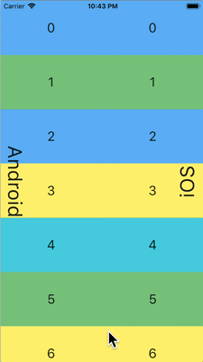
        <figcaption class="figure-caption">
          Medium fling comparison
        </figcaption>
      </figure>
    

    

      <figure class="figure text-center">
        
        <figcaption class="figure-caption">
          Strong fling comparison
        </figcaption>
      </figure>
    

  

### Overscroll behavior

On **Android**, scrolling past the edge of a scrollable shows an
[overscroll glow indicator]({{site.api}}/flutter/widgets/GlowingOverscrollIndicator-class.html)
(based on the color of the current Material theme).

On **iOS**, scrolling past the edge of a scrollable
[overscrolls]({{site.api}}/flutter/widgets/BouncingScrollPhysics-class.html)
with increasing resistance and snaps back.

  

    

      <figure class="figure">
        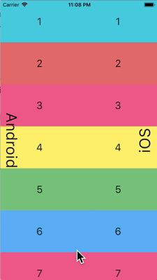
        <figcaption class="figure-caption">
          Dynamic overscroll comparison
        </figcaption>
      </figure>
    

    

      <figure class="figure">
        
        <figcaption class="figure-caption">
          Static overscroll comparison
        </figcaption>
      </figure>
    

  

### Momentum

On **iOS**, repeated flings in the same direction stacks momentum and
builds more speed with each successive fling. There is no equivalent
behavior on *Android*.

  

    

      <figure class="figure">
        
        <figcaption class="figure-caption">
          iOS scroll momentum
        </figcaption>
      </figure>
    

  

### Return to top

On **iOS**, tapping the OS status bar scrolls the primary scroll controller
to the top position. There is no equivalent behavior on **Android**.

  

    

      <figure class="figure">
        
        <figcaption class="figure-caption">
          iOS status bar tap to top
        </figcaption>
      </figure>
    

  

## Typography

When using the Material package, the typography automatically defaults to the
font family appropriate for the platform. On Android, the Roboto font is used.
On iOS, the OS's San Francisco font family is used.

When using the Cupertino package, the [default
theme](https://github.com/flutter/flutter/blob/master/packages/flutter/lib/src/cupertino/text_theme.dart)
always uses the San Francisco font.

The San Francisco font license limits its usage to software running on iOS,
macOS, or tvOS only. Therefore a fallback font is used when running on Android
if the platform is debug-overridden to iOS or the default Cupertino theme is
used.

  

    

      <figure class="figure">
        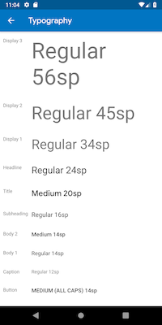
        <figcaption class="figure-caption">
          Roboto on Android
        </figcaption>
      </figure>
    

    

      <figure class="figure text-center">
        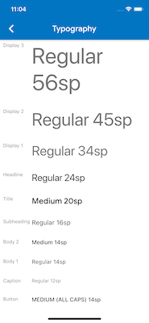
        <figcaption class="figure-caption">
          San Francisco on iOS
        </figcaption>
      </figure>
    

  

## Iconography

When using the Material package, certain icons automatically show different
graphics depending on the platform. For instance, the overflow button's 3 dots
are vertical on iOS and horizontal on Android. The back button is a simple
chevron on iOS and has a stem/shaft on Android.

  

    

      <figure class="figure">
        
        <figcaption class="figure-caption">
          Icons on Android
        </figcaption>
      </figure>
    

    

      <figure class="figure text-center">
        
        <figcaption class="figure-caption">
          Icons on iOS
        </figcaption>
      </figure>
    

  

## Haptic feedback

The Material and Cupertino packages automatically trigger the platform
appropriate haptic feedback in certain scenarios.

For instance, a word selection via text field long-press triggers a 'buzz'
vibrate on Android and not on iOS.

Scrolling through picker items on iOS triggers a 'light impact' knock and
no feedback on Android.

## Text editing

Flutter also makes the below adaptations while editing the content of text
fields to match the current platform.

### Keyboard gesture navigation

On **Android**, horizontal swipes can be made on the soft keyboard's spacebar
to move the cursor in Material and Cupertino text fields.

On **iOS** devices with 3D Touch capabilities, a force-press-drag gesture,
could be made on the soft keyboard to move the cursor in 2D via a floating
cursor. This works on both Material and Cupertino text fields.

  

    

      <figure class="figure">
        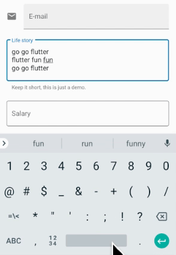
        <figcaption class="figure-caption">
          Android space key cursor move
        </figcaption>
      </figure>
    

    

      <figure class="figure text-center">
        
        <figcaption class="figure-caption">
          iOS 3D Touch drag cursor move
        </figcaption>
      </figure>
    

  

### Text selection toolbar

With **Material on Android**, the Android style selection toolbar is shown when
a text selection is made in a text field.

With **Material on iOS** or when using **Cupertino**, the iOS style selection
toolbar is shown when a text selection is made in a text field.

  

    

      <figure class="figure">
        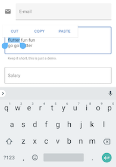
        <figcaption class="figure-caption">
          Android text selection toolbar
        </figcaption>
      </figure>
    

    

      <figure class="figure text-center">
        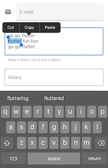
        <figcaption class="figure-caption">
          iOS text selection toolbar
        </figcaption>
      </figure>
    

  

### Single tap gesture

With **Material on Android**, a single tap in a text field puts the cursor at
the location of the tap.

A collapsed text selection also shows a draggable handle to subsequently move
the cursor.

With **Material on iOS** or when using **Cupertino**, a single tap in a text
field puts the cursor at the nearest edge of the word tapped.

Collapsed text selections don't have draggable handles on iOS.

  

    

      <figure class="figure">
        
        <figcaption class="figure-caption">
          Android tap
        </figcaption>
      </figure>
    

    

      <figure class="figure text-center">
        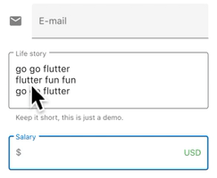
        <figcaption class="figure-caption">
          iOS tap
        </figcaption>
      </figure>
    

  

### Long-press gesture

With **Material on Android**, a long press selects the word under the long
press. The selection toolbar is shown upon release.

With **Material on iOS** or when using **Cupertino**, a long press places the
cursor at the location of the long pres. The selection toolbar is shown upon
release.

  

    

      <figure class="figure">
        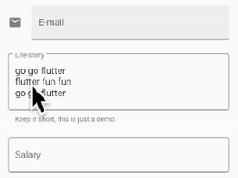
        <figcaption class="figure-caption">
          Android long press
        </figcaption>
      </figure>
    

    

      <figure class="figure text-center">
        
        <figcaption class="figure-caption">
          iOS long press
        </figcaption>
      </figure>
    

  

### Long-press drag gesture

With **Material on Android**, dragging while holding the long press expands
the words selected.

With **Material on iOS** or when using **Cupertino**, dragging while holding
the long press moves the cursor.

  

    

      <figure class="figure">
        
        <figcaption class="figure-caption">
          Android long press drag
        </figcaption>
      </figure>
    

    

      <figure class="figure text-center">
        
        <figcaption class="figure-caption">
          iOS long press drag
        </figcaption>
      </figure>
    

  

### Double tap gesture

On both Android and iOS, a double tap selects the word receiving the
double tap and shows the selection toolbar.

  

    

      <figure class="figure">
        
        <figcaption class="figure-caption">
          Android double tap
        </figcaption>
      </figure>
    

    

      <figure class="figure text-center">
        
        <figcaption class="figure-caption">
          iOS double tap
        </figcaption>
      </figure>
    

  

