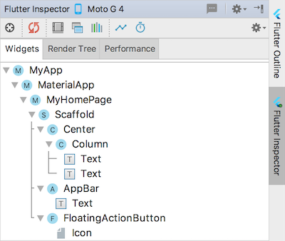
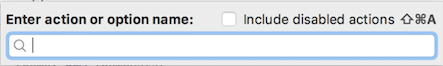
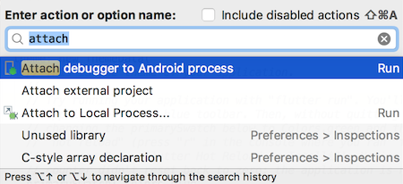
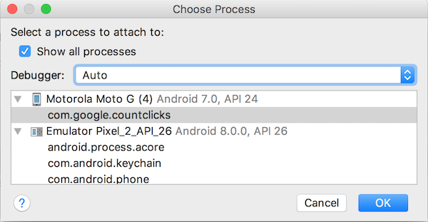

If you are exclusively writing Flutter apps with Dart code and not using
platform-specific libraries, or otherwise accessing platform-specific
features, you can debug your code using your IDE's debugger.
Only the first section of this guide, Debugging Dart code, is relevant for you.

If you're writing a platform-specific plugin or using platform-specific
libraries written in Swift, ObjectiveC, Java, or Kotlin, you can debug
that portion of your code using XCode (for iOS) or Android Gradle (for Android).
This guide shows you how you can connect _two_ debuggers to your Dart app,
one for Dart, and one for the OEM code.

* TOC Placeholder
{:toc}

# Debugging Dart code

Use your IDE for standard Dart debugging. These instructions describe Android
Studio, but you can use your preferred IDE with the Flutter and Dart
plugins installed and configured.

<aside class="alert alert-success" markdown="1">
<i class="fa fa-lightbulb-o"> </i> **Tip:**
Connect to a physical device when debugging, rather than an emulator or
simulator, which don't support profile mode. For more information, see
[Flutter's modes](https://github.com/flutter/flutter/wiki/Flutter's-modes).
</aside>

## Dart debugger

* Open your project in Android Studio. If you don't have a project yet,
  create one using the instructions in [Test drive](/get-started/test-drive).

* Simultaneously bring up the Debug pane and run the app in the Console
  view by clicking the bug icon.
  

  The first time you launch the app is the slowest.
  You should see the Debug pane appear at the bottom of the window that
  looks something like the following:

  

  You can configure where the debug pane appears, or even tear it off to its own
  window using the gear to the right in the Debug pane bar.
  This is true for any inspector in Android Studio.

* Add a breakpoint on the `counter++` line.

* Hot reload the app.
  

* In the app, click the **+** button (FloatingActionButton, or FAB, for short)
  to increment the counter. The app pauses.

* The following screenshot shows:
  * Breakpoint in the edit pane.
  * State of the app in the debug pane, when paused at the breakpoint.
  * `this` variable expanded to display its values.

  

You can step in, out, and over Dart statements, hot reload or resume the app,
and use the debugger in the same way you'd use any debugger.
The **5: Debug** button toggles display of the debug pane.

## Flutter inspector

There are two other features provided by the Flutter plugin that you may
find useful.  The Flutter inspector is a tool for visualizing and exploring
the Flutter widget tree and helps you:

* Understand existing layouts
* Diagnose layout issues

Toggle display of the inspector using the vertical button to the
right of the Android Studio window.

  

## Flutter outline

The Flutter Outline displays the current state of the widget tree.
Toggle display of the outline using the vertical button to the
right of the AS window.

  


TODO:
Android Tips - How to assign a keyboard shortcut on the Mac?


The rest of this guide shows how to set up your environment to debug OEM
code. As you'd expect, the process works differently for iOS and Android.

<aside class="alert alert-success" markdown="1">
<i class="fa fa-lightbulb-o"> </i> **Tip:**
Become a pro user of Android Studio by installing the **Presentation Assistant**
plugin. You can find and install this plugin using
**Preferences** > **Browsing repositories...** and start entering _Presen_ in
the search field.

Once installed and AS is relaunched, this plugin helps you to become a
pro user by:
* Showing the name and Windows/Linux/Mac shortcuts of any action you invoke.
* Allowing you to search and find available actions, settings, docs, and so on.
* Allowing you to toggle preferences, open up views, or run actions.
* Allowing you to assign keyboard shortcuts (?? Can't make this work on Mac.)

For example, try this:

* While focus is in the Edit pane, enter **command-Shift-A** (Mac) or
**shift-control-A** (Windows and Linux).
The plugin simultaneously brings up the Find panel and shows a hint for
performing this same operation on all three platforms.

Presentation assistant's Find panel

Presentation assistant's action hint for opening its Find panel on Mac, Windows and Linux

* Enter _attach_ to see the following:

* After an update, you might enter _Flutter_ or _Dart_ to see if new actions
  are available.

Hide the Presentation Assistant's Find panel by using **Escape**.
</aside>

# Debugging with Android Gradle (Android)

In order to debug OEM Android code, you need an app that contains OEM Android code.
In this section, you'll learn how to connect two debuggers to your app: 1) the
Dart debugger and, 2) the Android Gradle debugger, lldb.

* Create a basic Flutter app.

* Replace `lib/main.dart` with the following example code from the
[`url_launcher`](https://pub.dartlang.org/packages/url_launcher)
package:


// Copyright 2017 The Chromium Authors. All rights reserved.
// Use of this source code is governed by a BSD-style license that can be
// found in the LICENSE file.

import 'dart:async';

import 'package:flutter/material.dart';
import 'package:url_launcher/url_launcher.dart';

void main() {
 runApp(new MyApp());
}

class MyApp extends StatelessWidget {
 @override
 Widget build(BuildContext context) {
   return new MaterialApp(
     title: 'URL Launcher',
     theme: new ThemeData(
       primarySwatch: Colors.blue,
     ),
     home: new MyHomePage(title: 'URL Launcher'),
   );
 }
}

class MyHomePage extends StatefulWidget {
 MyHomePage({Key key, this.title}) : super(key: key);
 final String title;

 @override
 _MyHomePageState createState() => new _MyHomePageState();
}

class _MyHomePageState extends State<MyHomePage> {
 Future<Null> _launched;

 Future<Null> _launchInBrowser(String url) async {
   if (await canLaunch(url)) {
     await launch(url, forceSafariVC: false, forceWebView: false);
   } else {
     throw 'Could not launch $url';
   }
 }

 Future<Null> _launchInWebViewOrVC(String url) async {
   if (await canLaunch(url)) {
     await launch(url, forceSafariVC: true, forceWebView: true);
   } else {
     throw 'Could not launch $url';
   }
 }

 Widget _launchStatus(BuildContext context, AsyncSnapshot<Null> snapshot) {
   if (snapshot.hasError) {
     return new Text('Error: ${snapshot.error}');
   } else {
     return const Text('');
   }
 }

 @override
 Widget build(BuildContext context) {
   const String toLaunch = 'https://flutter.io';
   return new Scaffold(
     appBar: new AppBar(
       title: new Text(widget.title),
     ),
     body: new Center(
       child: new Column(
         mainAxisAlignment: MainAxisAlignment.center,
         children: <Widget>[
           const Padding(
             padding: const EdgeInsets.all(16.0),
             child: const Text(toLaunch),
           ),
           new RaisedButton(
             onPressed: () => setState(() {
               _launched = _launchInBrowser(toLaunch);
             }),
             child: const Text('Launch in browser'),
           ),
           const Padding(padding: const EdgeInsets.all(16.0)),
           new RaisedButton(
             onPressed: () => setState(() {
               _launched = _launchInWebViewOrVC(toLaunch);
             }),
             child: const Text('Launch in app'),
           ),
           const Padding(padding: const EdgeInsets.all(16.0)),
           new FutureBuilder<Null>(future: _launched, builder: _launchStatus),
         ],
       ),
     ),
   );
 }
}


* Add the `url_launcher` dependency to the pubspec file,
  and run flutter packages get:


name: flutter_app
description: A new Flutter application.
version: 1.0.0+1

dependencies:
  flutter:
    sdk: flutter

  [[highlight]]url_launcher: ^3.0.3[[/highlight]]
  cupertino_icons: ^0.1.2

dev_dependencies:
  flutter_test:
    sdk: flutter


* Click the debug icon (  )
  to simultaneously bring up the Debug pane and launch the app.
  Wait for the app to launch on the device, and for the debug pane to
  indicate **Connected**.
  (This can take a minute the first time but is faster for subsequent
   launches.) The app contains two buttons: 1) **Launch in browser**
   opens flutter.io in your phone's default browser and 2) **Launch
   in app** opens flutter.io within your app.

  

* Click the **Attach debugger to Android process** button (
   )

* From the process dialog, you should see an entry for each connected device.
  Select **show all processes** to display available processes for each device.

* Choose the process you want to attach to. In this case, it's the
  `com.google.clickcount`
   (or <strong>com.<em>company</em>.<em>app_name</em></strong>)
   process for the Motorola Moto G.

  

*  In the debug pane, you should now see a tab for **Android Debugger**.

* In the project pane, expand
  <strong><em>app_name</em> > android > app > src > main > java > io.flutter plugins</strong>.
  Double click **GeneratedProjectRegistrant** to open the Java code in the edit pane.

Both the Dart and OEM debuggers on the same process. User either, or both,
to set breakpoints, examine stack, resume, and so on.

  

  
The Dart debug pane with two breakpoints set in `lib/main.dart`.

  

  
The Android debug pane with one breakpoint set in
   `GeneratedPluginRegistrant.java`.

  
Toggle between the debuggers by clicking the appropriate debugger in
   the Debug pane's banner.

# Debugging with XCode (iOS)

[PENDING: in process]

# Resources

The following resources have more information on debugging Flutter,
iOS and Android:

## Flutter

* [Debugging Flutter Apps](/debugging/)
* [Advanced debugging](/using-ide/#advanced-debugging), a section in
  [Developing Flutter Apps in an IDE](/using-ide/).
* [Performance Profiling](/performance/)

## Android (developer.android.com)

* [Debug your app](https://developer.android.com/studio/debug/)
* [Android Debug Bridge (adb)](https://developer.android.com/studio/command-line/adb)


## iOS (developer.apple.com)

* [Debugging](https://developer.apple.com/support/debugging/)
* [Instruments Help](https://help.apple.com/instruments/mac/current/)

