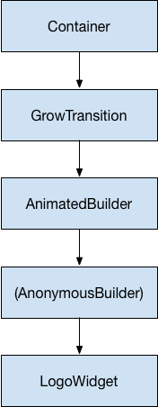

<b> <a id="whats-the-point" class="anchor" href="#whats-the-point" aria-hidden="true"></a>What you'll learn:</b>

* How to use the fundamental classes from the animation library to add
  animation to a widget.
* How to chain Tween animations.
* When to use AnimatedWidget vs. AnimatedBuilder.

This tutorial shows you how to build animations in Flutter.
After introducing some of the essential concepts, classes, and methods
in the animation library, it walks you through 5 animation examples.
The examples build on each other,
introducing you to different aspects of the animation library.

* [Essential animation concepts and classes](#concepts)
  * [Animations&lt;double&gt;](#animation-class)
  * [AnimationController](#animationcontroller)
  * [CurvedAnimation](#curvedanimation)
  * [Tween](#tween)
  * [Animation notifications](#animation-notifications)
* [Animation examples](#animation-examples)
  * [Rendering animations](#rendering-animations)
  * [Monitoring the progress of an animation](#monitoring)
  * [Simplifying with AnimatedWidget](#simplifying-with-animatedwidget)
  * [Refactoring with AnimatedBuilder](#refactoring-with-animatedbuilder)
  * [Simultaneous animations](#simultaneous-animations)
* [Next steps](#next-steps)

## Essential animation concepts and classes

<b> <a id="whats-the-point" class="anchor" href="#whats-the-point" aria-hidden="true"></a>What's the point?</b>

* The Animation object, a core class in Flutter's animation library,
  interpolates the values used to guide an animation.
* The animation object knows the current state of an animation (for example,
  whether it's started, stopped, or moving forward or in reverse),
  but doesn't know anything about what appears onscreen.
* An AnimationController manages the Animation.
* A CurvedAnimation defines progression as a non-linear curve.
* A Tween interpolates between the range of data as used by the
  object being animated. For example, a Tween might define an interpolation
  from red to blue, or from 0 to 255.
* Use Listeners and StatusListeners to monitor animation state changes.

The animation system in Flutter is based on typed
[`Animation`](https://docs.flutter.io/flutter/animation/Animation-class.html)
objects. Widgets can either incorporate these animations in their build
functions directly by reading their current value and listening to their
state changes or they can use the animations as the basis of more elaborate
animations that they pass along to other widgets.

### Animation&lt;double&gt;

In Flutter, an Animation object knows nothing about what is onscreen.
An Animation is an abstract class that understands its current value
and its state (completed or dismissed). One of the more commonly used
animation types is Animation&lt;double&gt;.

An Animation object in Flutter is a class that sequentially generates
interpolated numbers between two values over a certain duration.
The output of an Animation object may be linear, a curve, a step function,
or any other mapping you can devise. Depending on how the Animation object
is controlled, it could run in reverse, or even switch directions in the
middle.

Animations can also interpolate types other than double, such as
Animation&lt;Color&gt; or Animation&lt;Size&gt;.

`Animation` object has state. Its current value is always available
in the `.value` member.

An Animation object knows nothing about rendering or `build()` functions.

### CurvedAnimation

A CurvedAnimation defines the animation's progress as a non-linear curve.

<!-- skip -->

final CurvedAnimation curve =
    new CurvedAnimation(parent: controller, curve: Curves.easeIn);


<aside class="alert alert-success" markdown="1">
**Note:**
The [Curves](https://docs.flutter.io/flutter/animation/Curves-class.html)
class defines many commonly used curves, or you can create your own.
For example:

<!-- skip -->

class ShakeCurve extends Curve {
  @override
  double transform(double t) {
    return math.sin(t * math.PI * 2);
  }
}

</aside>

CurvedAnimation and AnimationController (described in the next section)
are both of type Animation&lt;double&gt;, so you can pass them interchangeably.
The CurvedAnimation wraps the object it’s modifying&mdash;you
don’t subclass AnimationController to implement a curve.

### AnimationController

AnimationController is a special Animation object that generates a new
value whenever the hardware is ready for a new frame. By default,
an AnimationController linearly produces the numbers from 0.0 to 1.0
during a given duration. For example, this code creates an Animation object,
but does not start it running:

<!-- skip -->

final AnimationController controller = new AnimationController(
    duration: const Duration(milliseconds: 2000), vsync: this);


AnimationController derives from Animation&lt;double&gt;, so it can be used
wherever an Animation object is needed. However, the AnimationController
has additional methods to control the animation. For example, you start
an animation with the `.forward()` method. The generation of numbers is
tied to the screen refresh, so typically 60 numbers are generated per
second. After each number is generated, each Animation object calls the
attached Listener objects. To create a custom display list for each
child, see
[RepaintBoundary](https://docs.flutter.io/flutter/widgets/RepaintBoundary-class.html).

When creating an AnimationController, you pass it a `vsync` argument.
The presence of `vsync` prevents offscreen animations from consuming
unnecessary resources. You can use your stateful object as the vsync
by adding SingleTickerProviderStateMixin to the class definition.
You can see an example of this in
[animate1](https://raw.githubusercontent.com/InMatrix/animation_tutorial/master/lib/animate1.dart)
on GitHub.

The `vsync` object ties the ticking of the animation controller to
the visiblity of the widget, so that when the animating widget goes
off-screen, the ticking stops, and when the widget is restored, it
starts again (without stopping the clock, so it's as if it had
been ticking the whole time, but without using the CPU.)
To use your custom State object as the `vsync`, include the
`TickerProviderStateMixin` when defining the custom State class.


<aside class="alert alert-success" markdown="1">
**Note**:
In some cases, a position might exceed the AnimationController's
0.0-1.0 range. For example, the `fling()` function allows you to provide
velocity, force, and position (via the Force object).
The position can be anything and so can be outside of the 0.0 to 1.0 range.

A CurvedAnimation can also exceed the 0.0 to 1.0 range,
even if the AnimationController doesn't. Depending on the curve selected,
the output of the CurvedAnimation can have a wider range than the input.
For example, elastic curves such as Curves.elasticIn will significantly
overshoot or undershoot the default range.
</aside>

### Tween

By default, the AnimationController object ranges from 0.0 to 1.0.
If you need a different range or a different data type,
you can use a Tween to configure an animation to interpolate to a
different range or data type. For example, the following Tween
goes from -200.0 to 0.0:

<!-- skip -->

final Tween doubleTween = new Tween<double>(begin: -200.0, end: 0.0);


A Tween is a stateless object that takes only `begin` and `end`.
The sole job of a Tween is to define a mapping from an input range
to an output range. The input range is commonly 0.0 to 1.0,
but that’s not a requirement.

A Tween inherits from Animatable&lt;T&gt;, not from Animation&lt;T&gt;.
An Animatable, like Animation, doesn't have to output double.
For example, ColorTween specifies a progression between two colors.

<!--- skip -->

final Tween colorTween =
    new ColorTween(begin: Colors.transparent, end: Colors.black54);


A Tween object does not store any state. Instead, it provides the
`evaluate(Animation<double> animation)` method that applies the mapping
function to the current value of the animation. The current value of the
`Animation` object can be found in the `.value` method.
The evaluate function also performs some housekeeping,
such as ensuring that begin and end are returned when the animation
values are 0.0 and 1.0, respectively.

#### Tween.animate

To use a Tween object, call `animate()` on the Tween, passing in the
controller object. For example, the following code generates the
integer values from 0 to 255 over the course of 500 ms.

<!-- skip -->

final AnimationController controller = new AnimationController(
    duration: const Duration(milliseconds: 500), vsync: this);
Animation<int> alpha = new IntTween(begin: 0, end: 255).animate(controller);


Notice that `animate()` returns an Animation, not an Animatable.

The following example shows a controller, a curve, and a Tween:

<!-- skip -->

final AnimationController controller = new AnimationController(
    duration: const Duration(milliseconds: 500), vsync: this);
final Animation curve =
    new CurvedAnimation(parent: animation, curve: Curves.easeOut);
Animation<int> alpha = new IntTween(begin: 0, end: 255).animate(curve);


You can chain Tweens together using the `.chain()` method,
in which case a single Animation object will be configured by multiple
Tween objects called in succession. This is different than calling
`.animate()` twice, in which case you have two Animate objects,
each configured with a single Tween.

### Animation notifications

An Animation object can have Listeners and StatusListeners,
defined with `addListener()` and `addStatusListener()`.
A Listener is called whenever the value of the animation changes.
The most common behavior of a Listener is to call `setState()`
to cause a rebuild. A StatusListener is called when an animation begins,
ends, moves forward, or moves reverse, as defined by AnimationStatus.
The next section has an example of the `addListener()` method,
and [Monitoring the progress of the animation](#monitoring) shows an
example of `addStatusListener()`.

---

## Animation examples

This section walks you through 5 animation examples.
Each section provides a link to the source code for that example.

### Rendering animations

<b> <a id="whats-the-point" class="anchor" href="#whats-the-point" aria-hidden="true"></a>What's the point?</b>

* How to add basic animation to a widget using `addListener()` and
  `setState()`.
* Every time the Animation generates a new number, the `addListener()`
  function calls `setState()`.
* How to define an AnimatedController with the required `vsync` parameter.
* Understanding the "`..`" syntax in "`..addListener`", also known as Dart's
  _cascade notation_.
* To make a class private, start its name with an underscore (`_`).

So far you've learned how to generate a sequence of numbers over time.
Nothing has been rendered to the screen. To render with an
Animation&lt;&gt; object, store the Animation object as a
member of your Widget, then use its value to decide how to draw.

Consider the following application that draws the Flutter logo without
animation:

<!-- skip -->

import 'package:flutter/material.dart';

class LogoApp extends StatefulWidget {
  _LogoAppState createState() => new _LogoAppState();
}

class _LogoAppState extends State<LogoApp> {
  Widget build(BuildContext context) {
    return new Center(
      child: new Container(
        margin: new EdgeInsets.symmetric(vertical: 10.0),
        height: 300.0,
        width: 300.0,
        child: new FlutterLogo(),
      ),
    );
  }
}

void main() {
  runApp(new LogoApp());
}


The following shows the same code modified to animate the
logo to grow from nothing to full size. When
defining an AnimationController, you must pass in a `vsync` object.
The `vsync` parameter is described in the
[AnimationController](#animationcontroller) section.

The changes from the non-animated example are highlighted:

<!-- skip -->

[[highlight]]import 'package:flutter/animation.dart';[[/highlight]]
import 'package:flutter/material.dart';

class LogoApp extends StatefulWidget {
  _LogoAppState createState() => new _LogoAppState();
}

class _LogoAppState extends State<LogoApp> [[highlight]]with SingleTickerProviderStateMixin[[/highlight]] {
  [[highlight]]Animation<double> animation;[[/highlight]]
  [[highlight]]AnimationController controller;[[/highlight]]

  [[highlight]]initState() {[[/highlight]]
    [[highlight]]super.initState();[[/highlight]]
    [[highlight]]controller = new AnimationController([[/highlight]]
        [[highlight]]duration: const Duration(milliseconds: 2000), vsync: this);[[/highlight]]
    [[highlight]]animation = new Tween(begin: 0.0, end: 300.0).animate(controller)[[/highlight]]
      [[highlight]]..addListener(() {[[/highlight]]
        [[highlight]]setState(() {[[/highlight]]
          [[highlight]]// the state that has changed here is the animation object’s value[[/highlight]]
        [[highlight]]});[[/highlight]]
      [[highlight]]});[[/highlight]]
    [[highlight]]controller.forward();[[/highlight]]
  [[highlight]]}[[/highlight]]

  Widget build(BuildContext context) {
    return new Center(
      child: new Container(
        margin: new EdgeInsets.symmetric(vertical: 10.0),
        height: [[highlight]]animation.value,[[/highlight]]
        width: [[highlight]]animation.value,[[/highlight]]
        child: new FlutterLogo(),
      ),
    );
  }

  [[highlight]]dispose() {[[/highlight]]
    [[highlight]]controller.dispose();[[/highlight]]
    [[highlight]]super.dispose();[[/highlight]]
  }
}

void main() {
  runApp(new LogoApp());
}


The `addListener()` function calls `setState()`, so every time the
Animation generates a new number, the current frame is marked dirty,
which forces `build()` to be called again.
In `build()`, the container changes size because its height and width
now use `animation.value` instead of a hardcoded value.
Dispose of the controller when the animation is finished to prevent
memory leaks.

With these few changes, you’ve created your first animation in Flutter!
You can find the source for this example,
[animate1.](https://raw.githubusercontent.com/InMatrix/animation_tutorial/master/lib/animate1.dart)

<aside class="alert alert-success" markdown="1">
**Dart language tricks**
You may not be familiar with Dart's cascade notation&mdash;the two
dots in `..addListener()`. This syntax means that the `addListener()`
method is called with the return value from `animate()`.
Consider the following example:

<!-- skip -->

[[highlight]]animation = tween.animate(controller)[[/highlight]]
          [[highlight]]..addListener(()[[/highlight]] {
            setState(() {
              // the animation object’s value is the changed state
            });
          });


This code is equivalent to:

<!-- skip -->

[[highlight]]animation = tween.animate(controller);[[/highlight]]
[[highlight]]animation.addListener(()[[/highlight]] {
            setState(() {
              // the animation object’s value is the changed state
            });
          });


You can learn more about cascade notation in the
[Dart Language Tour.](https://www.dartlang.org/guides/language/language-tour)
</aside>

###  Simplifying with AnimatedWidget

<b> <a id="whats-the-point" class="anchor" href="#whats-the-point" aria-hidden="true"></a>What's the point?</b>

* How to use the AnimatedWidget helper class (instead of `addListener()`
  and `setState()`) to create a widget that animates.
* Use AnimatedWidget to create a widget that performs a reusable animation.
  To separate the transition from the widget, use an
  [AnimatedBuilder.](#refactoring-with-animatedbuilder)
* Examples of AnimatedWidgets in the Flutter API: AnimatedBuilder,
  AnimatedModalBarrier, DecoratedBoxTransition, FadeTransition,
  PositionedTransition, RelativePositionedTransition, RotationTransition,
  ScaleTransition, SizeTransition, SlideTransition.

The AnimatedWidget class allows you to separate out the widget code
from the animation code in the `setState()` call. AnimatedWidget
doesn't need to maintain a State object to hold the animation.

In the refactored example below, LogoApp now derives from AnimatedWidget
instead of StatefulWidget. AnimatedWidget uses the current value of the
animation when drawing itself. The LogoApp still manages the
AnimationController and the Tween.

<!-- skip -->

// Demonstrate a simple animation with AnimatedWidget

import 'package:flutter/animation.dart';
import 'package:flutter/material.dart';

class AnimatedLogo extends AnimatedWidget {
  AnimatedLogo({Key key, Animation<double> animation})
      : super(key: key, listenable: animation);

  Widget build(BuildContext context) {
    final Animation<double> animation = listenable;
    return new Center(
      child: new Container(
        margin: new EdgeInsets.symmetric(vertical: 10.0),
        height: animation.value,
        width: animation.value,
        child: new FlutterLogo(),
      ),
    );
  }
}

class LogoApp extends StatefulWidget {
  _LogoAppState createState() => new _LogoAppState();
}

class _LogoAppState extends State<LogoApp> with SingleTickerProviderStateMixin {
  AnimationController controller;
  Animation<double> animation;

  initState() {
    super.initState();
    controller = new AnimationController(
        duration: const Duration(milliseconds: 2000), vsync: this);
    animation = new Tween(begin: 0.0, end: 300.0).animate(controller);
    controller.forward();
  }

  Widget build(BuildContext context) {
    return new AnimatedLogo(animation: animation);
  }

  dispose() {
    controller.dispose();
    super.dispose();
  }
}

void main() {
  runApp(new LogoApp());
}


LogoApp passes the Animation object to the base class and uses
`animation.value` to set the height and width of the container, so
it works exactly the same as before.

You can find the source for this example,
[animate2,](https://raw.githubusercontent.com/InMatrix/animation_tutorial/master/lib/animate2.dart)
on GitHub.

### Monitoring the progress of the animation

<b> <a id="whats-the-point" class="anchor" href="#whats-the-point" aria-hidden="true"></a>What's the point?</b>

* Use addStatusListener for notifications of changes to the animation's
  state, such as starting, stopping, or reversing direction.
* Run an animation in an infinite loop by reversing direction when
  the animation has either completed or returned to its starting state.

It’s often helpful to know when an animation changes state,
such as finishing, moving forward, or reversing.
You can get notifications for this with `addStatusListener()`.
The following code modifies the
[animate1](https://raw.githubusercontent.com/InMatrix/animation_tutorial/master/lib/animate1.dart)
example so that it listens for a state change and prints an update.
The highlighted line shows the change:

<!-- skip -->

class _LogoAppState extends State<LogoApp> with SingleTickerProviderStateMixin {
  AnimationController controller;
  Animation<double> animation;

  initState() {
    super.initState();
    controller = new AnimationController(
        duration: const Duration(milliseconds: 2000), vsync: this);
    animation = new Tween(begin: 0.0, end: 300.0).animate(controller)
      [[highlight]]..addStatusListener((state) => print("$state"));[[/highlight]]
    controller.forward();
  }
  //...
}


Running this code produces lines like the following:

<!-- skip -->

AnimationStatus.forward
AnimationStatus.completed


Next, use `addStatusListener()` to reverse the animation at the
beginning or the end. This creates a "breathing" effect:

<!-- skip -->

class _LogoAppState extends State<LogoApp> with SingleTickerProviderStateMixin {
  AnimationController controller;
  Animation<double> animation;

  initState() {
    super.initState();
    controller = new AnimationController(
        duration: const Duration(milliseconds: 2000), vsync: this);
    animation = new Tween(begin: 0.0, end: 300.0).animate(controller);

    animation.addStatusListener((status) {
      if (status == AnimationStatus.completed) {
        controller.reverse();
      } else if (status == AnimationStatus.dismissed) {
        controller.forward();
      }
    });
    controller.forward();
  }
  //...
}


You can find the source for this example,
[animate3,](https://raw.githubusercontent.com/InMatrix/animation_tutorial/master/lib/animate3.dart)
on GitHub.

### Refactoring with AnimatedBuilder

<b> <a id="whats-the-point" class="anchor" href="#whats-the-point" aria-hidden="true"></a>What's the point?</b>

* An AnimatedBuilder understands how to render the transition.
* An AnimatedBuilder doesn't know how to render the widget, nor does it
  manage the Animation object.
* Use AnimatedBuilder to describe an animation as part of a build method
  for another widget. If you simply want to define a widget with a reusable
  animation, use [AnimatedWidget.](#simplifying-with-animatedwidget)
* Examples of AnimatedBuilders in the Flutter API: BottomSheet, ExpansionTile,
  PopupMenu, ProgressIndicator, RefreshIndicator, Scaffold, SnackBar, TabBar,
  TextField.

One problem with the code in the
[animate3](https://raw.githubusercontent.com/InMatrix/animation_tutorial/master/lib/animate3.dart)
example, is that changing
the animation required changing the widget that renders the logo.
A better solution is to separate responsibilities into different
classes:

* Render the logo
* Define the Animation object
* Render the transition

You can accomplish this separation with the help of the
AnimatedBuilder class. An AnimatedBuilder is a separate class in the
render tree. Like AnimatedWidget, AnimatedBuilder automatically
listens to notifications from the Animation object, and marks
the widget tree dirty as necessary, so you don't need to call
`addListener()`.

The widget tree for the
[animate5](https://raw.githubusercontent.com/InMatrix/animation_tutorial/master/lib/animate5.dart)
example looks like this:

Starting from the bottom of the widget tree, the code for rendering
the logo is straightforward:

<!-- skip -->

class LogoWidget extends StatelessWidget {
  // Leave out the height and width so it fills the animating parent
  build(BuildContext context) {
    return new Container(
      margin: new EdgeInsets.symmetric(vertical: 10.0),
      child: new FlutterLogo(),
    );
  }
}


The middle three blocks in the diagram are all created in the
`build()` method in GrowTransition. The GrowTransition widget itself
is stateless and holds the set of final variables necessary to
define the transition animation. The build() function creates and
returns the AnimatedBuilder, which takes the (Anonymous builder)
method and the LogoWidget object as parameters. The work of
rendering the transition actually happens in the (Anonymous builder)
method, which creates a Container of the appropriate size to force
the LogoWidget to shrink to fit.

One tricky point in the code below is that the child looks like it's
specified twice. What's happening is that the outer reference of
child is passed to AnimatedBuilder, which passes it to the anonymous
closure, which then uses that object as its child. The net result is
that the AnimatedBuilder is inserted in between the two widgets in
the render tree.

<!-- skip -->

class GrowTransition extends StatelessWidget {
  GrowTransition({this.child, this.animation});

  final Widget child;
  final Animation<double> animation;

  Widget build(BuildContext context) {
    return new Center(
      child: new AnimatedBuilder(
          animation: animation,
          builder: (BuildContext context, Widget child) {
            return new Container(
                height: animation.value, width: animation.value, child: child);
          },
          child: child),
    );
  }
}


Finally, the code to initialize the animation looks very similar to
the first example,
[animate1.](https://raw.githubusercontent.com/InMatrix/animation_tutorial/master/lib/animate1.dart)
The `initState()` method creates an AnimationController
and a Tween, then binds them with `animate()`. The magic happens in the
`build()` method, which returns a GrowTransition object with a
LogoWidget as a child, and an animation object to drive the transition.
These are the three elements listed in the bullet points above.

<!-- skip -->

class LogoApp extends StatefulWidget {
  _LogoAppState createState() => new _LogoAppState();
}

class _LogoAppState extends State<LogoApp> with TickerProviderStateMixin {
  Animation animation;
  AnimationController controller;

  initState() {
    super.initState();
    controller = new AnimationController(
        duration: const Duration(milliseconds: 2000), vsync: this);
    final CurvedAnimation curve =
        new CurvedAnimation(parent: controller, curve: Curves.easeIn);
    animation = new Tween(begin: 0.0, end: 300.0).animate(curve);
    controller.forward();
  }

  Widget build(BuildContext context) {
    return new GrowTransition(child: new LogoWidget(), animation: animation);
  }

  dispose() {
    controller.dispose();
    super.dispose();
  }
}

void main() {
  runApp(new LogoApp());
}


You can find the source for this example,
[animate4,](https://raw.githubusercontent.com/InMatrix/animation_tutorial/master/lib/animate4.dart)
on GitHub.

### Simultaneous animations

<b> <a id="whats-the-point" class="anchor" href="#whats-the-point" aria-hidden="true"></a>What's the point?</b>

* Chain Tweens together to animate different effects.
* The [Curves](https://docs.flutter.io/flutter/animation/Curves-class.html)
  class defines an array of commonly used curves that you can use with a
  [CurvedAnimation](https://docs.flutter.io/flutter/animation/CurvedAnimation-class.html).

In this section, you'll build on the example from [monitoring
the progress of the animation](#monitoring)
([animate3](https://raw.githubusercontent.com/InMatrix/animation_tutorial/master/lib/animate3.dart)),
which used AnimatedWidget to animate in and out continuously. Consider the case
where you want to animate in and out while the opacity animates from
transparent to opaque.

<aside class="alert alert-success" markdown="1">
**Note:**
This example shows how to chain tweens together to manage multiple
effects in an animation. It is for illustrative purposes only.
If you were tweening opacity and size in production code,
you would probably use
[FadeTransition](https://docs.flutter.io/flutter/widgets/FadeTransition-class.html) and
[SizeTransition](https://docs.flutter.io/flutter/widgets/SizeTransition-class.html)
instead.
</aside>

Managing multiple animation effects is typically handled by adding Tween
objects to the animation chain. Each tween manages an aspect of the
animation. For example:

<!-- skip -->

final AnimationController controller =
    new AnimationController(duration: const Duration(milliseconds: 2000), vsync: this,);
final Animation<double> sizeAnimation =
    new Tween(begin: 0.0, end: 300.0).animate(controller);
final Animation<double> opacityAnimation =
    new Tween(begin: 1.0, end: 0.3).animate(controller);


You can get the size with `sizeAnimation.value` and the opacity
with `opacityAnimation.value`, but the constructor for AnimatedWidget
only takes a single Animation object. To solve this problem,
the example creates its own Tween objects and explicitly calculates the
values.

LogoApp widget was changed to encapsulate its own Tween objects.
Its `build` method calls the Tween `.evaluate()` function on the parent's
animation object to calculate the required size and opacity values.

The following code shows the changes with highlights:

<!-- skip -->

import 'package:flutter/animation.dart';
import 'package:flutter/material.dart';

class AnimatedLogo extends AnimatedWidget {
  // The Tweens are static because they don't change.
  [[highlight]]static final _opacityTween = new Tween<double>(begin: 1.0, end: 0.1);[[/highlight]]
  [[highlight]]static final _sizeTween = new Tween<double>(begin: 0.0, end: 300.0);[[/highlight]]

  AnimatedLogo({Key key, Animation<double> animation})
      : super(key: key, listenable: animation);

  Widget build(BuildContext context) {
    final Animation<double> animation = listenable;
    return new Center(
      child: new Opacity([[/highlight]]
        opacity: _opacityTween.evaluate(animation),[[/highlight]]
        child: new Container(
          margin: new EdgeInsets.symmetric(vertical: 10.0),
          height: [[highlight]]_sizeTween.evaluate(animation)[[/highlight]],
          width: [[highlight]]_sizeTween.evaluate(animation)[[/highlight]],
          child: new FlutterLogo(),
        ),
      ),
    );
  }
}

class LogoApp extends StatefulWidget {
  _LogoAppState createState() => new _LogoAppState();
}

class _LogoAppState extends State<LogoApp> with TickerProviderStateMixin {
  AnimationController controller;
  Animation<double> animation;

  initState() {
    super.initState();
    controller = new AnimationController(
        duration: const Duration(milliseconds: 2000), vsync: this);
    animation = [[highlight]]new CurvedAnimation(parent: controller, curve: Curves.easeIn);[[/highlight]]

    animation.addStatusListener((status) {
      if (status == AnimationStatus.completed) {
        controller.reverse();
      } else if (status == AnimationStatus.dismissed) {
        controller.forward();
      }
    });

    controller.forward();
  }

  Widget build(BuildContext context) {
    return new AnimatedLogo(animation: animation);
  }

  dispose() {
    controller.dispose();
    super.dispose();
  }
}

void main() {
  runApp(new LogoApp());
}


You can find the source for this example,
[animate5,](https://raw.githubusercontent.com/InMatrix/animation_tutorial/master/lib/animate5.dart)
on GitHub.

## Next steps

This tutorial gives you a foundation for creating animations in Flutter
using Tweens, but there are many other classes to explore.
You might investigate the specialized Tween classes,
animations specific to Material Design, ReverseAnimation, shared element
transitions (also known as Hero animations), physics simulations and
`fling()` methods. See the [animations landing page](/animations/)
for the latest available documents and examples.

