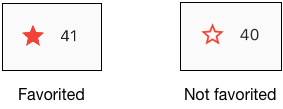
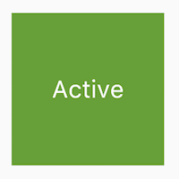
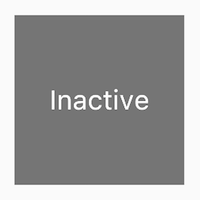


TODO:

* Restore _private variables in tapbox examples.
* Add the following examples to the GitHub repo, and update all links
  * lakes-interactive
  * tapbox-a
  * tapbox-b
  * tapbox-c


## Introduction

How do you modify your app to make it react to user input? In
[Building Layouts for Flutter](https://flutter.io/tutorials/layout/),
we showed how to create the layout for the Lakes app:

 

In this tutorial, you'll add interactivity to the Lakes app.
Specifically, you'll modify the star icon to make it tapable.
When the app first launches, the star is solid red, indicating that this lake
has previously been favorited. The number next to the star indicates that a
total of 41 people have favorited this lake.  After completing this tutorial,
tapping the star removes its favorited status, replacing
the solid star with an outline, and decreasing the count. Tapping
again favorites the lake, drawing a solid star and increasing the count.

The following shows both states.

 

To accomplish this, you'll create a single custom widget that includes both the
star and and the count. Tapping the star changes state for both widgets,
so it works best for the same widget to manage both.

You can find the starting code for the Lakes example here:

* [`lib/main.dart`](https://raw.githubusercontent.com/flutter/website/master/_includes/_code/lakes/main.dart)
* [`pubspec.yaml`](https://raw.githubusercontent.com/flutter/website/master/_includes/_code/lakes/pubspec.yaml)
* [`lakes.jpg`](https://github.com/flutter/website/blob/master/_includes/_code/lakes/images/lake.jpg)

<aside class="alert alert-success" markdown="1">
<i class="fa fa-lightbulb-o"> </i> **Tip:**
If you are new to Flutter, use these steps to prepare for this tutorial:

* [Set up](https://flutter.io/setup/) your environment.
* If you don't have a preferred IDE, we recommend
  [IntelliJ community edition.](https://flutter.io/intellij-setup/) (It's free!)
* Save the files in the list above to your computer.
* [Create your first Flutter
  app.](https://flutter.io/getting-started/#creating-your-first-flutter-app)
* Replace the `lib/main.dart` and `pubspec.yaml` files in your project
  with those provided.
* Create an `images` directory in your project, and add `lakes.jpg`.
* Once you have a connected and enabled device, or you've launched the
  [iOS simulator](/setup/#set-up-the-ios-simulator) (part of the Flutter install),
  you are good to go!
</aside>

### Contents

* [Stateful and stateless widgets](#stateful-stateless)
* [Creating a stateful widget](#creating-stateful-widget)
  * [Step 1: Decide who manages the widget's state](#step-1)
  * [Step 2: Subclass StatefulWidget](#step-2)
  * [Step 3: Subclass the State object](#step-3)
  * [Step 4: Plug the stateful widget into the widget tree](#step-4)
  * [Problems?](#problems)
* [Managing state](#managing-state)
  * [The widget manages its own state](#self-managed)
  * [The parent manages the widget's state](#parent-managed)
  * [A mix-and-match approach](#mix-and-match)
* [Other interactive widgets](#other-interactive-widgets)
  * [Standard widgets](#standard-widgets)
  * [Material widgets](#material-widgets)
* [Resources](#resources)

## Stateful and stateless widgets

<b> <a id="whats-the-point" class="anchor" href="#whats-the-point" aria-hidden="true"></a>What's the point?</b>

* _Stateful_ means that a widget can change because of user interaction or
  other factors, such a updating the UI using information from a service.
* All widgets are either stateful or stateless.
* A stateless widget sits there and looks pretty.
* A State object manages the stateful widget's state.

* You don't need to worry about abandoned widgets&mdash;they are automatically
  collected by the garbage collector (GC).

* All widgets are _immutable_, meaning once created they cannot change.
* When a widget's appearance changes, a new widget is created to reflect the change,
  but the State object allows the widget's state to persist.
* Typically, the State object is managed by the widget itself, the parent widget,
  or some combination.
* The widget's implementation determines who manages the state.

There are two kinds of widgets, stateful and stateless.

A _stateless_ widget
is drawn to the screen and sits there, informing the user,
or making the UI look more attractive.
The user doesn't interact with a stateless widget.
[Icon,](https://docs.flutter.io/flutter/material/Icon-class.html)
[Image,](https://docs.flutter.io/flutter/widgets/Image-class.html) and
[Text](https://docs.flutter.io/flutter/widgets/Text-class.html) are
examples of stateless widgets, which subclass
[StatelessWidget](https://docs.flutter.io/flutter/widgets/StatelessWidget-class.html).

A _stateful_ widget is dynamic. The user can interact with it
(by moving a slider, or checking a box, for example),
or it changes over time (the UI updates as a result of a data feed, for example).
[Checkbox,](https://docs.flutter.io/flutter/material/Checkbox-class.html)
[Radio,](https://docs.flutter.io/flutter/material/Radio-class.html) and
[Slider](https://docs.flutter.io/flutter/material/Slider-class.html) are
examples of stateful widgets, which subclass
[StatefulWidget](https://docs.flutter.io/flutter/widgets/StatefulWidget-class.html).

## Creating a stateful widget

<b> <a id="whats-the-point" class="anchor" href="#whats-the-point" aria-hidden="true"></a>What's the point?</b>

* To create a custom stateful widget, subclass StatefulWidget and State.
* The State object manages the widget's state.
* Calling `setState()` updates the widget's UI.

In this section, you'll create a custom stateful widget.
You'll be replacing two stateless widgets,
the solid red star and the numeric count next to it, with a single custom
stateful widget that manages a row with two children widgets: an IconButton
and Text.

A custom stateful widget requires creating two classes:

1. A subclass of StatefulWidget that defines the widgets and describes how to
   draw them in its `build()` method.
2. A subclass of State that manages state for that widget.

This section shows you how to build a stateful widget, called FavoriteWidget,
for the Lakes app. The first step is choosing who manages the State object.

### Step 1: Decide who manages the widget's state

There are different approaches to managing a widget's state, but in our example
the widget itself, FavoriteWidget, will manage its own state.
Toggling the star is an isolated action that doesn't affect the parent widget
or the rest of the UI, so it makes sense for the widget to handle its state internally.

Learn more about the separation of widget and state,
and how state might be managed, in [Managing state](#managing-state).

### Step 2: Subclass StatefulWidget

The FavoriteWidget subclass only needs to override the `createState`,
which is called when the framework wants to build the widget.
The `createState` function creates an instance of
FavoriteWidgetState, which you'll implement in the next step.

<!-- _code/lakes-interactive/main.dart -->
<!-- skip -->

class FavoriteWidget extends StatefulWidget {
  @override
  FavoriteWidgetState createState() => new FavoriteWidgetState();
}


### Step 3: Subclass the State object

The custom State class stores the mutable information&mdash;the logic and internal
state that can change over the lifetime of the widget. When the app first launches,
the UI displays a solid red star, indicating that the lake has "favorite" status,
and has a total of 41 “likes”. The State object stores this information in the
`isFavorited` and `favoriteCount` variables.

The widget’s `build` method creates a packed row containing a red IconButton,
and Text.  The widget uses
[IconButton,](https://docs.flutter.io/flutter/material/IconButton-class.html)
instead of Icon, because its `onPressed` property defines the callback method
for handling a tap. The `icon` property holds the Icon.

The `toggleFavorite()` method, which is called when the IconButton is pressed,
calls `setState`. Calling `setState` is critical, because this tells
the framework that the widget’s state has changed and the widget
should redraw. The `toggleFavorite` function swaps the UI between
1) a star icon and the number ‘41’, and 2) a star_border icon and the number ‘40’.

<!-- _code/lakes-interactive/main.dart -->
<!-- skip -->

class FavoriteWidgetState extends State<FavoriteWidget> {
  [[highlight]]bool isFavorited = true;[[/highlight]]
  [[highlight]]int favoriteCount = 41;[[/highlight]]

  [[highlight]]void toggleFavorite()[[/highlight]] {
    [[highlight]]setState(()[[/highlight]] {
      // If the lake is currently favorited, unfavorite it.
      if (isFavorited) {
        favoriteCount--;
        isFavorited = false;
        // Otherwise, favorite it.
      } else {
        favoriteCount++;
        isFavorited = true;
      }
    });
  }

  @override
  Widget build(BuildContext context) {
    return new Row(
      mainAxisSize: MainAxisSize.min,
      children: [
        new Container(
          padding: new EdgeInsets.all(0.0),
          child: new IconButton(
            [[highlight]]icon: (isFavorited[[/highlight]]
                [[highlight]]? new Icon(Icons.star)[[/highlight]]
                [[highlight]]: new Icon(Icons.star_border)),[[/highlight]]
            color: Colors.red[500],
            [[highlight]]onPressed: toggleFavorite,[[/highlight]]
          ),
        ),
        new SizedBox(
          width: 18.0,
          child: new Container(
            [[highlight]]child: new Text('$favoriteCount'),[[/highlight]]
          ),
        ),
      ],
    );
  }
}


### Step 4: Plug the stateful widget into the widget tree

Add your custom stateful widget to the widget tree in the app's
build method. First, locate the code that creates the Icon and Text, and delete it:

<!-- _code/lakes/main.dart -->
<!-- skip -->

// ...
[[strike]]new Icon([[/strike]]
  [[strike]]Icons.star,[[/strike]]
  [[strike]]color: Colors.red[500],[[/strike]]
[[strike]]),[[/strike]]
[[strike]]new Text('41')[[/strike]]
// ...


In the same location, create the stateful widget:

<!-- _code/lakes-interactive/main.dart -->
<!-- skip -->

class MyApp extends StatelessWidget {
  @override
  Widget build(BuildContext context) {
    Widget titleSection = new Container(
      // ...
      child: new Row(
        children: [
          new Expanded(
            child: new Column(
              // ...
          ),
          [[highlight]]new FavoriteWidget()[[/highlight]],
        ],
      ),
    );

    return new MaterialApp(
      // ...
    );
  }
}


 That's it! When you hot reload the app, the star icon should now respond to taps.

The rest of this page covers several ways a widget's state can be managed,
and lists other available interactive widgets.

### Problems?

If you can't get your code to run, look in your IDE for possible errors.
[Debugging Flutter Apps](https://flutter.io/debugging/) might help.
If you still can't find the problem,
check your code against the interactive Lakes example on GitHub.

* [`lib/main.dart`](https://raw.githubusercontent.com/flutter/website/master/_includes/_code/lakes/main.dart)
* [`pubspec.yaml`](https://raw.githubusercontent.com/flutter/website/master/_includes/_code/lakes/pubspec.yaml)&mdash;no changes to this file
* [`lakes.jpg`](https://github.com/flutter/website/blob/master/_includes/_code/lakes/images/lake.jpg)&mdash;no changes to this file

[PENDING: once the lakes-interactive example has been added to the GitHub repo,
updated these links.]

## Managing state

<b> <a id="whats-the-point" class="anchor" href="#whats-the-point" aria-hidden="true"></a>What's the point?</b>

* There are different approaches for managing state.
* You, as the widget designer, choose which approach to use.
* If in doubt, start by managing state in the parent widget.

Who manage's the stateful widget's state? The widget itself? The parent widget?
Both? Another object? The answer is... it depends.
There are several valid ways to make your widget interactive.
You, as the widget designer, makes the decision based on how you expect your
widget to be used. Here are the most common ways to manage state:

* [The widget manages its own state](#self-managed)
* [The parent manages the widget's state](#parent-managed)
* [A mix-and-match approach](#mix-and-match)


First, fix TapboxD, add it back to the repo, and then restore this note.
<aside class="alert alert-info" markdown="1">
**Note:** You can also manage state by exporting the state to a model class
that notifies widgets when state changes have occurred. This approach is
particularly useful when you want multiple widgets to listen and respond to the
same state information.

Explaining this approach is beyond the scope of this tutorial,
but you can try it out using the TapboxD example on GitHub.
The only file you need is [lib/main.dart]().
[PENDING: Add a link once it's up on the site.]
</aside>


How do you decide which approach to use?

The general rule of thumb is that the parent widget should manage the
state until it becomes too much of a burden. If there is any state
that isn't particularly relevant to the parent, perhaps offload that to the child widget.
For example, maybw you have a widget that randomly changes colors and the
colors have no semantic meaning&mdash;that state can be offloaded to the stateful
widget itself.
But, usually, if a user interacts with a widget, that state should be exported up
to the parent so the parent can take appropriate action.

It's not unlike designing API: some state is private and useful only
to the implementation, and some state is public.


We'll give examples of the different ways of managing state by creating three simple
examples: TapboxA, TapboxB, and TapboxC.
The examples all work similarly&mdash;each creates a container that, when tapped,
toggles between a green or grey box.
The `active` boolean determines the color: green for active or grey for inactive.

&nbsp;&nbsp;&nbsp;&nbsp;&nbsp;&nbsp;
 

These examples use
[GestureDetector](https://docs.flutter.io/flutter/widgets/GestureDetector-class.html)
to capture activity on the Container.

### The widget manages its own state

Sometimes it makes the most sense for the widget to manage its state internally.
For example, [ListView](https://docs.flutter.io/flutter/widgets/ListView-class.html)
automatically scrolls when its content exceeds the render box. Most
developers using ListView don't want to manage ListView's
scrolling behavior, so ListView itself manages its scroll offset.

The TapboxAState class:

* Manages state for TapboxA.
* Defines the `active` boolean which determines the box's current color.
* Defines the `handleTap()` function, which updates `active` when the box is tapped
  and calls the `setState()` function to update the UI.
* Implements all of the interactive behavior for the widget.

<!-- _code/lakes-interactive/main.dart -->
<!-- skip -->

class TapboxA extends StatefulWidget {
  TapboxA({Key key}) : super(key: key);

  TapboxAState createState() => new TapboxAState();
}

class TapboxAState extends State<TapboxA> {
  bool active = false;

  void handleTap() {
    setState(() {
      active = !active;
    });
  }

  Widget build(BuildContext context) {
    return new GestureDetector(
      onTap: handleTap,
      child: new Container(
        child: new Center(
          child: new Text(active ? 'Active' : 'Inactive',
              style: new TextStyle(fontSize: 32.0, color: Colors.white)),
        ),
        width: 200.0,
        height: 200.0,
        decoration: new BoxDecoration(
          backgroundColor: active ? Colors.lightGreen[700] : Colors.grey[600],
        ),
      ),
    );
  }
}

class MyApp extends StatelessWidget {
  @override
  Widget build(BuildContext context) {
    return new MaterialApp(
      title: 'Flutter Demo',
      theme: new ThemeData(
        primarySwatch: Colors.blue,
      ),
      home: new Scaffold(
        appBar: new AppBar(
          title: new Text('Flutter Demo'),
        ),
        body: new Center(
          child: new TapboxA(),
        ),
      ),
    );
  }
}


**Dart code:**  [`lib/main.dart`]()

[PENDING: once the tapbox-a example has been added to the GitHub repo,
updated this link.]

### The parent widget manages the widget's state

Sometimes, it makes the most sense for the parent widget to manage the state
and tell its child widget when to update. For example,
[IconButton](https://docs.flutter.io/flutter/material/IconButton-class.html)
allows you to treat an icon as a tappable button.
IconButton is a stateless widget because the designers decided that
the parent widget needs to know whether the button has been tapped,
so it can take appropriate action.

In the following example, TapboxB exports its state to its parent
through a callback. Because TapboxB doesn't manage any state, it
subclasses StatelessWidget.

The ParentWidgetState class:

* Manages the `active` state for TapboxB.
* Implements `handleTapboxChanged()`, the method called when the box is tapped.
* Calls `setState` to update the UI.

The TapboxB class:

* Extends StatelessWidget because all state is handled by its parent.
* When a tap is detected, that information is passed up to the parent.

<!-- _code/tapbox-b/main.dart -->
<!-- skip -->

//------------------------ ParentWidget --------------------------------

class ParentWidget extends StatefulWidget {
  @override
  ParentWidgetState createState() => new ParentWidgetState();
}

class ParentWidgetState extends State<ParentWidget> {
  bool active = false;

  void handleTapboxChanged(bool newValue) {
    setState(() {
      active = newValue;
    });
  }

  @override
  Widget build(BuildContext context) {
    return new Container(
      child: new TapboxB(
        active: active,
        onChanged: handleTapboxChanged,
      ),
    );
  }
}

//------------------------- TapboxB ----------------------------------

class TapboxB extends StatelessWidget {
  TapboxB({Key key, this.active: false, @required this.onChanged})
      : super(key: key);

  final bool active;
  final ValueChanged<bool> onChanged;

  void handleTap() {
    onChanged(!active);
  }

  Widget build(BuildContext context) {
    return new GestureDetector(
      onTap: handleTap,
      child: new Container(
        child: new Center(
          child: new Text(active ? 'Active' : 'Inactive',
              style: new TextStyle(fontSize: 32.0, color: Colors.white)),
        ),
        width: 200.0,
        height: 200.0,
        decoration: new BoxDecoration(
          backgroundColor: active ? Colors.lightGreen[700] : Colors.grey[600],
        ),
      ),
    );
  }
}


**Dart code:**  [`lib/main.dart`]()

[PENDING: once the tapbox-b example has been added to the GitHub repo,
updated this link.]

<aside class="alert alert-success" markdown="1">
<i class="fa fa-lightbulb-o"> </i> **Tip:**
When creating API, consider using the `@required` annotation for
any parameters that your code relies on.
To use `@required`, import the meta library:

<pre>
import package: meta/meta.dart;
</pre>
</aside>

### A mix-and-match approach

For some widgets, a mix-and-match approach makes the most sense.
In this scenario, the stateful widget manages some of the state,
and the parent widget manages other aspects of the state.

In the TapboxC example, on tap down, a dark green border appears around the box.
On tap up, the border disappears and the box's color changes.
TapboxC exports its `active` state to its parent but
manages its color state internally.

The ParentWidgetState class

* Manages the `active` state.
* Implements `handleTapboxChanged()`, the method called when the box is tapped.
* Calls `setState` to update the UI when a tap occurs and the `active` state changes.

The TapboxCState class

* Manages the `highlight` state.
* The GestureDetector listens to all tap events.
  As the user taps down, it adds the highlight (implemented as a dark green border).
  As the user releases the tape, removes the highlight.
* Calls `setState` to update the UI on tap down, tap up, or tap cancel, and
  the `highlight` state changes.
* On a tap event, passes that state change to the parent widget to take appropriate
  action.
* Uses the [config](https://docs.flutter.io/flutter/widgets/State/config.html)
  property to access state from the stateful widget.

<!-- _code/tapbox-c/main.dart -->
<!-- skip -->

//---------------------------- ParentWidget ----------------------------

class ParentWidget extends StatefulWidget {
  @override
  ParentWidgetState createState() => new ParentWidgetState();
}

class ParentWidgetState extends State<ParentWidget> {
  bool active = false;

  void handleTapboxChanged(bool newValue) {
    setState(() {
      active = newValue;
    });
  }

  @override
  Widget build(BuildContext context) {
    return new Container(
      child: new TapboxC(
        active: active,
        onChanged: handleTapboxChanged,
      ),
    );
  }
}

//----------------------------- TapboxC ------------------------------

class TapboxC extends StatefulWidget {
  TapboxC({Key key, this.active: false, @required this.onChanged})
      : super(key: key);

  final bool active;
  final ValueChanged<bool> onChanged;

  TapboxCState createState() => new TapboxCState();
}

class TapboxCState extends State<TapboxC> {
  bool highlight = false;

  void handleTapDown(TapDownDetails details) {
    setState(() {
      highlight = true;
    });
  }

  void handleTapUp(TapUpDetails details) {
    setState(() {
      highlight = false;
    });
  }

  void handleTapCancel() {
    setState(() {
      highlight = false;
    });
  }

  void handleTap() {
    config.onChanged(!config.active);
  }

  Widget build(BuildContext context) {
    // This example adds a green border on tap down.
    // On tap up, the square changes to the opposite state.
    return new GestureDetector(
      onTapDown: handleTapDown, // Handle the tap events in the order that
      onTapUp: handleTapUp, // they occur: down, up, tap, cancel
      onTap: handleTap,
      onTapCancel: handleTapCancel,
      child: new Container(
        child: new Center(
          child: new Text(config.active ? 'Active' : 'Inactive',
              style: new TextStyle(fontSize: 32.0, color: Colors.white)),
        ),
        width: 200.0,
        height: 200.0,
        decoration: new BoxDecoration(
          backgroundColor:
              config.active ? Colors.lightGreen[700] : Colors.grey[600],
          border: highlight
              ? new Border.all(
                  color: Colors.teal[700],
                  width: 10.0,
                )
              : null,
        ),
      ),
    );
  }
}


Another implementation might have flipped the two around and exported the highlight
state to the parent while keeping the value state internal,
but if you asked someone to use that tap box, they'd probably complain
that it doesn't make much sense.  The developer cares about changing a boolean
value used to update the UI.
The developer doesn't care about how the highlighting is managed,
and prefers that the tap box handles those details.

**Dart code:**  [`lib/main.dart`]()

[PENDING: once the tapbox-c example has been added to the GitHub repo,
updated this link.]

## Other interactive widgets

Flutter offers a variety of buttons and similar interactive widgets.
Most of these widgets implement the [material design
guidelines,](https://material.io/guidelines/) which define a set of
components with an opinionated UI.

If you prefer, you can use
[GestureDetector](https://docs.flutter.io/flutter/widgets/GestureDetector-class.html)
to build interactivity into any custom widget. You can find examples of
GestureDetector in [Managing state](#managing-state), and in the
[Flutter
Gallery](https://github.com/flutter/flutter/tree/master/examples/flutter_gallery).

<aside class="alert alert-info" markdown="1">
**Note:**
Flutter also provides a set of iOS-style widgets called
[Cupertino,](https://docs.flutter.io/flutter/cupertino/cupertino-library.html).
</aside>

When you need interactivity,
it's easiest to use one of the prefabricated widgets. Here's a partial list:

### Standard widgets:

* [Form](https://docs.flutter.io/flutter/widgets/Form-class.html)
* [FormField](https://docs.flutter.io/flutter/widgets/FormField-class.html)

### Material widgets:

* [Checkbox](https://docs.flutter.io/flutter/material/Checkbox-class.html)
* [DropdownButton](https://docs.flutter.io/flutter/material/DropdownButton-class.html)
* [FlatButton](https://docs.flutter.io/flutter/material/FlatButton-class.html)
* [FloatingActionButton](https://docs.flutter.io/flutter/material/FloatingActionButton-class.html)
* [IconButton](https://docs.flutter.io/flutter/material/IconButton-class.html)
* [InputField](https://docs.flutter.io/flutter/material/InputField-class.html)
* [Radio](https://docs.flutter.io/flutter/material/Radio-class.html)
* [RaisedButton](https://docs.flutter.io/flutter/material/RaisedButton-class.html)
* [Slider](https://docs.flutter.io/flutter/material/Slider-class.html)
* [Switch](https://docs.flutter.io/flutter/material/Switch-class.html)
* [TextField](https://docs.flutter.io/flutter/material/TextField-class.html)

## Resources

The following resources may help when adding interactivity to your app.

* [Handling gestures](https://flutter.io/widgets-intro/#handling-gestures),
  a section in [A Tour of the Flutter Widget
  Framework](https://flutter.io/widgets-intro/) 
  How to create a button and make it respond to input.
* [Gestures in Flutter](https://flutter.io/gestures/) 
  A description of Flutter's gesture mechanism.
* [Flutter API documentation](https://docs.flutter.io/) 
  Reference documentation for all of the Flutter libraries.
* [Flutter
  Gallery](https://github.com/flutter/flutter/tree/master/examples/flutter_gallery) 
  Demo app showcasing many material design widgets and other Flutter features.
* [Flutter's Layered
   Design (video)](https://www.youtube.com/watch?v=dkyY9WCGMi0) 
   This video includes information about state and stateless widgets.
   Presented by Google engineer, Ian Hickson.

