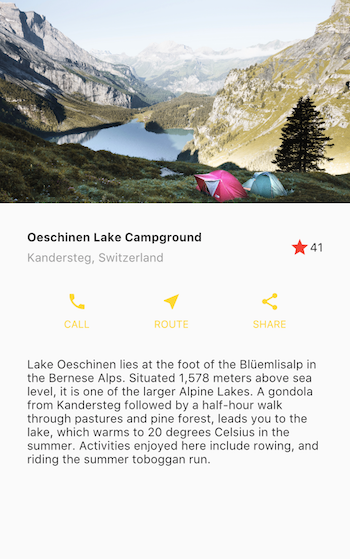

## Introduction

This is a guide to building layouts in Flutter.
We start by explaining Flutter's approach to layout, and
show you how to place single widgets on the screen.
We'll discuss how to to lay widgets out horizontally and vertically,
and then cover some of the most common layout widgets.
Finally, we'll walk through the process of creating a layout for this app:

### Contents

* [Flutter's approach to layout](#approach)
* [Lay out a widget](#lay-out-a-widget)
* [Lay out multiple widgets vertically and horizontally](#rows-and-columns)
* [Common layout widgets](#common-layout-widgets)
* [Building a layout](#building)
* [Resources](#resources)

## Flutter's approach to layout

<b> <a id="whats-the-point" class="anchor" href="#whats-the-point" aria-hidden="true"></a>What's the point?</b>

* Widgets are classes used to build UIs.
* Widgets are used for both layout and UI elements.
* Compose simple widgets to build complex widgets.

The core of Flutter's layout mechanism is widgets. In Flutter, most
everything is a widget&mdash;even layout models are widgets.
The images, icons, and text that you see in a Flutter app  are all widgets.
But things you don't see are also widgets, such as the rows, columns,
and grids that arrange, constrain, and align the visible widgets.

You create a layout by composing widgets to build more complex widgets.
For example, the screenshot on the left shows 3 icons with a label under
each one:

&nbsp;&nbsp;&nbsp;&nbsp;&nbsp;&nbsp;


<ul class="col2">
<li>

</li>
<li>

</li>
</ul>


The screenshot on the right displays the visual layout, showing a row of
3 columns where each column contains an icon and a label.

<aside class="alert alert-info" markdown="1">
**Note:** Most of the screenshots in this tutorial are displayed with
`debugPaintSizeEnabled` set to true so you can see the visual layout.
For more information, see
[Visual debugging](https://flutter.io/debugging/#visual-debugging), a section in
[Debugging Flutter Apps](https://flutter.io/debugging/#visual-debugging).
</aside>

Flutter's widget tree for this UI is as follows:

Most of this should look as you might expect, but you might be wondering
about the Containers (shown in pink). Container is a widget that allows
you to customize its child widget. Use a Container when you want to
add padding, margins, borders, or background color, to name some of its
capabilities.

In this example, each Text widget is placed in a Container to add margins.
The entire Row is also placed in a Container to add padding around the row.

The rest of the UI in this example is controlled by properties.
Set an Icon's color using its `color` property.
Use Text's `style` property to set the font, its color, weight, and so on.
Columns and Rows have properties that allow you to specify how their
children are aligned vertically or horizontally, and how much space
the children should occupy.

## Lay out a widget

<b> <a id="whats-the-point" class="anchor" href="#whats-the-point" aria-hidden="true"></a>What's the point?</b>

* Create an [Image](https://docs.flutter.io/flutter/widgets/Image-class.html),
  [Icon](https://docs.flutter.io/flutter/material/Icon-class.html),
  or [Text](https://docs.flutter.io/flutter/widgets/Text-class.html) widget.
* Add it to a layout widget, such as
  [Center](https://docs.flutter.io/flutter/widgets/Center-class.html),
  [Align](https://docs.flutter.io/flutter/widgets/Align-class.html),
  [SizedBox](https://docs.flutter.io/flutter/widgets/SizedBox-class.html),
  or [ListView](https://docs.flutter.io/flutter/widgets/ListView-class.html),
  to name a few.
* Add the layout widget to the root of the widget tree.

How do you layout a single widget in Flutter?
This page shows how to create a simple widget and display it on screen.
It also shows the entire code for a simple Hello World app.

In Flutter,
it takes only a few steps to put text, an icon, or an image on the screen.

<ol markdown="1">

<li markdown="1"> Select a layout widget to hold the object. 
    Choose from a variety of [layout widgets](/widgets/) based
    on how you want to align or constrain the visible widget,
    as these characteristics are typically passed on to the
    contained widget.
    This example uses Center which centers its content
    horizontally and vertically.
</li>

<li markdown="1"> Create a widget to hold the visible object. 

<aside class="alert alert-info" markdown="1">
**Note:**
Flutter apps are written in the [Dart language](https://www.dartlang.org/).
If you know Java or similar object-oriented coding languages, Dart
will feel very familiar. If not, you might try
[DartPad](https://www.dartlang.org/tools/dartpad), an interactive Dart
playground you can use from any browser. The
[Language Tour](https://www.dartlang.org/guides/language) provides an
overview of the features of the Dart Language.
</aside>

For example, create a Text widget:

<!-- skip -->

new Text('Hello World', style: new TextStyle(fontSize: 32.0))


Create an Image widget:

<!-- skip -->

new Image.asset('images/myPic.jpg', fit: ImageFit.cover)


Create an Icon widget:

<!-- skip -->

new Icon(Icons.star, color: Colors.red[500])


</li>

<li markdown="1"> Add the visible widget to the layout widget. 
    All layout widgets have a `child` property if they take a single
    child (for example, Center or Container),
    or a `children` property if they take a list of widgets (for example,
    Row, Column, ListView, or Stack).

Add the Text widget to the Center widget:

<!-- skip -->

new Center(
  child: new Text('Hello World', style: new TextStyle(fontSize: 32.0))


</li>

<li markdown="1"> Add the layout widget to the page. 
   A Flutter app is, itself, a widget and most widgets have a
   [build()](https://docs.flutter.io/flutter/widgets/StatelessWidget/build.html)
   method. Declaring the widget in the app's build method displays the widget
   on the device.

   For a Material App, you can add the Center widget directly to the
  `body` property for the home page.


class _MyHomePageState extends State<MyHomePage> {
  @override
  Widget build(BuildContext context) {
    return new Scaffold(
      appBar: new AppBar(
        title: new Text(config.title),
      ),
      /**highlight*/body: new Center(/*-highlight*/
        /**highlight*/child: new Text('Hello World', style: new TextStyle(fontSize: 32.0)),/*-highlight*/
      ),
    );
  }
}


<aside class="alert alert-info" markdown="1">
**Note:**
The material library implements widgets that follow
[material design principles](https://material.io/guidelines/).
When designing your UI, you can exclusively use widgets from the standard
[widgets library](https://docs.flutter.io/flutter/widgets/widgets-library.html),
or you can use widgets from the [material
library](https://docs.flutter.io/flutter/material/material-library.html).
You can mix widgets from both libraries (resulting in a material app),
you can customize existing widgets,
or you can build your own set of custom widgets.
</aside>

For a non-material app, you can add the Center widget to the app's `build`
method:



Note that the non-material app doesn't include an AppBar, title,
or background color. If you want these features in a non-material app,
you have to build them yourself.

</li>

</ol>

That's it! When you run the Material version of the app, you should see:

Here's the Dart code for the entire material app:


import 'package:flutter/material.dart';

void main() {
  runApp(new MyApp());
}

class MyApp extends StatelessWidget {
  @override
  Widget build(BuildContext context) {
    return new MaterialApp(
      title: 'Flutter Demo',
      theme: new ThemeData(
        primarySwatch: Colors.blue,
      ),
      home: new MyHomePage(title: 'Flutter Demo Home Page'),
    );
  }
}

class MyHomePage extends StatefulWidget {
  MyHomePage({Key key, this.title}) : super(key: key);

  final String title;

  @override
  _MyHomePageState createState() => new _MyHomePageState();
}

class _MyHomePageState extends State<MyHomePage> {
  @override
  Widget build(BuildContext context) {
    return new Scaffold(
      appBar: new AppBar(
        title: new Text(config.title),
      ),
      body: new Center(
        child: new Text('Hello World'),
      ),
    );
  }
}


<aside class="alert alert-success" markdown="1">
<i class="fa fa-lightbulb-o"> </i> **Tip:**
For a faster development experience, try Flutter's hot reload feature.
Hot reload allows you to modify your code and see the changes without
fully restarting the app. The Flutter plugins for IntelliJ and Atom support hot
reload, or you can trigger it when running apps from the command line.
For more information, see [Hot Reloads vs. Full Application
Restarts](https://flutter.io/intellij-ide/#hot-reloads-vs-full-application-restarts).
</aside>

## Lay out multiple widgets vertically and horizontally

One of the most common layout patterns is to arrange widgets vertically
or horizontally. You can use a Row widget to arrange widgets vertically,
and a Column widget to arrange widgets horizontally.

<b> <a id="whats-the-point" class="anchor" href="#whats-the-point" aria-hidden="true"></a>What's the point?</b>

* Row and Column are two of the most commonly used layout patterns.
* Row and Column each take a list of child widgets.
* A child widget can itself be a Row, Column, or other complex widget.
* You can specify how a Row or Column aligns its children, both vertically
  and horizontally.
* You can stretch or constrain specific child widgets.
* You can specify how child widgets use the Row's or Column's available space.

### Contents

* [Aligning widgets](#alignment)
* [Sizing widgets](#sizing)
* [Packing widgets](#packing)
* [Nesting rows and columns](#nesting)

To create a row or column in Flutter, you add a list of children widgets to a
[Row](https://docs.flutter.io/flutter/widgets/Row-class.html) or
[Column](https://docs.flutter.io/flutter/widgets/Column-class.html) widget.
In turn, each child can itself be a row or column, and so on.
The following example shows how it is possible to nest rows or columns inside
of rows or columns. Note how the "PREP  COOK  FEEDS" info box in the lower
left is a row of 3 columns, inside a column, inside a row.
You'll see code for this in [Nesting rows and columns](#nesting).

<aside class="alert alert-info" markdown="1">
**Note:** Row and Column are basic primitive widgets for horizontal
and vertical lay outs&mdash;these low-level widgets allow for maximum
customization. Flutter also offers specialized, higher level widgets
that might be sufficient for your needs. For example, instead of Row
you might prefer
[ListItem](https://docs.flutter.io/flutter/material/ListItem-class.html),
an easy-to-use widget with properties for leading and trailing icons,
and up to 3 lines of text.  Instead of Column, you might prefer
[ListView](https://docs.flutter.io/flutter/widgets/ListView-class.html),
a column-like layout that automatically scrolls if its content is too long
to fit the available space.  For more information,
see [Common layout widgets](#common-layout-widgets).
</aside>

### Aligning widgets

You control how a row or column aligns its children using the
`mainAxisAlignment` and `crossAxisAlignment` properties.
For a row, the main axis runs horizontally and the cross axis runs
vertically. For a column, the main axis runs vertically and the cross
axis runs horizontally.

 

 

 

The [MainAxisAlignment](https://docs.flutter.io/flutter/rendering/MainAxisAlignment-class.html)
and [CrossAxisAlignment](https://docs.flutter.io/flutter/rendering/CrossAxisAlignment-class.html)
classes offer a variety of constants for controlling alignment.

In the following example, each of the 3 images is 100 pixels wide.
The render box (in this case, the entire screen) is more than 300 pixels wide,
so setting the main axis alignment to `spaceEvenly` divides the free
horizontal space evenly between, before, and after each image.

 



 

 

Columns work the same way as rows. The following example shows a column
of 3 images, each is 100 pixels high. The height of the render box
(in this case, the entire screen) is more than 300 pixels, so
setting the main axis alignment to `spaceEvenly` divides the free vertical
space evenly between, above, and below each image.

 



 

 

<aside class="alert alert-info" markdown="1">
**Note:**
When a layout is too large to fit the device, a red strip appears along the
affected edge. For example, the row in the following screenshot is too
wide for the device's screen:

Widgets can be sized to fit within a row or column by using an Expanded widget,
which is described in the [Sizing widgets](#sizing) section below.
</aside>

### Sizing widgets

Perhaps you want a widget to occupy twice as much space as its siblings.
You can place the child of a row or column in an
[Expanded](https://docs.flutter.io/flutter/widgets/Expanded-class.html)
widget to control widget sizing along the main axis.
The Expanded widget has a `flex` property, an integer that determines
the flex factor for a widget. The default flex factor for an Expanded
widget is 1.

For example, to create a row of three widgets where the middle widget is twice
as wide as the other two widgets, set the flex factor on the middle widget to 2:

 



 

 

To fix the example in the previous section where the row of 3 images was
too wide for its render box, and resulted in the red strip,
wrap each widget with an Expanded widget.
By default, each widget has a flex factor of 1, assigning one-third of
the row to each widget.

 



 

 

### Packing widgets

By default, a row or column occupies as much space along its main axis
as possible, but if you want to pack the children closely together,
set its `mainAxisSize` to `MainAxisSize.min`. You'll see an example
of his property used for packing the star icons in the
[Nesting rows and columns](#nesting) section below.

### Nesting rows and columns

The layout framework allows you to nest rows and columns inside of rows
and columns as deeply as you need. Let's look the code for the outlined section
of the following layout:

The outlined section is implemented as two rows. The ratings row contains
five stars and the number of reviews. The icons row contains three
columns of icons and text.

The widget tree for the ratings row:

The `rating` variable creates a row containing text, and a smaller row of
5 star icons.



<aside class="alert alert-success" markdown="1">
<i class="fa fa-lightbulb-o"> </i> **Tip:**
To minimize the visual confusion that can result from heavily nested layout
code, implement pieces of the UI in variables and functions.
</aside>

The icons row, below the ratings row, contains 3 columns; each column contains
an icon and two lines of text, as you can see in its widget tree:

The `iconList` variable defines the icons row:



The `leftColumn` variable contains the ratings and icons rows, as well as
the title and text that describes the Pavlova:



Finally, the UI is constructed as a row containing the left column and the
main image. The left column is placed in a Container to constrain its
width to 440 pixels.



## Common layout widgets

Flutter has a rich library of layout widgets, but here a few of those most
commonly used. The intent is to get you up and running as quickly as possible,
rather than overwhelm you with a complete list.  For information on other
available widgets, refer to the [Widget Overview](https://flutter.io/widgets/),
or use the Search box in the the [API reference docs](https://docs.flutter.io/).
Also, the widget pages in the API docs often make suggestions
about similar widgets that might better suit your needs.

The following widgets fall into two categories: standard widgets from the
[widgets library,](https://docs.flutter.io/flutter/widgets/widgets-library.html)
and specialized widgets from the
[material library](https://docs.flutter.io/flutter/material/material-library.html).
Any app can use the widgets library but only material apps can use the
material library.

### Standard widgets

* [Container](#container)
: Add padding, margins, borders, background color,
  or other decorations to a widget.
* [GridView](#gridview)
: Lay widgets out as a scrollable grid.
* [ListView](#listview)
: Lay widgets out as a scrollable list.
* [Stack](#stack)
: Overlap a widget on top of another.

### Material widgets

* [Card](#card)
: Organize related info into a box with rounded corners
  and a drop shadow.

* [ListItem](#listitem)
: A specialized row that supports leading and trailing icons, and up to
  three lines of text.

### Container

Many layouts make liberal use of Containers to separate widgets with padding,
or to add borders or margins. You can change the device's background by
placing the entire layout into a Container and changing its background color
or image.

 

#### Container summary:

* Add padding, margins, borders
* Change background color or image
* Contains a single child widget, but that child can be a Row, Column,
  or even the root of a widget tree

 

 

#### Container examples:

In addition to the example below,
many examples in this tutorial use Container. You can also find more
Container examples in the [Flutter
Gallery](https://github.com/flutter/flutter/tree/master/examples/flutter_gallery).

 

This layout consists of a column of two rows, each containing 2 images.
Each image uses a Container to add a rounded grey border and margins.
The Column, which contains the rows of images,
uses a Container to change the background color to a more
translucent grey.

 

 



### GridView

Use [GridView](https://docs.flutter.io/flutter/widgets/GridView-class.html)
to lay widgets out as a two-dimensional list. GridView provides two
pre-fabricated lists, or you can build your own custom grid.
When a GridView detects that its contents are too long to fit the render box,
it automatically scrolls.

#### GridView summary:

* Lays widgets out in a grid
* Detects when the column content exceeds the render box and automatically
  provides scrolling
* Build your own custom grid, or use one of the provided grids:
  * `GridView.count` allows you to specify the number of columns
  * `GridView.extent` allows you to specify the maximum pixel width of a tile

* Use `MediaQuery.of(context).orientation` to create a grid that changes
  its layout depending on whether the device is in landscape or portrait mode.


<aside class="alert alert-info" markdown="1">
**Note:** When displaying a two-dimensional list where it's important which
row and column a cell occupies (for example,
it's the entry in the "calorie" column for the "avocado" row), use
[Table](https://docs.flutter.io/flutter/widgets/Table-class.html) or
[DataTable](https://docs.flutter.io/flutter/material/DataTable-class.html).
</aside>

#### GridView examples:

 

Uses `GridView.extent` to create a grid with tiles a maximum 200 pixels wide. 
**Code:** See below.

 

Uses `GridView.count` to create a grid that's 2 tiles wide in portrait mode,
and 3 tiles wide in landscape mode. The titles are created by setting the
`footer` property for each GridTile. 
**Code:** [grid_list_demo.dart](https://github.com/flutter/flutter/blob/master/examples/flutter_gallery/lib/demo/grid_list_demo.dart)
from the [Flutter
Gallery](https://github.com/flutter/flutter/tree/master/examples/flutter_gallery)

 



### ListView

[ListView](https://docs.flutter.io/flutter/widgets/ListView-class.html),
a column-like widget, automatically provides scrolling when
its content is too long for its render box.

#### ListView summary:

* A specialized Column for organizing a list of boxes
* Can be laid out horizontally or vertically
* Detects when its content won't fit and provides scrolling
* Less configurable than Column, but easier to use and supports scrolling

#### ListView examples:

 

Uses ListView to display a list of businesses using ListItems.
A Divider separates the theaters from the restaurants. 
**Code:** See below.

 

Uses ListView to display the
[Colors](https://docs.flutter.io/flutter/material/Colors-class.html)
from the
[material design palette](https://material.io/guidelines/style/color.html)
for a particular color family. 
**Code:** [colors_demo.dart](https://github.com/flutter/flutter/blob/master/examples/flutter_gallery/lib/demo/colors_demo.dart)
from the [Flutter
Gallery](https://github.com/flutter/flutter/tree/master/examples/flutter_gallery)

 





### Stack

Use [Stack](https://docs.flutter.io/flutter/widgets/Stack-class.html)
to arrange widgets on top of a base widget&mdash;often an image.
The widgets can completely or partially overlap the base widget.

#### Stack summary:

* Use for widgets that overlap another widget
* The first widget in the list of children is the base widget;
  subsequent children are overlaid on top of that base widget
* A Stack's content can't scroll
* You can choose to clip children that exceed the render box

#### Stack examples:

 

Uses Stack to overlay a Container (that displays its Text on a translucent
black background) on top of a Circle Avatar.
The Stack offsets the text using the `alignment` property and
FractionalOffsets. 
**Code:** See below.

 

Uses Stack to overlay a gradient to the top of the image. The gradient
ensures that the toolbar's icons are distinct against the image. 
**Code:** [contacts_demo.dart](https://github.com/flutter/flutter/blob/master/examples/flutter_gallery/lib/demo/contacts_demo.dart)
from the [Flutter
Gallery](https://github.com/flutter/flutter/tree/master/examples/flutter_gallery)

 



### Card

A Card, from the material library, contains related nuggets of information
and can be composed from most any widget, but is often used with ListItem.
Card has a single child, but its child can be a column, row, list, grid,
or other widget that supports multiple children. By default, Card shrinks
to 0 by 0 pixels. You can use
[SizedBox](https://docs.flutter.io/flutter/widgets/SizedBox-class.html) to
constrain the size of a card.

In Flutter, a Card features slightly rounded corners
and a drop shadow, giving it a 3D effect.
Changing a Card's `elevation`
property allows you to control the drop shadow effect.
Setting the elevation to 24, for example, visually lifts the Card further
from the surface and causes the shadow to become more dispersed.
For a list of supported elevation values, see
[Elevation and
Shadows](https://material.io/guidelines/material-design/elevation-shadows.html)
in the [material guidelines](https://material.io/guidelines/).
Specifying an unsupported value disables the drop shadow entirely.

#### Card summary:

* Implements a [material design
  card](https://material.io/guidelines/components/cards.html)
* Used for presenting related nuggets of information
* Accepts a single child, but that child can be a Row, Column, or other
  widget that holds a list of children
* Displayed with rounded corners and a drop shadow
* A Card's content can't scroll
* From the material library

#### Card examples:

 

Card containing 3 ListItems. A Divider separates the first and second ListItem.
The icons are from the list of supported
[Icons](https://docs.flutter.io/flutter/material/Icons-class.html).

**Code:** below

 

A Card containing an image and text. 
**Code:** [cards_demo.dart](https://github.com/flutter/flutter/blob/master/examples/flutter_gallery/lib/demo/cards_demo.dart)
from the [Flutter
Gallery](https://github.com/flutter/flutter/tree/master/examples/flutter_gallery)

 



### ListItem

Use
ListItem, a specialized row widget from the material library, for an easy
way to create a row containing up to 3 lines of text and optional leading
and trailing icons. ListItem is most commonly used in Card or ListView,
but can be used elsewhere.

#### ListItem summary:

* A specialized row that contains up to 3 lines of text and optional icons
* Less configurable than Row, but easier to use
* From the material library

#### ListItem examples:

 

A Card containing 3 ListItems. 
**Code:** See [Card examples](#card-examples).

 

Uses ListItem to list 3 drop down button types. 
**Code:** [buttons_demo.dart](https://github.com/flutter/flutter/blob/master/examples/flutter_gallery/lib/demo/buttons_demo.dart)
from the [Flutter
Gallery](https://github.com/flutter/flutter/tree/master/examples/flutter_gallery)

 

## Building a layout

The previous sections describe Flutter's approach to creating a layout.
How do you use this knowledge to build an entire layout?
Let's walk through the layout for the following screenshot:

### Contents

* [Step 1: Diagram the layout](#step-1)
* [Step 2: Implement the title row](#step-2)
* [Step 3: Implement the button row](#step-3)
* [Step 4: Implement the text section](#step-4)
* [Step 5: Implement the image section](#step-5)
* [Step 6: Put it together](#step-6)

### Step 1: Diagram the layout

The first step is to break the layout down to its basic elements:

* Identify the rows and columns.
* Does the layout include a grid?
* Overlapping elements?
* Tabs?
* Notice areas that require alignment, padding, or borders.

First, identify the larger elements. In this example, four elements are
arranged as a Column: an image, two rows, and a block of text.

Next, diagram each row. The first row, which we call the "Title
Section", has 3 children: 1) a column of text, 2) a Star icon,
and 3) a number. Its first child, the column, contains 2 lines of text.
That first column takes a lot of space, so it must be wrapped in an
Expanded widget.

The second row, which we call the "Button Section", also has
3 children&mdash;each child is a column that contains an Icon and text.

Once the layout has been diagrammed, it's easiest to take a bottom up
approach to implementing it. In order to minimize the visual
confusion of deeply nested layout code, place some of the implementation
in variables and functions.

### Step 2: Implement the title row

First, let's build the left column in the title section. The Column is
placed inside an Expanded widget to stretch it to use all remaining free
space in the row. Setting the `crossAxisAlignment` property to
`CrossAxisAlignment.start` positions the column to the beginning of the row.
The first row of text is placed inside a Container to add padding and the
text is styled to use a bold font weight. The second child in the Column,
also text, is styled to be painted in grey.



The last two items in the title row are a star icon, painted red, and
the text, '41'.



The entire row is placed in a Container and is given 32 pixels of padding to
each edge.  The `titleSection` variable builds the entire row:



### Step 3: Implement the button row

The button section contains 3 columns that use the same layout&mdash;an
icon over a row of text. Everything in this row is painted in yellow and
the columns are evenly spaced. Since the code for building each row would
be almost identical, it's most efficient to build each column
using a function. The `_buildButtonColumn` function takes an Icon and
the Text and returns a Column.



The icon, painted in yellow, is added directly to the column. The
text is placed into a Container to add padding to the top of the text,
separating it from the icon.

The row that contains these columns is built by calling the function and
passing the [Icon](https://docs.flutter.io/flutter/material/Icons-class.html)
and text specific to that column. The columns are aligned along the
main axis using
`MainAxisAlignment.spaceEvenly` to arrange the free space evenly before, between,
and after each column.



### Step 4: Implement the text section

The text section is fairly wordy, so it's also defined as a variable.
The text is placed in a Container in order to add 32 pixels of padding on
each edge. The `softwrap` property indicates whether the text should break
on soft line breaks, such as periods or commas.



### Step 5: Implement the image section

Three of the four Column elements are now complete, leaving only the image.
You can grab an image off the net using `Image.network`. This image is
[available
online](https://images.unsplash.com/photo-1471115853179-bb1d604434e0?dpr=1&amp;auto=format&amp;fit=crop&amp;w=767&amp;h=583&amp;q=80&amp;cs=tinysrgb&amp;crop=)
under the Creative Commons license, however it's quite large and slow to fetch.
For this example, we copied the image to an `images` directory in the Flutter
package, sized it down, and listed it in the pubspec file. Once properly
configured, you can access images in your package using `Image.asset`.
For more information, see
[Adding Assets and Images in Flutter](/assets-and-images).



### Step 6: Put it together

The final step assembles the pieces together. At this point, you can tweak
the layout as needed.  Here is the final Column:



You can view the Dart code for this example in
[lib/main.dart](/tutorials/layout/main.dart).

[PENDING: Once the code is in the repo, link to this file on GitHub.]

## Resources

The following resources will help when writing layout code.

* [Widget Overview](/widgets) 
  Describes many of the widgets available in Flutter.
* [HTML/CSS Analogs in Flutter](/web-analogs) 
  For those familiar with web programming, this page maps HTML/CSS functionality
  to Flutter features.
* [Flutter
  Gallery](https://github.com/flutter/flutter/tree/master/examples/flutter_gallery) 
  Demo app showcasing many material design widgets and other Flutter features.
* [Flutter API documentation](https://docs.flutter.io/) 
  Reference documentation for all of the Flutter libraries.
* [Dealing with Box Constraints in Flutter](/layout) 
  Discusses how widgets are constrained by their render boxes.
* [Adding Assets and Images in Flutter](/assets-and-images) 
  Explains how to add images and other assets to your app's package.

