

<b> <a id="whats-the-point" class="anchor" href="#whats-the-point" aria-hidden="true"></a>What you'll learn:</b>

* How Flutter's layout mechanism works.
* How to lay out widgets vertically and horizontally.
* How to build a Flutter layout.

This is a guide to building layouts in Flutter.
You'll build the layout for the following screenshot:

This guide then takes a step back to explain Flutter's approach to layout,
and shows how to place a single widget on the screen.
After a discussion of how to lay widgets out horizontally and vertically,
some of the most common layout widgets are covered.

* [Building a layout](#building)
  * [Step 0: Set up](#step-0)
  * [Step 1: Diagram the layout](#step-1)
  * [Step 2: Implement the title row](#step-2)
  * [Step 3: Implement the button row](#step-3)
  * [Step 4: Implement the text section](#step-4)
  * [Step 5: Implement the image section](#step-5)
  * [Step 6: Put it together](#step-6)
* [Flutter's approach to layout](#approach)
* [Lay out a widget](#lay-out-a-widget)
* [Lay out multiple widgets vertically and horizontally](#rows-and-columns)
  * [Aligning widgets](#alignment)
  * [Sizing widgets](#sizing)
  * [Packing widgets](#packing)
  * [Nesting rows and columns](#nesting)
* [Common layout widgets](#common-layout-widgets)
  * [Standard widgets](#standard-widgets)
  * [Material Components](#material-components)
* [Resources](#resources)

## Building a layout

If you want a "big picture" understanding of the layout mechanism,
start with [Flutter's approach to layout](#approach).

### Step 0: Set up

First, get the code:

* Make sure you've [set up](/get-started/install/) your environment.
* [Create a basic Flutter app](/get-started/test-drive/#create-app).

Next, add the image to the example:

* Create an `images` directory at the top of the project.
* Add
 [`lake.jpg`](https://github.com/flutter/website/blob/master/_includes/code/layout/lakes/images/lake.jpg).
  (Note that `wget` doesn't work for saving this binary file.)
* Update the
  [`pubspec.yaml`](https://raw.githubusercontent.com/flutter/website/master/_includes/code/layout/lakes/pubspec.yaml)
  file to include an `assets` tag. This makes the image available to your code.

### Step 1: Diagram the layout

The first step is to break the layout down to its basic elements:

* Identify the rows and columns.
* Does the layout include a grid?
* Are there overlapping elements?
* Does the UI need tabs?
* Notice areas that require alignment, padding, or borders.

First, identify the larger elements. In this example, four elements are
arranged into a column: an image, two rows, and a block of text.

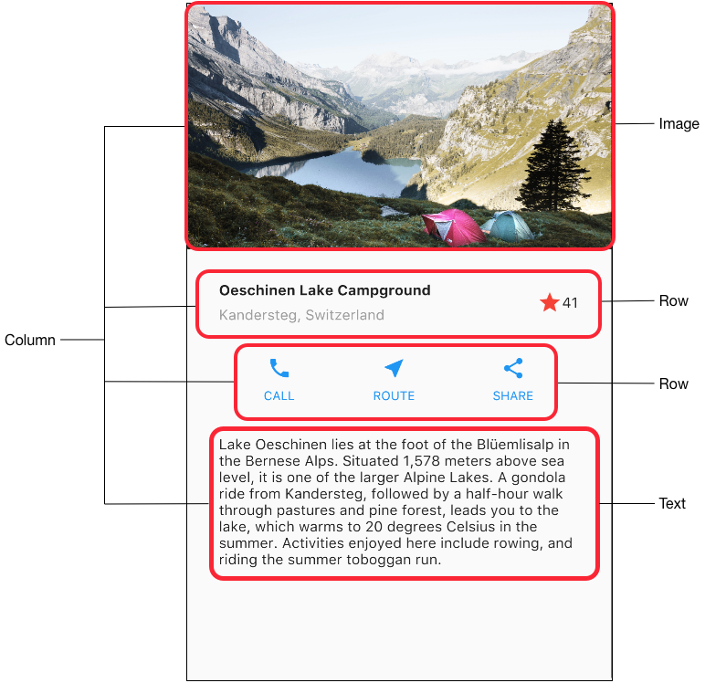

Next, diagram each row. The first row, called the Title
section, has 3 children: a column of text, a star icon,
and a number. Its first child, the column, contains 2 lines of text.
That first column takes a lot of space, so it must be wrapped in an
Expanded widget.

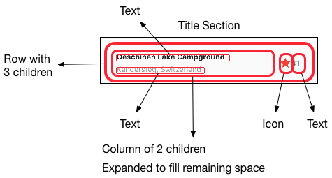

The second row, called the Button section, also has
3 children: each child is a column that contains an icon and text.

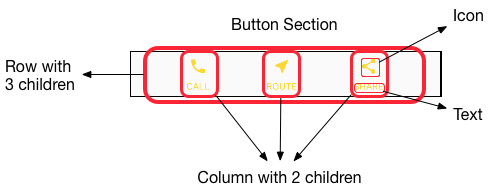

Once the layout has been diagrammed, it's easiest to take a bottom-up
approach to implementing it. To minimize the visual
confusion of deeply nested layout code, place some of the implementation
in variables and functions.

### Step 2: Implement the title row

First, you'll build the left column in the title section. Putting Column
inside an Expanded widget stretches the column to use all remaining free
space in the row. Setting the `crossAxisAlignment` property to
`CrossAxisAlignment.start` positions the column to the beginning of the row.

Putting the first row of text inside a Container enables adding padding.
The second child in the Column, also text, displays as grey.

The last two items in the title row are a star icon, painted red,
and the text "41". Place the entire row in a Container and pad
along each edge with 32 pixels.

Here's the code that implements the title row.

<aside class="alert alert-info" markdown="1">
**Note:**
If you have problems, you can check your code against
[`lib/main.dart`](https://raw.githubusercontent.com/flutter/website/master/_includes/code/layout/lakes/main.dart)
on GitHub.
</aside>

<!-- code/layout/lakes/main.dart -->
<!-- skip -->

class MyApp extends StatelessWidget {
  @override
  Widget build(BuildContext context) {
    Widget titleSection = new Container(
      padding: const EdgeInsets.all(32.0),
      child: new Row(
        children: [
          new Expanded(
            child: new Column(
              crossAxisAlignment: CrossAxisAlignment.start,
              children: [
                new Container(
                  padding: const EdgeInsets.only(bottom: 8.0),
                  child: new Text(
                    'Oeschinen Lake Campground',
                    style: new TextStyle(
                      fontWeight: FontWeight.bold,
                    ),
                  ),
                ),
                new Text(
                  'Kandersteg, Switzerland',
                  style: new TextStyle(
                    color: Colors.grey[500],
                  ),
                ),
              ],
            ),
          ),
          new Icon(
            Icons.star,
            color: Colors.red[500],
          ),
          new Text('41'),
        ],
      ),
    );
  //...
}


<aside class="alert alert-success" markdown="1">
<i class="fa fa-lightbulb-o"> </i> **Tip:**
When pasting code into your app, indentation can
become skewed. You can fix this in IntelliJ by right-clicking the
Dart code and selecting **Reformat with Dart Style**.
Or, at the command line, you can use
[dartfmt](https://github.com/dart-lang/dart_style).
</aside>

<aside class="alert alert-success" markdown="1">
<i class="fa fa-lightbulb-o"> </i> **Tip:**
For a faster development experience, try Flutter's hot reload feature.
Hot reload allows you to modify your code and see the changes without
fully restarting the app. The
[Flutter plugin for IntelliJ](/using-ide/) supports
hot reload, or you can trigger from the command line.
For more information, see [Hot Reloads vs. Full Application
Restarts](https://flutter.io/using-ide/#hot-reloads-vs-full-application-restarts).
</aside>

### Step 3: Implement the button row

The button section contains 3 columns that use the same layout&mdash;an
icon over a row of text. The columns in this row are evenly spaced,
and the text and icons are painted with the primary color,
which is set to blue in the app's `build()` method:

<!-- code/layout/lakes/main.dart -->
<!-- skip -->

class MyApp extends StatelessWidget {
  @override
  Widget build(BuildContext context) {
    //...

    return new MaterialApp(
      title: 'Flutter Demo',
      theme: new ThemeData(
        primarySwatch: Colors.blue,
      ),

    //...
}


Since the code for building each row would be almost identical,
it's most efficient to create a nested function, such as `buildButtonColumn()`,
which takes an Icon and Text, and returns a column with its widgets
painted in the primary color.

<!-- code/layout/lakes/main.dart -->
<!-- skip -->

class MyApp extends StatelessWidget {
  @override
  Widget build(BuildContext context) {
    //...

    Column buildButtonColumn(IconData icon, String label) {
      Color color = Theme.of(context).primaryColor;

      return new Column(
        mainAxisSize: MainAxisSize.min,
        mainAxisAlignment: MainAxisAlignment.center,
        children: [
          new Icon(icon, color: color),
          new Container(
            margin: const EdgeInsets.only(top: 8.0),
            child: new Text(
              label,
              style: new TextStyle(
                fontSize: 12.0,
                fontWeight: FontWeight.w400,
                color: color,
              ),
            ),
          ),
        ],
      );
    }
  //...
}


The build function adds the icon directly to the column. Put
text into a Container to add padding above the text,
separating it from the icon.

Build the row containing these columns by calling the function and
passing the [icon](https://docs.flutter.io/flutter/material/Icons-class.html)
and text specific to that column. Align the columns along the
main axis using `MainAxisAlignment.spaceEvenly` to arrange the free
space evenly before, between, and after each column.

<!-- code/layout/lakes/main.dart -->
<!-- skip -->

class MyApp extends StatelessWidget {
  @override
  Widget build(BuildContext context) {
    //...

    Widget buttonSection = new Container(
      child: new Row(
        mainAxisAlignment: MainAxisAlignment.spaceEvenly,
        children: [
          buildButtonColumn(Icons.call, 'CALL'),
          buildButtonColumn(Icons.near_me, 'ROUTE'),
          buildButtonColumn(Icons.share, 'SHARE'),
        ],
      ),
    );
  //...
}


### Step 4: Implement the text section

Define the text section, which is fairly long, as a variable.
Put the text in a Container to enable adding 32 pixels of padding along
each edge. The `softwrap` property indicates whether the text should break
on soft line breaks, such as periods or commas.

<!-- code/layout/lakes/main.dart -->
<!-- skip -->

class MyApp extends StatelessWidget {
  @override
  Widget build(BuildContext context) {
    //...

    Widget textSection = new Container(
      padding: const EdgeInsets.all(32.0),
      child: new Text(
        '''
Lake Oeschinen lies at the foot of the Blüemlisalp in the Bernese Alps. Situated 1,578 meters above sea level, it is one of the larger Alpine Lakes. A gondola ride from Kandersteg, followed by a half-hour walk through pastures and pine forest, leads you to the lake, which warms to 20 degrees Celsius in the summer. Activities enjoyed here include rowing, and riding the summer toboggan run.
        ''',
        softWrap: true,
      ),
    );
  //...
}


### Step 5: Implement the image section

Three of the four column elements are now complete, leaving only the image.
This image is [available
online](https://images.unsplash.com/photo-1471115853179-bb1d604434e0?dpr=1&amp;auto=format&amp;fit=crop&amp;w=767&amp;h=583&amp;q=80&amp;cs=tinysrgb&amp;crop=)
under the Creative Commons license, but it's large and slow to fetch.
In [Step 0](#step-0) you included the image in the project and updated the
[pubspec
file,](https://raw.githubusercontent.com/flutter/website/master/_includes/code/layout/lakes/pubspec.yaml)
so you can now reference it from your code:

<!-- code/layout/lakes/main.dart -->
<!-- skip -->

body: new ListView(
  children: [
    new Image.asset(
      'images/lake.jpg',
      height: 240.0,
      fit: BoxFit.cover,
    ),
    // ...
  ],
)


`BoxFit.cover` tells the framework that the image should be as small as
possible but cover its entire render box.

### Step 6: Put it together

In the final step, you assemble the pieces together. The widgets are arranged
in a ListView, rather than a Column, because the ListView automatically scrolls
when running the app on a small device.

<!-- skip -->
<!-- code/layout/lakes/main.dart -->

//...
body: new ListView(
  children: [
    new Image.asset(
      'images/lake.jpg',
      width: 600.0,
      height: 240.0,
      fit: BoxFit.cover,
    ),
    titleSection,
    buttonSection,
    textSection,
  ],
),
//...


**Dart code:** [main.dart](https://raw.githubusercontent.com/flutter/website/master/_includes/code/layout/lakes/main.dart) 
**Image:** [images](https://github.com/flutter/website/tree/master/_includes/code/layout/lakes/images) 
**Pubspec:** [pubspec.yaml](https://raw.githubusercontent.com/flutter/website/master/_includes/code/layout/lakes/pubspec.yaml)

That's it! When you hot reload the app, you should see the same layout
shown in the screenshots. You can add interactivity to this layout by following
[Adding Interactivity to Your Flutter App](/tutorials/interactive/).

## Flutter's approach to layout

<b> <a id="whats-the-point" class="anchor" href="#whats-the-point" aria-hidden="true"></a>What's the point?</b>

* Widgets are classes used to build UIs.
* Widgets are used for both layout and UI elements.
* Compose simple widgets to build complex widgets.

The core of Flutter's layout mechanism is widgets. In Flutter, almost
everything is a widget&mdash;even layout models are widgets.
The images, icons, and text that you see in a Flutter app  are all widgets.
But things you don't see are also widgets, such as the rows, columns,
and grids that arrange, constrain, and align the visible widgets.

You create a layout by composing widgets to build more complex widgets.
For example, the screenshot on the left shows 3 icons with a label under
each one:

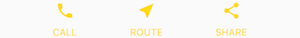&nbsp;&nbsp;&nbsp;&nbsp;&nbsp;&nbsp;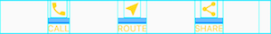

The second screenshot displays the visual layout, showing a row of
3 columns where each column contains an icon and a label.

<aside class="alert alert-info" markdown="1">
**Note:** Most of the screenshots in this tutorial are displayed with
`debugPaintSizeEnabled` set to true so you can see the visual layout.
For more information, see
[Visual debugging](https://flutter.io/debugging/#visual-debugging), a section in
[Debugging Flutter Apps](https://flutter.io/debugging/#visual-debugging).
</aside>

Here's a diagram of the widget tree for this UI:

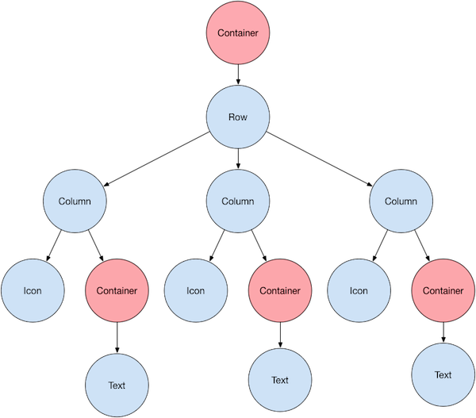

Most of this should look as you might expect, but you might be wondering
about the Containers (shown in pink). Container is a widget that allows
you to customize its child widget. Use a Container when you want to
add padding, margins, borders, or background color, to name some of its
capabilities.

In this example, each Text widget is placed in a Container to add margins.
The entire Row is also placed in a Container to add padding around the row.

The rest of the UI in this example is controlled by properties.
Set an Icon's color using its `color` property.
Use Text's `style` property to set the font, its color, weight, and so on.
Columns and Rows have properties that allow you to specify how their
children are aligned vertically or horizontally, and how much space
the children should occupy.

## Lay out a widget

<b> <a id="whats-the-point" class="anchor" href="#whats-the-point" aria-hidden="true"></a>What's the point?</b>


* Create an [Image](https://docs.flutter.io/flutter/widgets/Image-class.html),
  [Icon](https://docs.flutter.io/flutter/widgets/Icon-class.html),
  or [Text](https://docs.flutter.io/flutter/widgets/Text-class.html) widget.
* Add it to a layout widget, such as
  [Center](https://docs.flutter.io/flutter/widgets/Center-class.html),
  [Align](https://docs.flutter.io/flutter/widgets/Align-class.html),
  [SizedBox](https://docs.flutter.io/flutter/widgets/SizedBox-class.html),
  or [ListView](https://docs.flutter.io/flutter/widgets/ListView-class.html),
  to name a few.
* Add the layout widget to the root of the widget tree.

* Even the app itself is a widget.
* It's easy to create a widget and add it to a layout widget.
* To display the widget on the device, add the layout widget to the app widget.
* It's easiest to use
  [Scaffold](https://docs.flutter.io/flutter/material/Scaffold-class.html),
  a widget from the Material Components library, which provides a default banner,
  background color, and has API for adding drawers, snack bars,
  and bottom sheets.
* If you prefer, you can build an app that only uses standard widgets
  from the widgets library.

How do you layout a single widget in Flutter?
This section shows how to create a simple widget and display it on screen.
It also shows the entire code for a simple Hello World app.

In Flutter,
it takes only a few steps to put text, an icon, or an image on the screen.

<ol markdown="1">

<li markdown="1"> Select a layout widget to hold the object. 
    Choose from a variety of [layout widgets](/widgets/) based
    on how you want to align or constrain the visible widget,
    as these characteristics are typically passed on to the
    contained widget.
    This example uses Center which centers its content
    horizontally and vertically.
</li>

<li markdown="1"> Create a widget to hold the visible object. 

<aside class="alert alert-info" markdown="1">
**Note:**
Flutter apps are written in the [Dart language](https://www.dartlang.org/).
If you know Java or similar object-oriented coding languages, Dart
will feel very familiar. If not, you might try
[DartPad](https://www.dartlang.org/tools/dartpad), an interactive Dart
playground you can use from any browser. The
[Language Tour](https://www.dartlang.org/guides/language) provides an
overview of the features of the Dart Language.
</aside>

For example, create a Text widget:

<!-- skip -->

new Text('Hello World', style: new TextStyle(fontSize: 32.0))


Create an Image widget:

<!-- skip -->

new Image.asset('images/myPic.jpg', fit: BoxFit.cover)


Create an Icon widget:

<!-- skip -->

new Icon(Icons.star, color: Colors.red[500])


</li>

<li markdown="1"> Add the visible widget to the layout widget. 
    All layout widgets have a `child` property if they take a single
    child (for example, Center or Container),
    or a `children` property if they take a list of widgets (for example,
    Row, Column, ListView, or Stack).

Add the Text widget to the Center widget:

<!-- skip -->

new Center(
  child: new Text('Hello World', style: new TextStyle(fontSize: 32.0))


</li>

<li markdown="1"> Add the layout widget to the page. 
   A Flutter app is, itself, a widget and most widgets have a
   [build()](https://docs.flutter.io/flutter/widgets/StatelessWidget/build.html)
   method. Declaring the widget in the app's build method displays the widget
   on the device.

   For a Material app, you can add the Center widget directly to the
  `body` property for the home page.

<!-- code/layout/hello-world/main.dart -->
<!-- skip -->

class _MyHomePageState extends State<MyHomePage> {
  @override
  Widget build(BuildContext context) {
    return new Scaffold(
      appBar: new AppBar(
        title: new Text(widget.title),
      ),
      body: new Center(
        child: new Text('Hello World', style: new TextStyle(fontSize: 32.0)),
      ),
    );
  }
}


<aside class="alert alert-info" markdown="1">
**Note:**
The Material Components library implements widgets that follow
[Material Design principles](https://material.io/guidelines/).
When designing your UI, you can exclusively use widgets from the standard
[widgets library](https://docs.flutter.io/flutter/widgets/widgets-library.html),
or you can use widgets from [Material Components](https://docs.flutter.io/flutter/material/material-library.html).
You can mix widgets from both libraries,
you can customize existing widgets,
or you can build your own set of custom widgets.
</aside>

For a non-Material app, you can add the Center widget to the app's `build()`
method:

<!-- code/layout/widgets-only/main.dart -->
<!-- skip -->

// This app doesn't use any Material Components, such as Scaffold.
// Normally, an app that doesn't use Scaffold has a black background
// and the default text color is black. This app changes its background
// to white and its text color to dark grey to mimic a Material app.
import 'package:flutter/material.dart';

void main() {
  runApp(new MyApp());
}

class MyApp extends StatelessWidget {
  @override
  Widget build(BuildContext context) {
    return new Container(
      decoration: new BoxDecoration(color: Colors.white),
      child: new Center(
        child: new Text('Hello World',
            textDirection: TextDirection.ltr,
            style: new TextStyle(fontSize: 40.0, color: Colors.black87)),
      ),
    );
  }
}


Note that, by default, the non-Material app doesn't include an AppBar, title,
or background color. If you want these features in a non-Material app,
you have to build them yourself. This app changes the background color to
white and the text to dark grey to mimic a Material app.

</li>

</ol>

That's it! When you run the app, you should see:

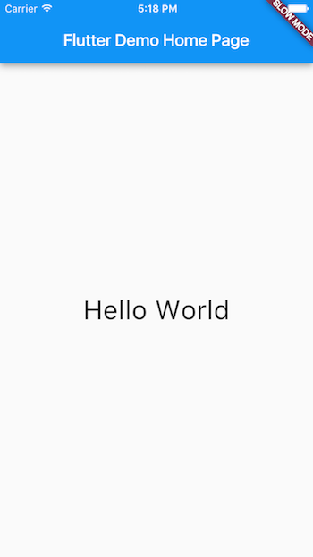

**Dart code** (Material app): [main.dart](https://raw.githubusercontent.com/flutter/website/master/_includes/code/layout/hello-world/main.dart) 
**Dart code** (widgets-only app): [main.dart](https://raw.githubusercontent.com/flutter/website/master/_includes/code/layout/widgets-only/main.dart)

## Lay out multiple widgets vertically and horizontally

One of the most common layout patterns is to arrange widgets vertically
or horizontally. You can use a Row widget to arrange widgets horizontally,
and a Column widget to arrange widgets vertically.

<b> <a id="whats-the-point" class="anchor" href="#whats-the-point" aria-hidden="true"></a>What's the point?</b>

* Row and Column are two of the most commonly used layout patterns.
* Row and Column each take a list of child widgets.
* A child widget can itself be a Row, Column, or other complex widget.
* You can specify how a Row or Column aligns its children, both vertically
  and horizontally.
* You can stretch or constrain specific child widgets.
* You can specify how child widgets use the Row's or Column's available space.

### Contents

* [Aligning widgets](#alignment)
* [Sizing widgets](#sizing)
* [Packing widgets](#packing)
* [Nesting rows and columns](#nesting)

To create a row or column in Flutter, you add a list of children widgets to a
[Row](https://docs.flutter.io/flutter/widgets/Row-class.html) or
[Column](https://docs.flutter.io/flutter/widgets/Column-class.html) widget.
In turn, each child can itself be a row or column, and so on.
The following example shows how it is possible to nest rows or columns inside
of rows or columns.

This layout is organized as a Row. The row contains two children:
a column on the left, and an image on the right:

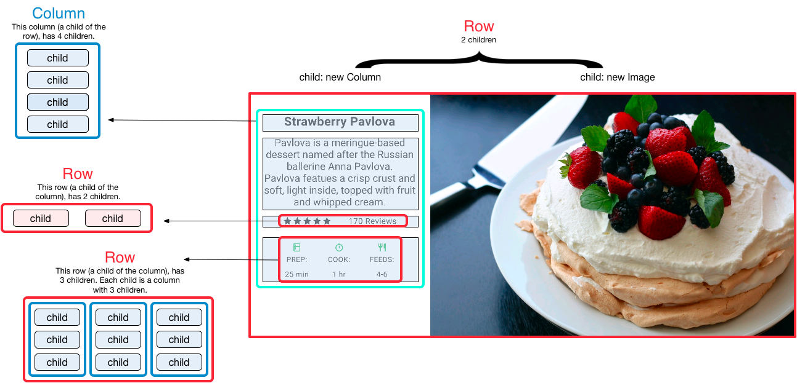
 

The left column's widget tree nests rows and columns.

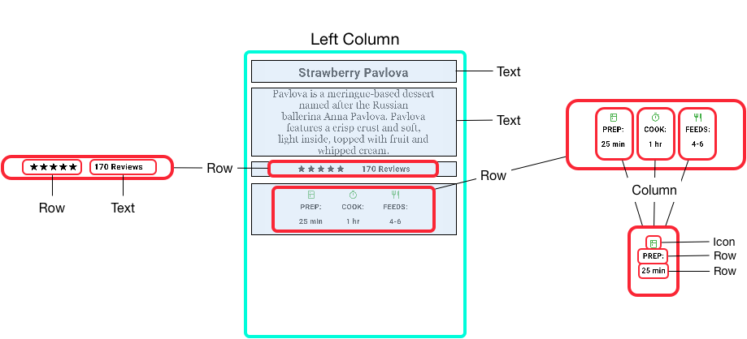
 

You'll implement some of Pavlova's layout code in
[Nesting rows and columns](#nesting).

<aside class="alert alert-info" markdown="1">
**Note:** Row and Column are basic primitive widgets for horizontal
and vertical layouts&mdash;these low-level widgets allow for maximum
customization. Flutter also offers specialized, higher level widgets
that might be sufficient for your needs. For example, instead of Row
you might prefer
[ListTile](https://docs.flutter.io/flutter/material/ListTile-class.html),
an easy-to-use widget with properties for leading and trailing icons,
and up to 3 lines of text.  Instead of Column, you might prefer
[ListView](https://docs.flutter.io/flutter/widgets/ListView-class.html),
a column-like layout that automatically scrolls if its content is too long
to fit the available space.  For more information,
see [Common layout widgets](#common-layout-widgets).
</aside>

### Aligning widgets

You control how a row or column aligns its children using the
`mainAxisAlignment` and `crossAxisAlignment` properties.
For a row, the main axis runs horizontally and the cross axis runs
vertically. For a column, the main axis runs vertically and the cross
axis runs horizontally.

 

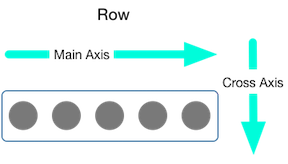

 

 

The [MainAxisAlignment](https://docs.flutter.io/flutter/rendering/MainAxisAlignment-class.html)
and [CrossAxisAlignment](https://docs.flutter.io/flutter/rendering/CrossAxisAlignment-class.html)
classes offer a variety of constants for controlling alignment.

<aside class="alert alert-info" markdown="1">
**Note:** When you add images to your project,
you need to update the pubspec file to access them&mdash;this
example uses `Image.asset` to display the images.  For more information,
see this example's [pubspec.yaml
file](https://raw.githubusercontent.com/flutter/website/master/_includes/code/layout/row/pubspec.yaml),
or [Adding Assets and Images in Flutter](/assets-and-images).
You don't need to do this if you're referencing online images using
`Image.network`.
</aside>

In the following example, each of the 3 images is 100 pixels wide.
The render box (in this case, the entire screen) is more than 300 pixels wide,
so setting the main axis alignment to `spaceEvenly` divides the free
horizontal space evenly between, before, and after each image.

 



 

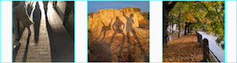

**Dart code:** [main.dart](https://raw.githubusercontent.com/flutter/website/master/_includes/code/layout/row/main.dart) 
**Images:** [images](https://github.com/flutter/website/tree/master/_includes/code/layout/row/images) 
**Pubspec:** [pubspec.yaml](https://raw.githubusercontent.com/flutter/website/master/_includes/code/layout/row/pubspec.yaml)

 

Columns work the same way as rows. The following example shows a column
of 3 images, each is 100 pixels high. The height of the render box
(in this case, the entire screen) is more than 300 pixels, so
setting the main axis alignment to `spaceEvenly` divides the free vertical
space evenly between, above, and below each image.

 



**Dart code:** [main.dart](https://raw.githubusercontent.com/flutter/website/master/_includes/code/layout/column/main.dart) 
**Images:** [images](https://github.com/flutter/website/tree/master/_includes/code/layout/column/images) 
**Pubspec:** [pubspec.yaml](https://raw.githubusercontent.com/flutter/website/master/_includes/code/layout/column/pubspec.yaml)

 

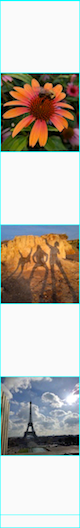

 

<aside class="alert alert-info" markdown="1">
**Note:**
When a layout is too large to fit the device, a red strip appears along the
affected edge. For example, the row in the following screenshot is too
wide for the device's screen:

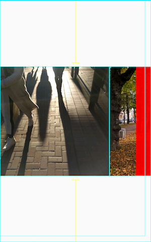

Widgets can be sized to fit within a row or column by using an Expanded widget,
which is described in the [Sizing widgets](#sizing) section below.
</aside>

### Sizing widgets

Perhaps you want a widget to occupy twice as much space as its siblings.
You can place the child of a row or column in an
[Expanded](https://docs.flutter.io/flutter/widgets/Expanded-class.html)
widget to control widget sizing along the main axis.
The Expanded widget has a `flex` property, an integer that determines
the flex factor for a widget. The default flex factor for an Expanded
widget is 1.

For example, to create a row of three widgets where the middle widget is twice
as wide as the other two widgets, set the flex factor on the middle widget to 2:

 



 

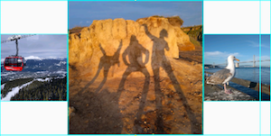

**Dart code:** [main.dart](https://raw.githubusercontent.com/flutter/website/master/_includes/code/layout/row-expanded/main.dart) 
**Images:** [images](https://github.com/flutter/website/tree/master/_includes/code/layout/row-expanded/images) 
**Pubspec:** [pubspec.yaml](https://raw.githubusercontent.com/flutter/website/master/_includes/code/layout/row-expanded/pubspec.yaml)

 

To fix the example in the previous section where the row of 3 images was
too wide for its render box, and resulted in the red strip,
wrap each widget with an Expanded widget.
By default, each widget has a flex factor of 1, assigning one-third of
the row to each widget.

 



 

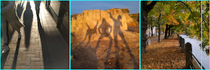

**Dart code:** [main.dart](https://raw.githubusercontent.com/flutter/website/master/_includes/code/layout/row-expanded-2/main.dart) 
**Images:** [images](https://github.com/flutter/website/tree/master/_includes/code/layout/row-expanded-2/images) 
**Pubspec:** [pubspec.yaml](https://raw.githubusercontent.com/flutter/website/master/_includes/code/layout/row-expanded-2/pubspec.yaml)

 

### Packing widgets

By default, a row or column occupies as much space along its main axis
as possible, but if you want to pack the children closely together,
set its `mainAxisSize` to `MainAxisSize.min`. The following example
uses this property to pack the star icons together.

 

<!-- code/layout/packed/main.dart -->
<!-- skip -->

class _MyHomePageState extends State<MyHomePage> {
  @override
  Widget build(BuildContext context) {
    var packedRow = new Row(
      mainAxisSize: MainAxisSize.min,
      children: [
        new Icon(Icons.star, color: Colors.green[500]),
        new Icon(Icons.star, color: Colors.green[500]),
        new Icon(Icons.star, color: Colors.green[500]),
        new Icon(Icons.star, color: Colors.black),
        new Icon(Icons.star, color: Colors.black),
      ],
    );

  // ...
}


 

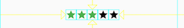

**Dart code:** [main.dart](https://raw.githubusercontent.com/flutter/website/master/_includes/code/layout/packed/main.dart) 
**Icons:** [Icons class](https://docs.flutter.io/flutter/material/Icons-class.html) 
**Pubspec:** [pubspec.yaml](https://raw.githubusercontent.com/flutter/website/master/_includes/code/layout/packed/pubspec.yaml)

 

### Nesting rows and columns

The layout framework allows you to nest rows and columns inside of rows
and columns as deeply as you need. Let's look the code for the outlined section
of the following layout:

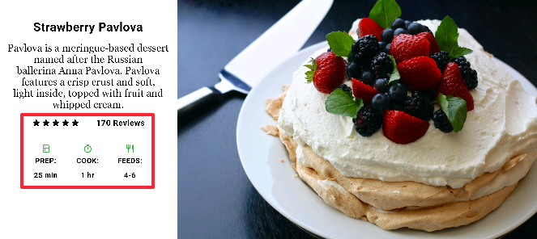

The outlined section is implemented as two rows. The ratings row contains
five stars and the number of reviews. The icons row contains three
columns of icons and text.

The widget tree for the ratings row:

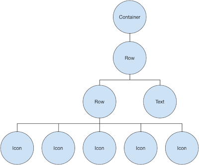
 

The `ratings` variable creates a row containing a smaller row of 5 star icons,
and text:

<!-- code/layout/pavlova/main.dart -->
<!-- skip -->

class _MyHomePageState extends State<MyHomePage> {
  @override
  Widget build(BuildContext context) {
    //...

    var ratings = new Container(
      padding: new EdgeInsets.all(20.0),
      child: new Row(
        mainAxisAlignment: MainAxisAlignment.spaceEvenly,
        children: [
          new Row(
            mainAxisSize: MainAxisSize.min,
            children: [
              new Icon(Icons.star, color: Colors.black),
              new Icon(Icons.star, color: Colors.black),
              new Icon(Icons.star, color: Colors.black),
              new Icon(Icons.star, color: Colors.black),
              new Icon(Icons.star, color: Colors.black),
            ],
          ),
          new Text(
            '170 Reviews',
            style: new TextStyle(
              color: Colors.black,
              fontWeight: FontWeight.w800,
              fontFamily: 'Roboto',
              letterSpacing: 0.5,
              fontSize: 20.0,
            ),
          ),
        ],
      ),
    );
    //...
  }
}


<aside class="alert alert-success" markdown="1">
<i class="fa fa-lightbulb-o"> </i> **Tip:**
To minimize the visual confusion that can result from heavily nested layout
code, implement pieces of the UI in variables and functions.
</aside>

The icons row, below the ratings row, contains 3 columns; each column contains
an icon and two lines of text, as you can see in its widget tree:

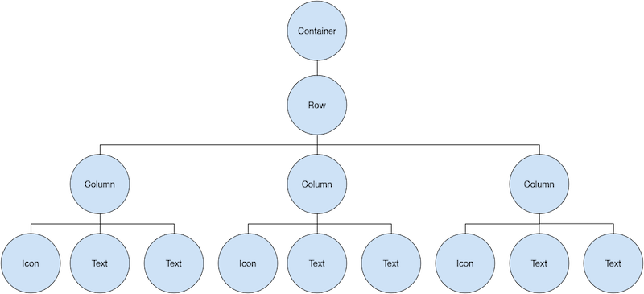

The `iconList` variable defines the icons row:

<!-- code/layout/pavlova/main.dart -->
<!-- skip -->

class _MyHomePageState extends State<MyHomePage> {
  @override
  Widget build(BuildContext context) {
    // ...

    var descTextStyle = new TextStyle(
      color: Colors.black,
      fontWeight: FontWeight.w800,
      fontFamily: 'Roboto',
      letterSpacing: 0.5,
      fontSize: 18.0,
      height: 2.0,
    );

    // DefaultTextStyle.merge allows you to create a default text
    // style that is inherited by its child and all subsequent children.
    var iconList = DefaultTextStyle.merge(
      style: descTextStyle,
      child: new Container(
        padding: new EdgeInsets.all(20.0),
        child: new Row(
          mainAxisAlignment: MainAxisAlignment.spaceEvenly,
          children: [
            new Column(
              children: [
                new Icon(Icons.kitchen, color: Colors.green[500]),
                new Text('PREP:'),
                new Text('25 min'),
              ],
            ),
            new Column(
              children: [
                new Icon(Icons.timer, color: Colors.green[500]),
                new Text('COOK:'),
                new Text('1 hr'),
              ],
            ),
            new Column(
              children: [
                new Icon(Icons.restaurant, color: Colors.green[500]),
                new Text('FEEDS:'),
                new Text('4-6'),
              ],
            ),
          ],
        ),
      ),
    );
    // ...
  }
}


The `leftColumn` variable contains the ratings and icons rows, as well as
the title and text that describes the Pavlova:

<!-- code/layout/pavlova/main.dart -->
<!-- skip -->

class _MyHomePageState extends State<MyHomePage> {
  @override
  Widget build(BuildContext context) {
    //...

    var leftColumn = new Container(
      padding: new EdgeInsets.fromLTRB(20.0, 30.0, 20.0, 20.0),
      child: new Column(
        children: [
          titleText,
          subTitle,
          ratings,
          iconList,
        ],
      ),
    );
    //...
  }
}


The left column is placed in a Container to constrain its width.
Finally, the UI is constructed with the entire row (containing the
left column and the image) inside a Card.

The Pavlova image is from
[Pixabay](https://pixabay.com/en/photos/?q=pavlova&image_type=&cat=&min_width=&min_height=)
and is available under the Creative Commons license.
You can embed an image from the net using `Image.network` but,
for this example, the image is saved to an images directory in the project,
added to the [pubspec
file,](https://raw.githubusercontent.com/flutter/website/master/_includes/code/layout/pavlova/pubspec.yaml)
and accessed using `Images.asset`. For more information, see
[Adding Assets and Images in Flutter](/assets-and-images).

<!-- code/layout/pavlova/main.dart -->
<!-- skip -->

body: new Center(
  child: new Container(
    margin: new EdgeInsets.fromLTRB(0.0, 40.0, 0.0, 30.0),
    height: 600.0,
    child: new Card(
      child: new Row(
        crossAxisAlignment: CrossAxisAlignment.start,
        children: [
          new Container(
            width: 440.0,
            child: leftColumn,
          ),
          mainImage,
        ],
      ),
    ),
  ),
),


 

**Dart code:** [main.dart](https://raw.githubusercontent.com/flutter/website/master/_includes/code/layout/pavlova/main.dart) 
**Images:** [images](https://github.com/flutter/website/tree/master/_includes/code/layout/pavlova/images) 
**Pubspec:** [pubspec.yaml](https://raw.githubusercontent.com/flutter/website/master/_includes/code/layout/pavlova/pubspec.yaml)

 

<aside class="alert alert-success" markdown="1">
<i class="fa fa-lightbulb-o"> </i> **Tip:**
The Pavlova example runs best horizontally on a wide device, such as a tablet.
If you are running this example in the iOS simulator, you can select a
different device using the **Hardware > Device** menu. For this example, we
recommend the iPad Pro. You can change its orientation to landscape mode using
**Hardware > Rotate**. You can also change the size of the simulator window
(without changing the number of logical pixels) using **Window > Scale**.
</aside>

 

## Common layout widgets

Flutter has a rich library of layout widgets, but here a few of those most
commonly used. The intent is to get you up and running as quickly as possible,
rather than overwhelm you with a complete list.  For information on other
available widgets, refer to the [Widget Overview](https://flutter.io/widgets/),
or use the Search box in the [API reference docs](https://docs.flutter.io/).
Also, the widget pages in the API docs often make suggestions
about similar widgets that might better suit your needs.

The following widgets fall into two categories: standard widgets from the
[widgets library,](https://docs.flutter.io/flutter/widgets/widgets-library.html)
and specialized widgets from the
[Material Components library](https://docs.flutter.io/flutter/material/material-library.html).
Any app can use the widgets library but only Material apps can use the
Material Components library.

### Standard widgets

* [Container](#container)
: Adds padding, margins, borders, background color,
  or other decorations to a widget.
* [GridView](#gridview)
: Lays widgets out as a scrollable grid.
* [ListView](#listview)
: Lays widgets out as a scrollable list.
* [Stack](#stack)
: Overlaps a widget on top of another.

### Material Components

* [Card](#card)
: Organizes related info into a box with rounded corners and a drop shadow.

* [ListTile](#listtile)
: Organizes up to 3 lines of text, and optional leading and trailing icons,
  into a row.

### Container

Many layouts make liberal use of Containers to separate widgets with padding,
or to add borders or margins. You can change the device's background by
placing the entire layout into a Container and changing its background color
or image.

 

#### Container summary:

* Add padding, margins, borders
* Change background color or image
* Contains a single child widget, but that child can be a Row, Column,
  or even the root of a widget tree

 

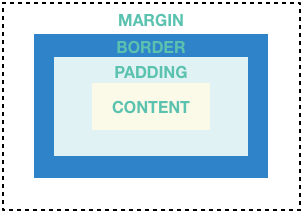

 

#### Container examples:

In addition to the example below,
many examples in this tutorial use Container. You can also find more
Container examples in the [Flutter
Gallery](https://github.com/flutter/flutter/tree/master/examples/flutter_gallery).

 

This layout consists of a column of two rows, each containing 2 images.
Each image uses a Container to add a rounded grey border and margins.
The Column, which contains the rows of images,
uses a Container to change the background color to a lighter grey.

**Dart code:** [main.dart](https://raw.githubusercontent.com/flutter/website/master/_includes/code/layout/container/main.dart), snippet below 
**Images:** [images](https://github.com/flutter/website/tree/master/_includes/code/layout/container/images) 
**Pubspec:** [pubspec.yaml](https://raw.githubusercontent.com/flutter/website/master/_includes/code/layout/container/pubspec.yaml)

 

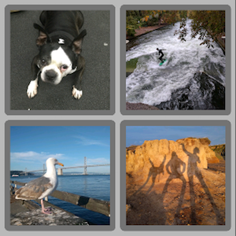

 

<!-- code/layout/container/main.dart -->
<!-- skip -->

class _MyHomePageState extends State<MyHomePage> {
  @override
  Widget build(BuildContext context) {

    var container = new Container(
      decoration: new BoxDecoration(
        color: Colors.black26,
      ),
      child: new Column(
        children: [
          new Row(
            children: [
              new Expanded(
                child: new Container(
                  decoration: new BoxDecoration(
                    border: new Border.all(width: 10.0, color: Colors.black38),
                    borderRadius:
                        const BorderRadius.all(const Radius.circular(8.0)),
                  ),
                  margin: const EdgeInsets.all(4.0),
                  child: new Image.asset('images/pic1.jpg'),
                ),
              ),
              new Expanded(
                child: new Container(
                  decoration: new BoxDecoration(
                    border: new Border.all(width: 10.0, color: Colors.black38),
                    borderRadius:
                        const BorderRadius.all(const Radius.circular(8.0)),
                  ),
                  margin: const EdgeInsets.all(4.0),
                  child: new Image.asset('images/pic2.jpg'),
                ),
              ),
            ],
          ),
          // ...
          // [[highlight]]See the definition for the second row on GitHub:[[/highlight]]
          // [[highlight]]https://raw.githubusercontent.com/flutter/website/master/_includes/code/layout/container/main.dart[[/highlight]]
        ],
      ),
    );
    //...
  }
}


### GridView

Use [GridView](https://docs.flutter.io/flutter/widgets/GridView-class.html)
to lay widgets out as a two-dimensional list. GridView provides two
pre-fabricated lists, or you can build your own custom grid.
When a GridView detects that its contents are too long to fit the render box,
it automatically scrolls.

#### GridView summary:

* Lays widgets out in a grid
* Detects when the column content exceeds the render box and automatically
  provides scrolling
* Build your own custom grid, or use one of the provided grids:
  * `GridView.count` allows you to specify the number of columns
  * `GridView.extent` allows you to specify the maximum pixel width of a tile

* Use `MediaQuery.of(context).orientation` to create a grid that changes
  its layout depending on whether the device is in landscape or portrait mode.


<aside class="alert alert-info" markdown="1">
**Note:** When displaying a two-dimensional list where it's important which
row and column a cell occupies (for example,
it's the entry in the "calorie" column for the "avocado" row), use
[Table](https://docs.flutter.io/flutter/widgets/Table-class.html) or
[DataTable](https://docs.flutter.io/flutter/material/DataTable-class.html).
</aside>

#### GridView examples:

 

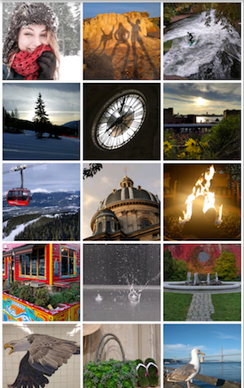

Uses `GridView.extent` to create a grid with tiles a maximum 150 pixels wide. 
**Dart code:** [main.dart](https://raw.githubusercontent.com/flutter/website/master/_includes/code/layout/grid/main.dart), snippet below 
**Images:** [images](https://github.com/flutter/website/tree/master/_includes/code/layout/grid/images) 
**Pubspec:** [pubspec.yaml](https://raw.githubusercontent.com/flutter/website/master/_includes/code/layout/grid/pubspec.yaml)

 

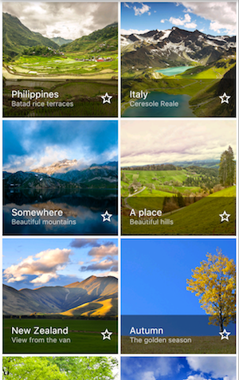

Uses `GridView.count` to create a grid that's 2 tiles wide in portrait mode,
and 3 tiles wide in landscape mode. The titles are created by setting the
`footer` property for each GridTile. 
**Dart code:** [grid_list_demo.dart](https://github.com/flutter/flutter/blob/master/examples/flutter_gallery/lib/demo/material/grid_list_demo.dart)
from the [Flutter
Gallery](https://github.com/flutter/flutter/tree/master/examples/flutter_gallery)

 

<!-- code/layout/grid/main.dart -->
<!-- skip -->

// The images are saved with names pic1.jpg, pic2.jpg...pic30.jpg.
// The List.generate constructor allows an easy way to create
// a list when objects have a predictable naming pattern.
List<Container> _buildGridTileList(int count) {

  return new List<Container>.generate(
      count,
      (int index) =>
          new Container(child: new Image.asset('images/pic${index+1}.jpg')));
}

Widget buildGrid() {
  return new GridView.extent(
      maxCrossAxisExtent: 150.0,
      padding: const EdgeInsets.all(4.0),
      mainAxisSpacing: 4.0,
      crossAxisSpacing: 4.0,
      children: _buildGridTileList(30));
}

class _MyHomePageState extends State<MyHomePage> {
  @override
  Widget build(BuildContext context) {
    return new Scaffold(
      appBar: new AppBar(
        title: new Text(widget.title),
      ),
      body: new Center(
        child: buildGrid(),
      ),
    );
  }
}


### ListView

[ListView](https://docs.flutter.io/flutter/widgets/ListView-class.html),
a column-like widget, automatically provides scrolling when
its content is too long for its render box.

#### ListView summary:

* A specialized Column for organizing a list of boxes
* Can be laid out horizontally or vertically
* Detects when its content won't fit and provides scrolling
* Less configurable than Column, but easier to use and supports scrolling

#### ListView examples:

 

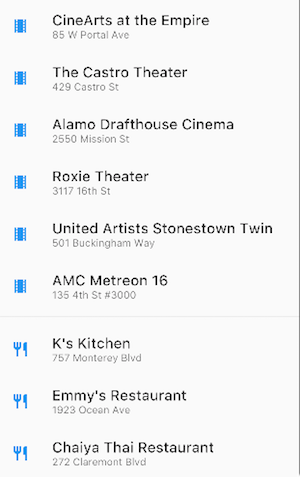

Uses ListView to display a list of businesses using ListTiles.
A Divider separates the theaters from the restaurants. 
**Dart code:** [main.dart](https://raw.githubusercontent.com/flutter/website/master/_includes/code/layout/listview/main.dart), snippet below 
**Icons:** [Icons class](https://docs.flutter.io/flutter/material/Icons-class.html) 
**Pubspec:** [pubspec.yaml](https://raw.githubusercontent.com/flutter/website/master/_includes/code/layout/listview/pubspec.yaml)

 

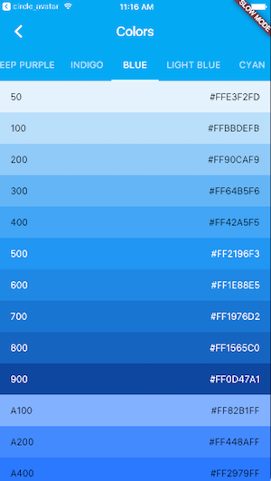

Uses ListView to display the
[Colors](https://docs.flutter.io/flutter/material/Colors-class.html)
from the
[Material Design palette](https://material.io/guidelines/style/color.html)
for a particular color family. 
**Dart code:** [colors_demo.dart](https://github.com/flutter/flutter/blob/master/examples/flutter_gallery/lib/demo/colors_demo.dart)
from the [Flutter
Gallery](https://github.com/flutter/flutter/tree/master/examples/flutter_gallery)

 

<!-- code/layout/listview/main.dart -->
<!-- skip -->

List<Widget> list = <Widget>[
  new ListTile(
    title: new Text('CineArts at the Empire',
        style: new TextStyle(fontWeight: FontWeight.w500, fontSize: 20.0)),
    subtitle: new Text('85 W Portal Ave'),
    leading: new Icon(
      Icons.theaters,
      color: Colors.blue[500],
    ),
  ),
  new ListTile(
    title: new Text('The Castro Theater',
        style: new TextStyle(fontWeight: FontWeight.w500, fontSize: 20.0)),
    subtitle: new Text('429 Castro St'),
    leading: new Icon(
      Icons.theaters,
      color: Colors.blue[500],
    ),
  ),
  // ...
  // [[highlight]]See the rest of the column defined on GitHub:[[/highlight]]
  // [[highlight]]https://raw.githubusercontent.com/flutter/website/master/_includes/code/layout/listview/main.dart[[/highlight]]
];

class _MyHomePageState extends State<MyHomePage> {
  @override
  Widget build(BuildContext context) {
    return new Scaffold(
      // ...
      body: new Center(
        child: new ListView(
          children: list,
        ),
      ),
    );
  }
}


### Stack

Use [Stack](https://docs.flutter.io/flutter/widgets/Stack-class.html)
to arrange widgets on top of a base widget&mdash;often an image.
The widgets can completely or partially overlap the base widget.

#### Stack summary:

* Use for widgets that overlap another widget
* The first widget in the list of children is the base widget;
  subsequent children are overlaid on top of that base widget
* A Stack's content can't scroll
* You can choose to clip children that exceed the render box

#### Stack examples:

 

Uses Stack to overlay a Container (that displays its Text on a translucent
black background) on top of a Circle Avatar.
The Stack offsets the text using the `alignment` property and
Alignments. 
**Dart code:** [main.dart](https://raw.githubusercontent.com/flutter/website/master/_includes/code/layout/stack/main.dart), snippet below 
**Image:** [images](https://github.com/flutter/website/tree/master/_includes/code/layout/stack/images) 
**Pubspec:** [pubspec.yaml](https://raw.githubusercontent.com/flutter/website/master/_includes/code/layout/stack/pubspec.yaml)

 

Uses Stack to overlay a gradient to the top of the image. The gradient
ensures that the toolbar's icons are distinct against the image. 
**Dart code:** [contacts_demo.dart](https://github.com/flutter/flutter/blob/master/examples/flutter_gallery/lib/demo/contacts_demo.dart)
from the [Flutter
Gallery](https://github.com/flutter/flutter/tree/master/examples/flutter_gallery)

 

<!-- code/layout/stack/main.dart -->
<!-- skip -->

class _MyHomePageState extends State<MyHomePage> {
  @override
  Widget build(BuildContext context) {
    var stack = new Stack(
      alignment: const Alignment(0.6, 0.6),
      children: [
        new CircleAvatar(
          backgroundImage: new AssetImage('images/pic.jpg'),
          radius: 100.0,
        ),
        new Container(
          decoration: new BoxDecoration(
            color: Colors.black45,
          ),
          child: new Text(
            'Mia B',
            style: new TextStyle(
              fontSize: 20.0,
              fontWeight: FontWeight.bold,
              color: Colors.white,
            ),
          ),
        ),
      ],
    );
    // ...
  }
}


### Card

A Card, from the Material Components library, contains related nuggets of information
and can be composed from most any widget, but is often used with ListTile.
Card has a single child, but its child can be a column, row, list, grid,
or other widget that supports multiple children. By default, a Card shrinks
its size to 0 by 0 pixels. You can use
[SizedBox](https://docs.flutter.io/flutter/widgets/SizedBox-class.html) to
constrain the size of a card.

In Flutter, a Card features slightly rounded corners
and a drop shadow, giving it a 3D effect.
Changing a Card's `elevation`
property allows you to control the drop shadow effect.
Setting the elevation to 24.0, for example, visually lifts the Card further
from the surface and causes the shadow to become more dispersed.
For a list of supported elevation values, see
[Elevation and
Shadows](https://material.io/guidelines/material-design/elevation-shadows.html)
in the [Material guidelines](https://material.io/guidelines/).
Specifying an unsupported value disables the drop shadow entirely.

#### Card summary:

* Implements a [Material Design
  card](https://material.io/guidelines/components/cards.html)
* Used for presenting related nuggets of information
* Accepts a single child, but that child can be a Row, Column, or other
  widget that holds a list of children
* Displayed with rounded corners and a drop shadow
* A Card's content can't scroll
* From the Material Components library

#### Card examples:

 

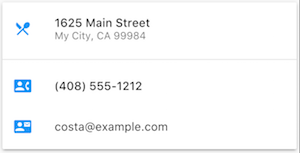

A Card containing 3 ListTiles and sized by wrapping it with a
SizedBox. A Divider separates the first and second ListTiles.

**Dart code:** [main.dart](https://raw.githubusercontent.com/flutter/website/master/_includes/code/layout/card/main.dart), snippet below 
**Icons:** [Icons class](https://docs.flutter.io/flutter/material/Icons-class.html) 
**Pubspec:** [pubspec.yaml](https://raw.githubusercontent.com/flutter/website/master/_includes/code/layout/card/pubspec.yaml)

 

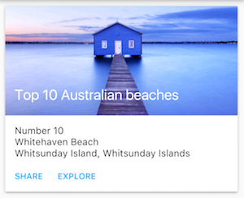

A Card containing an image and text. 
**Dart code:** [cards_demo.dart](https://github.com/flutter/flutter/blob/master/examples/flutter_gallery/lib/demo/material/cards_demo.dart)
from the [Flutter
Gallery](https://github.com/flutter/flutter/tree/master/examples/flutter_gallery)

 

<!-- code/layout/card/main.dart -->
<!-- skip -->

class _MyHomePageState extends State<MyHomePage> {
  @override
  Widget build(BuildContext context) {
    var card = new SizedBox(
      height: 210.0,
      child: new Card(
        child: new Column(
          children: [
            new ListTile(
              title: new Text('1625 Main Street',
                  style: new TextStyle(fontWeight: FontWeight.w500)),
              subtitle: new Text('My City, CA 99984'),
              leading: new Icon(
                Icons.restaurant_menu,
                color: Colors.blue[500],
              ),
            ),
            new Divider(),
            new ListTile(
              title: new Text('(408) 555-1212',
                  style: new TextStyle(fontWeight: FontWeight.w500)),
              leading: new Icon(
                Icons.contact_phone,
                color: Colors.blue[500],
              ),
            ),
            new ListTile(
              title: new Text('costa@example.com'),
              leading: new Icon(
                Icons.contact_mail,
                color: Colors.blue[500],
              ),
            ),
          ],
        ),
      ),
    );
  //...
}


### ListTile

Use
ListTile, a specialized row widget from the Material Components library, for an easy
way to create a row containing up to 3 lines of text and optional leading
and trailing icons. ListTile is most commonly used in Card or ListView,
but can be used elsewhere.

#### ListTile summary:

* A specialized row that contains up to 3 lines of text and optional icons
* Less configurable than Row, but easier to use
* From the Material Components library

#### ListTile examples:

 

A Card containing 3 ListTiles. 
**Dart code:** See [Card examples](#card-examples).

 

Uses ListTile to list 3 drop down button types. 
**Dart code:** [buttons_demo.dart](https://github.com/flutter/flutter/blob/master/examples/flutter_gallery/lib/demo/material/buttons_demo.dart)
from the [Flutter
Gallery](https://github.com/flutter/flutter/tree/master/examples/flutter_gallery)

 

## Resources

The following resources may help when writing layout code.

* [Widget Overview](/widgets) 
  Describes many of the widgets available in Flutter.
* [HTML/CSS Analogs in Flutter](/web-analogs) 
  For those familiar with web programming, this page maps HTML/CSS functionality
  to Flutter features.
* [Flutter
  Gallery](https://github.com/flutter/flutter/tree/master/examples/flutter_gallery) 
  Demo app showcasing many Material Design widgets and other Flutter features.
* [Flutter API documentation](https://docs.flutter.io/) 
  Reference documentation for all of the Flutter libraries.
* [Dealing with Box Constraints in Flutter](/layout) 
  Discusses how widgets are constrained by their render boxes.
* [Adding Assets and Images in Flutter](/assets-and-images) 
  Explains how to add images and other assets to your app's package.
* [Zero to One with
  Flutter](https://medium.com/@mravn/zero-to-one-with-flutter-43b13fd7b354#.z86tsq4ld) 
  One person's experience writing his first Flutter app.
