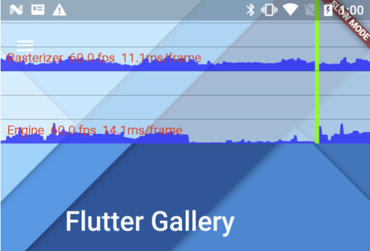
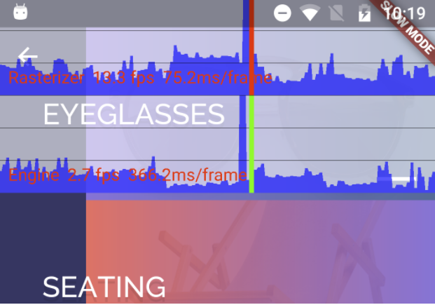

<b> <a id="whats-the-point" class="anchor" href="#whats-the-point" aria-hidden="true"></a>What you'll learn:</b>

* Flutter aims to provide 60 frames per second (fps) performance, and 120
  fps performance on devices capable of 120Hz updates.
* Frames should render in 16ms.
* Jank occurs when the UI doesn't render smoothly. In other words, a
  frame takes longer than 16ms to build and render.

This guide shows [PENDING: text].

* TOC Placeholder
{:toc}

## A workflow for diagnosing jank

<b> <a id="whats-the-point" class="anchor" href="#whats-the-point" aria-hidden="true"></a>What's the point?</b>

* Profile your app on a physical device.
* Profile your app in profile mode.
* Check performance on the slowest device your users might use.
* Start by enabling the performance overlay.

### Connect to a physical device

Almost all performance debugging for Flutter applications should be
conducted on a physical Android or iOS device, with your Flutter application
running in profile mode. Using debug mode, or running apps on simulators
or emulators, is generally not indicative* of the final
behavior of release mode builts. _You should consider checking performance
on the slowest device that your users might reasonably use._

<aside class="alert alert-info" markdown="1">
* Why you should run on a real device:

* Simulators and emulators don’t use the same hardware, so their
  performance characteristics are different, some operations are
  faster on simulators than real devices, and some are slower.
* Debug mode enables additional checks (such as asserts) that don’t run
  in profile or release builds, and these checks can be expensive.
  This is why debug mode is called “slow mode”.
* Debug mode also executes code in a different way than release mode.
  The debug build compiles the Dart code “just in time” (also called JIT)
  as the app runs, but profile and release builds are pre-compiled to native
  instructions (also called “ahead of time”, or AOT) before the app is
  loaded onto the device.
</aside>

### Compile in profile mode

Flutter’s profile mode compiles and launches your application almost
identical to release mode, but with just enough additional functionality
to allow debugging performance problems.
For example, profile mode provides tracing information to
[Observatory](https://dart-lang.github.io/observatory/) and other tools.

Launch the app in profile mode as follows:

<ul markdown="1">
<li markdown="1">In Android Studio, use the **Run > Profile…** menu item.
</li>
<li markdown="1">In IntelliJ, use the **Run > Flutter Run** in **Profile
    Mode** menu item.
</li>
<li markdown="1"> In VSCode ... [PENDING]
</li>
<li markdown="1">From the command line, use the `--profile` flag:

$ flutter run --profile

</li>
</ul>

For more information on how the different modes work, see [Flutter's
modes](https://github.com/flutter/flutter/wiki/Flutter%27s-modes).

### Use the performance overlay

The performance overly displays performance statistics in two graphs
that show you where time is being spent in your app.
If the UI is janky (skipping frames), these graphs help you figure out why.

The graphs display on top of your running app, but they aren’t drawn
like a normal widget—the Flutter engine itself paints the overlay.

The next section describes how to enable the performance overlay,
and use it it to diagnose the cause of any jank in your application.

## The performance overlay

<b> <a id="whats-the-point" class="anchor" href="#whats-the-point" aria-hidden="true"></a>What's the point?</b>

* Turn on the overlay with the Flutter inspector, at the command
  line, or programmatically.
* Observe the app's performance graphically.
* One graph displays performance of Dart code. The other displays
  performance of the graphics engine.
* The overlay displays the last 300 frames for each engine.

The
[PerformanceOverlay](https://docs.flutter.io/flutter/widgets/PerformanceOverlay-class.html)
widget, from the
[widget library](https://docs.flutter.io/flutter/widgets/widgets-library.html),
displays performance statistics using two graphs.
The following screenshot shows the performance overlay running on the Flutter
Gallery example:

The graphs produced by the performance overlay. THe vertical green bar represents the current frame.

Each graph represents the last 300 frames for the following two threads used in every Flutter
app:

* Engine 
  The engine graph (on the bottom) represents time spent executing Dart code in the Dart VM.
  This thread is sometimes called the UI thread and includes code that you wrote,
  and code performed by Flutter’s framework on your app’s behalf.

* Rasterizer 
  The rasterizer graph (on the top) represents time spent painting your application,
  or interfacing with the phone’s GPU (graphics processing unit) thread. When your app creates
  and displays a scene, the framework creates a “layer tree”, a lightweight object containing
  device-agnostic painting commands, and sends the layer tree to the GPU thread to be rendered
  on the device. You cannot directly access the GPU thread or its data but, if this thread is
  slow, it’s a result of something you’ve done in the Dart code.

Generally, each frame should be created and displayed within 16ms (or 1/60th of a second).
A frame exceeding this limit fails to display, resulting in jank, and a vertical red bar
appears in one or both of the graphs. If a red bar appears in the engine graph,
the Dart code is too expensive. If a red vertical bar appears in the rasterizer graph,
the scene is too complicated to render quickly.

The vertical red bar in the rasterier graph indicates that the current frame is expensive to paint.

### Displaying the performance overlay

You can toggle the performance overlay in several ways:

* Using the Flutter Inspector
* From the command line
* Programmatically

Flutter Inspector is available in the VSCode, Android Studio, and IntelliJ plugins,
or at the command line, but its UI may change as it continues to evolve.
Learn more about what the inspector can do in the
[Flutter Inspector talk](https://www.youtube.com/watch?v=JIcmJNT9DNI) presented at DartConf 2018.

#### Flutter Inspector

The easiest way to enable the PerformanceOverlay widget is by enabling it in the Flutter
Inspector, which is available through the Flutter plugin for your IDE. The Inspector
view opens by default when running an application. If the inspector is not available,
you can display it as follows.

In Android Studio and IntelliJ IDEA:

1. Select **View > Tool Windows > Flutter Inspector**.
1. In the gear's menu, select **Show Performance Overlay**.

In VSCode:

1. Select **View > Command Palette…* to bring up the command palette.
1. In the text field that pops up, enter “performance” and select **Toggle Performance Overlay**
   from the list that pops up. If this command isn’t available,
   make sure that that the app is running.

#### Command line

Toggle the performance overlay using the **P** key at the command line.

#### Programmatically

You can programmatically enable the PerformanceOverlay widget is by setting the
`showPerformanceOverlay` property to true on the MaterialApp or WidgetsApp constructor:

<!-- skip -->

class MyApp extends StatelessWidget {
  @override
  Widget build(BuildContext context) {
    return new MaterialApp(
      [[highlight]]showPerformanceOverlay: true,[[/highlight]]
      title: 'My Awesome App',
      theme: new ThemeData(
        primarySwatch: Colors.blue,
      ),
      home: new MyHomePage(title: 'My Awesome App'),
    );
  }
}


You are probably familiar with the Flutter Gallery example app. To use the performance overlay
with Flutter Gallery, download, and run the app in profile mode. The program is written so that
the app menu allows you to dynamically toggle the overlay, as well as enable checks for calls
to `saveLayer` and the presence of cached images.

<aside class="alert alert-info" markdown="1">
**Note:**
You are probably familiar with the Flutter Gallery example app. To use the performance overlay
with Flutter Gallery, download, and run the app in profile mode. The program is written
so that the app menu allows you to dynamically toggle the overlay, as well as enable checks
for calls to saveLayer and the presence of cached images.
</aside>

### Identifying problems in the engine graph

If the performance overlay shows red in the engine graph, start by profiling the engine (Dart VM),
even if the rasterizer graph also shows red. To do this use
[Observatory](https://dart-lang.github.io/observatory/), Dart’s profiling tool.

#### Displaying Observatory

Observatory provides a statement-level single-stepping debugger for Dart and Flutter applications.
 It also supports profiling, examining the heap, and reporting on code coverage. For this doc,
we are using Observatory’s timeline view to capture a snapshot of the timeline.
[TBD: more text about the timeline view]

Display Observatory in a browser as follows:

<ol markdown="1">
<li markdown="1">
When launching a Flutter app from the command line, you’ll see text similar to the following:


An Observatory debugger and profiler on <device> is available at: http://127.0.0.1:8100/

</li>
<li markdown="1">
In Android Studio or IntelliJ,
the Observatory icon ()
appears in the row of icons next to the Console at the bottom of the screen.
It also appears in the Flutter Inspector, next to the gear icon.
Click the stopwatch icon to open Observatory’s timeline view in a browser.
[PENDING: Provide a screenshot when the UI is stable.]
</li>
<li markdown="1">
In VSCode, bring up the command palette and enter “observatory”.
Select **Flutter: Open Observatory Timeline** from the list that pops up.
If this command isn’t available, make sure that the app is running.
[PENDING: Provide a screenshot when the UI is stable.]
</li>
</ol>

#### Using Observatory's timeline

Observatory is a web application that is hosted by the VM. It provides a suite of
program inspection and analysis tools, but we are primarily using the timeline to
grab and view slices of the stack to determine where your Flutter app is spending
its time.

<ol markdown="1">

<li markdown="1"> When bringing up Observatory from an IDE,
    it takes you directly to the timeline view.
    If you are looking at Observatory’s front page,
    click the “view <ul>timeline</ul>” link.

    Initially, timeline page contains no timeline data. In the **Recorded Streams Profile**,
    select the **Flutter Developer profile** radio button. This simultaneously selects the **Dart**,
    **Embedder**, and **GC** streams.
</li>

<li markdown="1"> Run the app and get it to the state that you want to examine.
</li>

<li markdown="1"> Click the **Refresh** button at the top right.
    This grabs the stack at its current state
    and displays a screen that looks something like the following:

<!--
1. Each of the "hairs" on the timeline represent a time slice from the Dart profiler.
You'll see slices for each phase: layout, compositing, animation, etc.
-->

    You can see data, but you can't read it. To make the data readable, hover the cursor over the
    area in the view that you want to enlarge and use the keyboard keys (as many times as needed)
    as follows:

<ul markdown="1">
<li markdown="1"> w - widen
</li>
<li markdown="1"> s - narrow
</li>
<li markdown="1"> a - shift right
</li>
<li markdown="1"> d - shift left
</li>
</ul>

    Once enlarged, the bottom middle graph looks like the following:

    Click on one of the hairs and you'll see a stack trace with the corresponding
    Dart code for that instant.
    [PENDING: Get feedback from Ryan to make this more understandable.]
</li>
</ol>

If the problem is in your Dart code, fix that performance issue.

If the problem is buried deep in the framework's code, then the app is doing something
to make the framework slow. You can learn more by adding custom slices to the timeline
using the [Timeline](https://docs.flutter.io/flutter/dart-developer/Timeline-class.html)
class in the
[dart:developer](https://docs.flutter.io/flutter/dart-developer/dart-developer-library.html)
package.

[PENDING: would be nice to have example of code with time slices, but not required]

Iterate until you can determine what in your code is causing the performance issue.

### Identifying problems in the rasterizer graph

Sometimes a scene results in a layer tree that is easy to construct, but expensive to render
on the GPU thread. When this happens, the engine graph has no red, but the rasterizer graph
shows red. In this case, you’ll need to figure out what your code is doing that is causing
rendering code to be slow. Specific kinds of workloads are more difficult for the GPU.
They may involve unnecessary calls to
[saveLayer](https://docs.flutter.io/flutter/dart-ui/Canvas/saveLayer.html),
intersecting opacities with multiple objects, and clips or shadows in specific situations.

If you suspect that the source of the slowness is during an animation, use the
[timeDilation](https://docs.flutter.io/flutter/scheduler/timeDilation.html) property
to greatly slow the animation down.

You can also slow the animation speed using the Flutter Inspector. In the inspector's
gear menu, select **Enable Slow Animations**. [PENDING: Then what? I can't see how
to control the speed...]

Is the slowness on the first frame, or on the whole animation?
If it's the whole animation, is clipping causing the slow down? Maybe there's an
alternative way of drawing the scene that doesn't use clipping. For example, overlay
opaque corners onto a square instead of clipping to a rounded rectangle.
If it's a static scene that's being faded, rotated, or otherwise manipluated,
maybe a RepaintBoundary can help.

#### Checking for offscreen layers

The `saveLayer` method is one of the most expensive methods in the Flutter framework.
It’s useful when applying post-processing to the scene, but it can slow your app and
should be avoided if you don’t need it. Even if you don’t call `saveLayer` explicitly,
implicit calls may happen on your behalf. You can check whether your scene is using
saveLayer with the
[PerformanceOverlayLayer.checkerboardOffscreenLayers](https://docs.flutter.io/flutter/rendering/PerformanceOverlayLayer/checkerboardOffscreenLayers.html)
switch.

[PENDING: how to turn it on (Flutter Inspector doesn't seem to support this? Also disable
the graphs and checkerboardRasterCachedImages.]

Once the switch is enabled, run the app and look for any images that are outlined with a
flickering box. The box flickers from frame to frame if a new frame is being rendered.
For example, perhaps you have a group of objects with opacities that are rendered using
`saveLayer`. In this case, it's probably more performant to apply an opacity to each
individual widget, rather than a parent widget higher up in the widget tree. The same
goes for other potentially expensive operations, such as clipping or shadows.

<aside class="alert alert-info" markdown="1">
**Note:** Opacity, clipping, and shadows are not, in themselves, a bad idea.
However, applying them to the top of the widget tree might cause extra calls to
`saveLayer`, and needless processing.
</aside>

When you encounter calls to `saveLayer`, ask yourself these questions:

* Does the app need this effect?
* Can any of these calls be eliminated?

#### Checking for non-cached images

Image I/O, such as passing images from host memory to device memory,
can be expensive. Where possible, you want to cache images.
You can see which images are being cached by enabled the
[PerformanceOverlayLayer.checkerboardRasterCachedImages](https://docs.flutter.io/flutter/widgets/PerformanceOverlay/checkerboardRasterCacheImages.html)
switch.

[PENDING: How to do this, either via UI or programmatically. At this point, disable the
graphs and checkerboardOffScreenLayers.]

Run the app and look for images rendered with a randomly colored checkerboard,
indicating that the image is cached. As you interact with the scene,
the checkerboarded images should remain constant—you don’t want to see flickering,
which would indicate that the cached image is being re-cached.

In most cases, you want to see checkerboards on static images, but not on non-static images.
If a static image is not cached, you can cache it by placing it into a
[RepaintBoundary](https://docs.flutter.io/flutter/widgets/RepaintBoundary-class.html) widget.

## Debug flags

Flutter provides a wide variety of debug flags to help you debug your app at various points
along the development cycle. To use these flags, you must compile in debug mode.
The following list, while not complete, highlights some of the more useful flags for
debugging performance issues.

Rendering library

* [debugDumpRenderTree](https://docs.flutter.io/flutter/rendering/debugDumpRenderTree.html)&mdash;Call
  this function when not in a layout or repaint phase to dump the rendering tree to the
  console.  (Pressing **t** from `flutter run` calls this command.)
  Search for RepaintBoundary to see diagnostics on how useful a boundary is.
* [debugPaintLayerBordersEnabled](https://docs.flutter.io/flutter/rendering/debugPaintLayerBordersEnabled.html)&mdash;xxx
* [debugRepaintRainbowEnabled](https://docs.flutter.io/flutter/rendering/debugRepaintRainbowEnabled.html)&mdash;xxx
* [debugPrintMarkNeedsLayoutStack](https://docs.flutter.io/flutter/rendering/debugPrintMarkNeedsLayoutStacks.html)&mdash;xxx
* [debugPrintMarkNeedsPaintStacks](https://docs.flutter.io/flutter/rendering/debugPrintMarkNeedsPaintStacks.html)&mdash;xxx

[PENDING: needs more fleshing out. Worth adding other flags in widgets/debug.dart.]

Widgets library

You can learn about other debug flags in [Debugging Flutter Apps](https://flutter.io/debugging/).

## Benchmarking

You can measure and track your app’s performance by writing benchmark tests.
The Flutter Driver library provides support for benchmarking. Using this integration
test framework, you can generates metrics to track the following:

* Jank
* Download size
* Battery efficiency
* Startup time

Tracking these benchmarks allows you to be informed with a regression is introduced
that adversely affects performance.

For more information, see [Integration testing](https://flutter.io/testing/#integration-testing),
a section in [Testing Flutter Apps](https://flutter.io/testing/).

## More information

The following resources provide more information on using Flutter's tools and debugging
in Flutter:

* [Debugging Flutter Apps](https://flutter.io/debugging/)
* [Flutter Inspector](https://www.youtube.com/watch?v=JIcmJNT9DNI), a
  talk presented at DartConf 2018
* [Observatory: A Profiler for Dart Apps](https://dart-lang.github.io/observatory/)
* [Flutter API](https://docs.flutter.io/index.html) docs,
  particularly the
  [PerformanceOverlay](https://docs.flutter.io/flutter/widgets/PerformanceOverlay-class.html) class,
  and the
  [dart:developer](https://docs.flutter.io/flutter/dart-developer/dart-developer-library.html)
  package.
