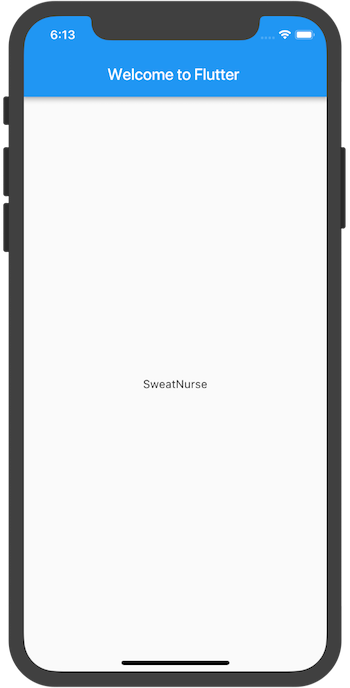

<figure class="right-figure" style="max-width: 260px; padding-right: 10px">
    
</figure>
这篇教程将指导你创建第一个 Flutter 应用程序。如果你熟悉面向对象程序设计和基本的编程概念（如变量，循环和条件），即可完成本教程。无需具有使用 Dart 语言或移动编程的相关经验。


TODO: (maybe, but later)
- Retake screenshots on the Android emulator? (Tao)
  Maybe alternate between Android and iOS emulators?
- Somehow cross link from code to text so people can restart
  and find their place more easily? (Tao)


* TOC
{:toc}

你需要做什么

完成一个简单的移动应用程序，为一家创业公司进行命名推荐。用户可以选择和取消选择名称，并保存最好的一个。代码一次生成十个名称。当用户滚动时，会新生成一批名称。用户可以点击应用栏右上方的列表图标，跳转到仅显示已被收藏的名称的列表页面。

这个GIF动画可以显示出该应用是如何工作的。

<b> <a id="whats-the-point" class="anchor" href="#whats-the-point" aria-hidden="true"></a>你将会学到:</b>

* Flutter 应用程序的基本结构。
* 查找和使用 package 来扩展功能。
* 使用热加载加快开发效率。
* 如何实现一个有状态的 widget 。
* 如何创建一个无限长度的延迟加载列表。
* 如何创建并导航到第二个页面。
* 如何使用主题更改应用程序的外观。

<b> <a id="whats-the-point" class="anchor" href="#whats-the-point" aria-hidden="true"></a>你将会用到:</b>

需要安装以下工具:

<ul markdown="1">
<li markdown="1"> Flutter SDK 
    Flutter SDK 包括 Flutter 的引擎，框架，控件，工具和 Dart SDK 。这个 codelab 需要 v0.1.4 或更高版本。
</li>
<li markdown="1"> Android Studio IDE 
    这个 codelab 基于 Android Studio IDE 构建，但也可以使用其他 IDE ，或者从命令行运行。
</li>
<li markdown="1"> 安装 IDE 插件 
    插件必须为您的编译器单独安装 Flutter 和 Dart 插件。除了Android Studio，Flutter和Dart插件也可用于 [VS Code](https://code.visualstudio.com/download) 和
    [IntelliJ](https://www.jetbrains.com/idea/download/#section=mac)IDE。
</li>
</ul>

有关如何设置环境的信息，请参阅 [Flutter安装和配置](/get-started/install/)。

# 第1步：创建初始Flutter应用

使用[第一个入门 Flutter 应用](/get-started/test-drive/#create-app)中的说明创建一个简单的模板化 Flutter 应用。将项目命名为 **startup_namer**（而不是*myapp*）。你将修改这个应用并最终完成它。

在这个 codelab 中，将主要编辑 Dart 代码所在的 **lib / main.dart**。

<aside class="alert alert-success" markdown="1">
<i class="fa fa-lightbulb-o"> </i> **小贴士：**
将代码粘贴到应用程序中时，缩进可能会错位。你可以使用 Flutter 工具自动修复此问题：

* Android Studio / IntelliJ IDEA: 右键单击 dart 代码，然后选择 **Reformat Code with dartfmt**。
* VS Code: 单击右键，选择 **Format Document**.
* 命令行: 运行 `flutter format <filename>`.
</aside>

<ol markdown="1">

<li markdown="1"> 替换 lib / main.dart 。 
删除 **lib / main.dart** 中的所有代码。替换为下面的代码，它在屏幕中心显示 “Hello World” 。


import 'package:flutter/material.dart';

void main() => runApp(new MyApp());

class MyApp extends StatelessWidget {
  @override
  Widget build(BuildContext context) {
    return new MaterialApp(
      title: 'Welcome to Flutter',
      home: new Scaffold(
        appBar: new AppBar(
          title: new Text('Welcome to Flutter'),
        ),
        body: new Center(
          child: new Text('Hello World'),
        ),
      ),
    );
  }
}

</li>

<li markdown="1"> 运行应用程序。现在应该可以看到下面的页面。

</li>
</ol>

小结

  <ul markdown="1">
  <li markdown="1"> 本示例创建了一个 Material app 。
      [Material](https://material.io/guidelines/) 设计语言是一套移动设备和网页上的视觉设计标准。Flutter 提供了一套丰富的 Material Widgets 。
  </li>
  <li markdown="1"> main 方法采用了 fat arrow (`=>`) 表示法，这是一种用于单行函数或方法的简写。
  </li>
  <li markdown="1"> 该 app 继承了使它本身成为一个 widget 的 StatelessWidget 类。在 Flutter 中，大多数时候一切都可以看作 widget , 包括 alignment，padding 和 layout 。
  </li>
  <li markdown="1"> Material 库中的 Scaffold widget 提供了默认的应用栏  (app bar)，标题和构成主页面 widget 树结构的 body 属性。 widget 的子树可以非常复杂。
  </li>
  <li markdown="1"> widget 的主要工作是提供一个`build()`方法，描述如何根据其他更低层级的 widget，来对这个 widget 进行展示。
  </li>
  <li markdown="1"> 本示例的 widget 树由包含了 Text child widget 的 Center widget 组成。Center widget 可将它的所有子树对齐到屏幕中心。
  </li>
</ul>

  Removing this for now. A) It might be confusing and B) the code as shown here is wrong.
  <li markdown="1"> Moving the “hello world” text into a separate widget,
      HelloWorld, results in an identical widget tree as the code above.
      (This code is informational only. You are starting with the Hello
      World code above.)

  <!-- skip -->
  
  import 'package: flutter/material.dart';

  class MyApp extends StatelessWidget {
   @override
   Widget build(BuildContext context) {
     return new MaterialApp(
       title: 'Welcome to Flutter',
       home: new Scaffold(
         appBar: new AppBar(
           title: new Text('Welcome to Flutter'),
         ),
         body: new Center(
           child: new Text('Hello World')
         ),
       ),
     );
   }
  }
  

  Update with this code:

  class HelloWorld extends StatelessWidget {
   @override
   Widget build(BuildContext context) {
     return new Center(
       child: new Text('Hello World'),
     );
   }
  }
  </li>


---

# 第2步：使用外部 package

在这一步，将开始使用名为 **english_words** 的开源软件包 ，其中包含数千个最常用的英文单词以及一些实用功能。

可以在 [pub.dartlang.org](https://pub.dartlang.org/flutter/) 上找到 [english_words](https://pub.dartlang.org/packages/english_words) 软件包以及其他许多开源软件包。

<ol markdown="1">

<li markdown="1"> pubspec 文件管理着 Flutter 应用程序的静态资源文件(assets)。
    在 **pubspec.yaml** 文件中， 将 **english_words**（3.1.0或更高版本）添加到依赖列表。新的一行高亮如下：

<!-- skip -->

dependencies:
  flutter:
    sdk: flutter

  cupertino_icons: ^0.1.0
  [[highlight]]english_words: ^3.1.0[[/highlight]]

</li>

<li markdown="1"> 在 Android Studio 的 editor 视图中查看 pubspec 时,
    点击右上角的 **Packages get** ，将把 package 拉取到项目中。现在应该可以在控制台中看到以下内容：

<!-- skip -->

flutter packages get
Running "flutter packages get" in startup_namer...
Process finished with exit code 0

</li>

<li markdown="1"> 在 **lib/main.dart** 中，为 `english_words` 添加导入，如高亮的行所示：

<!-- skip -->

import 'package:flutter/material.dart';
[[highlight]]import 'package:english_words/english_words.dart';[[/highlight]]


在键入该行时， Android Studio 会提供有关库导入的建议。然后将导入字符串显示为灰色，让你知道导入的库尚未使用（到目前为止）。
</li>

<li markdown="1"> 改用英文单词的 package 来生成文本，而不是字符串 “Hello World” 。

<aside class="alert alert-success" markdown="1">
<i class="fa fa-lightbulb-o"> </i> **小贴士：**
“Pascal case”（也被称为“大骆驼拼写法”），意味着字符串中的每个单词（包括第一个单词）都以大写字母开头。所以，“uppercamelcase” 变成 “UpperCamelCase” 。
</aside>

对代码进行以下更改，如高亮所示：

<!-- skip -->

import 'package:flutter/material.dart';
import 'package:english_words/english_words.dart';

void main() => runApp(new MyApp());

class MyApp extends StatelessWidget {
  @override
  Widget build(BuildContext context) {
    [[highlight]]final wordPair = new WordPair.random();[[/highlight]]
    return new MaterialApp(
      title: 'Welcome to Flutter',
      home: new Scaffold(
        appBar: new AppBar(
          title: new Text('Welcome to Flutter'),
        ),
        body: new Center(
          //child: new Text([[highlight]]'Hello World'[[/highlight]]), // Replace the highlighted text...
          child: new Text([[highlight]]wordPair.asPascalCase[[/highlight]]),  // With this highlighted text.
        ),
      ),
    );
  }
}

</li>

<li markdown="1"> 如果应用正在运行，请使用 Flutter Hot Reload (热重载)按钮
    ()更新应用程序。每次单击按钮或保存项目时，都会看到随机的词组文本，这是因为配对的词组是在 build 方法内部生成的，每次应用需要渲染时，或在 Flutter Inspector 中切换 Platform 时都会运行

</li>

</ol>

有问题吗？

如果应用程序运行不正常，请检查拼写错误。如有需要，可使用以下链接中的代码使项目恢复正常

* [**pubspec.yaml**](https://gist.githubusercontent.com/Sfshaza/bb51e3b7df4ebbf3dfd02a4a38db2655/raw/57c25b976ec34d56591cb898a3df0b320e903b99/pubspec.yaml)
(**pubspec.yaml**文件不会再更改。)
* [**lib/main.dart**](https://gist.githubusercontent.com/Sfshaza/bb51e3b7df4ebbf3dfd02a4a38db2655/raw/57c25b976ec34d56591cb898a3df0b320e903b99/main.dart)

---

# 第3步：添加有状态的widget

State<em>less</em> widgets 是不可改变的，这意味着它们的属性不能改变&mdash;&mdash;所有的值都是 final 的。

State<em>ful</em>widget 在其生命周期保持的状态可能会变化，实现一个有状态的 widget 至少需要两个类：StatefulWidgets类和State类，其中StatefulWidgets类创建了一个State类的实例。StatefulWidget类本身是不可变的，但State类可存在于Widget的整个生命周期中。

在这一步，将添加一个有状态的 RandomWords widget ，它可以创建其 State 类 RandomWordsState 。 State 类会为 widget 保存被推荐和被收藏的词组。

<ol markdown="1">
<li markdown="1"> 将有状态的 RandomWords widget 添加到 main.dart 。它可以在 MyApp 类之外的任何位置使用，但当前将把它放在文件底部。 RandomWords widget 除了创建 State 类之外几乎没有任何其他代码：

<!-- skip -->

class RandomWords extends StatefulWidget {
  @override
  createState() => new RandomWordsState();
}

</li>

<li markdown="1"> 添加 RandomWordsState 类。这个类保存了 RandomWords widget 的状态，该应用程序的大部分代码都放在该类中。这个类将保存随着用户的滑动操作而生成的无限增长的词组，以及保存用户收藏的词组，用户通过触发心形图标来添加或删除收藏的词组列表。

你可以一点点建立这个类。首先，通过以下高亮代码，创建一个最简的类：

<!-- skip -->

[[highlight]]class RandomWordsState extends State<RandomWords> {[[/highlight]]
[[highlight]]}[[/highlight]]

</li>

<li markdown="1"> 添加这个 state 类之后，IDE 会提示该类缺少 build 方法。接下来，需要添加一个基本的 build 方法，并将生成单词的代码行从 MyApp 类移动到 RandomWordsState 类的 build 方法中，生成词组。

将 build 方法添加到 RandomWordState 中，如高亮代码所示：

<!-- skip -->

class RandomWordsState extends State<RandomWords> {
  [[highlight]]@override[[/highlight]]
  [[highlight]]Widget build(BuildContext context) {[[/highlight]]
    [[highlight]]final wordPair = new WordPair.random();[[/highlight]]
    [[highlight]]return new Text(wordPair.asPascalCase);[[/highlight]]
  [[highlight]]}[[/highlight]]
}

</li>

<li markdown="1"> 根据高亮部分的更改，从 MyApp 中删除生成单词的代码：

<!-- skip -->

class MyApp extends StatelessWidget {
  @override
  Widget build(BuildContext context) {
    [[strike]]final wordPair = new WordPair.random();[[/strike]]  // Delete this line

    return new MaterialApp(
      title: 'Welcome to Flutter',
      home: new Scaffold(
        appBar: new AppBar(
          title: new Text('Welcome to Flutter'),
       ),
        body: new Center(
          //child: new [[highlight]]Text(wordPair.asPascalCase),[[/highlight]] // Change the highlighted text to...
          child: new [[highlight]]RandomWords(),[[/highlight]] // ... this highlighted text
        ),
      ),
    );
  }
}

</li>

</ol>

重启应用。如果尝试热重载，则可能会看到警告:


Reloading...
Not all changed program elements ran during view reassembly; consider
restarting.


这可能是一个误报，但可以考虑重启应用，以确保更改能正常反映在应用的 UI 界面中。

应用程序应该像之前一样运行，每次热重载或保存应用程序时都会显示一个词组。

有问题吗?

如果应用运行不正常，则可以使用以下链接中的代码使其恢复正常

* [**lib/main.dart**](https://gist.githubusercontent.com/Sfshaza/d7f13ddd8888556232476be8578efe40/raw/329c397b97309ce99f834bf70ebb90778baa5cfe/main.dart)

---

# 第4步：创建一个无限滚动的 ListView

在这一步，可以扩展 RandomWordsState 类，生成并展示词组列表。当用户滑动列表，ListView widget 中显示的列表将无限增长。 ListView 的 `builder` 工厂构造函数允许按需建立一个延迟加载的列表 view 。

<ol markdown="1">

<li markdown="1"> `_suggestions` 变量向 RandomWordsState 类中添加一个数组列表，用来保存推荐词组。 该变量以下划线(`_`)开头，在 Dart 语言中使用下划线前缀表示强制私有。

此外，添加一个 `biggerFont` 变量来增大字体。

<!-- skip -->

class RandomWordsState extends State<RandomWords> {
  [[highlight]]final _suggestions = <WordPair>[];[[/highlight]]

  [[highlight]]final _biggerFont = const TextStyle(fontSize: 18.0);[[/highlight]]
  ...
}

</li>

<li markdown="1"> 向 RandomWordsState 类添加一个 `_buildSuggestions()` 函数，用于构建一个显示词组的 ListView 。

ListView 类提供了一个 `itemBuilder` 属性，这是一个工厂 builder 并作为匿名函数进行回调。它有两个传入参数&mdash; BuildContext 上下文和行迭代器 `i` 。对于每个推荐词组都会执行一次函数调用，迭代器从 0 开始，每调用一次函数就累加 1 。这个模块允许推荐列表在用户滑动时无限增长。

添加如下高亮代码行：

<!-- skip -->

class RandomWordsState extends State<RandomWords> {
  ...
  [[highlight]]Widget _buildSuggestions() {[[/highlight]]
    [[highlight]]return new ListView.builder([[/highlight]]
      [[highlight]]padding: const EdgeInsets.all(16.0),[[/highlight]]
      // The itemBuilder callback is called once per suggested word pairing,
      // and places each suggestion into a ListTile row.
      // For even rows, the function adds a ListTile row for the word pairing.
      // For odd rows, the function adds a Divider widget to visually
      // separate the entries. Note that the divider may be difficult
      // to see on smaller devices.
      [[highlight]]itemBuilder: (context, i) {[[/highlight]]
        // Add a one-pixel-high divider widget before each row in theListView.
        [[highlight]]if (i.isOdd) return new Divider();[[/highlight]]

        // The syntax "i ~/ 2" divides i by 2 and returns an integer result.
        // For example: 1, 2, 3, 4, 5 becomes 0, 1, 1, 2, 2.
        // This calculates the actual number of word pairings in the ListView,
        // minus the divider widgets.
        [[highlight]]final index = i ~/ 2;[[/highlight]]
        // If you've reached the end of the available word pairings...
        [[highlight]]if (index >= _suggestions.length) {[[/highlight]]
          // ...then generate 10 more and add them to the suggestions list.
          [[highlight]]_suggestions.addAll(generateWordPairs().take(10));[[/highlight]]
        [[highlight]]}[[/highlight]]
        [[highlight]]return _buildRow(_suggestions[index]);[[/highlight]]
      [[highlight]]}[[/highlight]]
    [[highlight]]);[[/highlight]]
  [[highlight]]}[[/highlight]]
}

</li>

<li markdown="1"> 对于每个词组，`_buildSuggestions` 函数都调用一次 `_buildRow` 函数。这个函数每次会在一个 ListTile widget 中展示一条新词组，这将在下一步操作中，使一行数据更有表现力。

添加 `_buildRow` 函数到 RandomWordsState 类中：

<!-- skip -->

class RandomWordsState extends State<RandomWords> {
  ...

  [[highlight]]Widget _buildRow(WordPair pair) {[[/highlight]]
    [[highlight]]return new ListTile([[/highlight]]
      [[highlight]]title: new Text([[/highlight]]
        [[highlight]]pair.asPascalCase,[[/highlight]]
        [[highlight]]style: _biggerFont,[[/highlight]]
      [[highlight]]),[[/highlight]]
    [[highlight]]);[[/highlight]]
  [[highlight]]}[[/highlight]]
}

</li>

<li markdown="1"> 更新 RandomWordsState 类的 build 方法来使用 `_buildSuggestions()` 函数，而不是直接调用单词生成库。对高亮部分进行修改：

<!-- skip -->

class RandomWordsState extends State<RandomWords> {
  ...
  @override
  Widget build(BuildContext context) {
    [[strike]]final wordPair = new WordPair.random();[[/strike]] // Delete these two lines.
    [[strike]]Return new Text(wordPair.asPascalCase);[[/strike]]
    [[highlight]]return new Scaffold ([[/highlight]]
      [[highlight]]appBar: new AppBar([[/highlight]]
        [[highlight]]title: new Text('Startup Name Generator'),[[/highlight]]
      [[highlight]]),[[/highlight]]
    [[highlight]]body: _buildSuggestions(),[[/highlight]]
    [[highlight]]);[[/highlight]]
  }
  ...
}

</li>

<li markdown="1"> 更新 MyApp 类的 build 方法。从 MyApp 中删除 Scaffold 和 AppBar 实例。这些将由 RandomWordsState 类进行统一管理，这样在下一步操作中，可以使用户从一个页面导航到另一页面时，更方便的更改应用栏中的页面名称。

用下面高亮的 build 方法替换原始代码：

<!-- skip -->

class MyApp extends StatelessWidget {
  @override
  [[highlight]]Widget build(BuildContext context) {[[/highlight]]
    [[highlight]]return new MaterialApp([[/highlight]]
      [[highlight]]title: 'Startup Name Generator',[[/highlight]]
      [[highlight]]home: new RandomWords(),[[/highlight]]
    [[highlight]]);[[/highlight]]
  [[highlight]]}[[/highlight]]
}

</li>

</ol>

重启应用程序，将可以看到一个词组清单。尽量向下滑动，将继续看到新的词组。

有问题吗?

如果应用运行不正常，则可以使用以下链接中的代码使其恢复正常

* [**lib/main.dart**](https://gist.githubusercontent.com/Sfshaza/d6f9460a04d3a429eb6ac0b0f07da564/raw/34fe240f4122435c871bb737708ee0357741801c/main.dart)

---

# 第5步：添加可交互性

在这一步，将为每一行添加可点击的心形图标。当用户点击列表中的条目，切换其“收藏”状态，词组就会添加到收藏栏，或从已保存词组的收藏栏中删除。

<ol markdown="1">
<li markdown="1"> 添加一个 Set 集合 `_saved` 到 RandomWordsState 类。保存用户收藏的词组。Set 集合比 List 更适用于此，因为它不允许重复元素。

<!-- skip -->

class RandomWordsState extends State<RandomWords> {
  final _suggestions = <WordPair>[];

  [[highlight]]final _saved = new Set<WordPair>();[[/highlight]]

  final _biggerFont = const TextStyle(fontSize: 18.0);
  ...
}

</li>

<li markdown="1"> 在 `_buildRow` 函数中，添加 `alreadySaved` 标志检查来确保一个词组还没有被添加到收藏。

<!-- skip -->

  Widget _buildRow(WordPair pair) {
    [[highlight]]final alreadySaved = _saved.contains(pair);[[/highlight]]
    ...
  }

</li>

<li markdown="1"> 在 `_buildRow()` 的 ListTiles widget 中，添加一个心形图标来使用收藏功能，随后将添加与心形图标进行交互的功能。

添加以下高亮代码行：

<!-- skip -->

  Widget _buildRow(WordPair pair) {
    final alreadySaved = _saved.contains(pair);
    return new ListTile(
      title: new Text(
        pair.asPascalCase,
        style: _biggerFont,
      ),
      [[highlight]]trailing: new Icon([[/highlight]]
        [[highlight]]alreadySaved ? Icons.favorite : Icons.favorite_border,[[/highlight]]
        [[highlight]]color: alreadySaved ? Colors.red : null,[[/highlight]]
      [[highlight]]),[[/highlight]]
    );
  }

</li>

<li markdown="1"> 重启应用。现在应该可以在每一行看到心形图标，但还没有交互功能。
</li>

<li markdown="1"> 在 `_buildRow` 函数中使心形可点击。如果词条已经被加入收藏，再次点击它将从收藏中删除。当心形图标被点击，函数将调用 `setState()` 通知应用框架state已经改变。

添加高亮代码行：

<!-- skip -->

  Widget _buildRow(WordPair pair) {
    final alreadySaved = _saved.contains(pair);
    return new ListTile(
      title: new Text(
        pair.asPascalCase,
        style: _biggerFont,
      ),
      trailing: new Icon(
        alreadySaved ? Icons.favorite : Icons.favorite_border,
        color: alreadySaved ? Colors.red : null,
      ),
      [[highlight]]onTap: () {[[/highlight]]
        [[highlight]]setState(() {[[/highlight]]
          [[highlight]]if (alreadySaved) {[[/highlight]]
            [[highlight]]_saved.remove(pair);[[/highlight]]
          [[highlight]]} else {[[/highlight]]
            [[highlight]]_saved.add(pair);[[/highlight]]
          [[highlight]]}[[/highlight]]
        [[highlight]]});[[/highlight]]
      [[highlight]]},[[/highlight]]
    );
  }

</li>
</ol>

<aside class="alert alert-success" markdown="1">
<i class="fa fa-lightbulb-o"> </i> **小贴士：**
在 Flutter 的响应式风格框架中，调用 `setState()` ，将为 State 对象触发 `build()` 方法的调用，从而实现对UI的更新。
</aside>

热重载应用。可以点击任意一行来收藏或取消收藏条目。 请注意，点击一行可以产生从心形图标展开的泼墨动画效果。

有问题吗?

如果应用运行不正常，则可以使用以下链接中的代码使其恢复正常。

* [**lib/main.dart**](https://gist.githubusercontent.com/Sfshaza/936ce0059029a8c6e88aaa826a3789cd/raw/a3065d5c681a81eff32f75a9cd5f4d9a5b24f9ff/main.dart)

---

# 第6步：导航到新页面

在这一步，将添加一个显示收藏夹的新页面(在 Flutter 中称为 _route(路由)_)。你将学习如何在主路由和新路由之间导航。

在 Flutter 中， Navigator 管理着包含了应用程序所有路由的一个堆栈。将一个路由push到 Navigator 的堆栈，将显示更新为新页面路由。将一个路由 pull 出 Navigator 的堆栈，显示将返回到前一个页面路由。

<ol markdown="1">
<li markdown="1"> 在 RandomWordsState 类的 build 方法中，向 AppBar 添加一个列表图标。当用户点击列表图标时，包含了已收藏条目的新路由将被 push 到 Navigator 堆栈并显示新页面。

<aside class="alert alert-success" markdown="1">
<i class="fa fa-lightbulb-o"> </i> **小贴士：**
某些 widget 属性使用独立 widget(`child`) 和其他属性例如 `action` 组成一个子 widget 数组(`children`)，用方括号(`[]`)表示。
</aside>

将该图标及其相应的 action 操作添加到 build 方法中：

<!-- skip -->

class RandomWordsState extends State<RandomWords> {
  ...
  @override
  Widget build(BuildContext context) {
    return new Scaffold(
      appBar: new AppBar(
        title: new Text('Startup Name Generator'),
        [[highlight]]actions: <Widget>[[[/highlight]]
          [[highlight]]new IconButton(icon: new Icon(Icons.list), onPressed: _pushSaved),[[/highlight]]
        [[highlight]]],[[/highlight]]
      ),
      body: _buildSuggestions(),
    );
  }
  ...
}

</li>

<li markdown="1"> 向 RandomWordsState 类添加一个 `_pushSaved()` 函数。

<!-- skip -->

class RandomWordsState extends State<RandomWords> {
  ...
  [[highlight]]void _pushSaved() {[[/highlight]]
  [[highlight]]}[[/highlight]]
}


重新加载应用程序。列表图标将出现在应用栏中。点击它不会有任何响应，因为 `_pushSaved` 这个函数还未实现功能。
</li>

<li markdown="1"> 当用户点击应用栏中的列表图标时，将建立一个新路由并 push 到 Navigator 的路由堆栈中，这个操作将改变界面显示，展示新的路由页面。

新页面的内容使用匿名函数在 MaterialPageRoute widget的`builder`属性中创建。

将函数调用添加到 Navigator.push 中作为参数,如高亮代码所示，将路由 push 到 Navigator 的堆栈中。

<!-- skip -->

  [[highlight]]void _pushSaved() {[[/highlight]]
    [[highlight]]Navigator.of(context).push([[/highlight]]
    [[highlight]]);[[/highlight]]
  [[highlight]]}[[/highlight]]

</li>

<li markdown="1"> 添加 MaterialPageRoute widget 及其 builder 属性。先添加生成 ListTile  widget 的代码。其中 ListTile 的 `divideTiles()` 方法为每个 ListTile widget 之间添加水平间距。`divided`变量保存最终生成的所有行，并用 `toList()` 函数转换为列表。

<!-- skip -->

  void _pushSaved() {
    Navigator.of(context).push(
      [[highlight]]new MaterialPageRoute([[/highlight]]
        [[highlight]]builder: (context) {[[/highlight]]
          [[highlight]]final tiles = _saved.map([[/highlight]]
                [[highlight]](pair) {[[/highlight]]
              [[highlight]]return new ListTile([[/highlight]]
                [[highlight]]title: new Text([[/highlight]]
                  [[highlight]]pair.asPascalCase,[[/highlight]]
                  [[highlight]]style: _biggerFont,[[/highlight]]
                [[highlight]]),[[/highlight]]
              [[highlight]]);[[/highlight]]
            [[highlight]]},[[/highlight]]
          [[highlight]]);[[/highlight]]
          [[highlight]]final divided = ListTile[[/highlight]]
              [[highlight]].divideTiles([[/highlight]]
            [[highlight]]context: context,[[/highlight]]
            [[highlight]]tiles: tiles,[[/highlight]]
          [[highlight]])[[/highlight]]
              [[highlight]].toList();[[/highlight]]
        [[highlight]]},[[/highlight]]
      [[highlight]]),[[/highlight]]
    );
  }

</li>

<li markdown="1"> builder 属性返回一个 Scaffold widget ，其中包含了应用栏标题名为 “Saved Suggestions” 的新路由页面。新页面的body属性由包含多个 ListTile widget 的 ListView 组成。

添加如下高亮代码：

<!-- skip -->

  void _pushSaved() {
    Navigator.of(context).push(
      new MaterialPageRoute(
        builder: (context) {
          final tiles = _saved.map(
                (pair) {
              return new ListTile(
                title: new Text(
                  pair.asPascalCase,
                  style: _biggerFont,
                ),
              );
            },
          );
          final divided = ListTile
              .divideTiles(
            context: context,
            tiles: tiles,
          )
              .toList();

          [[highlight]]return new Scaffold([[/highlight]]
            [[highlight]]appBar: new AppBar([[/highlight]]
              [[highlight]]title: new Text('Saved Suggestions'),[[/highlight]]
            [[highlight]]),[[/highlight]]
            [[highlight]]body: new ListView(children: divided),[[/highlight]]
          [[highlight]]);[[/highlight]]
        },
      ),
    );
  }

</li>

<li markdown="1"> 热重载应用程序。对一些条目点击收藏，然后点击应用栏右侧的列表图标。显示出包含收藏夹列表的新页面。注意，Navigator 会在应用栏左侧添加一个“返回”按钮。不必再显式实现 Navigator.pop 。点击返回按钮会返回到主页面。
</li>
</ol>

有问题吗?

如果应用运行不正常，则可以使用以下链接中的代码使其恢复正常。

* [**lib/main.dart**](https://gist.github.com/Sfshaza/bc5547e112e4dc3a1aa87afdf917caeb)

---
# 第7步：使用主题更改UI

在最后一步中，将使用该应用的主题。 _theme_ 控制的是应用程序的观感。可以使用默认主题，该主题取决于使用的模拟器或真机，也可以自定义主题以反映你的品牌。

<ol markdown="1">
<li markdown="1"> 可以通过配置 ThemeData 类轻松更改应用程序的主题。应用程序目前使用默认主题，现在将更改主要颜色为白色。

将高亮代码添加到 MyApp 类中，可以把应用程序的主题更改为白色：

<!-- skip -->

class MyApp extends StatelessWidget {
  @override
  Widget build(BuildContext context) {
    return new MaterialApp(
      title: 'Startup Name Generator',
      [[highlight]]theme: new ThemeData([[/highlight]]
        [[highlight]]primaryColor: Colors.white,[[/highlight]]
      [[highlight]]),[[/highlight]]
      home: new RandomWords(),
    );
  }
}

</li>

<li markdown="1"> 热重载应用程序。请注意，整个背景都是白色的，甚至包括应用栏。
</li>

<li markdown="1"> 作为读者的练习，可使用 [ThemeData](https://docs.flutter.io/flutter/material/ThemeData-class.html) 来改变用户界面的其他方面。 Material 库中的 [Colors](https://docs.flutter.io/flutter/material/Colors-class.html) 类提供了多种可以使用的颜色常量，而热重载使用户界面的修改变得简单快捷。
</li>
</ol>

有问题吗?

如果又不能正常运行了，请使用以下链接中的代码查看最终应用的代码。

* [**lib/main.dart**](https://gist.githubusercontent.com/Sfshaza/c07c91a4061fce4b5eacaaf4d82e4993/raw/4001a72c0133b97c8e16bdeb3195ca03525696bd/main.dart)

---

# 干得漂亮！

您已经编写了一个可在 iOS 和 Android 上运行的交互式 Flutter 应用程序。在这个codelab中，已经完成了：

* 从头开始创建一个 Flutter 应用程序。
* 编写 Dart 语言代码。
* 使用外部的第三方库。
* 使用热重载加快开发。
* 实现了一个有状态的 widget，为你的应用增加可交互性。
* 用 ListView 和 ListTiles 创建了一个延迟加载的无限滚动列表。
* 创建了一个路由，并添加在主页面路由和新路由之间跳转的逻辑。
* 学习如何使用主题更改应用程序的UI外观。

下一步

[下一步: 学习更多](/get-started/learn-more/)
