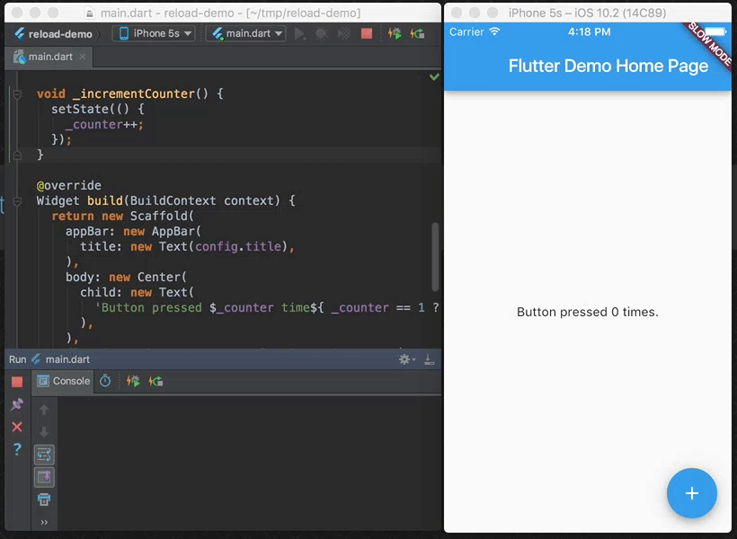

* TOC
{:toc}

## 使用热重载

Flutter 的热重载特性可以帮您方便快捷地尝试和构建用户界面，添加特性，修复 bug。  热重载通过将更新后的源码注入到运行中的 Dart 虚拟机（ VM ）的方式工作。在虚拟机更新了拥有新版字段或函数的类后，Flutter 框架会自动重建控件树，这样您就可以快速地看到改动产生的影响。

去热重载一个 Flutter 应用：

1.  通过受支持的 Intellij IDE 或命令行窗口运行应用，目标设备可以是真机也可以是虚拟机。
1.  修改工程中的某个 Dart 文件。热重载支持多数类型的源码改动，还有一些改动需要重启才能生效，详情查看[Limitations](#limitations).
1.  如果您在使用支持 Flutter IDE 工具的 Intellij 工作，
选择 **Save All** (`cmd-s`/`ctrl-s`),  或者点击工具栏上的热重载按钮：

   

如果使用 `flutter run` 通过命令行运行应用，则在命令行窗口输入 `r` 。

热重载成功后，会在控制台看到类似如下信息：

```
Performing hot reload...
Reloaded 1 of 448 libraries in 2,777ms.
```
应用更新反映出您的改动，并且当前状态—上面例子中的计数器变量的值—已经被保存。您的应用在运行热重载命令之前的位置继续执行。

代码变化只有 Dart 源码在改动后重新运行才会有可见的影响，下一节描述了热重载后改动的代码不会再次运行的常见场景。在某些情况下，对 Dart 代码的微小更改将使您能够继续使用热重载。

## 编译错误

当代码更改引入编译错误时，热重载总是会生成类似如下的错误消息:

```
Hot reload was rejected:
'/Users/obiwan/Library/Developer/CoreSimulator/Devices/AC94F0FF-16F7-46C8-B4BF-218B73C547AC/data/Containers/Data/Application/4F72B076-42AD-44A4-A7CF-57D9F93E895E/tmp/ios_testWIDYdS/ios_test/lib/main.dart': warning: line 16 pos 38: unbalanced '{' opens here
  Widget build(BuildContext context) {
                                     ^
'/Users/obiwan/Library/Developer/CoreSimulator/Devices/AC94F0FF-16F7-46C8-B4BF-218B73C547AC/data/Containers/Data/Application/4F72B076-42AD-44A4-A7CF-57D9F93E895E/tmp/ios_testWIDYdS/ios_test/lib/main.dart': error: line 33 pos 5: unbalanced ')'
    );
    ^
```
在这种情况下，纠正指定行上的错误以继续使用热重载。

## 前状态与新代码相结合。

Flutter 的热重载特性，有时描述为有状态热重载，即保存应用的状态。 这个设计可以让您在不丢失状态的情况下查看代码改动的影响。 例如，如果您的应用需要用户登录，您可以在导航层次结构中，修改并热重载页面的几个级别，无需重新输入登录凭据，状态已被保存，这通常是期望的行为。 

如果代码改动影响应用的状态（或者它的依赖）， 您的应用程序需要处理的数据可能与它从头开始执行的数据不完全一致。 热重载和重启结果可能产生不同的行为。

例如，如果您修改了一个类定义，从继承 StatelessWidget 改为 StatefulWidget  (或反向)，在热重加载后，您的应用程序的前一个状态会被保留。但是，该状态可能不兼容新的变化。

考虑如下代码：

```
class myWidget extends StatelessWidget {
  Widget build(BuildContext context) {
    return new GestureDetector(onTap: () => print('T'));
  }
}
```
运行应用后，如果您做出如下改动：

```
class myWidget extends StatefulWidget {
  @override
  State createState() => new myWidgetState();
}
class myWidgetState {
...
...
}
```

然后热重载，控制台显示一个断言失败，类似于: 

```
myWidget is not a subtype of StatelessWidget
```

在这些情况下，需要重新启动来查看更新后的应用程序。 


##包含最近的代码更改，但不包含应用状态。

Dart 中， [静态字段是懒加载的](https://news.dartlang.org/2012/02/static-variables-no-longer-have-to-be.html). 这意味着，当您首次运行 Flutter 应用程序并读取静态字段时，它将被赋值为初始化器设定的值。全局变量和静态字段被视为状态，因此在热重载时不会重新初始化。

如果您改动了全局变量和静态字段的初始化器，需要重新启动才能看到结果。例如，考虑如下代码：

```
final sampleTable = [
  new Table("T1"),
  new Table("T2"),
  new Table("T3"),
  new Table("T4"),
];
```
运行应用后，做如下修改：
```
final sampleTable = [
  new Table("T1"),
  new Table("T2"),
  new Table("T3"),
  new Table("T10"),    //modified
];
```
然后重加载，改动没有体现出来。

相反的，在下面的例子中：
```
const foo = 1;
final bar = foo;
void onClick(){
  print(foo);
  print(bar);
}
```
首次运行应用打印 `1` 和 `1` 。然后，如果您做出如下改变：
```
const foo = 2;    //modified
final bar = foo;
void onClick(){
  print(foo);
  print(bar);
}
```
热重载，现在打印 `2` 和 `1` 。对 `const` 修饰字段的改动总会被热重载，但静态字段初始器则不会重新运行。概念上， `const` 字段被当作别名而不是状态。

当一组更改需要完全重新启动才生效时，Dart VM 会检测初始化器更改并标记。在上面的示例中，大多数初始化工作都触发了标记机制，但不适用于以下情况:

```
final bar = foo;
```
为了能够更新 `foo` 并查看热重加载后的更改，可以考虑重新定义字段为 `const`，或者使用 getter 返回值，而不是使用 `final` 。例如:

```
const bar = foo;
```
or:

```
get bar => foo;
```

阅读更多关于 Dart 中 [`const` 和 `final` 关键字的不同](https://news.dartlang.org/2012/06/const-static-final-oh-my.html) . 

## 最近的UI更改被排除在外

即使热重载操作看起来成功了并且没有产生异常，有些代码更改在刷新后的界面中可能并不可见。这种现象在应用的 `main()` 方法更改后很常见。


一般规则，如果修改后的代码是根控件的构建方法的下游，那么热重加载的行为就像预期的那样。但是，如果修改后的代码不会因为重建控件树而被重新执行，那么在热重加载之后，您就不会看到它的效果了。

例如，考虑以下代码:
```
import 'package:flutter/material.dart';

void main() {
  runApp(new MyApp());
}

class MyApp extends StatelessWidget {
  Widget build(BuildContext context) {
    return new GestureDetector(
      onTap: () => print('tapped'));
  }
}
```

运行此应用程序后，您可能会更改以下代码:

```
import 'package:flutter/widgets.dart';
void main() {
  runApp(
    const Center(
      child: const Text('Hello', textDirection: TextDirection.ltr)));
  }
```


在完全重启之后，程序重新开始执行新版本的 `main()` ，并构建一个显示文本 `Hello` 的控件树。

但是，如果在此更改之后热加载应用程序， `main()` 不会被重新执行，而控件树将以 `MyApp` 不变的实例作为根控件重新构建。结果在热重重载后没有明显的变化。

## 限制

您可能还会遇到不支持热重载的罕见情况。这些包括:

*  枚举类型更改为常规类，或将常规类更改为枚举类型。例如，如果您改变:

    ```
    enum Color {
      red,
      green,
      blue
    }

    ```

    改为:
    ```
    class Color {
      Color(this.i, this.j);
      final Int i;
      final Int j;
    	}
    ```

*   泛型类型声明被修改。例如，如果您改变:
    ```
    class A<T> {
      T i;
    }
    ```
	改为:

    ```
    class A<T, V> {
      T i;
      V v;
    }
    ```

在这些情况下，热重加载会生成诊断消息并在不提交任何更改的情况下执行失败。
