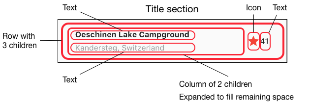
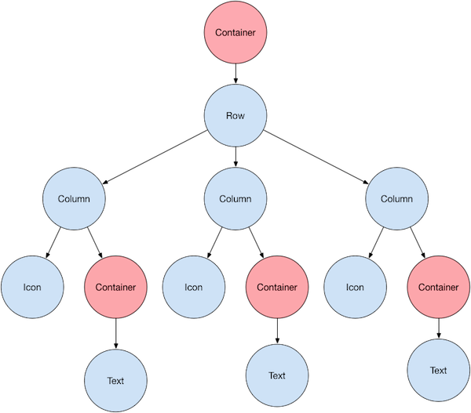
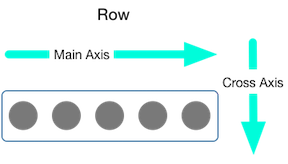
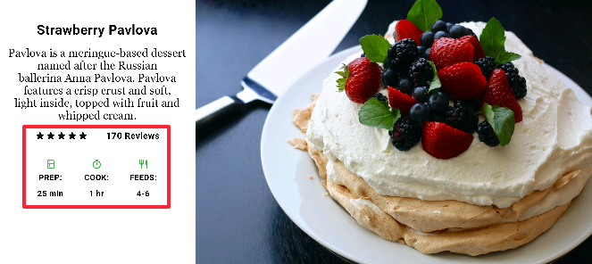
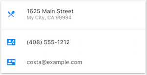

<b> <a id="whats-the-point" class="anchor" href="#whats-the-point" aria-hidden="true"></a>我们将会学习:</b>

* Flutter的布局机制是如何工作的。
* 如何让我们的控件做到水平或垂直布局。
* 如何以Flutter的方式去构建布局。

本文是一篇介绍如何在Flutter中构建布局的教程，接着下来你将会学习如何构建和布局出以下的界面：

本教程首先会花点时间讲述如何使用Flutter的方式去布局，然后展示如何在界面上放置一个控件。
接着在学习完如何让控件做到水平布局和垂直布局，还会讲述一些平时常用的布局控件。

* [构建一个布局](#building)
  * [第 1 步: 配置环境](#step-0)
  * [第 2 步: 图解布局](#step-1)
  * [第 3 步: 实现标题行](#step-2)
  * [第 4 步: 实现按钮行](#step-3)
  * [第 5 步: 实现文本部分](#step-4)
  * [第 6 步: 实现图像部分](#step-5)
  * [第 7 步: 整合一起](#step-6)
* [以Flutter的方式进行布局](#approach)
* [布局一个控件](#lay-out-a-widget)
* [水平或垂直地布局多个控件](#rows-and-columns)
  * [对齐控件](#alignment)
  * [调整控件尺寸](#sizing)
  * [挤压控件](#packing)
  * [嵌套行和列](#nesting)
* [常用布局控件](#common-layout-widgets)
  * [基础控件](#standard-widgets)
  * [Material 组件](#material-components)
* [资源](#resources)

## 构建一个布局

如果你想了解Flutter的布局机制，你可以从[以Flutter的方式进行布局](#approach)开始。

### 第一步: 配置环境

首先获取代码:

* 确定你已经[配置](/get-started/install/)好你的开发环境。
* [创建一个简单的Flutter应用](/get-started/test-drive/#create-app).

然后将图像资源添加到你的应用：

* 在你的项目最外层，创建一个 `images` 文件夹。
* 添加[`lake.jpg`](https://github.com/flutter/website/blob/master/_includes/code/layout/lakes/images/lake.jpg)。
* 更新[`pubspec.yaml`](https://raw.githubusercontent.com/flutter/website/master/_includes/code/layout/lakes/pubspec.yaml)文件中的 `assets` 一节，这样才可以让你的代码可以访问该图像。

### 第二步: 图解布局

第一步将布局分解成基本元素：
* 识别出行和列。
* 这个布局是否包含一个网格。
* 是否有元素重叠。
* 界面是否需要标签页。
* 注意需要对齐、填充或边框的区域. 

首先找出比较大的元素。而在这个示例中，四个比较大的元素会被排列在一个 Column 控件中，这四个元素分别是：一张图像，两个 Row 控件 和一个文本块。

下一步，图解每个 Row 控件中内容，在第一个 Row 中，我们称它为 Title section，它拥有 3 个子元素：一列文本（一个 Column 控件包裹两个 Text 控件），一个星星图标和一个数字。
在它的第一个子元素，Column 控件包裹着两行文本，而这个 Column 控件占据着大部分的空间，所以 Column 控件又必须需要被 Expanded 控件包裹。

在第二个 Row 中，我们称它为 Button section, 它同样拥有 3 个子元素：每个子元素都是一个 Column 控件包裹着一个图标和文本。

一旦图解布局完成，它是非常容易使用自底向上的方法去实现布局。为了减小布局代码深层嵌套所造成的视觉迷惑，可以将部分实现放到变量或者方法中。

### 第三步：实现标题行

首先，需要先构建title section左边列的布局。我们将 Column 控件放到 Expanded 控件中去，能够拉伸 Column 控件占据 row 中所有空闲的空间。然后再将 Column 的 `crossAxisAlignment` 属性设置为 `CrossAxisAlignment.start` 能够将 Column 控件放到 row 中开始的地方。

接着将第一行的文本放到一个 Container 控件中，就能在文本周围增加内边距，再将第二行文本颜色设置为灰色。

最后，就剩下两个元素：一个红色的星星图标 和 一个文本 “41“。把最后两个元素放置好后，将整个标题行放到一个 Container 控件中，并设置四周的内边距为 32 像素。

以下就是实现标题行布局的代码：

<aside class="alert alert-info" markdown="1">
**注意:**
如果实现过程中遇到问题，你可以参照这里的代码[`lib/main.dart`](https://raw.githubusercontent.com/flutter/website/master/_includes/code/layout/lakes/main.dart)
on GitHub.
</aside>

<!-- code/layout/lakes/main.dart -->
<!-- skip -->

class MyApp extends StatelessWidget {
  @override
  Widget build(BuildContext context) {
    Widget titleSection = new Container(
      padding: const EdgeInsets.all(32.0),
      child: new Row(
        children: [
          new Expanded(
            child: new Column(
              crossAxisAlignment: CrossAxisAlignment.start,
              children: [
                new Container(
                  padding: const EdgeInsets.only(bottom: 8.0),
                  child: new Text(
                    'Oeschinen Lake Campground',
                    style: new TextStyle(
                      fontWeight: FontWeight.bold,
                    ),
                  ),
                ),
                new Text(
                  'Kandersteg, Switzerland',
                  style: new TextStyle(
                    color: Colors.grey[500],
                  ),
                ),
              ],
            ),
          ),
          new Icon(
            Icons.star,
            color: Colors.red[500],
          ),
          new Text('41'),
        ],
      ),
    );
  //...
}


<aside class="alert alert-success" markdown="1">
<i class="fa fa-lightbulb-o"> </i> **提示:**
当把代码复制到你的应用的时候，缩进可能会不正确。你可以通过在 IntelliJ 中右击 Dart 代码选择**Reformat with Dart Style** 或者 在命令行中使用 [dartfmt](https://github.com/dart-lang/dart_style) 修复代码格式问题。
</aside>

<aside class="alert alert-success" markdown="1">
<i class="fa fa-lightbulb-o"> </i> **提示:**
如果希望获得更快速的开发体验，可以尝试 Flutter 的热加载特性。
热加载允许你修改代码，不用重启应用就能够看到修改；而 [IntelliJ 的 Flutter 插件](/using-ide/) 已经支持热加载，或者你可以在命令行中触发。想了解更多信息，可以看这里[热加载 vs 应用重启](https://flutter.io/using-ide/#hot-reloads-vs-full-application-restarts)。
</aside>

### 第四步：实现按钮行

按钮部分包含 3 列相同布局的内容：都是一个图标在一行文本上。而这行中的列是均匀间隔的，而且文本和图标颜色都是
使用主色调（primary color），这里使用的蓝色主色调是在应用的 `build()` 里面设置的。

<!-- code/layout/lakes/main.dart -->
<!-- skip -->

class MyApp extends StatelessWidget {
  @override
  Widget build(BuildContext context) {
    //...

    return new MaterialApp(
      title: 'Flutter Demo',
      theme: new ThemeData(
        primarySwatch: Colors.blue,
      ),

    //...
}


因为构建每一行的代码几乎是相同的，所以创建一个嵌套函数是最有高效的方式，例如  `buildButtonColumn()` 函数，它会接受一个图标和一个文本作为参数，然后返回一个 Column 控件并且已经将他们的颜色设置为主色调蓝色。

<!-- code/layout/lakes/main.dart -->
<!-- skip -->

class MyApp extends StatelessWidget {
  @override
  Widget build(BuildContext context) {
    //...

    Column buildButtonColumn(IconData icon, String label) {
      Color color = Theme.of(context).primaryColor;

      return new Column(
        mainAxisSize: MainAxisSize.min,
        mainAxisAlignment: MainAxisAlignment.center,
        children: [
          new Icon(icon, color: color),
          new Container(
            margin: const EdgeInsets.only(top: 8.0),
            child: new Text(
              label,
              style: new TextStyle(
                fontSize: 12.0,
                fontWeight: FontWeight.w400,
                color: color,
              ),
            ),
          ),
        ],
      );
    }
  //...
}


构建函数让图标直接添加到列中。然后为了在文本上方添加内边距，将文本放入容器中，这样就令文本与图标间隔开了。

通过传递[图标](https://docs.flutter.io/flutter/material/Icons-class.html)和文本来调用该构建函数，就可以构建这些列。接着使用`MainAxisAlignment.spaceEvenly`属性来让每一列前中后均匀地安排空间。

<!-- code/layout/lakes/main.dart -->
<!-- skip -->

class MyApp extends StatelessWidget {
  @override
  Widget build(BuildContext context) {
    //...

    Widget buttonSection = new Container(
      child: new Row(
        mainAxisAlignment: MainAxisAlignment.spaceEvenly,
        children: [
          buildButtonColumn(Icons.call, 'CALL'),
          buildButtonColumn(Icons.near_me, 'ROUTE'),
          buildButtonColumn(Icons.share, 'SHARE'),
        ],
      ),
    );
  //...
}


### 第五步：实现文本部分 

将相当长的文本部分定义为变量。 将文本放入容器中，以便沿每条边添加32像素的内边距。 softwrap属性指示文本是否应在软换行符（如句点或逗号）上断开。

<!-- code/layout/lakes/main.dart -->
<!-- skip -->

class MyApp extends StatelessWidget {
  @override
  Widget build(BuildContext context) {
    //...

    Widget textSection = new Container(
      padding: const EdgeInsets.all(32.0),
      child: new Text(
        '''
Lake Oeschinen lies at the foot of the Blüemlisalp in the Bernese Alps. Situated 1,578 meters above sea level, it is one of the larger Alpine Lakes. A gondola ride from Kandersteg, followed by a half-hour walk through pastures and pine forest, leads you to the lake, which warms to 20 degrees Celsius in the summer. Activities enjoyed here include rowing, and riding the summer toboggan run.
        ''',
        softWrap: true,
      ),
    );
  //...
}


### 第五步：实现图像部分

现在四列元素中的三个已经完成，只剩下图像部分。 该图像可以在Creative Commons许可下[在线](https://images.unsplash.com/photo-1471115853179-bb1d604434e0?dpr=1&amp;auto=format&amp;fit=crop&amp;w=767&amp;h=583&amp;q=80&amp;cs=tinysrgb&amp;crop=)获得，但是它比较大下载缓慢。 在[第一步](#step-0)中，您将该图像包含在项目中并更新了[pubspec文件](https://raw.githubusercontent.com/flutter/website/master/_includes/code/layout/lakes/pubspec.yaml)，以便现在可以从代码中引用它：

<!-- code/layout/lakes/main.dart -->
<!-- skip -->

body: new ListView(
  children: [
    new Image.asset(
      'images/lake.jpg',
      height: 240.0,
      fit: BoxFit.cover,
    ),
    // ...
  ],
)


`BoxFit.cover`的作用是告诉框架图像应该缩放到至少能够覆盖整个元素。

### 第七步：整合一起

在最后一步，你需要把他们整合在一起。 这些控件都会被摆放在 ListView 中而不是在 Column 中，因为在小屏幕的设备上运行应用程序时， 可以自动滚动。

<!-- skip -->
<!-- code/layout/lakes/main.dart -->

//...
body: new ListView(
  children: [
    new Image.asset(
      'images/lake.jpg',
      width: 600.0,
      height: 240.0,
      fit: BoxFit.cover,
    ),
    titleSection,
    buttonSection,
    textSection,
  ],
),
//...


**Dart code:** [main.dart](https://raw.githubusercontent.com/flutter/website/master/_includes/code/layout/lakes/main.dart) 
**Image:** [images](https://github.com/flutter/website/tree/master/_includes/code/layout/lakes/images) 
**Pubspec:** [pubspec.yaml](https://raw.githubusercontent.com/flutter/website/master/_includes/code/layout/lakes/pubspec.yaml)

顺利完成！当你使用热重载刷新应用程序时，应该会看到截图中显示的相同布局。 你还可以通过学习这个[教程](/tutorials/interactive/)，然后在布局上添加一些交互。

## Flutter的布局方法

<b> <a id="whats-the-point" class="anchor" href="#whats-the-point" aria-hidden="true"></a>要点是什么?</b>

* 控件是用作构建UI的类。
* 控件可以同时用作布局和呈现UI的元素。
* 通过组合简单的控件来构建复杂的控件。

Flutter的布局机制的核心是控件。 在Flutter中，几乎所有东西都是一个控件 - 甚至布局模型也是一样。 你在Flutter应用中看到的图像，图标和文本都是控件。但是你没有看到的东西也是控件，例如排列，约束和对齐可见小部件的行，列和网格。

你可以通过组合控件来创建一个布局以便构建更复杂的控件。 例如，左边的屏幕截图显示了3个图标，每个图标下有一个标签：

&nbsp;&nbsp;&nbsp;&nbsp;&nbsp;&nbsp;

第二个屏幕截图展示布局的结构，这里是一行3列，每列包含一个图标和一个标签.

<aside class="alert alert-info" markdown="1">
**注意:** 本教程中的大多数屏幕截图均以debugPaintSizeEnabled设置为true显示，以便您可以看到布局的结构。了解更多信息
[Visual debugging](https://flutter.io/debugging/#visual-debugging)和[Debugging Flutter Apps](https://flutter.io/debugging/#visual-debugging).
</aside>

以下就是这个UI的控件树图：

大部分应该看起来正如你所想到一样，但你可能想了解容器（以粉红色显示）。Container是一个控件，并且允许您自定义其子控件。 如果要添加内边距，外边距，边框或背景色，可以在创建容器时设置对应的属性值。

在这个例子中，每个文本控件放置在容器中以添加外边距。整个行也被放置在容器中以在行的周围添加内边距。

本例中的其余UI由属性控制。使用其颜色属性设置图标的颜色。 使用文本的样式属性来设置字体，颜色，重量等等。列和行的属性允许您指定他们的孩子如何垂直或水平对齐，以及子控件应占用多少空间。

## 布局一个控件

<b> <a id="whats-the-point" class="anchor" href="#whats-the-point" aria-hidden="true"></a>要点是什么?</b>


* 创建一个 [Image](https://docs.flutter.io/flutter/widgets/Image-class.html),
  [Icon](https://docs.flutter.io/flutter/widgets/Icon-class.html),
  或者 [Text](https://docs.flutter.io/flutter/widgets/Text-class.html) 控件。
* 将它添加到布局控件中, 例如
  [Center](https://docs.flutter.io/flutter/widgets/Center-class.html),
  [Align](https://docs.flutter.io/flutter/widgets/Align-class.html),
  [SizedBox](https://docs.flutter.io/flutter/widgets/SizedBox-class.html),
  或者 [ListView](https://docs.flutter.io/flutter/widgets/ListView-class.html) 。
* 将布局控件添加到根控件树中。

* 甚至应用本身都是一个控件。
* 在Flutter中是很容易创建一个控件然后添加控件布局中。
* 为了在设备上显示控件需要将控件添加到app控件上
* 在Flutter中最方便就是使用
  [Scaffold](https://docs.flutter.io/flutter/material/Scaffold-class.html),
  它是Material Components库中的一个控件，它会提供默认的标题栏，背景颜色，并且具有添加drawer，snack bar和bottom sheets的API
* 如果您愿意，可以构建仅使用控件库中的标准控件的应用程序。

如何在Flutter中布置单个控件？本节介绍如何创建一个简单的控件并将其显示在屏幕上。它还显示了一个简单的Hello World应用程序的完整代码。

在Flutter中，只需几个步骤即可在屏幕上放置文本，图标或图像。

<ol markdown="1">
<li markdown="1"> 选择一个布局控件来保存该对象. 
    根据你想要对齐或约束控件的方式，从各种布局控件中进行选择，因为这些特性通常会传递到所包含的控件中。这个例子使用Center控件，它将内容水平和垂直居中。
</li>

<li markdown="1"> 创建一个控件来容纳可见对象。 

<aside class="alert alert-info" markdown="1">
**Note:**
Flutter应用都是使用[Dart语言](https://www.dartlang.org/)编写的。
如果你了解Java或者类似的面向对象语言，你会对Dart感到相当熟悉。如果没有的话，你可以使用[DartPad](https://www.dartlang.org/tools/dartpad)，一个可以在任何浏览器上使用的交互式Dart playground，还有[Language Tour](https://www.dartlang.org/guides/language)提供了Dart语言功能的概述。
</aside>

例如, 创建一个Text控件:

<!-- skip -->

new Text('Hello World', style: new TextStyle(fontSize: 32.0))


创建一个Image控件:

<!-- skip -->

new Image.asset('images/myPic.jpg', fit: BoxFit.cover)


创建一个Icon控件:

<!-- skip -->

new Icon(Icons.star, color: Colors.red[500])


</li>
将可见小部件添加到布局小部件。
如果所有布局小部件带有一个子元素（例如Center或Container），则它们具有一个子属性，如果它们带有小部件列表（例如Row，Column，ListView或Stack），则它们具有子属性。
<li markdown="1"> 将可视控件添加到布局控件中。 
    如果所有布局控件只能带有一个子控件（例如Center或Container），则它们具有一个 `child` 属性，如果它们带有控件列表（例如Row，Column，ListView或Stack），则它们具有 `children` 属性。

添加 Text 控件到 Center 控件中:

<!-- skip -->

new Center(
  child: new Text('Hello World', style: new TextStyle(fontSize: 32.0))


</li>

<li markdown="1"> 添加布局控件到页面中。 
  Flutter应用本身就是一个控件，而大部分控件都有一个[build()](https://docs.flutter.io/flutter/widgets/StatelessWidget/build.html)方法。只要在应用程序的 `build` 方法中声明控件就可以在设备上显示出来。

  对于 Material 应用程序，您可以将 Center 控件直接添加到主页的 body 属性上。

<!-- code/layout/hello-world/main.dart -->
<!-- skip -->

class _MyHomePageState extends State<MyHomePage> {
  @override
  Widget build(BuildContext context) {
    return new Scaffold(
      appBar: new AppBar(
        title: new Text(widget.title),
      ),
      body: new Center(
        child: new Text('Hello World', style: new TextStyle(fontSize: 32.0)),
      ),
    );
  }
}


<aside class="alert alert-info" markdown="1">
**注意:**
Material Components 库实现了遵循 [Material Design principles](https://material.io/guidelines/) 原则的控件。在设计用户界面时，您可以专门使用标准[widgets library](https://docs.flutter.io/flutter/widgets/widgets-library.html)中的控件，也可以使用[Material Components](https://docs.flutter.io/flutter/material/material-library.html)中的控件。你可以混合使用两个库中的控件，可以自定义现有的控件，也可以构建自己的一组定制的控件。
</aside>

对于非 Material 应用，你可以直接添加 Center 控件到应用的 `build()` 方法：

<!-- code/layout/widgets-only/main.dart -->
<!-- skip -->

// This app doesn't use any Material Components, such as Scaffold.
// Normally, an app that doesn't use Scaffold has a black background
// and the default text color is black. This app changes its background
// to white and its text color to dark grey to mimic a Material app.
import 'package:flutter/material.dart';

void main() {
  runApp(new MyApp());
}

class MyApp extends StatelessWidget {
  @override
  Widget build(BuildContext context) {
    return new Container(
      decoration: new BoxDecoration(color: Colors.white),
      child: new Center(
        child: new Text('Hello World',
            style: new TextStyle(fontSize: 40.0, color: Colors.black87)),
      ),
    );
  }
}


请注意，默认情况下，非 Material 应用不会包含 AppBar ，标题或背景颜色。 如果你想在非 Material 应用中使用这些特性，你必须自己构建它们。而上面例子中将将背景颜色更改为白色，将文本更改为深灰色以模仿Material应用程序。

</li>

</ol>

当你运行应用时就可以看到以下界面：

**Dart code** (Material app): [main.dart](https://raw.githubusercontent.com/flutter/website/master/_includes/code/layout/hello-world/main.dart) 
**Dart code** (widgets-only app): [main.dart](https://raw.githubusercontent.com/flutter/website/master/_includes/code/layout/widgets-only/main.dart)

## 垂直和水平放置多个控件

最常见的布局模式之一是垂直或水平排列控件。你可以使用 Row 控件水平排列控件，并使用 Column 控件垂直排列控件。

<b> <a id="whats-the-point" class="anchor" href="#whats-the-point" aria-hidden="true"></a>要点是什么？</b>

* Row 和 Column 是两种最常用的布局模式。
* Row 和 Column 都拥有一个控件列表。
* 子控件本身可以是 Row，Column，或者其他复杂的控件。
* 你可以指定 Row 或 Column 如何在垂直和水平方向上对齐其子控件。
* 你可以拉伸或约束特定的子控件。
* 你可以指定子控件如何使用 Row 或 Column 的可用空间。

### Contents

* [对齐控件](#alignment)
* [调整控件的大小](#sizing)
* [挤压控件](#packing)
* [嵌套行和列](#nesting)

要在 Flutter 中创建行或列，可以将一个控件列表添加到 [Row](https://docs.flutter.io/flutter/widgets/Row-class.html) 或 [Column](https://docs.flutter.io/flutter/widgets/Column-class.html) 控件中。反过来，每个子控件本身可以是一个 Row 或 Column 控件，依此类推。以下示例显示如何在行或列之间互相嵌套。

以下布局按行组织。该行包含两个子控件：左侧的 Column 控件和右侧的 Image 控件：

 

The left column's widget tree nests rows and columns.

左侧的 Column 的控件树包含行和列。

 

你将在将在 [嵌套行和列](#nesting) 中实现一些 Pavlova 的布局代码。

<aside class="alert alert-info" markdown="1">
**注意:** 
Row 和 Column 是水平和垂直布局的基本原始控件，这些低级控件允许最大化的自定义。Flutter还提供专门的，更高级别的控件，可能足以满足您的需求。例如，你可能更喜欢 [ListTile](https://docs.flutter.io/flutter/material/ListTile-class.html) ，而不是 Row ，它是一个易于使用的控件，具有前导和尾随图标属性以及最多3行文本。你也可能更喜欢 ListView ，而不是 Column，这是一种 column-like 布局，如果其内容太长而不能适应可用空间，则会自动滚动。有关更多信息，请参阅[Common layout widgets](#common-layout-widgets)。
</aside>

### 对齐控件

您可以使用 mainAxisAlignment 和 crossAxisAlignment 属性控制行或列的排列方式。

 

 

 

[MainAxisAlignment](https://docs.flutter.io/flutter/rendering/MainAxisAlignment-class.html)
和 [CrossAxisAlignment](https://docs.flutter.io/flutter/rendering/CrossAxisAlignment-class.html)
提供了用于控制对齐的各种常量

<aside class="alert alert-info" markdown="1">
**注意:** 
将图像添加到项目中时，需要更新 pubspec 文件以访问它们 - 本示例使用 `Image.asset` 来显示图像。 有关更多信息，请参阅此示例的 [pubspec.yaml](https://raw.githubusercontent.com/flutter/website/master/_includes/code/layout/row/pubspec.yaml) 文件，或[在Flutter中添加资源和图像](/assets-and-images)。 如果您使用Image.network来引用网络图像，则不需要执行此操作。
</aside>

在以下示例中，3个图像中的都是100像素宽。 渲染盒（render box）的（在这种情况下，整个屏幕）宽度超过300像素，因此将主轴对齐设置为 `spaceEvenly` 将会在水平方向上均匀划分剩余的空间。

 



 

**Dart code:** [main.dart](https://raw.githubusercontent.com/flutter/website/master/_includes/code/layout/row/main.dart) 
**Images:** [images](https://github.com/flutter/website/tree/master/_includes/code/layout/row/images) 
**Pubspec:** [pubspec.yaml](https://raw.githubusercontent.com/flutter/website/master/_includes/code/layout/row/pubspec.yaml)

 

Column 的工作方式与 Row 相同。以下示例显示了一列3个图像，每个图像高100个像素。 渲染盒（render box）（在这种情况下，整个屏幕）的高度大于300像素，因此将主轴对齐设置为 `spaceEvenly` 将会在垂直方向上均匀划分剩余的空间。

 



**Dart code:** [main.dart](https://raw.githubusercontent.com/flutter/website/master/_includes/code/layout/column/main.dart) 
**Images:** [images](https://github.com/flutter/website/tree/master/_includes/code/layout/column/images) 
**Pubspec:** [pubspec.yaml](https://raw.githubusercontent.com/flutter/website/master/_includes/code/layout/column/pubspec.yaml)

 

 

<aside class="alert alert-info" markdown="1">
**注意:**
如果布局太大而不适合该设备，则会在受影响的边缘出现红色条带。例如，以下截图中的行对于设备的屏幕来说太宽了：

通过使用 Expanded 控件，可以控件的大小设置为适合行或列，这在下面的 [调整控件大小](#sizing) 部分可以了解到。
</aside>

### 调整控件大小

也许你想要一个控件占据其兄弟控件两倍的空间。您可以将行或列的子控件放到 [Expanded](https://docs.flutter.io/flutter/widgets/Expanded-class.html) 控件中，以控制沿着主轴的控件大小。Expanded 控件具有 `flex` 属性，它是一个整数，用于确定控件的弹性因子。Expanded 控件的默认弹性因子是1。

例如，要创建一个由三个控件组成的行，其中中间控件的宽度是其他两个控件两倍，请将中间控件的弹性系数设置为2：

 



 

**Dart code:** [main.dart](https://raw.githubusercontent.com/flutter/website/master/_includes/code/layout/row-expanded/main.dart) 
**Images:** [images](https://github.com/flutter/website/tree/master/_includes/code/layout/row-expanded/images) 
**Pubspec:** [pubspec.yaml](https://raw.githubusercontent.com/flutter/website/master/_includes/code/layout/row-expanded/pubspec.yaml)

 

要修复上一节中的示例，其中3行图像的行对于其渲染框太宽了，并且导致红色条，请使用 Expanded 控件来包装每个控件。 默认情况下，每个控件的弹性因子为1，将会把行的三分之一空间平均分配给每个控件。

 



 

**Dart code:** [main.dart](https://raw.githubusercontent.com/flutter/website/master/_includes/code/layout/row-expanded-2/main.dart) 
**Images:** [images](https://github.com/flutter/website/tree/master/_includes/code/layout/row-expanded-2/images) 
**Pubspec:** [pubspec.yaml](https://raw.githubusercontent.com/flutter/website/master/_includes/code/layout/row-expanded-2/pubspec.yaml)

 

### 挤压控件

默认情况下，行或列沿着其主轴占据尽可能多的空间，但如果要将子控件紧密挤压一起，请将 `mainAxisSize` 设置为`MainAxisSize.min`。 以下示例使用此属性将星形图标挤压在一起。

 

<!-- code/layout/packed/main.dart -->
<!-- skip -->

class _MyHomePageState extends State<MyHomePage> {
  @override
  Widget build(BuildContext context) {
    var packedRow = new Row(
      mainAxisSize: MainAxisSize.min,
      children: [
        new Icon(Icons.star, color: Colors.green[500]),
        new Icon(Icons.star, color: Colors.green[500]),
        new Icon(Icons.star, color: Colors.green[500]),
        new Icon(Icons.star, color: Colors.black),
        new Icon(Icons.star, color: Colors.black),
      ],
    );

  // ...
}


 

**Dart code:** [main.dart](https://raw.githubusercontent.com/flutter/website/master/_includes/code/layout/packed/main.dart) 
**Icons:** [Icons class](https://docs.flutter.io/flutter/material/Icons-class.html) 
**Pubspec:** [pubspec.yaml](https://raw.githubusercontent.com/flutter/website/master/_includes/code/layout/packed/pubspec.yaml)

 

### 嵌套行和列

布局框架允许你根据需要在行和列内部嵌套行和列。让我们看下面的布局的矩形框部分的代码：

矩形框部分实现为两行。评级行包含五颗星星和评论数量。图标行包含三列图标和文本。

评级行的控件树：

 

`ratings` 变量创建一行，其中包含一行较小的5星形图标和文本：

<!-- code/layout/pavlova/main.dart -->
<!-- skip -->

class _MyHomePageState extends State<MyHomePage> {
  @override
  Widget build(BuildContext context) {
    //...

    var ratings = new Container(
      padding: new EdgeInsets.all(20.0),
      child: new Row(
        mainAxisAlignment: MainAxisAlignment.spaceEvenly,
        children: [
          new Row(
            mainAxisSize: MainAxisSize.min,
            children: [
              new Icon(Icons.star, color: Colors.black),
              new Icon(Icons.star, color: Colors.black),
              new Icon(Icons.star, color: Colors.black),
              new Icon(Icons.star, color: Colors.black),
              new Icon(Icons.star, color: Colors.black),
            ],
          ),
          new Text(
            '170 Reviews',
            style: new TextStyle(
              color: Colors.black,
              fontWeight: FontWeight.w800,
              fontFamily: 'Roboto',
              letterSpacing: 0.5,
              fontSize: 20.0,
            ),
          ),
        ],
      ),
    );
    //...
  }
}


<aside class="alert alert-success" markdown="1">
<i class="fa fa-lightbulb-o"> </i> **提示:**
为了最大限度地减少由嵌套严重的布局代码引起的视觉混淆，可以在变量和函数中实现UI的各个部分。
</aside>

评级行下方的图标行包含3列；每个列都包含一个图标和两行文本，您可以在其控件树中看到：

The `iconList` variable defines the icons row:

<!-- code/layout/pavlova/main.dart -->
<!-- skip -->

class _MyHomePageState extends State<MyHomePage> {
  @override
  Widget build(BuildContext context) {
    // ...

    var descTextStyle = new TextStyle(
      color: Colors.black,
      fontWeight: FontWeight.w800,
      fontFamily: 'Roboto',
      letterSpacing: 0.5,
      fontSize: 18.0,
      height: 2.0,
    );

    // DefaultTextStyle.merge allows you to create a default text
    // style that is inherited by its child and all subsequent children.
    var iconList = DefaultTextStyle.merge(
      style: descTextStyle,
      child: new Container(
        padding: new EdgeInsets.all(20.0),
        child: new Row(
          mainAxisAlignment: MainAxisAlignment.spaceEvenly,
          children: [
            new Column(
              children: [
                new Icon(Icons.kitchen, color: Colors.green[500]),
                new Text('PREP:'),
                new Text('25 min'),
              ],
            ),
            new Column(
              children: [
                new Icon(Icons.timer, color: Colors.green[500]),
                new Text('COOK:'),
                new Text('1 hr'),
              ],
            ),
            new Column(
              children: [
                new Icon(Icons.restaurant, color: Colors.green[500]),
                new Text('FEEDS:'),
                new Text('4-6'),
              ],
            ),
          ],
        ),
      ),
    );
    // ...
  }
}


`leftColumn` 变量包含评分和图标行，以及描述 Pavlova 的标题和文本：

<!-- code/layout/pavlova/main.dart -->
<!-- skip -->

class _MyHomePageState extends State<MyHomePage> {
  @override
  Widget build(BuildContext context) {
    //...

    var leftColumn = new Container(
      padding: new EdgeInsets.fromLTRB(20.0, 30.0, 20.0, 20.0),
      child: new Column(
        children: [
          titleText,
          subTitle,
          ratings,
          iconList,
        ],
      ),
    );
    //...
  }
}


左列放置在容器中以约束其宽度。 最后，在 Card 内使用整个行（包含左列和图像）构建UI。

Pavlova图像来自 [Pixabay](https://pixabay.com/en/photos/?q=pavlova&image_type=&cat=&min_width=&min_height=)，可以在Creative Commons许可下使用。你可以使用 `Image.network` 从网络中嵌入图像，但对于此示例，图像将保存到项目中的图像目录中，添加到pubspec文件并使用 `Images.asset` 访问。 有关更多信息，请参阅[在Flutter中添加资源和图图像](/assets-and-images)。

<!-- code/layout/pavlova/main.dart -->
<!-- skip -->

body: new Center(
  child: new Container(
    margin: new EdgeInsets.fromLTRB(0.0, 40.0, 0.0, 30.0),
    height: 600.0,
    child: new Card(
      child: new Row(
        crossAxisAlignment: CrossAxisAlignment.start,
        children: [
          new Container(
            width: 440.0,
            child: leftColumn,
          ),
          mainImage,
        ],
      ),
    ),
  ),
),


 

**Dart code:** [main.dart](https://raw.githubusercontent.com/flutter/website/master/_includes/code/layout/pavlova/main.dart) 
**Images:** [images](https://github.com/flutter/website/tree/master/_includes/code/layout/pavlova/images) 
**Pubspec:** [pubspec.yaml](https://raw.githubusercontent.com/flutter/website/master/_includes/code/layout/pavlova/pubspec.yaml)

 

<aside class="alert alert-success" markdown="1">
<i class="fa fa-lightbulb-o"> </i> **提示:**

Pavlova 示例在宽屏设备（如平板电脑）上水平运行效果最佳。 如果您在iOS模拟器中运行此示例，则可以使用 **Hardware > Device** 菜单选择其他设备。 对于这个例子，我们推荐 iPad Pro。 您可以使用 **Hardware > Rotate** 将其方向更改为横向模式。 您还可以使用 **Window > Scale** 更改模拟器窗口的大小（不更改逻辑像素的数量）。

</aside>

 

## 常用的布局控件

Flutter 拥有丰富的布局控件，但这里有一些最常用的布局控件，列出这些控件目的是让你能够尽可能快地上手和开发应用。 有关其他可用控件的信息，请参阅 [Widget Overview](https://flutter.io/widgets/) ，或使用[API文档](https://docs.flutter.io/)中的搜索框。此外，API文档中的控件页面经常会提供有关可能更适合你需求的类似控件的建议。

以下控件部分为两类：[控件库](https://docs.flutter.io/flutter/widgets/widgets-library.html)中的标准控件和[Material Components库](https://docs.flutter.io/flutter/material/material-library.html)中的专用控件。任何应用程序都可以使用控件库，但只有 Material 应用程序可以使用 Material Components 库。
### 标准控件

* [Container](#container)
: 可以将内边距，外边距，边框，背景颜色或其他装饰添加到控件。
* [GridView](#gridview)
: 可以将控件布局为可滚动的表格。
* [ListView](#listview)
: 可以将控件布局为可滚动的列表。
* [Stack](#stack)
: 可以将控件覆盖到另一个控件上

### Material组件

* [Card](#card)
: 可以在带圆角和投影的盒子中进行布局。

* [ListTile](#listtile)
: 包括三行文本，可选图标和标题

### Container

许多布局会通过容器使用内边距分隔控件，或者添加边框和外边距。你可以通过将整个布局放入容器并更改其背景颜色或图像来更改设备的背景。

 

#### Container 总结:

* 添加内边距，外边距和边框
* 改变背景颜色和背景图像
* 可以容纳一个子控件，这个控件也可以是 Row 或 Column ，甚至控件树的根结点。

 

 

#### 容器示例:

除了下面的例子之外，本教程中的许多示例都使用 Container 。 您还可以在 [Flutter Gallery](https://github.com/flutter/flutter/tree/master/examples/flutter_gallery) 中找到更多容器示例。

 

该布局由两列组成，每列包含2个图像。 每个图像使用一个 Container 来添加一个圆形的灰色边框和边距。包含图像行的列使用容器将背景颜色更改为浅灰色。

**Dart code:** [main.dart](https://raw.githubusercontent.com/flutter/website/master/_includes/code/layout/container/main.dart), snippet below 
**Images:** [images](https://github.com/flutter/website/tree/master/_includes/code/layout/container/images) 
**Pubspec:** [pubspec.yaml](https://raw.githubusercontent.com/flutter/website/master/_includes/code/layout/container/pubspec.yaml)

 

 

<!-- code/layout/container/main.dart -->
<!-- skip -->

class _MyHomePageState extends State<MyHomePage> {
  @override
  Widget build(BuildContext context) {

    var container = new Container(
      decoration: new BoxDecoration(
        color: Colors.black26,
      ),
      child: new Column(
        children: [
          new Row(
            children: [
              new Expanded(
                child: new Container(
                  decoration: new BoxDecoration(
                    border: new Border.all(width: 10.0, color: Colors.black38),
                    borderRadius:
                        const BorderRadius.all(const Radius.circular(8.0)),
                  ),
                  margin: const EdgeInsets.all(4.0),
                  child: new Image.asset('images/pic1.jpg'),
                ),
              ),
              new Expanded(
                child: new Container(
                  decoration: new BoxDecoration(
                    border: new Border.all(width: 10.0, color: Colors.black38),
                    borderRadius:
                        const BorderRadius.all(const Radius.circular(8.0)),
                  ),
                  margin: const EdgeInsets.all(4.0),
                  child: new Image.asset('images/pic2.jpg'),
                ),
              ),
            ],
          ),
          // ...
          // [[highlight]]See the definition for the second row on GitHub:[[/highlight]]
          // [[highlight]]https://raw.githubusercontent.com/flutter/website/master/_includes/code/layout/container/main.dart[[/highlight]]
        ],
      ),
    );
    //...
  }
}


### GridView

使用 [GridView](https://docs.flutter.io/flutter/widgets/GridView-class.html) 将控件布局为二维列表。 GridView 提供了两个预设的网格，或者您可以构建自己的自定义网格。当 GridView 检测到其内容太长而不适合渲染框时，它会自动滚动。

#### GridView 总结:

* 在网格中布局控件
* 检测到垂直内容何时超过渲染框并自动提供滚动
* 构建您自己的自定义网格，或使用以下框架提供的网格：
  * `GridView.count` 允许您指定列数
  * `GridView.extent` 允许您指定单元格的最大像素宽度

* Use `MediaQuery.of(context).orientation` to create a grid that changes
  its layout depending on whether the device is in landscape or portrait mode.


<aside class="alert alert-info" markdown="1">
**注意:**
当显示一个二维列表，其中重要的是确定一个单元格占据哪个行和列（例如，它是 “avocado” 行的 “calorie” 列中的条目）时，可以使用 [Table](https://docs.flutter.io/flutter/widgets/Table-class.html) 或 [DataTable](https://docs.flutter.io/flutter/material/DataTable-class.html)。
</aside>

#### GridView 示例:

 

使用 `GridView.extent` 创建一个最大宽度为150像素的网格。 
**Dart code:** [main.dart](https://raw.githubusercontent.com/flutter/website/master/_includes/code/layout/grid/main.dart), snippet below 
**Images:** [images](https://github.com/flutter/website/tree/master/_includes/code/layout/grid/images) 
**Pubspec:** [pubspec.yaml](https://raw.githubusercontent.com/flutter/website/master/_includes/code/layout/grid/pubspec.yaml)

 

使用 `GridView.count` 在纵向模式下创建2个宽度的网格，在横向模式下创建3个宽度的网格。标题是通过设置每个 GridTile 的`footer` 属性创建的。 
**Dart code:** [grid_list_demo.dart](https://github.com/flutter/flutter/blob/master/examples/flutter_gallery/lib/demo/material/grid_list_demo.dart)
from the [Flutter
Gallery](https://github.com/flutter/flutter/tree/master/examples/flutter_gallery)

 

<!-- code/layout/grid/main.dart -->
<!-- skip -->

// The images are saved with names pic1.jpg, pic2.jpg...pic30.jpg.
// The List.generate constructor allows an easy way to create
// a list when objects have a predictable naming pattern.
List<Container> _buildGridTileList(int count) {

  return new List<Container>.generate(
      count,
      (int index) =>
          new Container(child: new Image.asset('images/pic${index+1}.jpg')));
}

Widget buildGrid() {
  return new GridView.extent(
      maxCrossAxisExtent: 150.0,
      padding: const EdgeInsets.all(4.0),
      mainAxisSpacing: 4.0,
      crossAxisSpacing: 4.0,
      children: _buildGridTileList(30));
}

class _MyHomePageState extends State<MyHomePage> {
  @override
  Widget build(BuildContext context) {
    return new Scaffold(
      appBar: new AppBar(
        title: new Text(widget.title),
      ),
      body: new Center(
        child: buildGrid(),
      ),
    );
  }
}


### ListView

[ListView](https://docs.flutter.io/flutter/widgets/ListView-class.html) 是一个类似 Column 的控件，当它的内容对于其渲染框太长时会自动提供滚动。

#### ListView 总结:

* 一个类似 Column 布局的控件
* 可以在水平或垂直方向上进行布局
* 内容超长时可以提供滚动
* 比 Column 更少配置，但更易于使用并支持滚动

#### ListView 示例:

 

使用 ListView 和 ListTiles 显示业务列表。分隔线将条目分开。 
**Dart code:** [main.dart](https://raw.githubusercontent.com/flutter/website/master/_includes/code/layout/listview/main.dart), snippet below 
**Icons:** [Icons class](https://docs.flutter.io/flutter/material/Icons-class.html) 
**Pubspec:** [pubspec.yaml](https://raw.githubusercontent.com/flutter/website/master/_includes/code/layout/listview/pubspec.yaml)

 

使用 ListView 显示 [Material Design面板](https://material.io/guidelines/style/color.html)中的[Colors](https://docs.flutter.io/flutter/material/Colors-class.html)。 
**Dart code:** [colors_demo.dart](https://github.com/flutter/flutter/blob/master/examples/flutter_gallery/lib/demo/colors_demo.dart)
from the [Flutter
Gallery](https://github.com/flutter/flutter/tree/master/examples/flutter_gallery)

 

<!-- code/layout/listview/main.dart -->
<!-- skip -->

List<Widget> list = <Widget>[
  new ListTile(
    title: new Text('CineArts at the Empire',
        style: new TextStyle(fontWeight: FontWeight.w500, fontSize: 20.0)),
    subtitle: new Text('85 W Portal Ave'),
    leading: new Icon(
      Icons.theaters,
      color: Colors.blue[500],
    ),
  ),
  new ListTile(
    title: new Text('The Castro Theater',
        style: new TextStyle(fontWeight: FontWeight.w500, fontSize: 20.0)),
    subtitle: new Text('429 Castro St'),
    leading: new Icon(
      Icons.theaters,
      color: Colors.blue[500],
    ),
  ),
  // ...
  // [[highlight]]See the rest of the column defined on GitHub:[[/highlight]]
  // [[highlight]]https://raw.githubusercontent.com/flutter/website/master/_includes/code/layout/listview/main.dart[[/highlight]]
];

class _MyHomePageState extends State<MyHomePage> {
  @override
  Widget build(BuildContext context) {
    return new Scaffold(
      // ...
      body: new Center(
        child: new ListView(
          children: list,
        ),
      ),
    );
  }
}


### Stack

使用 [Stack](https://docs.flutter.io/flutter/widgets/Stack-class.html) 来安排控件放到基础控件上面 - 通常是图像。这样控件可以完全或部分与基础控件互相重叠。

#### Stack 总结:

* 用于与另一个控件重叠的控件
* 控件列表的第一个控件是基础控件，其他的控件都会覆盖到该控件上
* Stack 的内容是不能滚动的
* 你可以选择剪切超过渲染框的内容

#### Stack examples:

 

使用 Stack 叠加容器（在半透明的黑色背景上显示其文本），放在 Circle Avatar 上。然后Stack 使用 `alignment` 属性和Alignments偏移文本。 
**Dart code:** [main.dart](https://raw.githubusercontent.com/flutter/website/master/_includes/code/layout/stack/main.dart), snippet below 
**Image:** [images](https://github.com/flutter/website/tree/master/_includes/code/layout/stack/images) 
**Pubspec:** [pubspec.yaml](https://raw.githubusercontent.com/flutter/website/master/_includes/code/layout/stack/pubspec.yaml)

 

使用 Stack 将渐变叠加到图像上。渐变可以让工具栏的图标与图像不同。 
**Dart code:** [contacts_demo.dart](https://github.com/flutter/flutter/blob/master/examples/flutter_gallery/lib/demo/contacts_demo.dart)
from the [Flutter
Gallery](https://github.com/flutter/flutter/tree/master/examples/flutter_gallery)

 

<!-- code/layout/stack/main.dart -->
<!-- skip -->

class _MyHomePageState extends State<MyHomePage> {
  @override
  Widget build(BuildContext context) {
    var stack = new Stack(
      alignment: const Alignment(0.6, 0.6),
      children: [
        new CircleAvatar(
          backgroundImage: new AssetImage('images/pic.jpg'),
          radius: 100.0,
        ),
        new Container(
          decoration: new BoxDecoration(
            color: Colors.black45,
          ),
          child: new Text(
            'Mia B',
            style: new TextStyle(
              fontSize: 20.0,
              fontWeight: FontWeight.bold,
              color: Colors.white,
            ),
          ),
        ),
      ],
    );
    // ...
  }
}


### Card

Material 组件库中的卡片包含相关的信息块，可以由大多数控件构成，但通常与ListTile一起使用。Card 只有一个子控件，但其子控件可以是支持多个子控件的 Column，Row，List，Grid或其他控件。 默认情况下，卡片将其大小缩小为0像素。你可以使用 [SizedBox](https://docs.flutter.io/flutter/widgets/SizedBox-class.html) 来约束 Card 的大小。

在Flutter中，Card 具有稍微圆润的角落和阴影，使其具有3D效果。 更改 Card 的 `elevation` 属性可让您控制投影效果。 例如，将 `elevation` 设置为24.0，将卡片从视觉上抬离表面并使阴影变得更加分散。有关支持的 `elevation` 的列表，请参见[Material guidelines](https://material.io/guidelines/) 中的 [Elevation and
Shadows](https://material.io/guidelines/material-design/elevation-shadows.html)。如果指定不支持的值将完全禁用投影。

#### Card 总结:

* 实现了 [Material Design
  Card](https://material.io/guidelines/components/cards.html) 的控件
* 用于呈现相关信息的块
* 只接受单个子控件，但该控件可以是Row，Column或其他包含子级列表的控件
* 显示圆角和阴影
* Card 的内容不能滚动
* 来自 Material 组件库

#### Card 示例:

 

该 Card 控件包含3个 ListTile 并用 SizedBox 进行大小调整。分隔符分隔第一个和第二个ListTile。

**Dart code:** [main.dart](https://raw.githubusercontent.com/flutter/website/master/_includes/code/layout/card/main.dart), snippet below 
**Icons:** [Icons class](https://docs.flutter.io/flutter/material/Icons-class.html) 
**Pubspec:** [pubspec.yaml](https://raw.githubusercontent.com/flutter/website/master/_includes/code/layout/card/pubspec.yaml)

 

该 Card 控件包含一个图像和文本 
**Dart code:** [cards_demo.dart](https://github.com/flutter/flutter/blob/master/examples/flutter_gallery/lib/demo/material/cards_demo.dart)
from the [Flutter
Gallery](https://github.com/flutter/flutter/tree/master/examples/flutter_gallery)

 

<!-- code/layout/card/main.dart -->
<!-- skip -->

class _MyHomePageState extends State<MyHomePage> {
  @override
  Widget build(BuildContext context) {
    var card = new SizedBox(
      height: 210.0,
      child: new Card(
        child: new Column(
          children: [
            new ListTile(
              title: new Text('1625 Main Street',
                  style: new TextStyle(fontWeight: FontWeight.w500)),
              subtitle: new Text('My City, CA 99984'),
              leading: new Icon(
                Icons.restaurant_menu,
                color: Colors.blue[500],
              ),
            ),
            new Divider(),
            new ListTile(
              title: new Text('(408) 555-1212',
                  style: new TextStyle(fontWeight: FontWeight.w500)),
              leading: new Icon(
                Icons.contact_phone,
                color: Colors.blue[500],
              ),
            ),
            new ListTile(
              title: new Text('costa@example.com'),
              leading: new Icon(
                Icons.contact_mail,
                color: Colors.blue[500],
              ),
            ),
          ],
        ),
      ),
    );
  //...
}


### ListTile

ListTile 是 Material 组件库中的一个专门的行控件，用于创建包含最多3行文本和可选的前导和尾随图标的行。 ListTile 在Card 或 ListView 中最常用，但也可以在别处使用。

#### ListTile 总结:

* 包含最多3行文本和可选图标的专用行
* 比 Row 更少的配置，但更易于使用
* 来自 Material 组件库

#### ListTile examples:

 

包含3个 ListTiles 的 Card 
**Dart code:** See [Card examples](#card-examples).

 

使用ListTile列出3个下拉按钮。 
**Dart code:** [buttons_demo.dart](https://github.com/flutter/flutter/blob/master/examples/flutter_gallery/lib/demo/material/buttons_demo.dart)
from the [Flutter
Gallery](https://github.com/flutter/flutter/tree/master/examples/flutter_gallery)

 

## 资源

编写布局代码时以下资源可能会有所帮助。

* [控件概览](/widgets) 
  介绍Flutter中提供的许多控件。
* [HTML/CSS 模式](/web-analogs) 
  主要面向那些熟悉网络编程的人，这个页面将介绍如何将HTML / CSS功能映射到Flutter中。
* [Flutter
  Gallery](https://github.com/flutter/flutter/tree/master/examples/flutter_gallery) 
  该应用程序展示了许多 Material Design 控件和其他Flutter功能。
* [Flutter API 文档](https://docs.flutter.io/) 
  所有 Flutter 库的参考文档。
* [如何在 Flutter 中处理框约束](/layout) 
  讨论控件如何受其渲染框约束。
* [在 Flutter 中添加图像和资源](/assets-and-images) 
  说明如何将图像和其他资源添加到应用程序包中。
* [从零开始尝试 Flutter ](https://medium.com/@mravn/zero-to-one-with-flutter-43b13fd7b354#.z86tsq4ld) 
  一个人写他的第一个Flutter应用程序的经验。
