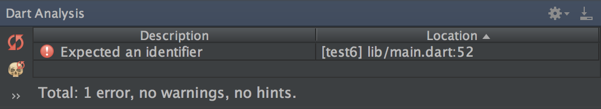
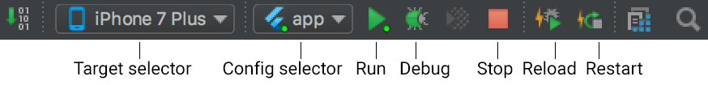
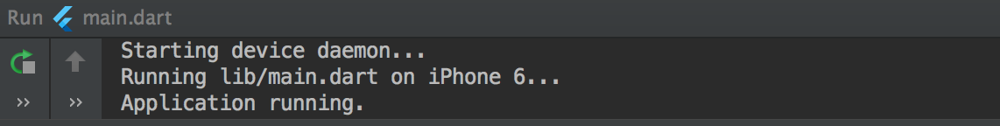
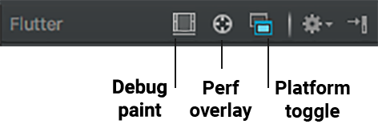
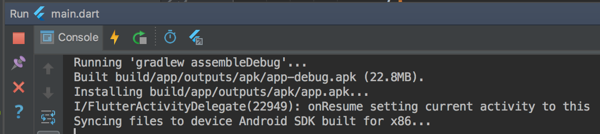
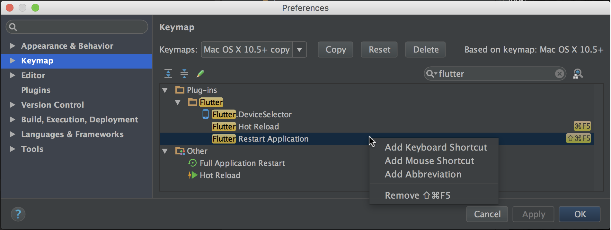

<ul class="tabs__top-bar">
    <li class="tab-link current" >Android Studio / IntelliJ</li>
    <li class="tab-link" data-tab-href="/using-ide-vscode/">VS Code</li>
</ul>

Flutter 插件在 Android Studio 和 IntelliJ IDEs 中提供了完整的开发体验。

* TOC Placeholder
{:toc}

## 安装配置

请您按照[编辑器配置](/get-started/editor/) 说明来安装 Dart 和 Flutter 插件。

### 更新插件<a name="updating"/>

对插件的更新会定期发布。 当有可用更新时您会在 IntelliJ 中收到弹窗提示。

手动检查更新：

1. macOS 上打开 preferences (**IntelliJ IDEA>Check for Updates...**,
Linux 上 **Help>Check for Updates...**).
1. 如果 `dart` 或 `flutter` 被列出, 更新它们。

## 创建工程

### 创建一个新的工程

从 Flutter starter app 模板创建一个新的 Flutter IntelliJ 项目：

1. 在  IntelliJ 中, 从 'Welcome' 窗口点击 **Create New Project**  或从 IDE 主窗口点击
**File>New>Project...** .
1. 选择 **Flutter** 菜单项并点击 **Next**.
1. 输入 **Project name** 和 **Project location**.
1. 点击 **Finish**.

### 通过现有源代码创建新的工程

创建包含已存在 Flutter 源码的新工程：

1. 在  IntelliJ 中, 从 'Welcome' 窗口点击 **Create New Project** 或从 IDE 主窗口点击
**File>New>Project...** .
  - **注意**:  *不要* 使用 **New>Project from existing sources...** 选项来创建
1. 选择 **Flutter** 选项并点击 **Next**.
1. 在 **Project location** 项输入,或浏览选择包含 Flutter 源代码文件的目录。
1. 点击 **Finish**.

## 编辑代码和查看代码问题。

Dart 插件执行代码分析，可以：

* 语法高亮。
* 基于丰富类型分析的代码补全。
* 导航到类型声明 (**Navigate>Declaration**),查看类型的使用情况 (**Edit>Find>Find Usages**).
* 查看当前代码所有问题  (**View>Tool Windows>Dart Analysis**).
  任何问题分析都将在Dart分析窗格中显示。: 
  

## 运行和调试

运行和调试由主工具栏控制：

### 选择一个target

在 IntelliJ 中打开一个 Flutter 工程，您会在右侧工具栏看到一组特定的按钮。

*注意*:如果运行和调试按钮被禁用而且没有列出目标设备,那是因为 Flutter 没发现任何连接的 iOS 或Android 设备或模拟器。您需要连接设备或启动模拟器才能继续。

1. 找到 **Flutter Target Selector** 下拉按钮。 这会显示可用设备列表。选择您想运行应用的目标设备。
*  当您连接设备或启动模拟器，会出钱额外的选项。

### 无断点运行

1. 点击工具栏 **Play**图标，或调用 **Run>Run**.
*  底部 **Run** 面板将输出日志：: 

### 断点运行

1. 如果需要，可以在源码中设置断点。
1. 点击工具栏 **Debug** 图标或调用 **Run>Debug**.
*  底部 **Debugger** 面板会展示栈帧和变量。
*  底部 **Console** 面板将会输出日志细节。
*  调试基于默认的启动配置。如果要自定义，点击设备选择器右边的下拉按钮并选择 **Edit configuration**.

## 快速编辑和刷新开发周期

Flutter 提供了快速的开发周期，通过“热重加载”特性可以让您几乎立即看到您的更改产生的影响。
详情查看 [热重载 Flutter 应用程序](/hot-reload/)。

## 高级调试

### 调试可视化布局问题

要调试视图问题，通过 'Debug' 启动应用，然后使用 'View > Tool Windows > Flutter Inspector' 打开 Flutter 检查工具窗口。

这里提供了很多调试工具，详情请查看
[调试 Flutter 应用程序](https://flutter.io/debugging/).

* '切换 Select Widget 模式': 在设备上选择一个控件在  [Flutter Inspector](/inspector/) 中对其进行检查。 

* '切换 Debug Paint': 添加可视化调试提示，以显示边框、填充、对齐和间隔。

* '切换 Platform 模式': 在渲染 Android 或 iOS 之间切换。

* '切换 Performance Overlay': 展示 GPU 和 CPU 线程的性能图表。

* '打开 Timeline View': 分析应用程序运行时的活动。

* '打开 Observatory': 用于 Dart 应用程序的分析器。

附加菜单：

* 'Show Paint Baselines': 使每个 RenderBox 展示基线。

* 'Enable Repaint Rainbow': 重绘时在图层上显示旋转颜色。

* 'Enable Slow Animations': 减慢动画以进行视图检查。

* 'Hide Slow Mode Banner': 运行调试版本时隐藏  'slow mode' 横幅。

### 使用 Observatory 调试

Observatory 是一个额外的基于 html UI 的调试和分析工具，详情查看 [Observatory page](https://dart-lang.github.io/observatory/).

打开 Observatory:

1. 调试模式下运行应用。
1. 在调试面板选择 'open observatory' (依照如下截图), 点击 **Stopwatch** ('打开 Observatory').

## Flutter 源码编辑技巧

### 辅助 & 快速修正

辅助是与某个代码标识符相关的代码更改。就如黄色灯泡图标展示的， 当光标放在 Flutter 空间标识符上时，有一定数量的辅助可以使用。可以通过点击黄色灯泡或者键盘快捷键 `Alt-Enter` 来调用辅助：

快速修正也是相似的，只有在一段代码有错误时，它们可以帮您纠正。他们用一个红色灯泡表示。

#### 使用新的控件辅助包裹当前控件
当您有一个控件想要包装在一个控件中时，可以使用它，例如，如果您想要将一个控件包在`Row` 或 `Column`中。

####  使用新的控件辅助包裹控件列表
与上一条相似，只是用在包裹控件列表而不是单个独立控件。

#### 将 child 转换为 children
将 child 参数 改为 children 参数，并将参数值放在一个 list 中。

### 动态模板

动态模板可以用来加速输入典型的代码结构。通过输入它们的前缀并在代码补全窗口中选择来调用：

Flutter 插件包含以下模板：

* 前缀 `stless`: 创建一个新的 `StatelessWidget` 派生类。
* 前缀 `stful`: 创建一个新的 `StatefulWidget` 的派生类和相关联的
 State 派生类。
*  前缀 `stanim`: 创建一个 `StatefulWidget` 派生类和一个与其关联的包含一个使用`AnimationController`初始化字段的 State 派生类。

通过  **Settings > Editor > Live Templates**  您也可以定义自定义模板。

### IntelliJ 键盘快捷键

**热重载**

在 Linux (IntelliJ 键盘映射 _Default for XWin_)  和  Windows 上键盘快捷键是 `ctrl-alt-;` 和 `ctrl-\`.

在 MacOS 上 (IntelliJ 键盘映射 _Mac OS X 10.5+ copy_) 快捷键是 `⌘-⌥-;`
and `⌘-\`.

在 IntelliJ Preferences/Settings 下可以修改键盘映射：选择
*Keymap*,  然后在右上角搜索框输入  _flutter_ 。右击您想要修改的绑定并点击  _Add Keyboard Shortcut_。

###  ’热重载 ‘ vs '完全重启'

热重载通过将更新后的代码注入到运行中的 Dart VM（虚拟机）的方式工作。 这不仅包含添加新类还包含向已存在的类中添加方法和字段，以及修改已有函数。少数几种代码更改不支持：

* 全局变量初始化。
* 静态字段初始化。
* 应用的 ’main()' 方法。

对于这些改动，您可以完全重启应用不需要结束调试会话：

1. 不要点击 Stop 按钮；仅仅重新点击 Run 按钮  (如果在运行会话中) 或 Debug 按钮 (如果在调试会话中), 或按住 shift 点击 'hot reload'  按钮。.

## 在 IntelliJ 中编辑 Android 代码 {#edit-android-code}

要使 IntelliJ IDEA 可以编辑 Android 代码，您需要配置 Android SDK 的位置：

1. 在 Preferences->Plugins 中,启用 **Android Support** 如果您还没有启用。
1. 右击工程视图下 **android** 文件夹，选择 **Open Module Settings**。
1. 在 **Sources**  选项卡，找到  **Language level** 并选择 level '8' 或以上。
1. 在 **Dependencies** 选项卡，找到 **Module SDK** 并选择 Android SDK 。如果没有 SDK 列出来，点击 **New** 并指定 Android SDK 的位置。确保选择的 Android SDK 与 Flutter 使用的相匹配 （如 `flutter doctor` 所示）。 
1. 点击  **OK**.

## 提示和技巧

请查看这些 '备忘单':

  * [Flutter IntelliJ cheat sheet, MacOS version](/downloads/Flutter-IntelliJ-cheat-sheet-MacOS.pdf)
  * [Flutter IntelliJ cheat sheet, Windows & Linux version](/downloads/Flutter-IntelliJ-cheat-sheet-WindowsLinux.pdf)

## 故障排除

### 已知问题和反馈

[Flutter plugin README](https://github.com/flutter/flutter-intellij/blob/master/README.md) 中记录了已知可能影响您的体验的重要问题。

所有已知的bug都被追踪到问题追踪器:

  * Flutter plugin: [GitHub issue
      tracker](https://github.com/flutter/flutter-intellij/issues).
  * Dart plugin: [JetBrains
      YouTrack](https://youtrack.jetbrains.com/issues?q=%23dart%20%23Unresolved).

我们非常欢迎您的反馈。 bugs/issues 或特性要求。 在此之前请：

  * 在 issue 追踪器中快速检索查看是否已被追踪。
  * 确保 [updated](#updating) 更新到了最新版本的插件。

 提交新 issue 时，请附加 [flutter doctor](https://flutter.io/bug-reports/#provide-some-flutter-diagnostics)。

